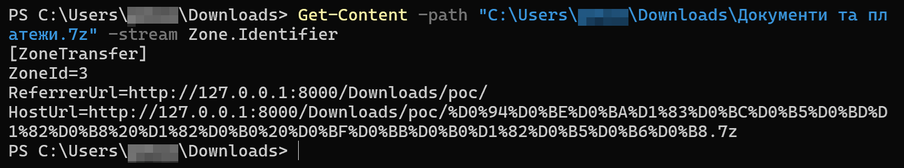

## URL

[https://www.trendmicro.com/ko_kr/research/25/a/cve-2025-0411-ukrainian-organizations-targeted.html](https://www.trendmicro.com/ko_kr/research/25/a/cve-2025-0411-ukrainian-organizations-targeted.html)

## Target

- 7-Zip < 24.09

## Explain

2024년 9월, Trend ZDI 위협 헌팅팀은 실제 공격에서 악용되고 있는 제로데이 취약점인 CVE-2025-0411을 발견했습니다. 이 취약점은 7-Zip 압축 프로그램에서 발견되었으며, 우크라이나 기관을 대상으로 하는 SmokeLoader 악성 코드 캠페인에 사용되었습니다. 러시아 사이버 범죄 그룹이 러시아-우크라이나 분쟁 중에 사이버 스파이 활동을 위해 이 전술을 사용했으며, 취약점을 악용하기 위해 손상된 이메일 계정과 homoglyph 공격을 활용한 것으로 추정됩니다.

### Background

Windows 운영 체제는 사용자가 인터넷처럼 신뢰할 수 없는 곳에서 파일을 다운로드할 때, 파일에 **Mark-of-the-Web (MotW)**이라는 일종의 **출처 표시**를 합니다.  이 표시는 Windows와 사용자에게 해당 파일이 잠재적으로 위험할 수 있음을 알려주어, 시스템이 파일을 좀 더 주의해서 다루도록 합니다.  예를 들어, MotW가 표시된 파일을 실행하려고 하면 Windows Defender SmartScreen이 파일의 reputation을 확인하고 사용자에게 경고를 보내 악성 코드 감염을 막는 데 도움을 줍니다.

다음 그림은 압축 파일의 `Zone.Identifier` 정보를 보여줍니다. 이 정보는 해당 파일이 인터넷에서 다운로드되었다는 것을 Windows에 알립니다.

또한 다음 그림은 MotW 태그로 인해 나타나는 Windows Defender SmartScreen 보안 경고를 보여줍니다. 이 경고는 잠재적으로 위험할 수 있는 파일로부터 사용자를 보호하는 데 도움이 됩니다.

참고로 파일의 속성에서 다음과 같이(파란박스) MotW 태그 정보를 보여줍니다. 이런 태그의 파일을 실행 시 위와 같이 경고 팝업이 나타납니다.

### Root cause

그러나 CVE-2025-0411 취약점을 이용하면 공격자가 7-Zip을 사용하여 파일을 **이중 압축**함으로써 이러한 MotW 보호를 우회할 수 있습니다. **Windows는 겉에 있는 압축 파일에만 MotW 표시를 하고, 그 안에 있는 파일들에는 MotW 표시를 하지 않습니다.**  바로 이 점을 악용해서, 공격자는 악성 실행 파일을 안쪽 압축 파일에 숨기고, 겉쪽 압축 파일을 통해 배포함으로써 Windows의 MotW 보호를 우회할 수 있습니다. 사용자가 이렇게 이중으로 압축된 파일을 7-Zip으로 열고 안쪽 파일을 실행하면, MotW 경고나 Windows Defender SmartScreen의 검사 없이 악성 코드가 실행될 수 있는 것입니다.

### Proof of Concept

이 그림은 ZIP 압축 파일이 다른 ZIP 압축 파일 안에 중첩된 CVE-2025-0411의 PoC 데모를 보여줍니다. 이 PoC에서 중첩된 압축 파일(poc.outer.zip\poc.inner.zip) 내부에 있는 `poc.bat` 파일에는 MotW 보호가 없습니다. 이 보호 부재로 인해 악성 코드 감염 위험이 크게 증가하고 Windows Defender SmartScreen이 파일의 reputation 및 서명을 제대로 검사하지 못합니다. 해당 파일을 압축해제 후 실행을 하면, 경고 팝업이 뜨지 않고 바로 다음과 같이 실행이 됩니다.

이 제로데이 취약점은 우크라이나 단체를 대상으로 한 SmokeLoader 악성 코드 캠페인에 악용된 것이 발견되었습니다. 이 캠페인에서 주로 우크라이나 정부 기관과 기업을 표적으로 삼아 사이버 스파이 활동을 수행한 것으로 보입니다. 공격자들은 손상된 이메일 계정을 통해 악성 첨부 파일을 유포하고, 특히 "Homoglyph 공격"이라는 기법을 사용하여 파일 확장자를 교묘하게 위장했습니다. 

> `Homoglyph` 공격은 시각적으로 유사한 문자를 사용하여 사용자를 속이는 공격 방식입니다.  공격자는 합법적인 웹사이트나 파일처럼 보이도록 악성 콘텐츠를 위장하여 사용자의 클릭을 유도합니다. 
예를 들어, 공격자는 도메인 이름에서 라틴 문자 "c" 대신 키릴 문자 "Es"(С 또는 с)를 사용할 수 있습니다.  두 문자는 겉보기에는 거의 동일하지만, 컴퓨터는 서로 다른 문자로 인식합니다.  이를 통해 "api-microsoft[.]com"과 같이 합법적인 Microsoft 사이트처럼 보이는 악성 도메인을 만들 수 있으며, 사용자는 속아서 개인 정보나 자격 증명(아이디, 비밀번호)을 입력할 수 있습니다.
> 

## Reference

https://github.com/dhmosfunk/7-Zip-CVE-2025-0411-POC
https://www.zerodayinitiative.com/advisories/ZDI-25-045/
https://nvd.nist.gov/vuln/detail/CVE-2025-0411
https://securityonline.info/cve-2025-0411-7-zip-security-vulnerability-enables-code-execution-update-now/