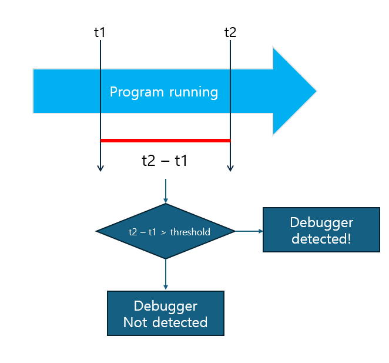
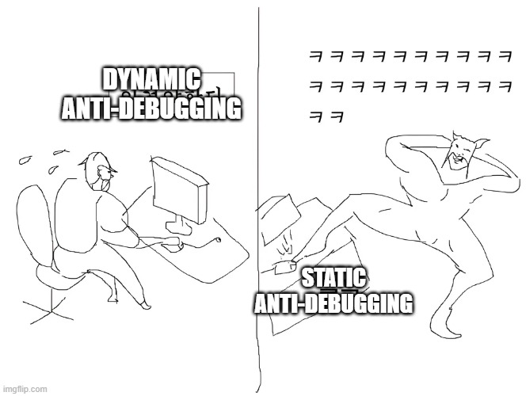

# Introduction

Hello, This is OUYA77, and it's a pleasure to greet you 🙂 If you look at the our team's blog posts, there are many articles from the offensive security perspective, so I'll write a research article from the defensive security perspective...(~~Offensive and defensive are just like heroes and villains ^-^☆~~)

Let's get started!


# Debugging

Debugging is the process of finding and fixing problems, or bugs, that occur during software development. Debugging is an essential step in ensuring the quality and reliability of your software, and it plays an important role in making sure your programmes work as intended.


I've found a really good introduction to debugging, so I'm going to use some of it,

> [Introduction to Debugging for Beginners Developers](https://okky.kr/articles/272227)
The way I see proper debugging is as follows:
(to ensure reproducibility) -> Collect clues -> Analyse clues -> Formulate hypothesis -> Test hypothesis.
>

Debugging is the process of finding and narrowing down where something is wrong in the code, analysing the cause and fixing it. Debugging tools can observe the internal state of a running program (e.g., variable values, function call order, memory state, etc.) in real time.

But what happens if an attacker exploits using this feature?

If an attacker exploits the software using the debugging feature, they will be able to understand how the software code behaves and analyse creative algorithms and logic💀.

This debugging is also known as dynamic analysis in reverse engineering, which provides more detailed analysis than would be possible with static analysis. If anyone can use this debugging feature, attackers could exploit it to analyze all the detailed functions of the software that should be protected!

That's why Anti-Debugging comes in.

# Anti-Debugging

Anti-debugging refers to techniques and methods designed to detect debuggers or disrupt their operation, protecting software from vulnerabilities to reverse engineering and analysis.

Over the years, a wide variety of these techniques have been extensively studied.


Anti-debugging techniques are constantly evolving and are heavily dependent on debuggers and operating systems, leading to continuous research into various methods. Here, I’ll introduce some of the traditional techniques that have been widely discussed.

According to the "leaf book" in Korea, often referred to as the Bible or textbook for reverse engineers (The book’s name is 리버싱 핵심원리), anti-debugging can be broadly classified into two categories based on the “Detection method”: **Static** and **Dynamic** groups. 

**Static anti-debugging techniques** operate when the debugger is "running" and typically rely on examining various system details and APIs to determine if a debugger is attached to the current process. For example, these methods might check the structure of **PEB** (Process Environment Block) or **TEB** (Thread Environment Block) to detect debugging or utilize operating system APIs such as **NTQueryInformationProcess()** to verify if a process is being debugged.

On the other hand, **Dynamic anti-debugging techniques** work when the debugger is actively "tracing" the process. These methods often exploit interaction during process execution, such as handling **exceptions**, setting breakpoints, or measuring execution time to detect debugging activities.

Let's have a look at a simple example code to see the difference!

- Static Anti-Debugging


```
#include <windows.h>
#include <stdio.h>

int main(void) {
    if (IsDebuggerPresent()) {
        printf("Debugger detected!\n");
    } else {
        printf("No debugger found.\n");
    }
    return 0;
}

```

The `IsDebuggerPresent()` function is an API provided by the Windows operatng system that checks whether the current process is being debugged. Internally, it references the PEB (Process Environment Block) structure to determine the presence of a debugger.

Specifically, `IsDebuggerPresent()` examines the `BeingDebugged` field within the PEB. This field is a **one-byte flag** indicating the debugging state: a value of `1` means a debugger is attached, while `0` indicates no debugging.

Static anti-debugging techniques like this rely on direct API calls or structure fields to detect the presence of a debugger. These methods are relatively straightforward to implement and can be applied quickly.


- Dynamic Anti-Debugging

Dynamic methods are techniques that detect the presence of a debugger based on interactive patterns during program execution. Although they require more complex implementation compared to static methods, they offer the advantage of higher detection accuracy. For instance, the timing-based anti-debugging technique leverages the fact that attaching a debugger to a process can significantly slow down the program's execution speed.



A code representation of the above illustration would look like this

```
uint64_t start_time = t1; // Get the current system time
<some part of the program code>
uint64_t end_time = t2;

uint64_t elapsed_time = end_time - start_time; 

if (elapsed_time > threshold) { 
		printf("Debugger is detected!\n");
}else{
		printf("Debugger is not detected!\n"); 
}
```

Just by looking at the code above, you can see that the Dynamic method takes a bit more effort to implement than the Static method that calls the API.



However, anti-debugging techniques in the **static group** are relatively easy to bypass due to their simplicity in implementation and lower complexity compared to dynamic anti-debugging. Static methods are often analyzed and neutralized before the program even runs in a debugging environment.

**Dynamic anti-debugging**, on the other hand, works by taking advantage of environmental changes or dynamic conditions during execution, and therefore requires the analyst to fully understand the program's runtime context in order to bypass or disable it. Because of this, Static techniques aim to detect and block quickly, while Dynamic techniques are more complex and difficult to bypass, and are often more effective at protecting the system.

Beyond the differences between static and dynamic approaches, anti-debugging techniques also vary depending on the operating system. For example, the methods used in Windows and Linux diverge due to differences in system architecture and APIs. The previously mentioned `IsDebuggerPresent()` function is an example of an anti-debugging technique specific to Windows. Meanwhile, in Linux and Unix-like systems, the `ptrace()` system call is used to detect whether a debugger is attached to the process.

Looking through the code,

```
#include <sys/ptrace.h>
#include <stdio.h>
#include <unistd.h>
#include <stdlib.h>
#include <errno.h>

int main(void) {
    if (ptrace(PTRACE_TRACEME, 0, NULL, NULL) == -1) {
        printf("Debugger detected or ptrace call failed!\n");
        return EXIT_FAILURE;
    }
    printf("No debugger found.\n");
    return EXIT_SUCCESS;
}

```

The code above is a simple example that uses the `ptrace()` system call on Linux systems to check whether a debugger is attached to the process. The `ptrace()` system call allows a process to be monitored and controlled, and the `PTRACE_TRACEME` option sets the process to be traceable by a debugger. The purpose of this code is to detect the presence of a debugger and output a warning message when one is detected.

Since anti-debugging techniques inherently rely on the characteristics of debuggers and operating systems, what if we leverage those very characteristics in reverse?


The practice of anti-debugging techniques and their bypass methods will be covered in the next section :)

# Side Note


As mentioned earlier, developers apply anti-debugging techniques to prevent their software from being analyzed by attackers. Similarly, malware developers use anti-debugging to protect their malicious code from being analyzed. Analysts, in turn, must employ more sophisticated techniques and tools to analyze malware, while malware developers continue to advance their anti-debugging methods to evade detection. The ongoing battle between reverse engineering and anti-reverse engineering, debugging and anti-debugging, analysts and malware developers, continues to drive technological progress, much like a battle between heroes and villains.

As the saying goes, "Know yourself and your enemy, and you will never be defeated." It's important to familiarize yourself with various techniques. I look forward to bringing you more valuable content in the next section!

Have a great end of the year, and let's continue to grow together in 2025! 🙌


참고문헌

- 리버싱 핵심 원리: 악성 코드 분석가의 리버싱 이야기(저자 이승원)
- https://www.openrce.org/reference_library/anti_reversing
- https://medium.com/naver-cloud-platform/보다-안전하게-모바일-게임을-서비스하는-방법-2-b08352208672
- https://blog.naver.com/kby88power/220946544312