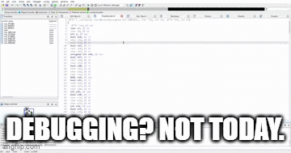

# Introduction

안녕하세요 새로 인사드리겠습니다 OUYA77 입니다🙂 팀의 블로그 글들을 보면, Offensive Security 관점의 글들이 많은데요. 저는 그럼 신선하게 Defensive Security 관점에서 연구글을 한편 써보겠습니다..!(~~히어로와 빌런처럼 오펜시브와 디펜시브는 칭구칭구니까요 ^-^☆~~)

그럼 시작해보겠습니다!


# 디버깅(Debugging)

**디버깅(Debugging)**은 소프트웨어 개발 과정에서 발생하는 문제, 즉 **버그(Bug)**를 찾아내고 수정하는 과정을 의미합니다. 디버깅은 소프트웨어의 품질과 안정성을 보장하기 위한 필수적인 단계로, 프로그램이 의도한 대로 동작하도록 만드는 데 중요한 역할을 합니다.


디버깅 방법을 되게 잘 소개한 글이 있어서 일부분을 가져와 보면,

> [초보 개발자를 위한 디버깅 방법 소개](https://okky.kr/articles/272227)
*제가 생각하는 올바른 디버깅의 절차는 아래와 같습니다:
(재현 가능성 확보) -> 단서 수집 -> 단서 분석 -> 가설 수립 -> 가설 검증*
>

코드에서 문제가 있는 곳을 찾아서 범위를 좁혀가며 원인을 분석하고 해결하는 과정을 말하는데요. 디버깅 도구는 실행 중인 프로그램의 내부 상태(e.g., 변수 값, 함수 호출 순서, 메모리 상태 등)를 실시간으로 관찰할 수 있습니다. 

그런데!! 공격자가 이 기능을 악용하면 어떤 일이 일어날까요?!

공격자가 디버깅 기능을 악용하면 공격자는 소프트웨어 코드의 동작 방식을 파악하고 독창적인 알고리즘과 로직을 분석할 수 있게 됩니다💀

또한 이 디버깅은 역공학적 분석(Reverse Engineering)에서 동적 분석에 해당하기도 해, 정적 분석을 할 경우보다 더 세부적인 분석이 가능한데요. 누구나 이런 디버깅 기능을 이용하면 공격자는 이 기능을 이용해서 보호받아야하는 소프트웨어의 세부 기능들을 다 분석할 수 있겠죠!!

그렇기에 안티 디버깅(Anti-Debugging)이 나타나게 되었습니다.


# 안티 디버깅(Anti-Debugging)

안티 디버깅(Anti-Debugging)은 디버거(Debugger)를 탐지하거나 그 동작을 방해하여, 소프트웨어가 역공학 및 분석에 취약하지 않도록 보호하는 기술과 기법을 말합니다. 

그동안 정말 많은 기법들이 연구되어왔습니다.


안티 디버깅 기법은 계속해서 발전 중이고 디버거와 운영체제에 강한 의존성이 있어 여러 가지 방법이 계속해서 연구되고 있는데요. 그 중에서 정통적으로 다뤄져온 기법에 대해서만 소개해보겠습니다.

리버서들의 교과서, 리버서들의 바이블과 같은 나뭇잎책(리버싱 핵심원리)에 따르면 안티 디버깅은 해제 방법에 따라 크게 Static 그룹과 Dynamic 그룹으로 구분할 수 있습니다. 

Static 그룹에 속한 안티 디버깅 기법은 디버거가 “Run”될 때 동작하며 다양한 시스템 정보(+ API)를 통해서 현재 프로세스에 디버거가 Attach 되어있음을 확인합니다. 예를 들면, PEB나 TEB의 구조체 정보를 확인하여 현재 프로세스의 디버깅 여부를 판단하거나 NTQueryInformationProcess() 등의 운영체제 API를 통해서 디버깅 여부를 판단할 수 있습니다.

Dynamic 그룹에 속한 안티 디버깅 기법은 디버거가 프로세스를 “Trace”할 때 동작하며 Exception 정보를 활용하여 디버깅 중일 시, 브레이크 포인트를 걸거나 시간을 측정하여 디버깅 중임을 판단하는 등 프로세스 동작 중에 일어나는 인터렉션을 이용하여 디버깅 여부를 판단하는 방법입니다.

간단한 예제 코드를 통해 차이를 알아봅시다!

- Static 안티 디버깅


```
#include <windows.h>
#include <stdio.h>

int main(void) {
    if (IsDebuggerPresent()) {
        printf("Debugger detected!\n");
    } else {
        printf("No debugger found.\n");
    }
    return 0;
}

```

`IsDebuggerPresent()` 함수는 Windows 운영 체제에서 제공되는 API로, 현재 프로세스가 디버거에 의해 디버깅되고 있는지를 확인하는 데 사용됩니다. 이 함수는 내부적으로 **PEB (Process Environment Block)** 구조체를 참조하여 디버거의 존재 여부를 판단합니다.

구체적으로, `IsDebuggerPresent()`는 PEB의 `BeingDebugged` 필드를 확인합니다. 이 필드는 현재 프로세스가 디버깅 중인지 여부를 나타내는 1바이트 크기의 플래그입니다. 값이 `1`이면 디버거가 연결되어 있음을 의미하고, 값이 `0`이면 디버깅 중이 아님을 나타냅니다.

이처럼 Static 안티 디버깅은 **직접적인 API 호출이나 구조체 필드를 이용해 디버거의 존재를 확인**하는 방식으로, 구현이 간단하다는 장점이 있습니다.


- Dynamic 안티 디버깅

Dynamic 방식은 **프로그램 실행 중의 행동 패턴을 기반으로 디버거의 존재를 탐지**하는 기법으로, 정적 기법에 비해 복잡한 구현을 필요로 하지만 탐지 정확도가 높다는 장점이 있습니다. 아래에 예시로 든 타이밍 기반 안티 디버깅(Timing Anti-Debugging)은 프로세스에 디버거를 붙여 분석하기 시작하면 프로그램의 실행 속도를 느리게 만들 수 있다는 점을 활용합니다.


위 그림을 코드로 표현하면 아래와 같습니다.

```
uint64_t start_time = t1; //시스템 시간 측정 
<프로그램 코드 중 일부>
uint64_t end_time = t2;

uint64_t elapsed_time = end_time - start_time; 

if (elapsed_time > threshold) { 
		printf("Debugger is detected!\n");
}else{
		printf("Debugger is not detected!\n"); 
}
```

위 코드만 봐도 API를 호출한 Static 기법보다 Dynamic 기법이 구현에 좀 더 노력이 들어감을 알 수 있습니다.


그러나 Static 그룹에 속한 안티디버깅은 구현이 쉬운 만큼 Dynamic 안티 디버깅보다 해제 난이도가 쉬워 비교적 쉽게 우회될 수 있습니다. 이는 Static 기법이 디버깅 환경에서 실행되기 전에 분석되고 해제될 가능성이 크기 때문입니다.

반면, Dynamic 안티디버깅은 실행 중에 환경 변화나 동적 조건을 활용하여 동작합니다. 따라서 이를 우회하거나 해제하기 위해서는 분석자가 프로그램의 런타임 상황을 충분히 이해해야 합니다. 이러한 특성으로 인해 **Static 기법**은 빠른 탐지와 차단을 목표로 하지만, **Dynamic 기법**은 더 복잡하고 우회 난이도가 높아, 시스템 보호에 더 효과적인 경우가 많습니다. 

Static 방법과 Dynamic 방법의 차이 뿐만 아니라, 운영체제에 따른 차이에 따라 안티 디버깅 기법이 달라지기도 합니다. 윈도우와 리눅스 간의 안티 디버깅 기법은 운영 체제의 구조와 API 차이로 인해 다르게 구현됩니다. 위에서 예를 든 `IsDebuggerPresent()` 함수는 윈도우에서 사용하는 안티 디버깅 기법이었습니다. 리눅스 및 유닉스 계열 시스템에서는 `ptrace()` 시스템 호출을 사용하여 디버거가 프로세스에 연결되었는지를 탐지할 수 있습니다. 

코드를 통해 살펴보면,

```
#include <sys/ptrace.h>
#include <stdio.h>
#include <unistd.h>
#include <stdlib.h>
#include <errno.h>

int main(void) {
    if (ptrace(PTRACE_TRACEME, 0, NULL, NULL) == -1) {
        printf("Debugger detected or ptrace call failed!\n");
        return EXIT_FAILURE;
    }
    printf("No debugger found.\n");
    return EXIT_SUCCESS;
}

```

위 코드는 리눅스 시스템에서 `ptrace()` 시스템 호출을 사용하여 자기 자신에 디버거가 붙어 있는지 확인하는 간단한 예제입니다. `ptrace()`는 프로세스를 추적하고 제어할 수 있는 시스템 콜인데, `PTRACE_TRACEME` 옵션은 해당 프로세스가 디버깅되도록 허용하는 설정입니다. 이 코드의 목적은 **디버거가 감지되었을 때** 이를 탐지하고 경고 메시지를 출력하는 것입니다.

안티 디버깅 자체가 디버거나 운영체제 등의 특성을 이용한 내용이기에 반대로 그 특성을 이용하면 어떻게 될까요?



안티 디버깅 기법 실습과 해제에 대한 실습은 다음 파트에 진행해보겠습니다 :)

# 여담


앞에서 이야기한 것처럼 공격자가 자신의 소프트웨어를 분석하지 못하게 하기 위해서 안티 디버깅을 적용하기도 하지만, 사실 악성코드 개발자가 자신의 악성코드가 분석당하지 않도록 안티 디버깅을 적용하기도 해요. 분석가들은 악성코드를 분석하기 위해 더욱 정교한 기법과 도구를 사용해야 하고, 악성코드 개발자들은 이를 우회하기 위해 지속적으로 안티 디버깅 기법을 발전시키는 노력을 기울입니다. 리버싱과 안티 리버싱, 디버깅과 안티 디버깅, 분석가와 악성코드 개발자, 마치 히어로와 빌런처럼 계속해서 치열한 전쟁을 치루며 기술 발전을 이어오고 있습니다. 

지피지기면 백전백승이라는 말처럼, 다양한 기술을 숙지하는 것이 좋겠죠? 다음 파트도 보다 유익한 내용으로 내년에 뵙도록 하겠습니다!

연말 잘 보내시고 2025년에도 같이 성장해보아요! 🙌


참고문헌

- 리버싱 핵심 원리: 악성 코드 분석가의 리버싱 이야기(저자 이승원)
- https://www.openrce.org/reference_library/anti_reversing
- https://medium.com/naver-cloud-platform/보다-안전하게-모바일-게임을-서비스하는-방법-2-b08352208672
- https://blog.naver.com/kby88power/220946544312