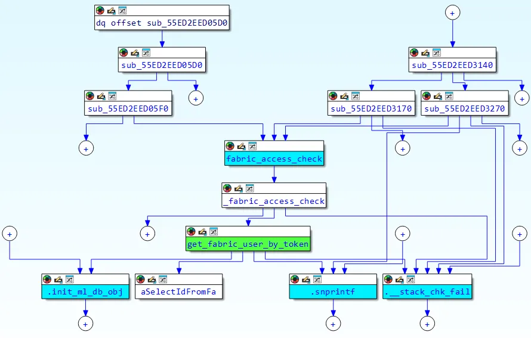
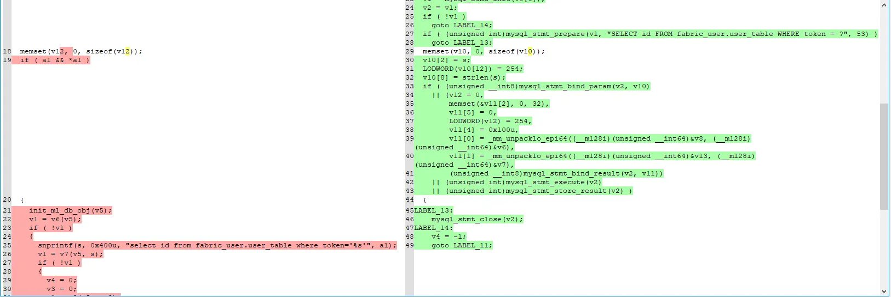

## URL

https://labs.watchtowr.com/pre-auth-sql-injection-to-rce-fortinet-fortiweb-fabric-connector-cve-2025-25257

## Target

- FortiWeb 7.6.x < 7.6.4
- FortiWeb 7.4.x < 7.4.8
- FortiWeb 7.2.x < 7.2.11
- FortiWeb 7.0.x < 7.0.11

## Explain

CVE-2025-25257는 Fortinet FortiWeb Fabric Connector에서 발생한 pre-auth SQL Injection 취약점입니다.

Fabric API를 통해 외부 Fortinet 장비와 연동 될 때 호출되는 `get_fabric_user_by_token()` 함수 내부에서, 사용자 입력을 그대로 SQL 쿼리에 포함시키는 방식으로 인해 발생했습니다.

```c
[..SNIP..]

<Location "/api/fabric/device/status">
    SetHandler fabric_device_status-handler
</Location>

<Location "/api/fabric/authenticate">
    SetHandler fabric_authenticate-handler
</Location>

<Location ~ "/api/v[0-9]/fabric/widget">
    SetHandler fabric_widget-handler
</Location>

[..SNIP..]
```

먼저 `httpd.conf` Apache HTTP Server 구성 파일을 통해 특정 URL 요청이 어떤 내부 핸들러로 라우팅되는지 확인할 수 있습니다.

- `GET /api/fabric/device/status` → `fabric_device_status-handler`
- `POST /api/fabric/authenticate` → `fabric_authenticate-handler`
- `GET /api/v[0-9]/fabric/widget` → `fabric_widget-handler`



이러한 핸들러 함수들은 공통적으로 `fabric_access_check`를 거쳐 `get_fabric_user_by_token`을 호출하는 흐름을 보여줍니다. 이는 여러 API 경로가 모두 `get_fabric_user_by_token`이라는 동일한 취약 함수에 도달할 수 있다는 점을 나타냅니다.

```c
__int64 __fastcall fabric_access_check(__int64 a1)
{
  __int64 v1; // rdi
  __int64 v2; // rax
  _OWORD v4[8]; // [rsp+0h] [rbp-A0h] BYREF
  char v5; // [rsp+80h] [rbp-20h]
  unsigned __int64 v6; // [rsp+88h] [rbp-18h]

  v1 = *(_QWORD *)(a1 + 248);
  v6 = __readfsqword(0x28u);
  v5 = 0;
  memset(v4, 0, sizeof(v4));
  v3 = apr_table_get(v1, "Authorization"); // [1]
  if ( (unsigned int)__isoc23_sscanf(v2, "Bearer %128s", v4) != 1 ) // [2]
    return 0;
  v5 = 0;
  if ( (unsigned int)fabric_user_db_init()
    || (unsigned int)refresh_fabric_user()
    || (unsigned int)get_fabric_user_by_token((const char *)v4) ) // [3]
  {
    return 0;
  }
  else
  {
    return 2 * (unsigned int)((unsigned int)update_fabric_user_expire_time_by_token((const char *)v4) == 0);
  }
}
```

`fabric_access_check()` 함수는 다음과 같은 동작을 수행합니다.

- **[1]** : HTTP 요청에서 `Authorization` 헤더를 추출하여 `v3` 변수에 저장합니다.
- **[2]** : `__isoc23_sscanf` 함수로 헤더를 파싱하는데, `"Bearer "`로 시작하는 형식을 기대하며, 공백 이후 최대 128자의 문자열을 추출하여 `v4`에 저장합니다.
- **[3]** : `v4`에 저장된 값을 기반으로 `get_fabric_user_by_token` 함수가 호출되어 사용자 인증을 시도합니다.

```c
__int64 __fastcall get_fabric_user_by_token(const char *a1)
{
  unsigned int v1; // ebx
  __int128 v3; // [rsp+0h] [rbp-4B0h] BYREF
  __int64 v4; // [rsp+10h] [rbp-4A0h]
  _BYTE v5[16]; // [rsp+20h] [rbp-490h] BYREF
  __int64 (__fastcall *v6)(_BYTE *); // [rsp+30h] [rbp-480h]
  __int64 (__fastcall *v7)(_BYTE *, char *); // [rsp+38h] [rbp-478h]
  void (__fastcall *v8)(_BYTE *); // [rsp+58h] [rbp-458h]
  __int64 (__fastcall *v9)(_BYTE *, __int128 *); // [rsp+60h] [rbp-450h]
  void (__fastcall *v10)(__int128 *); // [rsp+68h] [rbp-448h]
  char s[16]; // [rsp+80h] [rbp-430h] BYREF
  _BYTE v12[1008]; // [rsp+90h] [rbp-420h] BYREF
  unsigned __int64 v13; // [rsp+488h] [rbp-28h]

  v13 = __readfsqword(0x28u);
  *(_OWORD *)s = 0;
  memset(v12, 0, sizeof(v12));
  if ( a1 && *a1 )
  {
    init_ml_db_obj((__int64)v5);
    v1 = v6(v5);
    if ( !v1 )
    {
    
	    **// VULN
      snprintf(s, 0x400u, "select id from fabric_user.user_table where token='%s'", a1);**
      
      [..SNIP..]
```

취약점은 `get_fabric_user_by_token()` 함수 내부의 `snprintf` 함수를 사용하여 SQL 쿼리를 구성하는 부분에서 발생합니다. `%s` 포맷을 통해 입력 문자열이 작은 따옴표로 감싸진 채 쿼리에 삽입되며, 공격자가 입력값 `a1`에 악의적인 SQL 구문을 포함할 경우 쿼리 구조를 깨뜨리고 임의의 SQL 명령을 실행시킬 수 있게 됩니다.

### Exploit

```c
'/**/UNION/**/SELECT/**/token/**/from/**/fabric_user.user_table/**/into/**/outfile/**/'../../lib/python3.10/site-packages/x.pth'
```

payload는 SQL Injection을 통해 `Python .pth` 파일을 생성하여 RCE로 이어지도록 하는 코드로 구성되었습니다. 

INTO OUTFILE 구문을 통해 쿼리 결과를 DB 서버의 파일 시스템에 기록하여, `x.pth` 파일을 생성하도록 유도하였습니다. 또한 Authorization 헤더의 128바이트 길이 제한을 우회하기 위해 `../../lib/..` 형태의 상대 경로를 사용하였습니다. 


Exploit을 실행하여 FortiWeb에서 root 권한의 쉘을 얻은 것을 확인할 수 있습니다.

### Patch



diffing을 통해 패치 전후 코드 차이를 확인해볼 수 있습니다.

```c
v1 = mysql_stmt_init(v9[0]);
  v2 = v1;
  if ( !v1 )
    goto LABEL_14;
  if ( (unsigned int)mysql_stmt_prepare(v1, "SELECT id FROM fabric_user.user_table WHERE token = ?", 53) )
    goto LABEL_13;
```

패치 후 `get_fabric_user_by_token()` 함수에서 SQL Injection 취약점과 관련된 사용자 입력 처리 로직을 수정하였습니다. 기존의 `snprintf` 기반 동적 쿼리 생성을 제거하고, `mysql_stmt_prepare`를 통해 정적 쿼리 구조를 먼저 정의한 후 `?` placeholder에 사용자 입력을 바인딩하는 방식으로 패치된 것을 확인할 수 있습니다.
    
## Reference

- https://nvd.nist.gov/vuln/detail/CVE-2025-25257
- https://pwner.gg/blog/2025-07-10-fortiweb-fabric-rce