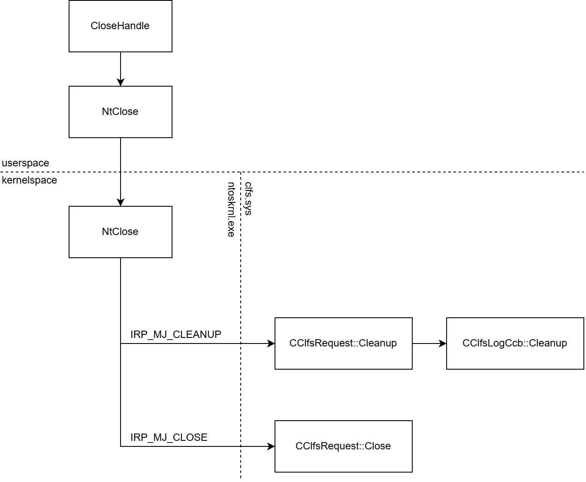
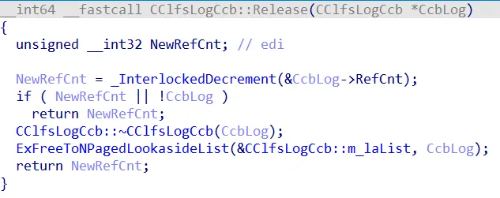

## URL

- https://www.microsoft.com/en-us/security/blog/2025/04/08/exploitation-of-clfs-zero-day-leads-to-ransomware-activity/
- https://bi-zone.medium.com/deep-dive-into-cve-2025-29824-in-windows-8bc6d52dd028

## Target

- 2025년 4월 8일 Microsoft 누적 업데이트 이전 clfs.sys 파일

## Explain

CVE-2025-29824는 Windows Common Log File System에서 발생하였습니다. 

해당 취약점은 clfs.sys의 `CClfsLogCcb` 구조체에서 Use-After-Free를 통해 발생하였으며, 최종적으로 커널 권한 내 `RtlSetAllBits` 호출 유도로 인해 EPROCESS 권한 비트맵이 전부 활성화되어 LPE 취약점으로 이어집니다.



취약점 경로는 `CClfsRequest::Cleanup` → `CClfsLogCcb::Cleanup` → (IRP Dispatch Routine) → `CClfsRequest::Close` 를 통해 발생하였습니다.

```c
MajorFunction = Irp->Tail.Overlay.CurrentStackLocation->MajorFunction;
if ( MajorFunction == IRP_MJ_CLEANUP ) // [1]
{
    v7 = CClfsRequest::Cleanup(Irp);
    if ( v7 < 0 )
    {
        v8 = WPP_GLOBAL_Control;
        if ( WPP_GLOBAL_Control != &WPP_GLOBAL_Control 
             && (WPP_GLOBAL_Control->TraceBits & 0x400000000000000LL) != 0 )
        {
            v9 = 22;
            goto LABEL_10;
        }
    }
}
else if ( MajorFunction == IRP_MJ_CLOSE ) // [2]
{
    v7 = CClfsRequest::Close(Irp);
    if ( v7 < 0 )
    {
        v8 = WPP_GLOBAL_Control;
        if ( WPP_GLOBAL_Control != &WPP_GLOBAL_Control 
             && (WPP_GLOBAL_Control->TraceBits & 0x400000000000000LL) != 0 )
        {
            v9 = 23;
            goto LABEL_10;
        }
    }
}

```

취약 경로의 시작점은 디스패처가 Cleanup을 먼저 호출하고, 이어서 Close를 호출하는 흐름으로 진행됩니다. 커널은 파일 HANDLE을 정리하고 종료할 때 FileObject에 대해 아래와 같은 두 번의 IRP를 순차로 보냅니다.

[1] `IRP_MJ_CLEANUP` → `CClfsRequest::Cleanup(Irp)`
[2] `IRP_MJ_CLOSE` → `CClfsRequest::Close(Irp)`

```c
v7 = ExAcquireResourceExclusiveLite(&CClfsLogFcbPhysical->CommonLog.Resource, 1u);
Next = LogCcb->Next;
if ( *(Next + 8) != &LogCcb->Next || (Prev = LogCcb->Prev, *Prev != &LogCcb->Next) )
    __fastfail(3u);

*Prev = Next;
*(Next + 8) = Prev;

LogCcb->Flags &= ~0x80u;
if ( Feature_3133209913__private_IsEnabledDeviceUsage() )
{
    LogCcb->Flags |= 4u;
}
ExReleaseResourceForThreadLite(&CClfsLogFcbPhysical->CommonLog.Resource, KeGetCurrentThread());
CClfsLogFcbPhysical->CommonLog.VTable->Cleanup(CClfsLogFcbPhysical, LogCcb->FileObject);

if ( !Feature_3133209913__private_IsEnabledDeviceUsage() )
{
    LogCcb->Flags |= 4u;
    CClfsLogCcb::Release(LogCcb);
}

```

파일 핸들이 정리될 때 커널은 `IRP_MJ_CLEANUP` 요청을 보내며, 이때 `CClfsRequest::Cleanup` → `CClfsLogCcb::Cleanup` 경로가 실행됩니다. `IRP_MJ_CLEANUP` 경로(`CClfsRequest::Cleanup`)에서는 `LogCcb`를 linked list에서 제거하는 역할을 수행합니다.



`Release()` 함수 내부에서는 `LogCcb` 객체의 참조 카운트를 감소시키고, 참조 카운트가 0이 되면 소멸자가 실행되어 `LogCcb`에 할당된 커널 힙 메모리 객체가 free됩니다. 그러나 `FileObject→CClfsLogCcb` 포인터는 무효화되지 않고 그대로 남아 해제된 주소를 가리키고 있는 상태가 되기 때문에, 이 시점에서 dangling pointer가 됩니다. 이를 통해 다음 두 경로에서 Use-After-Free가 발생할 수 있습니다.

1.**Close 단계에서 dangling pointer 재사용**

```c
CClfsLogCcb = 0;
CClfsLogCcb = 0;

CurrentStackLocation = Irp->Tail.Overlay.CurrentStackLocation;
if ( CurrentStackLocation->MajorFunction != IRP_MJ_CLOSE )
    KeBugCheckEx(0xC1F5u, 0x46u, CurrentStackLocation->MajorFunction, 0, 0);

FileObject = CurrentStackLocation->FileObject;
CClfsLogFcbCommon = &ADJ(FileObject->PhysicalLog)->CommonLog.CClfsLogFcbPhysical->CommonLog;
CClfsLogFcbCommon->vTable->AddRef(CClfsLogFcbCommon);

if ( Feature_3133209913__private_IsEnabledDeviceUsage() )
{
    CClfsLogCcb = CurrentStackLocation->FileObject->CClfsLogCcb;
    if ( CClfsLogCcb )
    {
        CClfsLogCcb::AddRef(CClfsLogCcb);
        CClfsLogCcb::Close(CClfsLogCcb);
    }
}

v7 = ExAcquireResourceExclusiveLite(&CClfsLogFcbCommon->Resource, 1u);
CClfsLogFcbCommon::Close(CClfsLogFcbCommon);
if ( v7 )
    ExReleaseResourceForThreadLite(&CClfsLogFcbCommon->Resource, KeGetCurrentThread());

if ( Feature_3133209913__private_IsEnabledDeviceUsage() )
{
    FileObject->PhysicalLog = 0;
    FileObject->CClfsLogCcb = 0;
    if ( CClfsLogCcb )
        CClfsLogCcb::Release(CClfsLogCcb);
}

CClfsLogFcbCommon->vTable->Release(CClfsLogFcbCommon);
Irp->IoStatus.Status = 0;
Irp->IoStatus.Information = 0;
IoCompleteRequest(Irp, 0);
return 0;

```

CLEANUP 단계에서 `CClfsLogCcb`가 이미 free되었음에도 불구하고, 이후 커널은 동일한 FileObject에 대해 `IRP_MJ_CLOSE` 요청을 보냅니다. Close 경로(`CClfsRequest::Close`)에서도 여전히 `FileObject->CClfsLogCcb`를 참조합니다. 따라서, CLEANUP에서 free된 객체를 Close 경로에서 다시 사용하면서 UAF가 발생할 수 있습니다.

2.**IOCTL 경로(StartArchival)에서 dangling pointer 재사용**

```c
SystemBuffer = IRP->AssociatedIrp.SystemBuffer;
RtlInitUnicodeString(&DestinationString, 0LL);
DestinationString.MaximumLength = CurrentStackLocation->Parameters.DeviceIoControl.OutputBufferLength;

CClfsLogCcb = CurrentStackLocation->FileObject->CClfsLogCcb;
CClfsLogCcb::AddRef(CClfsLogCcb);

if (!DestinationString.MaximumLength
    || ((MdlAddress = this->IRP->MdlAddress, (MdlAddress->MdlFlags & 5) == 0)
        ? (MappedSystemVa = MmMapLockedPagesSpecifyCache(
                                MdlAddress, 0, MmCached, 0LL, 0, 0x40000010u))
        : (MappedSystemVa = MdlAddress->MappedSystemVa),
        (DestinationString.Buffer = MappedSystemVa) != 0LL))
{
    Status = CClfsLogCcb::AddArchiveRef(
                 CClfsLogCcb,
                 &DestinationString,
                 SystemBuffer,
                 SystemBuffer + 1,
                 &v13);
}
else
{
    Status = STATUS_INSUFFICIENT_RESOURCES;
}

```

`CClfsRequest::StartArchival` 루틴은 IOCTL 요청 처리 과정에서 내부적으로 `FileObject->CClfsLogCcb`를 참조하고 `AddRef` 및 `AddArchiveRef`를 호출합니다. 따라서 `FileObject->CClfsLogCcb`가 이미 free된 객체를 가리키고 있다면, IOCTL 경로에서도 동일하게 해제된 메모리에 접근하며 UAF가 발생할 수 있습니다.

## Exploit

```c
VOID __stdcall ExFreeToNPagedLookasideList(
    PNPAGED_LOOKASIDE_LIST Lookaside,
    PVOID Entry
)
{
    ++Lookaside->L.TotalFrees;

    if (ExQueryDepthSList(&Lookaside->L.ListHead) >= Lookaside->L.Depth)
    {
        ++Lookaside->L.FreeMisses;
        (Lookaside->L.FreeEx)(Entry);
    }
    else
    {
        ExpInterlockedPushEntrySList(&Lookaside->L.ListHead, Entry);
    }
}

```

메모리는 `LookasideList`를 통해 해제되는데, exploit을 위해 `LookasideList` 캐시에 쌓이는 방식을 위의 코드를 통해 확인할 수 있습니다. `CClfsLogCcb` 객체는 `Release()`로 free될 때 즉시 해제되지 않고 `LookasideList`(깊이 24)에 보관되는데, 이를 통해 다음과 같은 exploit을 설계할 수 있게 됩니다.

1. 동일 log file에 대해 25개 이상의 HANDLE 생성
2. 24개 HANDLE을 먼저 닫아 `LookasideList` 채움 (깊이 24)
3. 마지막 HANDLE의 CLEANUP → `CClfsLogCcb` free → dangling pointer 발생
4. 동일 크기 풀 청크 spray → free된 메모리를 공격자 데이터로 덮어씀
5. IOCTL 처리 루틴(`CClfsRequest::StartArchival`) 호출 → 오염된 구조체 참조
6. 오염된 vtable/callback을 통해 `RtlSetAllBits` 호출 유도
7. Privilege 비트맵 전체 활성화 → **LPE 달성**

Microsoft 보고서 설명에 따르면, exploit은 dllhost.exe 프로세스 환경에서 수행되었으며 NtQuerySystemInformation으로 kernel address를 leak한 후 PDUDrv.blf을 생성해 clfs.sys 내에서 UAF를 트리거하는 방식으로 이루어졌습니다.

## Patch


패치 전/후 코드 변화를 비교해보면 새로운 함수 `Feature_[number]__private_IsEnabledDeviceUsage`가 추가되었으며, `CClfsRequest::Close와 CClfsLogCcb::Cleanup` 함수가 수정되었습니다.

패치 이전에는 `CClfsLogCcb::Release()` 호출이 `CClfsLogCcb::Cleanup` 내부에 존재하여, CLEANUP 단계에서 객체가 해제되었습니다. 패치 이후에는 이 호출이 제거되고, 대신 `CClfsRequest::Close` 루틴 안으로 이동되어 CLOSE 단계에서만 해제가 이루어지도록 변경되었습니다. 또한 `FileObject->CClfsLogCcb` 포인터를 0으로 초기화하는 코드가 새롭게 추가되어, dangling pointer가 남지 않도록 보완되었습니다.
    
## Reference

- https://msrc.microsoft.com/update-guide/vulnerability/CVE-2025-29824

