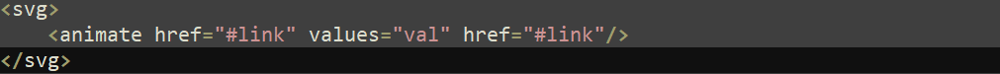
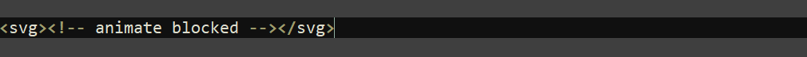
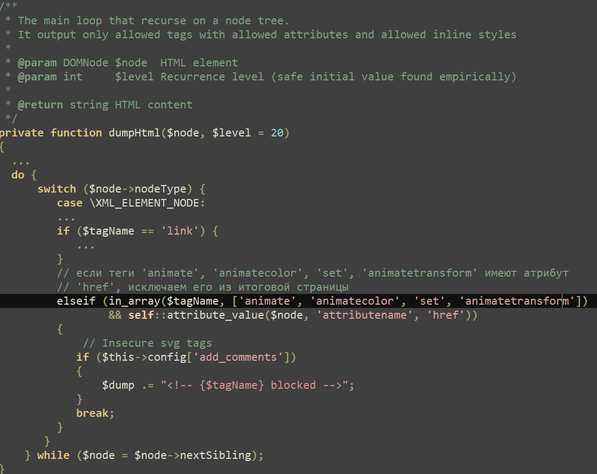
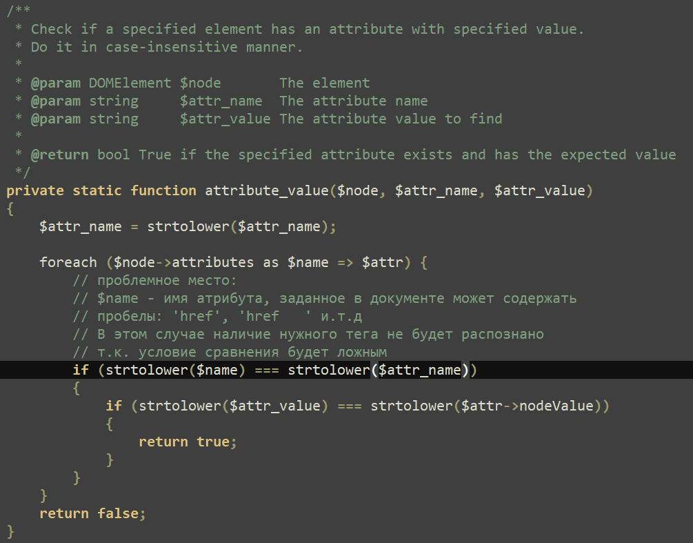
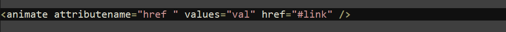
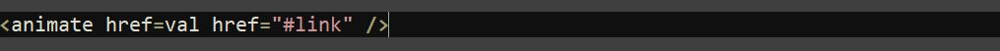

## URL

[https://nvd.nist.gov/vuln/detail/cve-2024-37383](https://nvd.nist.gov/vuln/detail/cve-2024-37383)

## Target

- Target Product: Roundcube webmail
- Affected Versions: ≤1.5.7 and 1.6.x < 1.6.7

## Explain

CVE-2024-37383은 Roundcube Webmail에서 발견된 stored XSS 취약점입니다.  이 취약점은 이메일 본문 마크업의 SVG 태그에서 animated 속성을 적절하게 처리하지 못해 발생합니다.

이메일 본문에 아래와 같은 코드가 포함된 경우

코드가 필터링되며 다음과 같이 빈 요소로 변환됩니다.

이메일 본문의 html 요소를 처리하는 로직은 다음과 같이 구현되어 있습니다. 

### Workflow

위의 코드에서 볼 수 있듯이, Roundcube Webmail은 보안상 이메일 본문에서 `<animate>`, `<animatecolor>`, `<set>`, `<animatetransform>` 태그를 필터링 합니다. 하지만 이를 검증하는 과정에서 사용되는 attribute_value 함수는, 속성 이름에 포함된 공백을 처리하지 못합니다.

이로 인해 `if (strtolower($name) === strtolower($attr_name))`이 `false`가 되어 필터링을 우회할 수 있습니다.
아래와 같은 태그가 이메일에 포함될 경우

필터링 되지 않고, 브라우저에서 실행 가능한 코드로 재구성됩니다.

해당 취약점을 사용하여 Roundcube 클라이언트에서 악의적인 이메일을 열람할 때, 임의의 Javascript 코드를 실행할 수 있습니다.

이 취약점은 CVSS 점수 6.1로 평가되었으며, Roundcube Webmail의 1.5.7 버전 및 1.6.7 버전에서 패치가 적용되었습니다.

## Reference

- [Fake attachment. Roundcube mail server attacks exploit CVE-2024-37383 vulnerability](https://global.ptsecurity.com/analytics/pt-esc-threat-intelligence/fake-attachment-roundcube-mail-server-attacks-exploit-cve-2024-37383-vulnerability)
