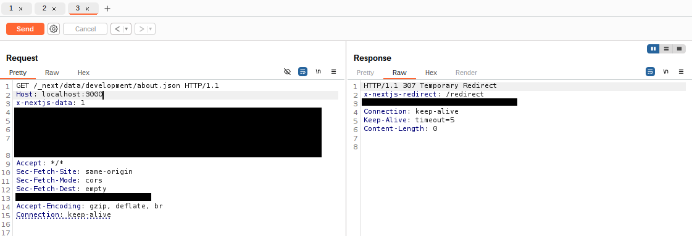
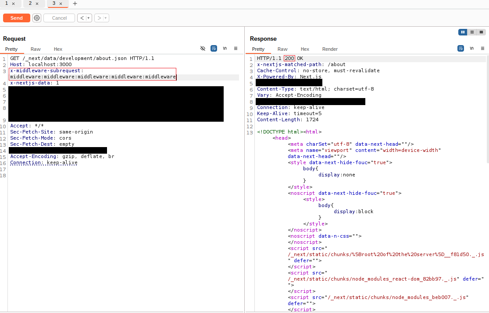

## URL

[https://nvd.nist.gov/vuln/detail/CVE-2025-29927](https://nvd.nist.gov/vuln/detail/CVE-2025-29927)


## Target

- Next.js 15.x < 15.2.3
- Next.js 14.x < 14.2.25
- Next.js 13.x < 13.5.9


## Explain
해당 취약점은 Next.js 프레임워크의 미들웨어에서 발생하는 보안 취약점으로, 공격자가 인증 절차를 우회하여 보호된 리소스에 접근할 수 있게 합니다.

Next.js에서 미들웨어는 일반적으로 특정 페이지나 API 경로에 접근하기 전에 사용자의 세션 쿠키를 확인하고, 인증 및 권한 여부를 판단하는 데 사용됩니다. 예를 들어 사용자가 `/dashboard/admin`처럼 인증이 필요한 경로에 접근하려 할 경우, 세션이 유효하지 않다면 요청은 로그인 페이지로 리디렉션됩니다.

[Next.js 12.2 이전 버전](https://nextjs.org/docs/messages/middleware-upgrade-guide)에서는 미들웨어 파일의 구조와 위치가 고정되어있다는 점 때문에 미들웨어의 정확한 위치를 예측하기 쉬웠습니다. 이전에는 파일명을 _middleware.ts로 작성해야 했고, App Router가 도입되기 전이었기 때문에 미들웨어는 pages/ 디렉토리 하위에만 존재할 수 있었습니다. 예를 들어 전역 미들웨어는 pages/_middleware.ts에 위치할 가능성이 높으므로, 아래와 같은 헤더를 요청에 포함시키는 것 만으로도 해당 미들웨어를 우회할 수 있습니다.

```plaintext
x-middleware-subrequest: pages/_middleware
```

이 동작은 내부적으로 [다음 코드](https://github.com/vercel/next.js/blob/v12.0.7/packages/next/server/next-server.ts#L686)에 따라 처리됩니다.

```ts
const subreq = params.request.headers[`x-middleware-subrequest`]
const subrequests = typeof subreq === 'string' ? subreq.split(':') : [] //[1]
const allHeaders = new Headers()
let result: FetchEventResult | null = null

for (const middleware of this.middleware || []) {
	if (middleware.match(params.parsedUrl.pathname)) {
		if (!(await this.hasMiddleware(middleware.page, middleware.ssr))) {
			console.warn(`The Edge Function for ${middleware.page} was not found`)
			continue
		}

		await this.ensureMiddleware(middleware.page, middleware.ssr)

		const middlewareInfo = getMiddlewareInfo({
			dev: this.renderOpts.dev,
			distDir: this.distDir,
			page: middleware.page,
			serverless: this._isLikeServerless,
		})

		if (subrequests.includes(middlewareInfo.name)) { // [2]
			result = {
				response: NextResponse.next(),
				waitUntil: Promise.resolve(),
			}
			continue
		}
	}
```
클라이언트에서 보낸 `x-middleware-subrequest` 헤더를 읽어, `:`를 기준으로 분리된 값들을 이미 실행된 미들웨어 목록으로 간주합니다 [1]. 그리고 현재 실행될 미들웨어의 경로 정보(middlewareInfo.name)가 이 미들웨어 목록에 포함되어 있다면, 해당 미들웨어는 실행되지 않고 다음 단계로 넘어갑니다.[2]

Next.js 13 버전부터는 재귀 검사가 구현되었습니다. 취약한 최신 버전(v15.2.2)의 [코드](https://github.com/vercel/next.js/blob/v15.1.7/packages/next/src/server/web/sandbox/sandbox.ts#L94)는 다음 과 같습니다.

```ts
export const run = withTaggedErrors(async function runWithTaggedErrors(params) {
  const runtime = await getRuntimeContext(params)
  const subreq = params.request.headers[`x-middleware-subrequest`]
  const subrequests = typeof subreq === 'string' ? subreq.split(':') : []

  const MAX_RECURSION_DEPTH = 5 // [1]
  const depth = subrequests.reduce(
    (acc, curr) => (curr === params.name ? acc + 1 : acc),
    0
  )

  if (depth >= MAX_RECURSION_DEPTH) { //[2]
    return {
      waitUntil: Promise.resolve(),
      response: new runtime.context.Response(null, {
        headers: {
          'x-middleware-next': '1',
        },
      }),
    }
```
헤더 `x-middleware-subrequest`는 이전과 마찬가지로 `:` 기호를 기준으로 분리되어 배열로 처리됩니다. 하지만 이번에는 미들웨어 규칙을 우회하고 요청을 직접 전달하는 조건이 달라졌습니다. `MAX_RECURSION_DEPTH`라는 상수(5)는, 재귀적으로 미들웨어가 실행되는 최대 깊이를 제한합니다. 요청에 포함된 `x-middleware-subrequest` 헤더의 각 항목 중, 현재 실행 중인 미들웨어의 경로(`params.name`)와 일치하는 값이 있을 때마다 `depth` 값이 1씩 증가합니다.

`depth >= MAX_RECURSION_DEPTH` 조건을 만족하면, 해당 미들웨어는 실행되지 않고, 요청이 바로 다음 단계로 전달됩니다. 예를 들어 `middleware.ts`가 미들웨어 경로라면, 다음과 같은 헤더를 삽입함으로써 이를 우회할 수 있습니다.
```plaintext
x-middleware-subrequest: middleware:middleware:middleware:middleware:middleware
```

만약 src/middleware.ts 경로를 사용하는 경우라면 다음과 같이 작성할 수 있습니다.
```plaintext
x-middleware-subrequest: src/middleware:src/middleware:src/middleware:src/middleware:src/middleware
```

예를 들어, Next.js에서 인증이 필요한 페이지에 접근하려 할 경우, 미들웨어에 의해 요청은 /redirect 경로로 리디렉션됩니다.


아래는 `x-middleware-subrequest` 헤더를 이용해 인증이 필요한 경로로 접근한 결과입니다. 헤더 조작으로 인해 200 응답이 반환되며 미들웨어를 우회할 수 있습니다.


해당 취약점은 아래 버전에서 수정되었습니다
- Next.js 15.x → **15.2.3**
- Next.js 14.x → **14.2.25**
- Next.js 13.x → **13.5.9**
- Next.js 12.x → **12.3.5**

안전한 버전으로의 업그레이드가 어려운 경우, `x-middleware-subrequest` 헤더가 포함된 외부 요청이 Next.js 애플리케이션에 도달하지 않도록 웹 서버에서 해당 헤더를 제거하거나 필터링하는 방식으로 취약점을 완화할 수 있습니다.


## Reference

- [https://github.com/aydinnyunus/CVE-2025-29927](https://github.com/aydinnyunus/CVE-2025-29927)
- [https://zhero-web-sec.github.io/research-and-things/nextjs-and-the-corrupt-middleware](https://zhero-web-sec.github.io/research-and-things/nextjs-and-the-corrupt-middleware)
- [https://nextjs.org/docs/app/building-your-application/routing/middleware](https://nextjs.org/docs/app/building-your-application/routing/middleware)
- [https://nextjs.org/blog/cve-2025-29927](https://nextjs.org/blog/cve-2025-29927)
