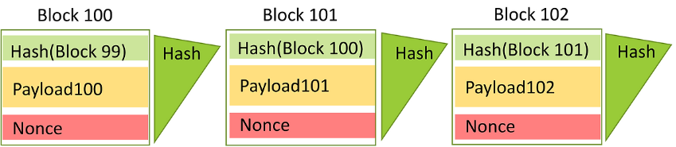
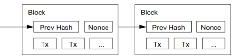

# Introduction
Hello! This is Bekim and It’s my first time introducing myself. I’ve written my first research post on blockchain. There’s so much material to cover, and I have been thinking a lot about how to narrow down the topic.

So, I’d like to explain the structure of blockchain based on the Bitcoin whitepaper, which is essential for understanding it. I don’t know how my research writing will progress in the future🤪. but who cares.

Let’s get started!


# 1. Bitcoin: A Peer-to-Peer Electronic Cash System

In Oct 2008, a mysterious figure known as Satoshi Nakamoto released a paper titled Bitcoin: A Peer-to-Peer Electronic Cash System on The Cryptography Mailing List. This paper introduced an innovative electronic cash system that allows direct peer-to-peer(P2P) transactions without relying on centralized institutions, such as banks, found in traditional systems.


# 2. The limitations of existing trust-based systems

The Bitcoin whitepaper mentions the double-spending problem as the primary issue with traditional digital currency systems. Unlike physical currency, digital assets can be duplicated and reused, which is why centralized authorities were necessary to verify transactions and prevent misuse.

However, this centralized approach also has some clear downsides. First, transaction fees charged by intermediaries made small transactions inefficient. Second, all transactions had to go through a central server, the system was less efficient in terms of processing speed. Lastly, centralized systems are vulnerable to a Single Point of Failure—if the central server is compromised or malfunctions, the entire system could collapse 👻

To address these problems. Bitcoin introduced a structure based on a hash chain. In Bitcoin, transactions are linked through a hash chain, forming a secure and interconnected data structure. This design prevents double-spending and enables decentralized transaction verification without relying on a central authority.


# 3. HashChain
A hash chain is a value created by repeatedly applying a cryptographic hash functionh to a string x.

For example:
```
h(h(h(h(x))))
```
Applying the hash fuction four times creates a hash chain of length 4, which is denoted as $$h^4(x)$$. Each value generated at every step is based on the hash result of the previous step. This structure ensures data integrity and is widely used in cryptographic verification mechanisms.

Bitcoin, implemented as a blockchains, also relies on a hash chain to link data and form a structure where every block is cryptographically connected to the previous one.

Let me explain it using the example in the image above. 🕶️
**Block 100**
- The header contains the hash value of the previous block Hash(Block 99), the block’s data (Payload 100), and the nonce (a value required for proof of work)
- Based on this information, a unique hash value for Block 100 is generated
**Block 101**
- The header of Block 101 includes the hash value of Block 100.
- By adding Payload 101 and the nonce, a new hash value unique to Block 101 is generated.
**Block 102**
- In the same way, BBlock 102 is linked to Block 101 by referencing the hash value of Block 101 in its header.
- Through this process, all blocks are cryptographically linked, forming a chain structure. 

This structure plays a crucial role in protecting the data from tampering.  For example, if the data in Block 100 (Payload 100) is altered, the hash value of Block 100 changes and breaks the link to Block 101. This disruption then triggers all subsequent blocks to become invalid. In this way, blockchain ensures the integrity of its data.


## 3.1. Transaction

> image source: Bitcoin: A Peer-to-Peer Electronic Cash System
>

As mentioned earlier, Bitcoin transaction also follow the principles of a hash chain. In this context, a transaction refers to the basic unit used to send or transfer Bitcoin within the network. These transaction records are stored on the blockchain and maintained in a **distributed ledger** shared by all participants in the Bitcoint network

Each transaction is linked by including the hash value of the previous transaction, thereby creating a chain. For instance, as shown in the image, the transaction from Owner 1 includes the hash value of Owner 0’s transaction, proving that Owner 1 has legitimately received ownership of the asset.

Additionally, each transaction includes the **public key** and **digital signature** of the current owner. The network uses the public key to verify the digital signature, ensuring that the transaction has not been forged. Subsequently, when Owner 2 creates a new transaction, they reference Owner 1’s transaction and add their own digital signature. This process repeats, linking transactions together into a hash chain.

Thanks to this structure, if even a single transaction is altered, all subsequent transactions become invalid, ensuring the integrity of the data.


# 4. Proof of Work (PoW)
In the Bitcoin network, new currency is created and transactions are processed by adding new blocks to the blockchain. At the heart of this process lies a key mechanism called Proof of Work (PoW).

To put it simply, Proof of Work requires miners to **"prove they’ve done the work"** by solving complex mathematical problems. The first miner to successfully solve the problem earns the right to add a new block to the blockchain and is rewarded with Bitcoin as an incentive.

Since decentralized systems lack a central authority to oversee transactions, a mechanism that all participants can trust and agree upon is essential. Proof of Work plays an important role in enabling this consensus and maintaining the integrity of the system.

Here is the process in more detail.

Miners work to solve what is called a hash puzzle by continuously adjusting a nonce value. For a new block to be considered valid, the hash output must meet a specific condition, such as starting with a series of “zeros”.

The Bitcoin network is designed to generate a new block approximately every 10 minutes. To maintain this interval, the network dynamically adjusts the difficulty level. The difficulty is determined by the number of leading zeros required in the hash output. As the number of required zeros increases, the computational effort needed to find a valid hash grows exponentially. In the past, eight leading zeros were enough, but by 2024, the difficulty has grown to require 19 leading zeros. This dramatic rise in difficulty means mining now demands immense computational resources and energy, making it almost impossible for ordinary computers to compete.

Proof of Work plays a key role in ensuring the integrity of data within the blockchain network and helps participants reach consensus through the Longest Chain Rule.

> Image Source: The longest chain accounts for the greatest PoW effort and is admitted as the main chain, ResearchGate.
>

When multiple miners generate new blocks at the same time, the network can temporarily split into two or more chains—a situation referred to as a fork. In such cases, participants in the network must decide which chain to trust.

In that case, The Longest Chain Rule resolves this by recognizing the chain with the most Proof of Work (PoW) as the main chain. In other words, the longest chain is considered valid because it represents the greatest amount of computational effort.
As shown in the image, blocks in the losing chain labeled as **stale blocks** are discarded by the network. However, the transactions within these stale blocks are not lost; they are re-included in the main chain at a later time.

Through this process, all participants in the network stick to the longest chain, ensuring data integrity and reliability while maintaining consensus in a decentralized environment. 🙆

So far, we have explored the principles and core mechanisms of blockchain, focusing on the Bitcoin whitepaper. In this post, I aimed to explain how blockchain maintains decentralization and ensures data integrity.

While this first piece takes a broad look at the fundamentals of blockchain, my next research post will dive deeper into other consensus algorithms beyond Proof of Work (PoW).
I hope this article has been helpful for readers looking to understand blockchain and its key concepts😀


### Bitcoin for Beginners
- Distributed Ledger: A shared transaction record held by all network participants.
- Digital Signature: An electronic signature generated using a private key.
- You can check Bitcoin block creation in real-time at [https://bitaps.com/](https://bitaps.com/)
