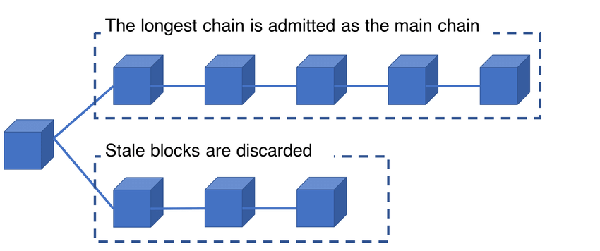

# Introduction
안녕하세요! 새로 인사 드리는 bekim입니다. 블록체인을 주제로 처음 연구글을 작성해보는데요. 자료의 양이 많기도 하고, 이 주제를 어떻게 좁혀갈지 고민이 많았어요.

그래서 저는 블록체인을 이해하는데 필수적인 비트코인 백서를 기반으로 블록체인 구조를 먼저 설명해보려고 합니다. 앞으로 연구글이 어떻게 흘러갈지는 미래의 제가 결정할테니, 거두절미하고 시작할게요.


# 1. Bitcoin: A Peer-to-Peer Electronic Cash System

2008년 10월, “사토시 나카모토” 라는 가명을 사용하는 신원 미상의 인물이 Bitcoin: A Peer-to-Peer Electronic Cash System이라는 논문을 The Cryptography Mailing List에 발표했습니다. 이 논문은 신뢰할 수 있는 제 3자(ex. 은행)에 의존하는 기존 방식 대신, 개인 간(P2P) 직접 거래를 가능하게 하는 새로운 전자 화폐 시스템을 제안하고 있습니다. 


# 2. The limitations of existing trust-based systems

비트코인 백서에서는 기존 디지털 화폐 시스템의 가장 큰 문제로 이중 지불 문제를 언급하고 있어요. 디지털 화폐는 물리적인 화폐와 달리 동일한 자산을 중복해서 사용할 가능성이 있기 때문에, 이를 방지하기 위해 중앙 기관이 모든 거래를 검증해야 했습니다.

하지만 이런 중앙 집중식 방식에는 몇 가지 한계가 있어요. 제 3자가 거래를 중재하는 과정에서 발생하는 거래 수수료와 같은 추가 비용은, 소액 거래에서 특히 비효율적이었어요. 또한 모든 거래가 중앙 서버를 거치기 때문에 시스템 처리 속도 측면에서도 효율성이 떨어졌어요. 마지막으로 중앙 시스템에 문제가 생기거나 악의적으로 작동할 경우, 전체 시스템이 위험에 빠질 수 있는 Single Point of Failure 문제도 존재했습니다. 👻

이러한 문제를 해결하기 위해서 비트코인은 Hashchain을 기반으로 한 구조를 도입했습니다. 비트코인의 ‘Transaction(거래)은 실제로 Hashchain으로 작동하며, 서로 강력하게 연결된 데이터 구조를 형성하고 있어요. 이 설계는 이중 지불 문제를 방지하면서, 중앙 기관 없이 탈중앙화된 검증 과정을 가능하게 만듭니다.


# 3. HashChain
Hashchain은 암호학적 해시 함수 h를 문자열 x에 연속적으로 적용해서 만들어진 값이에요. 예를 들어
```
h(h(h(h(x))))
```
와 같이 해시 함수를 4번 적용하면, 길이가 4인 해시 체인이 됩니다. 이를 $$h^4(x)$$로 표기하며, 각 단계에서 생성된 값은 이전 단계의 해시 결과를 기반으로 합니다. 이 구조는 데이터의 무결성을 보장하고, 암호학적 검증 매커니즘에서도 사용됩니다.

블록체인으로 구현된 비트코인 또한 이런 해시 체인을 기반으로 데이터를 연결해서, 모든 블록이 이전 블록과 암호학적으로 연결된 구조를 가지고 있어요.

위 그림을 예시로 들어서 쉽게 설명해볼게요. 🕶️
**Block 100**
- 헤더에는 이전 블록의 해시 값 Hash(Block 99), 블록의 데이터(Payload 100) 그리고 Nonce (작업 증명에 필요한 값)가 포함되어 있어요.
- 이 정보를 바탕으로 Block 100의 고유한 해시 값을 생성합니다.
**Block 101**
- Block 101의 헤더에는 Block 100의 해시 값이 포함됩니다.
- 여기에 Payload 101과 Nonce를 추가하여 Block 101만의 새로운 해시 값을 생성합니다.
**Block 102**
- 같은 방식으로 Block 102는 Block 101의 해시 값을 참조하여 연결됩니다.
- 위와 같은 과정을 통해 모든 블록이 암호학적으로 연결된 체인 구조를 형성합니다.

이런 구조는 데이터 변조를 방지하는데 중요한 역할을 합니다. 예를 들어, Block 100의 데이터(Payload 100)가 변경된다면, Block 101이 참조하는 Block 100의 해시 값이 달라져 유효하지 않게 되고, 결국 Block 101 이후의 모든 블록이 무효화 될 것입니다. 이런 방식으로 블록체인의 데이터의 무결성을 보장할 수 있습니다.


## 3.1. Transaction

> image source: Bitcoin: A Peer-to-Peer Electronic Cash System
>

위에서 언급했듯이, 비트코인의 Transaction도 HashChain의 원리를 따릅니다. 여기서 Transaction은 비트코인 네트워크에서 비트코인을 송금하거나 이동시키는 기본적인 단위를 말합니다. 이 거래 기록들은 모두 블록체인에 저장되며, 비트코인 네트워크 참여자가 공유하는 **분산 원장(ledger)**에 기록됩니다.

각 Transaction은 **이전 Transaction의 해시 값**을 포함해서 서로 연결됩니다. 위 그림처럼, Owner 1의 Transaction에는 Owner 0의 해시 값이 포함되어, Owner 1이 해당 자산의 소유권을 합법적으로 이전 받았음을 증명할 수 있습니다. 

또한 Transaction에는 현재 Owner의 **공개 키(Public key)**와 **디지털 서명(Digital Signature)**이 포함하고 있어요. 그래서 네트워크는 공개 키를 통해 디지털 서명을 검증하여, Transaction이 위조되지 않았는지 확인하게 됩니다. 이후 Owner 2는 Owner 1의 Transaction을 참조하고, 자신의 디지털 서명을 추가하여 새로운 Transaction을 생성해요. 이러한 과정이 반복되면서 Transaction들은 연속적으로 연결되어 해시 체인 형태를 이루게 됩니다.

이러한 구조로 인해, 하나의 Transaction이라도 변경되면, 이후 모든 트랜잭션이 무효화 되어 데이터 무결성을 보장할 수 있게 됩니다.


# 4. Proof of Work (PoW, 작업 증명)
비트코인 네트워크에서는 새로운 블록을 블록 체인에 추가하는 방식으로 새로운 화폐를 생성하고 송금을 처리합니다. 이 과정에서 사용되는 핵심 메커니즘이 바로 Proof of Work (작업 증명)입니다.

작업 증명을 직관적으로 이해하자면, 채굴자들이 복잡한 수학적 문제를 해결하는 **“작업을 수행했음을 증명”**하도록 요구하는 것입니다. 문제를 가장 먼저 해결한 채굴자는 문제를 가장 먼저 해결한 채굴자는 새로운 블록을 블록체인에 추가할 권리를 얻으며, 보상으로 비트코인을 받습니다. 

탈중앙화 시스템에서는 거래를 관리하는 중앙 시스템이 없기 때문에, 모든 참여자가 자동으로 신뢰하고 동의할 수 있는 방식이 필요합니다. 작업 증명은 이를 가능하게 하는 중요한 역할을 합니다.

위 과정을 좀 더 자세히 설명해보겠습니다.
채굴자들은 Nonce라는 값(채굴자가 임의로 변경할 수 있는 값)을 계속 변경해가서 해시 퍼즐(Hash Puzzle)을 풀어야 합니다. 예를 들어 처음에는 해시 출력 값이 8개의 0으로 시작되어야 새로운 블록이 정당하게 채굴된 것으로 인정됩니다. 

비트코인 네트워크에서는 평균 10분에 한 번씩 블록이 생성되도록 설계되어있는데, 이를 유지하기 위해 네트워크는 난이도(Difficulty)를 조정합니다. 난이도는 해시 값에서 요구하는 0의 개수를 통해 결정되는데, 0의 개수가 많아질수록 유효한 해시 값을 찾는데 필요한 계산량이 더 늘게 돼요. 초기에는 해시의 출력 값이 8개의 0이 필요했지만, 현재(2024년 기준) 난이도는 더 높아져서 해시 값에 19개의 0이 요구됩니다. 이로 인해 막대한 계산 자원과 전력이 필요 며, 오늘날에는 일반적인 컴퓨터로는 채굴 경쟁에 참여하기 어려워졌습니다.

이러한 작업 증명은 블록 체인 네트워크의 데이터 무결성을 보장하고, Longest chain rule (가장 긴 체인 원칙)을 통해 네트워크 참여자들이 합의에 도달하도록 돕습니다.

> Image Source: The longest chain accounts for the greatest PoW effort and is admitted as the main chain, ResearchGate.
>

네트워크에서 동시에 여러 채굴자가 새로운 블록을 생성하면 두 개 이상의 체인이 존재할 수 있습니다. 이 경우를 fork라고 하는데, 포크가 발생하면 네트워크 참여자들은 어떤 체인을 신뢰해야 할지 결정해야 합니다.
이 경우 longest chain rule을 따라서 가장 많은 작업 증명(PoW)이 투입된 체인을 메인 체인으로 인정합니다. 즉, 가장 긴 체인이 가장 많은 계산 자원을 소모해 생성되었으므로, 유효한 체인임을 인정하는 것입니다.

위 그림에서 볼 수 있듯, 경쟁에서 탈락한 체인에 속한 블록들은 Stale Block(버려진 블록)으로 간주되어 네트워크에서 무효화 됩니다. 이 블록에 포함된 트랜잭션은 이후 main chain에 다시 포함됩니다.

이 과정을 통해 네트워크의 모든 참여자가 가장 긴 체인을 공유함으로써 데이터의 무결성과 신뢰성을 유지하고, 탈중앙화된 환경에서의 합의를 이룰 수 있게 됩니다. 🙆

지금까지 비트코인 백서를 중심으로 블록체인의 원리와 핵심 매커니즘을 정리해보았습니다. 이번 글에서는 블록체인이 어떻게 탈중앙화와 데이터 무결성을 유지하는지를 중점적으로 작성해보았어요. 

첫 글은 블록체인의 기본 원리를 넓은 범위에서 다뤘지만, 다음 연구글에서는 작업 증명(Proof of Work) 외에도 다양한 합의 알고리즘에 대해 구체적으로 정리해볼 예정입니다.
이 연구글이 블록체인을 접하는 독자분들에게 유익한 글이 되었기를 바랍니다. 😀


### 초심자를 위한 비트코인
- 분산 원장(ledger): 모든 네트워크 참여자가 나눠 가진 동일한 거래 기록
- 디지털 서명: 개인 키로 생성된 전자 서명
- [https://bitaps.com/](https://bitaps.com/)사이트에서는 비트코인 블록 생성을 실시간으로 볼 수 있습니다!
