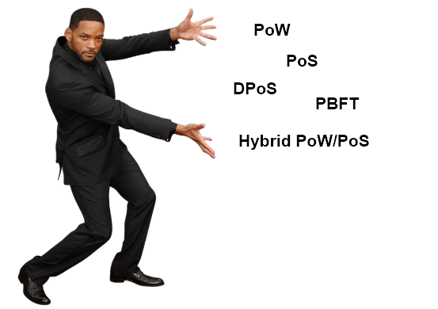
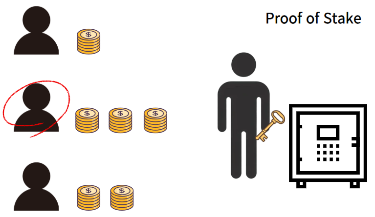
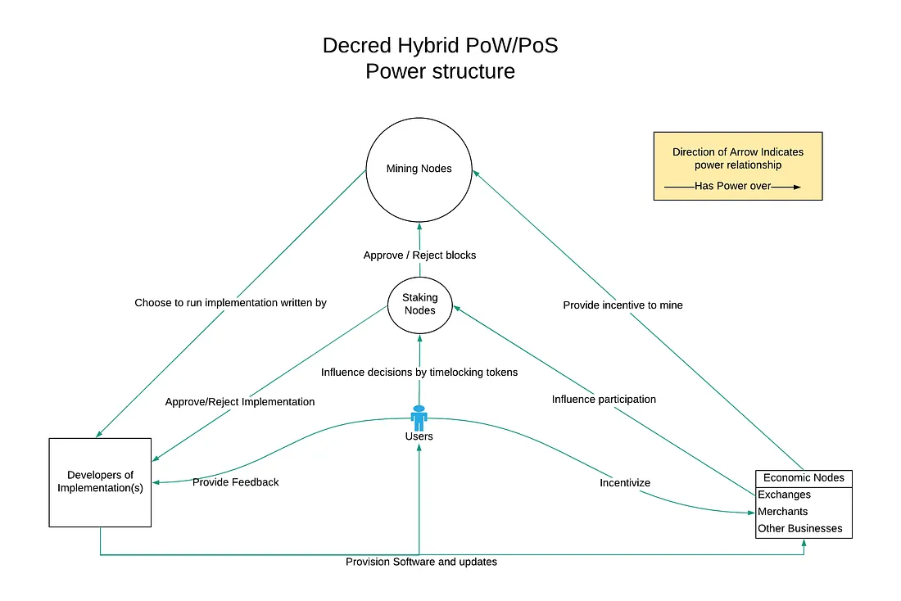
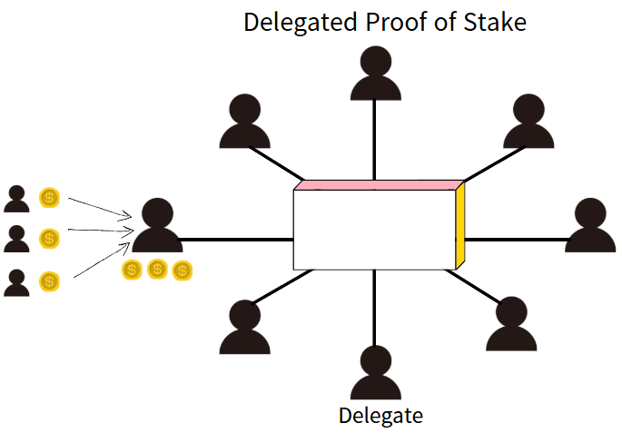
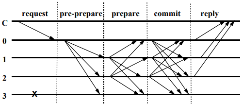

# Introduction
Hello! It's bekim.

In my previous post, I briefly explained that transactions in the Bitcoin network become possible by adding new blocks through a mechanism called "Proof of Work.”. But, PoW isn\'t the only consensus algorithm available. Actually there are actually many different consensus algorithms used in blockchain systems.
A consensus algorithm is basically the mechanism by which participants in a blockchain network agree on choosing a single valid block and maintaining the chain.
In this post, I'll introduce various consensus algorithms: PoW, PoS, DPoS, PBFT, and Hybrid PoW/PoS.


# 1. Proof of Work  (PoW)
To explain this a bit further, Proof of Work is a method where participants (miners) need to find a hash value that meets a specific difficulty requirement. This mechanism was first introduced by Bitcoin. Miners repeatedly adjust a Nonce value, attempting to find a hash that matches the target difficulty.
Bitcoin aims to generate a new block roughly every 10 minutes. To keep this timing consistent, the network automatically adjusts the mining difficulty approximately every two weeks (every 2016 blocks)
Now, let's take a closer look at how Proof of Work (PoW) functions in Bitcoin's latest implementation.
```cpp
unsigned int GetNextWorkRequired(const CBlockIndex* pindexLast, const CBlockHeader *pblock, const Consensus::Params& params)
{
    assert(pindexLast != nullptr);
    unsigned int nProofOfWorkLimit = UintToArith256(params.powLimit).GetCompact();
		
		// Only change once per difficulty adjustment interval
    // [1] 
    if ((pindexLast->nHeight+1) % params.DifficultyAdjustmentInterval() != 0)
    {
        if (params.fPowAllowMinDifficultyBlocks)
        {
            // Special difficulty rule for testnet:
            // If the new block's timestamp is more than 2* 10 minutes
            // then allow mining of a min-difficulty block.
            // [2]
            if (pblock->GetBlockTime() > pindexLast->GetBlockTime() + params.nPowTargetSpacing*2)
                return nProofOfWorkLimit;
            else
            {
                // Return the last non-special-min-difficulty-rules-block
                // [3]
                const CBlockIndex* pindex = pindexLast;
                while (pindex->pprev && pindex->nHeight % params.DifficultyAdjustmentInterval() != 0 && pindex->nBits == nProofOfWorkLimit)
                    pindex = pindex->pprev;
                return pindex->nBits;
            }
        }
        // [4]
        return pindexLast->nBits;
    }

    // Go back by what we want to be 14 days worth of blocks
    // [5]
    int nHeightFirst = pindexLast->nHeight - (params.DifficultyAdjustmentInterval()-1);
    assert(nHeightFirst >= 0);
    const CBlockIndex* pindexFirst = pindexLast->GetAncestor(nHeightFirst);
    assert(pindexFirst);

    return CalculateNextWorkRequired(pindexLast, pindexFirst->GetBlockTime(), params);
}
```
\[1] Bitcoin adjusts the mining difficulty approximately every two weeks (every 2016 blocks). If the next block's height (`pindexLast->nHeight+1`) is not a multiple of 2016 (`params.DifficultyAdjustmentInterval()`), Bitcoin retains the difficulty level (`pindexLast->nBits`)\[4] from the previous block without any adjustment.
\[2]In Bitcoin's Testnet, there is an exception rule: if no new block is generated for 20 minutes (twice the normal 10-minute interval), the network temporarily reduces the difficulty to its minimum value (`nProofOfWorkLimit`). 
\[3] Even after this temporary minimum difficulty adjustment on Testnet, once miners successfully generate subsequent blocks, the difficulty returns to its previous normal level. This is done by tracking backwards through recent blocks to find the most recent valid difficulty value

```cpp
const CBlockIndex* pindex = pindexLast;
while (pindex->pprev && pindex->nHeight % params.DifficultyAdjustmentInterval() != 0 && pindex->nBits == nProofOfWorkLimit)
    pindex = pindex->pprev;
return pindex->nBits;
```
For this purpose, Bitcoin checks the most recently added block (`pindexLast`) and traces back from there. While traversing backward through previous blocks, Bitcoin skips blocks where the difficulty was temporarily reduced to the minimum (`pindex->nBits == nProofOfWorkLimit`). Specifically, it continues moving backward through blocks that haven't yet reached the difficulty adjustment interval (`pindex->nHeight % params.DifficultyAdjustmentInterval() != 0`) until it finds a block where an actual difficulty adjustment occurred. At that point, it stops searching and uses that block’s difficulty as a reference.

\[5] However, if the current block height (`pindexLast->nHeight`) is a multiple of the difficulty adjustment interval (2016 blocks), Bitcoin recalculates the difficulty level instead of using the previous one.

---

Bitcoin is designed so that if the previous 2016 blocks were generated faster than expected, the difficulty increases. On the other hand, if those blocks were generated more slowly than expected, the difficulty is lowered.
```cpp
unsigned int CalculateNextWorkRequired(const CBlockIndex* pindexLast, int64_t nFirstBlockTime, const Consensus::Params& params)
{
    if (params.fPowNoRetargeting)
        return pindexLast->nBits;

    // Limit adjustment step
    // [1]
    int64_t nActualTimespan = pindexLast->GetBlockTime() - nFirstBlockTime;
    // [2]
    if (nActualTimespan < params.nPowTargetTimespan/4)
        nActualTimespan = params.nPowTargetTimespan/4;
    if (nActualTimespan > params.nPowTargetTimespan*4)
        nActualTimespan = params.nPowTargetTimespan*4;

    // Retarget
    const arith_uint256 bnPowLimit = UintToArith256(params.powLimit);
    arith_uint256 bnNew;

    // Special difficulty rule for Testnet4
    // [3]
    if (params.enforce_BIP94) {
        // Here we use the first block of the difficulty period. This way
        // the real difficulty is always preserved in the first block as
        // it is not allowed to use the min-difficulty exception.
        int nHeightFirst = pindexLast->nHeight - (params.DifficultyAdjustmentInterval()-1);
        const CBlockIndex* pindexFirst = pindexLast->GetAncestor(nHeightFirst);
        bnNew.SetCompact(pindexFirst->nBits);
    } else {
        bnNew.SetCompact(pindexLast->nBits);
    }
		
		// [4]
    bnNew *= nActualTimespan;
    bnNew /= params.nPowTargetTimespan;
		
		
		// [5]
    if (bnNew > bnPowLimit)
        bnNew = bnPowLimit;

    return bnNew.GetCompact();
}
```
\[1] First, The network compares the timestamp of the latest block (`pindexLast->GetBlockTime()`) with the timestamp from 2016 blocks ago (`nFirstBlockTime`) to calculate the actual time taken to generate the previous 2016 blocks, storing this result in `nActualTimespan`. This value serves as the basis for adjusting the difficulty later.
```cpp
int64_t nActualTimespan = pindexLast->GetBlockTime() - nFirstBlockTime;
```

\[2] Bitcoin measures `nActualTimespan` and compares it to the target time (`params.nPowTargetTimespan`) to adjust the difficulty. To prevent drastic changes in difficulty, the adjustment is limited—difficulty can only increase up to 1/4 of the target time or decrease up to 4 times the target time.
```cpp
if (nActualTimespan < params.nPowTargetTimespan/4)
    nActualTimespan = params.nPowTargetTimespan/4;
if (nActualTimespan > params.nPowTargetTimespan*4)
    nActualTimespan = params.nPowTargetTimespan*4;
```
This limitation helps prevent sudden fluctuations in the network.
The process of determining the reference block for difficulty adjustment depends on the value of `params.enforce_BIP94`.
If this rule is applied, the difficulty of the block 2016 blocks before the current one (`pindexFirst->nBits`) is used as the reference. This helps prevent exceptional cases where the difficulty could drop to the minimum value. If the rule is not applied, the difficulty of the current block (`pindexLast->nBits`) is used instead.
This approach helps prevent the difficulty from dropping abnormally low in environments like Testnet.
```cpp
if (params.enforce_BIP94) {
    // Here we use the first block of the difficulty period. This way
    // the real difficulty is always preserved in the first block as
    // it is not allowed to use the min-difficulty exception.
    int nHeightFirst = pindexLast->nHeight - (params.DifficultyAdjustmentInterval()-1);
    const CBlockIndex* pindexFirst = pindexLast->GetAncestor(nHeightFirst);
    bnNew.SetCompact(pindexFirst->nBits);
} else {
    bnNew.SetCompact(pindexLast->nBits);
}
```
> BIP (Bitcoin Improvement Proposal): A proposal for improving the Bitcoin protocol. BIP94 is one of these proposals and is designed to prevent the difficulty from dropping excessively in certain networks (such as Testnet4) during difficulty adjustments.
> 

\[4] After that, Bitcoin calculates the new difficulty using the `nActualTimespan` value. Bitcoin sets the target block generation time to 10 minutes, and assuming 2016 blocks are created, the target time (`params.nPowTargetTimespan`) is approximately two weeks (1,209,600 seconds). The difficulty is then adjusted based on the ratio between the actual block generation time and the target time.
```cpp
bnNew *= nActualTimespan;
bnNew /= params.nPowTargetTimespan;
```
In other words, the new difficulty is adjusted using the formula:
_New Difficulty = (Current Difficulty × Actual Time Taken) / Target Time_

By applying this formula, Bitcoin ensures that the average block generation time stays around 10 minutes.
\[5] Plus, to prevent the difficulty from dropping too low, it is restricted from falling below the minimum difficulty (`bnPowLimit`).
```cpp
if (bnNew > bnPowLimit)
    bnNew = bnPowLimit;
```
The calculated difficulty is then applied to the next block, and miners must solve for this target value.
However, as mentioned in a previous post, the PoW method requires a massive amount of computation, which means it uses a ton of energy.
On top of that, with the rise of large-scale mining pools, there is a risk that one group could control more than 51% of the network's hash power**.** If that happens, they could manipulate transactions or even pull off a double-spending attack.
To overcome these limitations of PoW, the Proof of Stake (PoS) consensus algorithm was introduced.

# 2. Proof of Stake (PoS)
Proof of Stake (PoS) is a consensus algorithm that grants block creation and validation rights based on the amount of cryptocurrency a user holds and how long they’ve held it.
In PoW, miners have to solve complex mathematical problems, but in PoS, users can participate as validators by staking a certain amount of the network’s cryptocurrency. The more coins a validator stakes, the higher their chances of being selected to create a new block. PoS also enhances security through economic incentives. honest validators receive rewards, while those who engage in fraudulent activities face penalties, such as losing a portion of their staked funds.
The PoS concept was first implemented in Peercoin in 2012, and many blockchains have adopted it since then. In 2022, Ethereum also transitioned from PoW to PoS.

I was going to use Ethereum as an example to explain how PoS works, but analyzing its code would make this post way too long. So instead, let’s break it down using a highly simplified version of the PoS consensus algorithm to understand the core principles.

```python
import random
import hashlib
import time

// [1]
class Validator:
    def __init__(self, address, stake):
        self.address = address  # Validator address
        self.stake = stake 
        self.vote_weight = stake  
    
    def __repr__(self):
        return f"Validator({self.address}, Stake: {self.stake})"

class PoSBlockchain:
    def __init__(self):
        self.validators = [] 
        self.blocks = []
    
    def register_validator(self, address, stake):
        if stake < 32:
            print(f"[ERROR] {address} need to stake over 32 ETH")
            return
        validator = Validator(address, stake)
        self.validators.append(validator)
        print(f"[INFO] {validator} registered as a validator.")
		
		// [2]
    def select_proposer(self):
        """ Randomly select a block proposer """
        total_stake = sum(v.stake for v in self.validators)
        rand_value = random.uniform(0, total_stake)
        
        cumulative = 0
        for validator in self.validators:
            cumulative += validator.stake
            if rand_value <= cumulative:
                print(f"[INFO] selected validator: {validator.address}")
                return validator
		// [3]
    def create_block(self, proposer):
        """ Generate a block and calculate hash """
        prev_hash = self.blocks[-1]['hash'] if self.blocks else "GENESIS"
        timestamp = time.time()
        block_data = f"{proposer.address}-{timestamp}-{prev_hash}"
        block_hash = hashlib.sha256(block_data.encode()).hexdigest()
        block = {"proposer": proposer.address, "hash": block_hash, "prev_hash": prev_hash}
        return block
		
		// [4]
    def validate_and_vote(self, block):
        votes = 0
        for validator in self.validators:
            if random.random() > 0.1:  # 90% probability of a valid vote
                votes += validator.vote_weight
        
        required_votes = sum(v.stake for v in self.validators) * 0.67  # At least 67% approval required
        if votes >= required_votes:
            self.blocks.append(block)
            print(f"[INFO] Validation: {block['hash']}")
            return True
        else:
            print("[WARNING] Not enough votes ")
            return False
		// [5]
    def run_consensus(self):
        proposer = self.select_proposer()
        if proposer:
            new_block = self.create_block(proposer)
            self.validate_and_vote(new_block)

pos_chain = PoSBlockchain()

pos_chain.register_validator("Alice", 50)
pos_chain.register_validator("Bob", 40)
pos_chain.register_validator("Charlie", 32)
pos_chain.register_validator("Dave", 100)

for _ in range(3):
    pos_chain.run_consensus()
```

\[1] In Ethereum, you need to stake 32 ETH to participate as a validator.
```python
class Validator:
    def __init__(self, address, stake):
        self.address = address  
        self.stake = stake  
        
    def __repr__(self):
        return f"Validator({self.address}, Stake: {self.stake})"
```

\[2] Participants who stake more coins have a higher chance of being selected as the next block validator, but the selection process also involves randomization algorithms to make it unpredictable and harder to manipulate
```python
def select_proposer(self):
    """Select a block proposer randomly, weighted by stake"""
    total_stake = sum(v.stake for v in self.validators.values())
    rand_value = random.uniform(0, total_stake)

    cumulative = 0
    for validator in self.validators.values():
        cumulative += validator.stake
        if rand_value <= cumulative:
            print(f"[INFO] Selected proposer: {validator.address}")
            return validator
    return None
```

\[3] The selected validator bundles new transactions, creates a block, and proposes it to the blockchain.
```python
def create_block(self, proposer):
    """Generate a new block"""
    prev_hash = self.blockchain[-1]['Hash']
    new_block = {
        "Index": len(self.blockchain),
        "Timestamp": str(datetime.now()),
        "PrevHash": prev_hash,
        "Validator": proposer.address
    }
    new_block["Hash"] = self.hash_block(new_block)
    return new_block
```

\[4] Other validators participate in the consensus process by verifying the block’s validity and voting on it. In Ethereum, at least 128 validators must review and vote on a block. Once enough consensus is reached through this voting process, the block is added to the blockchain.
```python
def validate_and_vote(self, block):
    """Simulate validator voting process"""
    total_stake = sum(v.stake for v in self.validators.values())
    votes = sum(v.stake for v in self.validators.values() if random.random() > 0.1)  # # 90% chance to approve

    if votes >= total_stake * 0.67:  # Requires at least 67% approval 
        self.blockchain.append(block)
        print(f"[INFO] Block added: {block['Hash']}")
        return True
    else:
        print("[WARNING] Block rejected due to insufficient votes.")
        return False
```

\[5] Validators who successfully create a valid block receive transaction fees and network rewards as compensation.
```python
def run_consensus(self):
    """Run the PoS consensus process"""
    proposer = self.select_proposer()
    if proposer:
        new_block = self.create_block(proposer)
        self.validate_and_vote(new_block)
        proposer.stake += 5  # reward
        print(f"[INFO] {proposer.address} received 5 ETH as a reward.")
```
If a validator engages in dishonest behavior or fails to perform the required validation tasks, they face penalties. For example, if a validator goes offline and fails to validate blocks, they may receive reduced rewards or have a portion of their staked funds slashed. In more severe cases, such as double signing or approving an invalid block, the validator can be slashed, meaning they lose some or even all of their staked funds and get removed from the network.

Because of this system, PoS helps maintain the security and integrity of the network while being more energy-efficient than PoW. However, PoS has its own limitations. Those who hold more coins tend to have a continuous advantage, leading to potential centralization risks in the network.

# 3. Hybrid PoW/PoS

> Complete Overview of Decred's Structure [Source: https://medium.com/decred/blockchain-governance-how-decred-iterates-upon-bitcoin-3cc7030c655e]
>

The traditional PoW provides high security but has high energy consumption and the issue of mining monopolization. On the other hand, the PoS method is energy-efficient but comes with the risk of validator monopoly. To solve this, the Hybrid PoW/PoS model emerged. In this method, PoW is used to generate blocks, while PoS validators approve them.
First, a miner performs computations using the Proof-of-Work method to create a new block. However, the created block is not immediately added to the chain but goes through a final approval process via the PoS validators' vote. PoS validators participate by staking a certain amount of the cryptocurrency they hold, and randomly selected validators evaluate the validity of the block and vote on it. Typically, if at least 3 out of 5 validators approve, the block is validated and added to the blockchain. The rewards are distributed to both PoW miners and PoS validators. For example, in Decred (DCR), 60% of the reward is given to PoW miners, 30% goes to PoS validators, and the remaining 10% is allocated to the network development fund. Through this, excessive monopolization by PoW miners is prevented, and PoS validators are incentivized to actively participate in maintaining the network.
By combining PoW’s high security with PoS’s energy efficiency, this structure strengthens resistance against 51% attacks and mitigates validator centralization issues.

# 4. DPoS (Delegated Proof of Stake)
Delegated Proof of Stake (DPoS) is an improved version of the traditional PoS consensus algorithm, designed to make transaction verification and block generation in blockchain networks more efficient. Instead of users directly creating blocks, DPoS allows them to elect delegates, who are then entrusted with the responsibility of validating transactions and generating blocks.

First, all token holders vote based on their stake to elect delegates. These elected delegates take turns generating and validating blocks in a fixed order, playing a key role in maintaining the network.

In this system, the integrity of the delegates is crucial. Voting is an ongoing process, and if a delegate fails to create blocks or engages in dishonest behavior, token holders can replace them through re-elections. Because DPoS operates in a more democratic manner and delegates take turns producing blocks, it achieves faster block finalization times, leading to better network performance. Additionally, since there is no mining competition, energy consumption is significantly lower compared to PoW. However, since the number of delegates is limited, DPoS carries a higher risk of centralization compared to PoW or PoS. If a small group of delegates collude, it could undermine the fairness of the network.

Notable DPoS-based blockchains include EOS and TRON, as well as projects like Steem and Lisk, which also utilize DPoS. In these systems, a fixed number of delegates manage the network and execute the consensus process efficiently.

# 5. PBFT (Practical Byzantine Fault Tolerance)
Those who have studied blockchain may have heard of the Byzantine Generals Problem.
The Byzantine fault tolerance problem was designed to address this issue and is described as follows:
- A group of Byzantine generals has surrounded an enemy city. They cannot communicate directly with each other and must rely on messengers to exchange information. The problem is that some of the generals might be **traitors**. Loyal generals need to either attack together or retreat together, but the traitors aim to create confusion, causing some to attack while others retreat, ultimately ruining the operation.
- In this situation, loyal generals must achieve two key goals:
    - All loyal generals must reach the same decision—either they all attack or they all retreat.
    - The traitors must not be able to spread false information that leads to an incorrect decision.
- The loyal generals must maintain these two conditions under any circumstances. However, the traitors can do anything—they can send false messages, alter communications, or deceive others in various ways.

Thus, the generals need a reliable communication method (algorithm) that enables them to reach a correct agreement in any situation.
This is the essence of the "Byzantine Generals Problem."
PBFT (Practical Byzantine Fault Tolerance) is a consensus algorithm designed to ensure secure agreement within a network, even if some nodes fail to respond or provide incorrect information. In particular, when there are 3f + 1 nodes, the system can remain secure and functional even if up to f nodes are malicious (Byzantine). Unlike PoW or PoS, this consensus algorithm does not require computational competition. Instead, it operates based on a voting system, allowing for faster transaction finality.

> Figure 1. Byzantine Generals Problem Image [Source: Attached research paper]
>

PBFT consists of clients and replicas, with one of the replicas acting as the leader (Primary) node. To achieve consensus, it follows a four-step protocol: Request, Pre-prepare, Prepare, and Commit. _(f: The number of nodes that can exhibit Byzantine faults)_

1. **Request**
The client sends a request to the leader node.

2. **Pre-Prepare**
The leader node broadcasts the request to all backup nodes. At this stage, if the leader node is malicious, it could propagate an incorrect request. However, the following steps will verify its validity.

3. **Prepare**
Each backup node verifies the Pre-Prepare message sent by the leader node and then broadcasts a PREPARE message to the other nodes. At this stage, a node considers the request trustworthy if it receives at least 2f + 1 PREPARE messages for the same request.

4. **Commit**
Each backup node considers the request trustworthy once it receives 2f + 1 PREPARE messages and then sends a COMMIT message to the other nodes. Nodes finalize the request when they receive 2f + 1 COMMIT messages for the same request.

5. **Reply**
The client confirms that the request has been successfully processed once it receives f + 1 matching responses.

PBFT is a consensus algorithm that provides fast transaction finality and high security. Unlike PoW or PoS, it does not rely on computational competition and can maintain network stability even with up to one-third Byzantine faults. However, as the network grows, the consensus process slows down, making scalability a major limitation. PBFT is used in Hyperledger Fabric, Zilliqa, and other blockchain projects. It is considered a suitable consensus algorithm for private blockchains and small-scale node networks.
We've explored 5 different blockchain consensus algorithms so far. Some were explained in detail, while others were covered more briefly. Since Proof of Work (PoW) and Proof of Stake (PoS) are the most familiar ones from my studies, I ended up writing a bit more about them.
Of course, there are many other consensus algorithms out there, but for today, I focused on these five well-known ones.
Thanks for reading this long post! If I come across more interesting topics, I'll make sure to summarize them again. 👋

- **Reference**
[https://github.com/bitcoin/bitcoin](https://github.com/bitcoin/bitcoin)
[https://github.com/ethereum/go-ethereum](https://github.com/ethereum/go-ethereum)
[https://blockapps.net/blog/staking-in-crypto-exploring-adoption-trends-and-strategies-for-2024/](https://blockapps.net/blog/staking-in-crypto-exploring-adoption-trends-and-strategies-for-2024/)
[https://coinbureau.com/review/decred-dcr/](https://coinbureau.com/review/decred-dcr/)
[https://pmg.csail.mit.edu/papers/osdi99.pdf](https://pmg.csail.mit.edu/papers/osdi99.pdf)
