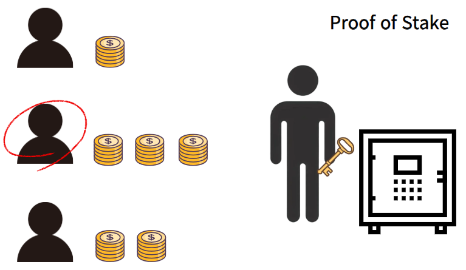
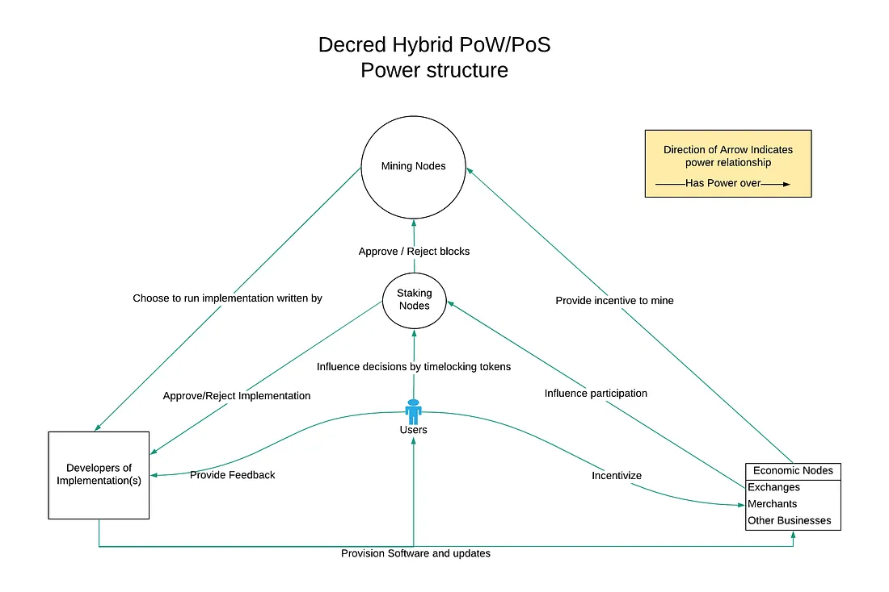
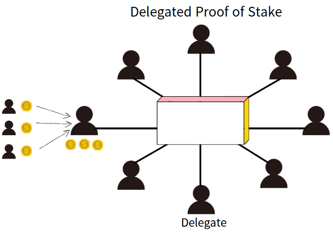
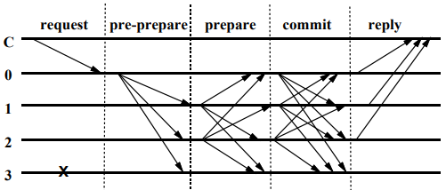

# Introduction
안녕하세요 bekim입니다.

이전 연구글에서는 비트코인 네트워크에 블록을 추가하여 거래를 가능하게 하는 것이 “Proof of Work”임을 짧게 알려드렸죠? 사실 이 과정을 가능하게 하는 합의 알고리즘은 PoW 뿐만 아니라 여러 가지가 있어요. 합의 알고리즘(Consensus Algorithm)이란, 블록체인 네트워크의 참여자들이 하나의 유효한 블록을 선택하고, 해당 체인을 유지하는 방식을 결정하는 매커니즘을 말해요. 
이번 연구글에서는 그 중에서도 잘 알려진 알고리즘인 PoS, PoW와 DPoS, PBFT, Hybrid PoW/PoS에 대해 설명드리겠습니다.


# 1. Proof of Work  (PoW)
저번에 말씀드렸던 작업 증명을 간단하게 설명드리면, 작업증명은 채굴자가 연산을 수행하여 특정 난이도를 만족하는 해시 값을 찾는 방식입니다. 이 방식은 비트코인에서 처음 도입되었으며, 채굴자는 Nonce 값을 조정하며 목표 해시 값을 찾는 과정을 반복해야 해요. 
비트코인은 평균 10분마다 블록이 생성되도록 설계되어있는데, 이를 유지하기 위해 네트워크는 약 2주(2016개 블록)마다 난이도(Difficulty)를 조정해요.

실제 비트코인의 최신 구현을 기준으로, PoW가 어떻게 동작하는지 살펴보겠습니다!

```cpp
unsigned int GetNextWorkRequired(const CBlockIndex* pindexLast, const CBlockHeader *pblock, const Consensus::Params& params)
{
    assert(pindexLast != nullptr);
    unsigned int nProofOfWorkLimit = UintToArith256(params.powLimit).GetCompact();
		
		// Only change once per difficulty adjustment interval
    // [1] 
    if ((pindexLast->nHeight+1) % params.DifficultyAdjustmentInterval() != 0)
    {
        if (params.fPowAllowMinDifficultyBlocks)
        {
            // Special difficulty rule for testnet:
            // If the new block's timestamp is more than 2* 10 minutes
            // then allow mining of a min-difficulty block.
            // [2]
            if (pblock->GetBlockTime() > pindexLast->GetBlockTime() + params.nPowTargetSpacing*2)
                return nProofOfWorkLimit;
            else
            {
                // Return the last non-special-min-difficulty-rules-block
                // [3]
                const CBlockIndex* pindex = pindexLast;
                while (pindex->pprev && pindex->nHeight % params.DifficultyAdjustmentInterval() != 0 && pindex->nBits == nProofOfWorkLimit)
                    pindex = pindex->pprev;
                return pindex->nBits;
            }
        }
        // [4]
        return pindexLast->nBits;
    }

    // Go back by what we want to be 14 days worth of blocks
    // [5]
    int nHeightFirst = pindexLast->nHeight - (params.DifficultyAdjustmentInterval()-1);
    assert(nHeightFirst >= 0);
    const CBlockIndex* pindexFirst = pindexLast->GetAncestor(nHeightFirst);
    assert(pindexFirst);

    return CalculateNextWorkRequired(pindexLast, pindexFirst->GetBlockTime(), params);
}
```

\[1] 비트코인은 2016개 블록마다 난이도를 조정해요. 만약 다음 블록의 높이(`pindexLast->nHeight+1`)가 2016(`params.DifficultyAdjustmentInterval()`) 의 배수가 아니라면 난이도를 변경하지 않고 기존 블록의 난이도(`pindexLast->nBits`)\[4]를 유지하게 됩니다.

\[2] 이 때, Testnet 환경에서는, 이전 블록이 생성된 후 목표시간(10분)의 2배인 20분 이상이 지나도록 새로운 블록이 생성되지 않으면 난이도를 최소값(nProofOfWorkLimit)으로 조정하는 예외 규칙이 적용되는데요.

\[3] Testnet에서 난이도를 최소값으로 조정했더라도, 이후 정상적인 블록이 생성되면 다시 원래 난이도로 복귀합니다. 이 과정에서 이전 블록을 따라가며 가장 최근의 정상적인 난이도를 가진 블록을 찾아 그 난이도를 유지해요.

```cpp
const CBlockIndex* pindex = pindexLast;
while (pindex->pprev && pindex->nHeight % params.DifficultyAdjustmentInterval() != 0 && pindex->nBits == nProofOfWorkLimit)
    pindex = pindex->pprev;
return pindex->nBits;
```
이를 위해 비트코인은 가장 최근에 추가된 블록(`pindexLast`)을 시작점으로, 이전 블록을 따라가며(`while (pindex->pprev)`) 가장 최근의 정상적인 난이도를 가진 블록을 찾아 난이도를 유지해요. 
즉, 최소 난이도로 생성된 블록들은 건너 뛰고(`pindex->nBits == nProofOfWorkLimit`), 난이도 조정 주기에 도달하지 않은 블록들을 탐색하다가(`pindex->nHeight % params.DifficultyAdjustmentInterval() != 0`), 난이도 조정이 이루어진 블록을 만나면 탐색을 종료합니다.

\[5] 하지만, 현재 블록의 높이(`pindexLast->nHeight`)가  난이도 조정 주기(2016개의 배수)에 도달했을 경우, 비트코인 네트워크에서는 새로운 난이도를 계산하여 조정합니다.

---

비트코인에서는 이전 2016개 블록이 예상보다 빨리 생성되었으면 난이도를 높이고, 느리게 생성되었으면 난이도를 낮추는 방식으로 설계되었어요.
```cpp
unsigned int CalculateNextWorkRequired(const CBlockIndex* pindexLast, int64_t nFirstBlockTime, const Consensus::Params& params)
{
    if (params.fPowNoRetargeting)
        return pindexLast->nBits;

    // Limit adjustment step
    // [1]
    int64_t nActualTimespan = pindexLast->GetBlockTime() - nFirstBlockTime;
    // [2]
    if (nActualTimespan < params.nPowTargetTimespan/4)
        nActualTimespan = params.nPowTargetTimespan/4;
    if (nActualTimespan > params.nPowTargetTimespan*4)
        nActualTimespan = params.nPowTargetTimespan*4;

    // Retarget
    const arith_uint256 bnPowLimit = UintToArith256(params.powLimit);
    arith_uint256 bnNew;

    // Special difficulty rule for Testnet4
    // [3]
    if (params.enforce_BIP94) {
        // Here we use the first block of the difficulty period. This way
        // the real difficulty is always preserved in the first block as
        // it is not allowed to use the min-difficulty exception.
        int nHeightFirst = pindexLast->nHeight - (params.DifficultyAdjustmentInterval()-1);
        const CBlockIndex* pindexFirst = pindexLast->GetAncestor(nHeightFirst);
        bnNew.SetCompact(pindexFirst->nBits);
    } else {
        bnNew.SetCompact(pindexLast->nBits);
    }
		
		// [4]
    bnNew *= nActualTimespan;
    bnNew /= params.nPowTargetTimespan;
		
		
		// [5]
    if (bnNew > bnPowLimit)
        bnNew = bnPowLimit;

    return bnNew.GetCompact();
}
```

\[1] 먼저, 최근 블록의 타임스탬프(`pindexLast->GetBlockTime()`)와 이전 2016개 블록의 타임스탬프(`nFirstBlockTime`)을 비교하여, 이전 2016개 블록이 생성되는데 걸린 실제 시간을 `nActualTimespan` 에 저장합니다.이 값은 이후 난이도 조정을 위한 기준이 돼요.
```cpp
int64_t nActualTimespan = pindexLast->GetBlockTime() - nFirstBlockTime;
```

\[2] 비트코인은 nActualTimespan을 측정해 목표 시간(`params.nPowTargetTimespan`)과 비교한 후 난이도를 조정하는데, 난이도가 급격하게 변하는 것을 방지하기 위해 목표 시간의 1/4배까지 난이도를 증가시키거나, 4배까지 난이도를 감소시킬 수 있도록 제한해요.
```cpp
if (nActualTimespan < params.nPowTargetTimespan/4)
    nActualTimespan = params.nPowTargetTimespan/4;
if (nActualTimespan > params.nPowTargetTimespan*4)
    nActualTimespan = params.nPowTargetTimespan*4;
```
이러한 제한을 두면 네트워크의 급격한 변동을 방지할 수 있습니다.

먼저, 난이도 조정 시 기준이 되는 블록을 결정하는 과정은 `params.enforce_BIP94` 값에 따라 달라집니다.
이 규칙이 적용되는 경우,현재 블록에서 2016개 이전 블록(`pindexFirst`)의 난이도(`pindexFirst->nBits`)를 기준으로 사용합니다. 이를 통해 난이도를 최소값으로 낮추는 예외적인 상황을 방지할 수 있습니다. 그렇지 않으면 현재 블록의 난이도(`pindexLast->nBits`)를 기준으로 설정합니다
이러한 방식은 Testnet과 같은 환경에서 난이도가 비정상적으로 낮아지는 현상을 방지하는 역할을 합니다.
```cpp
if (params.enforce_BIP94) {
    // Here we use the first block of the difficulty period. This way
    // the real difficulty is always preserved in the first block as
    // it is not allowed to use the min-difficulty exception.
    int nHeightFirst = pindexLast->nHeight - (params.DifficultyAdjustmentInterval()-1);
    const CBlockIndex* pindexFirst = pindexLast->GetAncestor(nHeightFirst);
    bnNew.SetCompact(pindexFirst->nBits);
} else {
    bnNew.SetCompact(pindexLast->nBits);
}
```
> BIP(Bitcoin Improvement Proposal): 비트코인 프로토콜 개선안. BIP94는 비트코인 프로토콜의 개선안 중 하나로, 난이도 조정 시 특정 네트워크(Testnet4 등)에서 예외적으로 난이도가 급격히 낮아지는 것을 방지하는 규칙입니다.
>

\[4] 그 후,  `nActualTimespa`n 값을 이용하여 새로운 난이도를 계산합니다. 비트코인은 목표 블록 생성 시간을 10분으로 설정하고, 2016개의 블록을 생성한다고 가정했을 때 목표 시간(`params.nPowTargetTimespan`)은 약 2주(1209600초)입니다. 난이도는 실제 블록 생성시간과 목표 시간의 비율을 적용해서 조정해요.
```cpp
bnNew *= nActualTimespan;
bnNew /= params.nPowTargetTimespan;
```

즉, _새로운 난이도 =  (기존 난이도x실제 걸린 시간)/목표 시간_ 의 공식으로 난이도를 조정함으로써, 블록 생성 속도를 평균 10분으로 유지할 수 있어요

\[5] 또한, 난이도가 너무 낮아지는 것을 막기 위해 최소 난이도(`bnPowLimit`)보다 낮아지지 않도록 제한합니다.
```cpp
if (bnNew > bnPowLimit)
    bnNew = bnPowLimit;
```
이렇게 계산된 난이도는 다음 블록의 난이도로 적용되며, 채굴자는 이 목표값을 해결해야합니다.

하지만 이전 연구 글에서 언급했듯이, PoW 방식은 막대한 연산량을 요구하여 전력 소비가 매우 큽니다. 또한, 대규모 채굴장(mining pool)의 등장으로 인해 특정 그룹이 네트워크 전체 해시 파워의 51% 이상을 확보하게 되면, 트랜잭션 조작 및 이중 지불(Double Spending) 공격의 위험이 존재합니다.

이러한 PoW의 한계를 극복하기 위해, 지분 증명(Proof of Stake, PoS) 합의 알고리즘이 도입되었습니다.

# 2. Proof of Stake (PoS)
지분 증명은 블록체인에서  코인의 보유량과 보유 기간에 따라 블록 생성과 검증 권한을 부여하는 합의 알고리즘입니다. PoW에서는 복잡한 수학 문제를 풀어야하지만, PoS에서는 해당 네트워크의 코인을 일정량 예치(Staking)하면 검증자(validator)로 참여할 수 있어요. 
이 과정에서 검증자는 보유한 지분의 크기에 따라 블록 생성 가능성이 높아집니다. 또한, 정직한 행동을 하면 보상을 받고, 부정행위를 하면 패널티(예치금 삭감)를 받는 경제적 인센티브를 통해 보안성을 높입니다. PoS 개념은 2012년 Peercoin에서 최초로 구현되었고, 이후 많은 블록체인이 이 방식을 채택했습니다. 2022년에는 이더리움도 PoW에서 PoS로 전환했습니다.


사실 이더리움을 예시로 PoS의 작동 방식을 설명하고 싶었는데, 코드 분석하려면 연구글이 너무 길어질 것 같아요. 그래서 엄청 단순화한 PoS 합의 알고리즘 코드를 통해 원리를 파악해보겠습니다.
```python
import random
import hashlib
import time

// [1]
class Validator:
    def __init__(self, address, stake):
        self.address = address  # Validator address
        self.stake = stake 
        self.vote_weight = stake  
    
    def __repr__(self):
        return f"Validator({self.address}, Stake: {self.stake})"

class PoSBlockchain:
    def __init__(self):
        self.validators = [] 
        self.blocks = []
    
    def register_validator(self, address, stake):
        if stake < 32:
            print(f"[ERROR] {address} need to stake over 32 ETH")
            return
        validator = Validator(address, stake)
        self.validators.append(validator)
        print(f"[INFO] {validator} registered as a validator.")
		
		// [2]
    def select_proposer(self):
        """ Randomly select a block proposer """
        total_stake = sum(v.stake for v in self.validators)
        rand_value = random.uniform(0, total_stake)
        
        cumulative = 0
        for validator in self.validators:
            cumulative += validator.stake
            if rand_value <= cumulative:
                print(f"[INFO] selected validator: {validator.address}")
                return validator
		// [3]
    def create_block(self, proposer):
        """ Generate a block and calculate hash """
        prev_hash = self.blocks[-1]['hash'] if self.blocks else "GENESIS"
        timestamp = time.time()
        block_data = f"{proposer.address}-{timestamp}-{prev_hash}"
        block_hash = hashlib.sha256(block_data.encode()).hexdigest()
        block = {"proposer": proposer.address, "hash": block_hash, "prev_hash": prev_hash}
        return block
		
		// [4]
    def validate_and_vote(self, block):
        votes = 0
        for validator in self.validators:
            if random.random() > 0.1:  # 90% probability of a valid vote
                votes += validator.vote_weight
        
        required_votes = sum(v.stake for v in self.validators) * 0.67  # At least 67% approval required
        if votes >= required_votes:
            self.blocks.append(block)
            print(f"[INFO] Validation: {block['hash']}")
            return True
        else:
            print("[WARNING] Not enough votes ")
            return False
		// [5]
    def run_consensus(self):
        proposer = self.select_proposer()
        if proposer:
            new_block = self.create_block(proposer)
            self.validate_and_vote(new_block)

pos_chain = PoSBlockchain()

pos_chain.register_validator("Alice", 50)
pos_chain.register_validator("Bob", 40)
pos_chain.register_validator("Charlie", 32)
pos_chain.register_validator("Dave", 100)

for _ in range(3):
    pos_chain.run_consensus()
```

\[1] 이더리움에서는 32ETH을 예치(Staking)해야 검증자로 참여할 수 있어요. 
```python
class Validator:
    def __init__(self, address, stake):
        self.address = address  
        self.stake = stake  
        
    def __repr__(self):
        return f"Validator({self.address}, Stake: {self.stake})"
```

\[2] 더 많은 코인을 스테이킹한 참여자가 다음 블록 검증자로 선택될 가능성이 상대적으로 크지만, 난수 알고리즘 등을 통해 예측 불가능하게 선택함으로써 공격을 어렵게 만듭니다.
```python
def select_proposer(self):
    """Select a block proposer randomly, weighted by stake"""
    total_stake = sum(v.stake for v in self.validators.values())
    rand_value = random.uniform(0, total_stake)

    cumulative = 0
    for validator in self.validators.values():
        cumulative += validator.stake
        if rand_value <= cumulative:
            print(f"[INFO] Selected proposer: {validator.address}")
            return validator
    return None
```

\[3] 선정된 검증자는 새로운 거래들을 묶어 블록을 생성하고 블록체인에 제안합니다.
```python
def create_block(self, proposer):
    """Generate a new block"""
    prev_hash = self.blockchain[-1]['Hash']
    new_block = {
        "Index": len(self.blockchain),
        "Timestamp": str(datetime.now()),
        "PrevHash": prev_hash,
        "Validator": proposer.address
    }
    new_block["Hash"] = self.hash_block(new_block)
    return new_block
```

\[4] 그 외의 다른 검증자들은 해당 블록의 유효성을 검증하고 투표를 진행함으로써 합의에 참여합니다. 이더리움의 경우, 최소 128명의 검증자가 블록을 검토하고 투표해야해요. 이 투표를 통해 충분한 합의(Consensus)가 이루어지면, 이 블록이 블록체인에 추가되는 방식입니다.
```python
def validate_and_vote(self, block):
    """Simulate validator voting process"""
    total_stake = sum(v.stake for v in self.validators.values())
    votes = sum(v.stake for v in self.validators.values() if random.random() > 0.1)  # # 90% chance to approve

    if votes >= total_stake * 0.67:  # Requires at least 67% approval 
        self.blockchain.append(block)
        print(f"[INFO] Block added: {block['Hash']}")
        return True
    else:
        print("[WARNING] Block rejected due to insufficient votes.")
        return False
```

\[5] 이렇게 올바르게 블록을 생성한 검증자는 거래 수수료 및 네트워크 보상을 받습니다. 
```python
def run_consensus(self):
    """Run the PoS consensus process"""
    proposer = self.select_proposer()
    if proposer:
        new_block = self.create_block(proposer)
        self.validate_and_vote(new_block)
        proposer.stake += 5  # reward
        print(f"[INFO] {proposer.address} received 5 ETH as a reward.")
```
반대로 검증자가 부정행위를 하거나 요구된 검증 작업을 수행하지 않으면 패널티가 주어집니다. 예를 들어, 검증자가 오프라인 상태여서 블록을 검증하지 못하면 보상이 줄어들거나 일부 지분을 삭감당할 수 있고, 이중 서명이나 잘못된 블록 승인과 같은 부정행위를 할 경우에는 슬래싱(Slash)되어 예치한 지분 일부 또는 전부를 몰수당하고 네트워크에서 퇴출됩니다. 

따라서 PoS는 이런 방식으로 네트워크의 보안과 무결성을 유지하면서도, PoW보다 에너지 효율적인 합의 매커니즘을 제공합니다. 하지만 PoS 역시 코인 지분이 많은 사람이 계속해서 유리해지는 구조적 한계를 가지며, 중앙화 위험이 존재한다는 단점이 있습니다.

# 3. Hybrid PoW/PoS

> Complete Overview of Decred's Structure [출처: https://medium.com/decred/blockchain-governance-how-decred-iterates-upon-bitcoin-3cc7030c655e]
>

기존 PoW는 높은 보안성을 제공하지만 에너지 소비가 높고 채굴 독점 문제가 있었습니다. 반면 PoS 방식은 에너지 효율적이지만 검증자 독점 위험이 있습니다. 이를 해결하기 위해서 Hybrid PoW/PoS 모델이 등장했으며, 이 방식에서는 PoW를 사용해 블록을 생성하고 PoS 검증자들이 블록을 승인하는 구조를 채택했어요.

먼저, Proof-of-Work 방식으로 채굴자가 연산을 수행해서 새로운 블록을 생성해요. 하지만 생성된 블록이 바로 체인에 추가되는 것이 아닌, PoS 검증자들의 투표를 통해 최종 승인 걸차를 거칩니다. PoS 검증자들은 자신이 보유한 코인을 일정량 예치(staking)하여 검증자로 참여하고, 랜덤하게 선택된 검증자들이 해당 블록의 유효성을 평가하고 투표합니다. 보통 검증자 5명 중 3명 이상이 찬성하면 블록이 승인되며, 최종적으로 블록체인에 추가됩니다.

이 보상은 PoW 채굴자와 PoS 검증자에게 분배됩니다. 예를 들어, Decred(DCR)에서는 PoW 채굴자가 보상의 60%, PoS 검증자가 30%, 나머지 10%는 네트워크 개발 기금으로 할당됩니다. 이를 통해서 PoW 채굴자의 과도한 독점을 방지하고, PoS 검증자들이 네트워크를 유지하는데 적극적으로 참여할 수 있도록 인센티브를 제공합니다.

이러한 구조를 통해서 PoW의 높은 보안성과 PoS의 에너지 효율성을 결합하여 51% 공격 방어력을 높이고 검증자의 중앙화 문제를 완화할 수 있습니다.

# 4. DPoS (Delegated Proof of Stake)
DPoS(Delegated Proof of Stake)는 기존 PoS 합의 알고리즘을 개선한 형태의 합의 알고리즘으로, 블록체인 네트워크의 거래 검증 및 블록 생성을 보다 효율적으로 수행할 수 있도록 설계된 시스템입니다. DPoS는 사용자들이 블록을 직접 생성하는 대신, 대표자(Delegates)를 선출하여 검증 및 블록 생성 권한을 위임하는 방식으로 작동합니다. 


먼저, 모든 토큰 보유자들은 자신의 지분을 기반으로 투표를 진행하고, 이 투표를 통해 대표자를 뽑습니다. 이렇게 선출된 대표자들은 정해진 순서대로 블록을 생성하고 검증하는 역할을 수행하며 네트워크를 운영합니다. 

또한, 이런 시스템에서는 대표자의 성실한 운영이 중요합니다. 투표는 지속적으로 진행되며, 만약 대표자가 블록을 생성하지 않거나 부정행위를 저지르면, 토큰 보유자들은 재투표로 대표자를 교체할 수 있습니다.  이처럼 DPoS는 보다 민주적인 방식으로 운영되고, 대표자들이 순차적으로 블록을 생성하기 때문에 블록 확정 시간이 짧아, 네트워크 성능이 뛰어납니다. 또한, 채굴 경쟁이 없기 때문에 에너지 소비가 낮다는 장점이 있습니다. 하지만 대표자가 제한된 수로 운영되기 때문에, PoW나 PoS보다 중앙화될 가능성이 있으며, 일부 대표자들이 담합할 경우 네트워크의 공정성이 훼손될 위험이 있습니다.

대표적인 DPoS 블록체인으로는 EOS와 TRON이 있으며, 이외에도 Steem과 Lisk 같은 프로젝트에서도 DPoS를 활용하고 있습니다. 이 시스템에서는 일정 수의 대표자가 네트워크를 운영하고, 합의 과정을 빠르게 수행합니다.

# 5. PBFT (Practical Byzantine Fault Tolerance)
블록체인을 공부하신 분들은 비잔틴 장군 문제(Byzantine General Problems)에 대해서도 들어보셨을 것 같은데요.

비잔틴 장군 문제를 해결하기 위해 고안된 비잔틴 장애 문제는 다음과 같습니다.
- 비잔틴 군대의 여러 장군들이 적의 도시를 포위하고 있습니다. 이들은 서로 직접 대화할 수 없고, 메신저를 통해서만 소통해야 합니다. 문제는 몇몇 장군이 **반역자**일 수도 있다는 것입니다. 충성스러운 장군들은 함께 공격하거나 후퇴해야 하지만, 반역자들은 혼란을 일으켜 일부는 공격하고, 일부는 후퇴하게 만들어 작전을 망치려 합니다.
- 이러한 상황에서 충성스러운 장군들은 두 가지 목표를 달성해야 합니다.
    - 모든 충성스러운 장군들이 같은 결정을 내려야 합니다. 즉, 공격할 거면 모두 공격하고, 후퇴할 거면 모두 후퇴해야 합니다.
    - 소수의 반역자들이 잘못된 정보를 퍼뜨려 엉뚱한 결정을 내리게 해서는 안 됩니다.
- 충성스러운 장군들은 어떤 경우에도 이 두 가지 조건을 지켜야 합니다. 그러나 반역자들은 거짓 정보를 보내거나, 메시지를 조작하는 등 무엇이든 할 수 있습니다.
따라서, 장군들이 어떤 상황에서도 올바른 합의를 이끌어낼 수 있는 안정적인 소통 방식(알고리즘) 이 필요합니다. 이 문제가 바로 "비잔틴 장군 문제(Byzantine Generals Problem)"입니다. 

PBFT(Practical Byzantine Fault Tolerance)는 네트워크에서  일부 노드가 응답하지 않거나 잘못된 정보로 응답하더라도 안전하게 합의를 이루는 알고리즘입니다. 특히, 3f+1 개의 노드가 존재할 때 f개의 악의적인(비잔틴) 노드가 있어도 안전하게 작동할 수 있습니다. 이 합의 알고리즘은 기존의 PoW나 PoS와 달리 연산 경쟁이 필요하지 않고, 투표 기반으로 합의를 수행해 빠른 트랜잭션 Finality를 보장할 수 있습니다. 

> Figure 1. Byzantine Generals Problem Image [출처: 논문 첨부]
>

PBFT는 클라이언트(Client)와 복제본(Replicas) 으로 구성되며, 복제본 중 하나가 리더(Primary) 노드 역할을 합니다. 이를 위해 4단계 프로토콜(Request, Pre-prepare, Prepare, Commit)을 사용합니다. (f: 비잔틴 장애 가능 노드 수)

1. **Request**
Client가 리더 노드에 요청을 보냅니다.

2. **Pre-Prepare**
리더 노드는 모든 보조(백업) 노드에 요청을 브로드캐스트 합니다.이 과정에서 리더 노드가 악의적이라면 잘못된 요청을 전파할 수도 있지만,이후의 과정에서 이를 검증하게 됩니다.

3. **Prepare**
각 보조 노드는 리더 노드가 보낸 Pre-Prepare 메시지를 검증한 뒤, 다른 노드들에게 PREPARE 메시지를 보냅니다. 이 때, 노드들은 동일한 요청에 대해 최소 2f+1개의 PREPARE 메시지를 받으면 신뢰할 수 있습니다.

4. **Commit**
각 보조 노드는  2f+1개의 PREPARE 메시지를 받으면 요청을 신뢰하고, 다른 노드들에게 COMMIT 메시지를 전송합니다. 노드들은 동일한 요청에 대해 2f+1 개의 COMMIT 메시지를 받으면 요청을 확정합니다.

5. **Reply**
Client가 f+1개의 일치하는 응답을 받으면, 해당 요청이 성공적으로 처리되었음을 확인합니다.

PBFT는 빠른 트랜잭션 확정과 높은 보안성을 제공하는 합의 알고리즘이에요. PoW나 PoS와 달리 연산 경쟁이 없고, 1/3 이하의 비잔틴 장애를 허용하면서도 네트워크를 안정적으로 운영할 수 있다는 장점이 있어요. 하지만 네트워크가 커질수록 합의 과정이 느려지기 때문에 확장성이 제한되는 단점도 있습니다. 
PBFT는 Hyperledger Fabric, Zilliqa 등에서 사용하고 있으며, 프라이빗 블록체인이나 소규모 노드 네트워크에서 적합한 합의 알고리즘으로 평가받고 있어요.

지금까지 5가지 블록체인 합의 알고리즘을 알아보았어요! 자세하게 설명한 것도 있고, 그렇지 않은 것도 있는데, 아무래도 공부를 하면서 가장 익숙한 건 작업 증명과 지분 증명이었던지라 내용이 조금 많네요. 이외에도 많은 합의 알고리즘이 있는데, 오늘은 잘 알려진 5가지만 다뤄보았습니다. 
긴 글 읽어주셔서 감사하고 흥미로운 내용이 있으면 또 정리해보겠습니다! 감사합니다 👋

- **Reference**
[https://github.com/bitcoin/bitcoin](https://github.com/bitcoin/bitcoin)
[https://github.com/ethereum/go-ethereum](https://github.com/ethereum/go-ethereum)
[https://blockapps.net/blog/staking-in-crypto-exploring-adoption-trends-and-strategies-for-2024/](https://blockapps.net/blog/staking-in-crypto-exploring-adoption-trends-and-strategies-for-2024/)
[https://coinbureau.com/review/decred-dcr/](https://coinbureau.com/review/decred-dcr/)
[https://pmg.csail.mit.edu/papers/osdi99.pdf](https://pmg.csail.mit.edu/papers/osdi99.pdf)