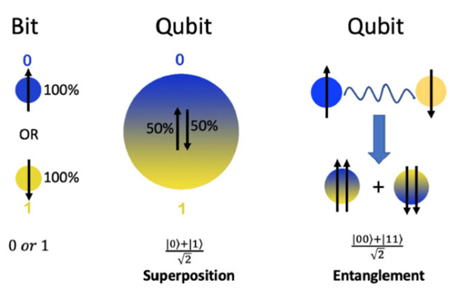
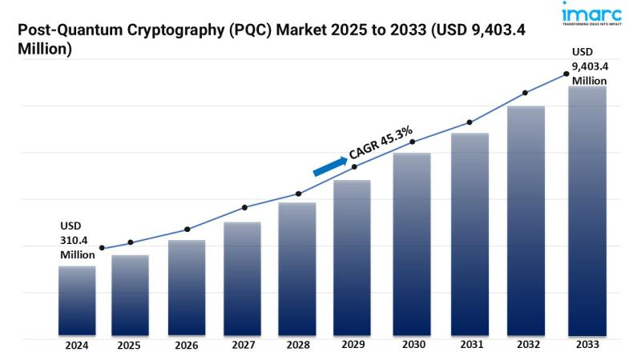

## 1. Introduction

Hello! Today, I'd like to take a break and talk about quantum computers. In recent years, as quantum computing technology has advanced rapidly, we're seeing that existing cryptographic systems, which we've long believed to be secure, are under threat.

The reason is that most cryptography relies on the assumption that certain calculations are difficult. For example, RSA is based on the difficulty of factoring large numbers, while ECDHE relies on the difficulty of computing discrete logarithms over elliptic curves. However, quantum computers can perform these calculations much faster than classical computers.

This is possible due to the properties of quantum superposition and entanglement, which allow multiple paths to be considered simultaneously in a single operation. As a result, cryptanalysis that was previously considered “practically impossible” has become theoretically feasible.

The point at which quantum computers can decrypt current cryptography is called **Q-Day (Quantum Day)**. While the exact timing of Q-Day remains uncertain, major companies like IBM, Google, IonQ, and Syquantum are striving to build quantum computers with hundreds of qubits. Consequently, the IT industry views Q-Day not as mere speculation but as a tangible risk.

Therefore, today we'll cover the fundamental characteristics of quantum computers and the algorithms they use to break existing encryption. I'll explain it as clearly as possible!

## 2. Quantum Computers

Quantum computers operate on principles entirely different from conventional digital computers. While traditional computers represent information using two states—0 and 1—as electrical signals, quantum computers express information using units called ‘qubits’.

A qubit doesn't simply hold one value, either 0 or 1. Through a state called quantum superposition, it can exist in a state where 0 and 1 are present simultaneously. This allows quantum computers to perform parallel computations, unlike conventional computers.

Mathematically, the state of a qubit can be expressed as follows:

Here, α and β are probability amplitudes, and these two values always satisfy the relationship ∣α∣² + ∣β∣² = 1. This means a qubit exists in a state simultaneously containing the “probability of being 0 (∣α∣^2)” and the “probability of being 1 (∣β∣^2)”. This state exists probabilistically until we measure it; once measured, it collapses into a single value.

Thanks to this property, quantum computers can explore multiple possibilities simultaneously in a single operation—something classical computers must compute sequentially. Consequently, quantum computers can achieve vastly faster computation speeds than classical computers for specific problems (e.g., factorization, optimization, search, etc.).

> Source: “Concise Insights into Quantum Machine Learning and Its Practical Uses” (Sanati & Borzoei, 2024, DOI: 10.13140/RG.2.2.14216.64002)
>

### 2.1 Quantum Superposition

Quantum superposition is one of the most fundamental properties of quantum computers, referring to the phenomenon where **a single qubit can exist in multiple states simultaneously**. As explained earlier, while classical computers execute calculations sequentially along ‘one path,’ quantum computers perform calculations in parallel by 'exploring multiple paths simultaneously.'

For example, with 10 qubits, a quantum computer can simultaneously consider 2^10 = 1024 states in a single operation. This parallelism enables computational efficiency far surpassing classical methods!

However, qubits in superposition states are highly sensitive to external environments and can easily collapse due to factors like noise or decoherence. Therefore, the biggest challenge in practical quantum computer implementation is how stably these superposition states can be maintained.

### 2.2 Quantum Entanglement

Quantum entanglement is the phenomenon where two or more qubits become bound together in a state where they are not independent. That is, **if the state of one qubit changes, the state of another entangled qubit also changes instantly**. Einstein famously questioned this phenomenon, calling it “spooky action at a distance.” However, experiments like Bell's inequality tests and those by Alain Aspect (1982) later proved its existence.

In quantum computers, this entanglement enables simultaneous processing of computational dependencies between qubits. Entanglement allows operations to be connected in parallel, and by leveraging the correlation of information, specific computational results can be amplified or unnecessary outcomes eliminated, thereby strengthening the pattern leading to the correct answer. For example, measuring one qubit in an entangled pair automatically determines the state of the other qubit. This property enables advanced operations like information transfer, state control, and error correction.

This entanglement phenomenon forms the basis for quantum computers to implement logically connected computational networks beyond mere parallel processing.

### 2.3 Quantum Interference

Quantum interference strengthens the probability of the path leading to the correct answer among multiple paths in a superposition state, while weakening the probability of incorrect paths.

Quantum algorithms are designed to intentionally manipulate this interference so that the correct result is ultimately observed with a higher probability. For example, Grover's algorithm repeatedly enhances the probability of the correct solution among all possible solutions. This allows finding the correct answer among N pieces of data in O(√n) time using a quantum algorithm, compared to O(N) time using classical methods.

If quantum superposition broadens the scope of computation, quantum interference can be seen as a filter that retains only the correct answer within that scope.

## 3. Quantum Algorithms

The properties of quantum computers we've examined—superposition, entanglement, and interference—are not merely ‘fascinating physical phenomena’. Utilizing these properties allows us to solve problems that are difficult for classical computers to tackle, far more efficiently.

Representative examples demonstrating the potential of quantum computation are Shor's algorithm and Grover's algorithm. While these algorithms weren't created “to break classical cryptography,” their computational principles ultimately undermined the security of the cryptographic systems we currently use.

### 3.1 Shor's Algorithm

Shor's algorithm, proposed by Peter Shor in 1994, can perform **polynomial-time integer factorization**. On classical computers, factoring large numbers becomes incredibly difficult; breaking a 2048-bit RSA key would take billions of years, making it practically impossible. However, Shor's algorithm proved that using a quantum computer, this can be done in polynomial time.

The operating principle is somewhat complex, but simply put, it uses the quantum Fourier transform to rapidly identify the periodicity within a sequence. Knowing this periodicity allows one to naturally find the prime factors through the information revealed.

This diagram is a simplified circuit representing the basic structure of Shor's algorithm. The qubits on the left initialize the input state and create a superposition state using the Hadamard gate (H). Next, each qubit performs a different Ua^{2^{n-1}} operation, reflecting the sequence's periodicity to obtain phase information. Finally, applying the inverse quantum Fourier transform (QFT⁻¹) converts this into a form where the periodicity information can be measured.

Honestly, this part is hard to explain simply. I once got a B+ on a quantum cryptography exam question proving Shor's algorithm quantum circuit.

Anyway, why is this important? Because **almost all public-key cryptosystems like RSA, Diffie–Hellman, and ECDSA operate on the assumption that ‘factoring is difficult’. In other words, if Shor's algorithm becomes practical, it could threaten the internet security we rely on today.

Of course, it's theoretically very powerful, but in reality, we haven't yet implemented enough stable logical qubits. So, while it's not at the level of breaking RSA immediately, the fact that it might be possible someday is why academia is actively researching the transition to post-quantum cryptography (PQC). PQC is another major topic, so I'll cover it later if the opportunity arises.

### 3.2 Grover's Algorithm

Grover's algorithm is **an algorithm that efficiently finds a specific item in an unordered database**. If we were to find the answer to a problem by trying every possible case one by one, the classical approach would require an average of N/2 attempts for N candidates to find the correct answer. However, a quantum computer can find the correct answer in approximately √N attempts using Grover's algorithm. This is possible because quantum computers utilize superposition and interference.

Grover's algorithm simultaneously superimposes all possible states, enabling all candidates to participate in the computation at once. It then applies an oracle operation that flips the phase only of the correct state, repeating this process while using interference to amplify the probability amplitude of the correct answer. Finally, when measured, the state with the highest probability of being correct remains.

This characteristic makes Grover's algorithm highly applicable across various fields, such as large-scale database searches and machine learning problems.

However, it simultaneously poses a threat capable of halving the security strength of symmetric-key cryptography or hash-based systems. For instance, while a classical computer requires 2^128 attempts to brute-force an AES-128 cipher, calculations show a quantum computer could achieve this in just 2^64 attempts.

While Grover's algorithm doesn't directly break public-key cryptography like Shor's algorithm does, it clearly demonstrated that quantum computers threaten not only public-key cryptography but also symmetric-key cryptography. Therefore, the security industry **recommends using long keys like AES-256**. Even considering Grover attacks, AES-256 remains sufficiently secure.

## 4. Q-day

No one can accurately predict when **Q-Day (Quantum Day)**—the day quantum computers can actually decrypt current cryptography—will arrive. However, we are currently in the NISQ (Noisy Intermediate-Scale Quantum) era.

It is literally the noisy intermediate-scale quantum computer era. While leading global IT companies have implemented hundreds of qubits, they remain unstable with high error rates, insufficient to break RSA. It's known that breaking RSA-2048 completely requires tens of millions of stable logical qubits, yet current hardware mostly remains at the level of hundreds of physical qubits.

Furthermore, error correction technology—which groups multiple physical qubits to create a single logical qubit—is still in the research phase. Therefore, we can consider this an era of learning how to operate quantum computers reliably.

Nevertheless, there is no disagreement that Q-Day **will inevitably arrive someday**. Governments and major institutions have already begun preparing for that moment. The U.S. National Institute of Standards and Technology (NIST) is driving the standardization of **Post-Quantum Cryptography (PQC)** and finalized its first set of candidate standards in 2024. The European Union, Korea's KISA, Japan's NICT, and others are also preparing accordingly.

> Source: IMARC Group
>

As governments and companies worldwide prepare for quantum threats, the quantum-resistant cryptography (PQC) market is also experiencing explosive growth. According to IMARC Group, the PQC market is projected to grow from approximately $300 million in 2024 to around $9.4 billion by 2033.

This article aims to explain the relationship between quantum computers and cryptography as simply as possible. If the opportunity arises, we'll explore what quantum-resistant cryptography (PQC) entails and why it's hailed as a core technology for the “post-quantum era.”