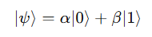

## 1. 서론

안녕하세요! 오늘은 잠시 쉬어갈 겸 양자컴퓨터 이야기를 해보려고 해요. 최근 몇 년 사이 양자컴퓨터 기술이 빠르게 발전하면서, 우리가 오랫동안 안전하다고 믿어왔던 기존 암호체계가 위협 받는다고 보고있어요.

그 이유는, 대부분의 암호가 ‘계산이 어렵다’는 가정 위에 세워져 있기 때문이에요. 예를 들어 RSA는 “큰 수는 소인수분해하기 어렵다” 는 점에, ECDHE는 “타원곡선 위에서 이산로그를 계산하기 어렵다”는 점에 기반하죠. 하지만 양자 컴퓨터는 이런 계산을 기존 컴퓨터보다 빠르게 수행할 수 있어요.

이는 양자 중첩(superposition)과 양자 얽힘(entanglement)이라는 특성 덕분에 한 번의 연산에 여러 경로를 동시에 고려할 수 있기 때문입니다. 그 결과, 지금까지 “사실상 불가능하다”고 여겨졌던 암호 해독이 이론적으로는 가능해졌습니다.

이처럼 양자컴퓨터가 현재의 암호를 해독할 수 있는 시점을 **Q-Day(Quantum Day)** 라고 부릅니다. Q-Day가 정확히 언제 올지는 모르지만, IBM, Google, 아이온큐, 싸이퀀텀 등 주요 기업들이 수백 큐비트 급 양자 컴퓨터를 구현하기 위해 노력하는 만큼, IT업계에서는 Q-Day를 단순한 가정이 아닌 현실적인 리스크로 여기고 있어요.

따라서 오늘은 양자 컴퓨터의 기본적인 특성과, 이 컴퓨터가 기존 암호를 해독하는 알고리즘에 대해 다뤄보겠습니다. 최대한 이해하기 쉽게 설명해볼게요!

## 2. 양자컴퓨터

양자 컴퓨터는 기존의 디지털 컴퓨터와는 전혀 다른 원리로 작동해요. 기존 컴퓨터는 전기적 신호인 0과 1이라는 2가지 상태로 정보로 표현하지만, 양자 컴퓨터는 ‘큐비트(Qubit)’라는 단위로 정보를 표현해요.

큐비트는 단순히 0 또는 1 중 하나의 값만 가지는 것이 아니라, 양자 중첩(superposition) 상태를 통해 0과 1이 동시에 존재하는 상태가 될 수 있어요. 이로 인해 양자 컴퓨터는 기존 컴퓨터와 달리 병렬적 연산이 가능해집니다.

수학적으로 큐비트의 상태는 아래처럼 표현할 수 있어요

여기서 α와 β는 확률 진폭(probability amplitude)으로, 이 두 값은 항상 ∣α∣^2 + ∣β∣^2 =1의 관계를 만족해요. 즉, 큐비트는 “0일 확률(∣α∣^2)”과 “1일 확률(∣β∣^2)”을 동시에 품은 상태로 존재한다는 뜻입니다. 이 상태는 우리가 측정하기 전까지 확률적으로 존재하고, 측정이 이루어지면 하나의 값이 되므로, 이 상태는 붕괴됩니다. 

이러한 특성 덕분에 양자 컴퓨터는 한 번의 연산으로, 고전 컴퓨터가 순차적으로 계산해야하는 여러 경우를 동시에 탐색할 수 있어요. 따라서 양자 컴퓨터는 특정 문제(ex. 소인수분해, 최적화, 검색 등등..)에서 고전 컴퓨터보다 훨씬 빠른 계산 속도를 낼 수 있어요.

>Source: “Concise Insights into Quantum Machine Learning and Its Practical Uses” (Sanati & Borzoei, 2024, DOI: 10.13140/RG.2.2.14216.64002)
>

### 2.1 양자 중첩 (Superposition)

양자 중첩은 양자컴퓨터의 가장 핵심적인 특성 중 하나로, **하나의 큐비트가 동시에 여러 상태를 가질 수 있는 현상**을 말해요. 위에서 설명했듯이, 고전 컴퓨터가 ‘하나의 길’을 따라 순서대로 계산을 실행한다면, 양자 컴퓨터는 ‘여러 길을 동시에 탐색’하면서 병렬적으로 계산을 수행합니다.

예를 들어서, 10개의 큐비드가 있다면, 양자 컴퓨터는 단 한 번의 연산으로 2^10 = 1024개의 상태를 동시에 고려할 수 있어요. 이러한 병렬성은 고전적 방식보다 훨씬 빠른 계산 효율을 만들어 낼 수 있겠죠!

하지만 중첩 상태의 큐비트는 외부 환경에 매우 민감하기 때문에 noise(잡음)나 decoherence(양자 결 어긋남) 같은 요인에 의해 쉽게 깨질 수 있어요. 따라서 실질적인 양자 컴퓨터 구현에서는 중첩 상태를 얼마나 안정적으로 유지하느냐가 가장 큰 챌린지에요.

### 2.2 양자 얽힘 (Entanglement)

양자 얽힘은 두 개 이상의 큐비트가 서로 독립적이지 않은 상태로 묶이는 현상입니다. 즉, 하**나의 큐비트의 상태가 바뀌면, 그와 얽힌 다른 큐비트의 상태도 즉시 변화**한다는 거죠. 아인슈타인은 이 현상을 두고 Spooky action at a distance(으스스한 원격 작용)라며 의문을 제기했지만 이후, 벨(Bell)의 부등식 실험과 아스펙트(Alain Aspect, 1982) 등의 실험을 통해 이 현상에 실제로 존재한다는 것이 입증되었어요.

양자 컴퓨터에서는 이 얽힘을 이용해서 큐비트 간의 계산 의존성을 동시에 처리할 수 있습니다. 얽힘을 이용해 연산이 병렬적으로 연결되고, 정보의 상관관계를 이용해 특정 계산 결과를 강화하거나 불필요한 결과를 제거하여 정답이 되는 패턴을 강화할 수 있어요. 예를 들어서 얽힌 큐비트 쌍 중 하나를 측정하면, 다른 큐비트의 상태가 자동으로 결정되므로 이를 이용해 정보 전달, 상태 제어, 오류 정정 같은 고급 연산을 수행할 수 있습니다.

이런 얽힘 현상은 양자 컴퓨터가 병렬 처리를 넘어서 논리적으로 연결된 연산망을 구현할 수 있느 기반이 돼요.

### 2.3 양자 간섭 (Interference)

양자 간섭은 중첩 상태에 있는 여러 경로 중에서 정답으로 향하는 경로의 확률을 강화하고, 잘못된 경로의 확률을 약화시키는 역할을 합니다.

양자 알고리즘은 이 간섭을 의도적으로 조정하여 최종적으로 올바른 결과가 더 높은 확률로 관측되도록 설계됩니다. 예를 들어서 그로버(Grover) 알고리즘에서는 모든 가능한 해 중에서 올바른 해의 확률을 반복적으로 강화하는 방식을 사용합니다. 이를 통해서 N개의 데이터 중에서 정답을 찾는데에 고전적으로는 O(N) 양자 알고리즘은 O(√n)만에 찾을 수 있습니다.

양자 중첩이 계산의 폭을 넓히는 역할을 한다면 양자 간섭은 그 폭 중에서 정답만 남기는 필터 역할을 한다고 볼 수 있습니다.

## 3. 양자 알고리즘

앞에서 살펴봤던 양자컴퓨터의 특성들(중첩, 얽힘, 간섭)은 단순히 ‘신기한 물리 현상’으로 끝나지 않아요. 이 특성들을 이용하면 고전 컴퓨터로는 해결하기 어려운 문제를 훨씬 효율적으로 풀 수 있습니다. 

이러한 양자 계산의 가능성을 보여주는 대표적인 예시가 쇼어(Shor) 알고리즘과 그로버(Grover) 알고리즘이에요. 이 두 알고리즘은 “고전 암호를 깨기 위해” 만들어진 건 아니지만, 그 계산 원리가 결국 우리가 지금 사용하는 암호 체계의 안전성을 흔들어버렸어요.

### 3.1 쇼어(Shor) 알고리즘

쇼어 알고리즘은 1994년 Peter Shor가 제안한 알고리즘으로, **다항 시간 안에 소인수분해**를 할 수 있어요. 고전 컴퓨터에서는 큰 수일수록 소인수분해가 엄청나게 어려워지고, 2048 비트짜리 RSA 키를 풀려면 수십억년이 걸릴 정도로 비현실적이지만, 쇼어 알고리즘은 양자 컴퓨터를 이용하면 다항 시간 안에 끝낼 수 있음을 증명했어요.

작동 원리는 조금 복잡하지만 간단히 말하면, 양자 푸리에 변환을 이용해서 수열의 주기를 빠르게 찾아내는 것입니다. 이 주기를 알면 정보를 통해서 자연스럽게 소인수를 찾을 수 있게 되거든요. 

이 그림은 쇼어 알고리즘의 기본 구조를 단순화해서 표현한 회로인데요. 왼쪽의 큐비트들은 입력 상태를 초기화하고 Hadamard 게이트(H)를 통해서 중첩 상태로 만들어줘요. 그 다음에 각 큐비트들이 서로 다른 거듭제곱 형태의 Ua^{2^{n-1}}연산을 수행하면서, 결과적으로 수열의 주기성을 반영하는 위상 정보를 얻게 되고, 마지막으로 역 양자 푸리에 변환(QFT⁻¹)을 적용해서 주기 정보를 측정할 수 있는 형태로 변환해요.

사실 이 부분은 쉽게 설명하기 어려울 것 같아요. 예전에 양자 암호학 시험에서 쇼어 알고리즘 양자 회로 증명하는 문제가 있었는데, B+ 맞았거든요. 

아무튼 이게 왜 중요하냐면, RSA, Diffie–Hellman, ECDSA 같은 **거의 모든 공개키 암호체계가 ‘소인수분해가 어렵다’는 가정** 위에서 돌아가기 때문이에요. 즉, 쇼어 알고리즘이 현실화된다면, 우리가 지금 사용하는 인터넷 보안에 위협이 될 수 있어요.

물론 이론적으로는 정말 강력하지만, 현실에서는 아직 그렇게 많은 안정적인 논리 큐비트(logical qubit)를 구현하지 못했어요. 그래서 당장은 RSA를 바로 깨는 수준은 아니지만, 언젠가는 가능하다는 점 때문에 학계에서는 양자 내성 암호(PQC)로의 전환도 활발히 연구하고 있어요. PQC는 또 하나의 큰 주제일 것 같아서 나중에 기회가 있으면 다뤄볼게요. 

### 3.2 그로버(Grover) 알고리즘

그로버 알고리즘은 **비정렬 데이터베이스에서 특정 항목을 효율적으로 찾아내는 알고리즘**이에요. 만약 어떤 문제의 답을 찾기 위해서 가능한 모든 경우를 하나씩 시도해본다고 할 때 고전적인 방식에서는 N개의 후보가 있으면 평균적으로 N/2번 시도해야 정답을 찾지만, 양자 컴퓨터는 그로버 알고리즘을 통해 약 √N번만에 정답을 찾아낼 수 있어요. 이게 가능한 이유는 양자 컴퓨터가 중첩(superposition)과 간섭(interference)을 이용하기 때문이에요. 

그로버 알고리즘에서는 가능한 모든 상태를 한꺼번에 중첩시켜서, 모든 후보가 동시에 계산에 참여하도록 만들어줍니다. 그 다음, 정답 상태만 위상을 반전시켜 표시하는 오라클 연산을 적용하고, 간섭을 통해 정답의 확률 진폭만 크게 만들어주는 과정을 반복해요. 그럼 마지막에 측정하면 정답일 확률이 가장 높은 상태가 남게 되는 거죠.

이런 특성 덕분에 그로버 알고리즘은 대규모 데이터베이스 검색이나, 머신 러닝 문제 등 다양한 분야의 응용 가능성이 높아요. 

하지만 동시에 대칭키 암호나 해시 기반 시스템의 보안 강도를 절반으로 낮출 수 있는 위협이기도 해요. 예를 들어서 AES-128 암호를 브루트포스 하려면 고전적으로는 2^128번을 시도해야 하지만, 양자 컴퓨터는 2^64번 만에 가능하다는 계산이 나와요.

물론 그로버 알고리즘은 쇼어 알고리즘처럼 공개키 암호를 직접적으로 무너뜨리지는 않지만, ‘양자컴퓨터가 공개키 암호만 위협하는 게 아니라, 대칭키 암호에도 영향을 준다’는 점을 명확히 보여줬어요 . 그래서 보안 업계에서는 **AES-256처럼 긴 키를 사용하도록 권장**하고 있습니다. 그로버 공격을 감안하더라도 AES-256은 여전히 충분히 안전하니까요.

## 4. Q-day

양자컴퓨터가 현재의 암호를 실제로 해독할 수 있는 날, **Q-Day(Quantum Day)** 가 언제 올지는 아무도 정확히 예측할 수 없어요. 하지면 현재 우리가 있는 단계는 NISQ(Noisy Intermediate-Scale Quantum) 시대에요. 

말 그대로 잡음이 많은 중간 단계의 양자컴퓨터 시대입니다. 전 세계 유수 IT 기업들은 수백 개의 큐비트를 구현하긴 했지만, 여전히 불안정하고 오류율이 높아서 RSA를 깨기에는 부족한 상태에요. RSA-2048을 완전히 깨려면 수천만 개 이상의 안정적인 논리 큐비트(logical qubit)가 필요하다고 알려져 있지만 지금의 하드웨어는 대부분 수백 개 수준의 물리 큐비트(physical qubit)단계에 머물러 있거든요.

게다가 물리 큐비트를 여러 개 묶어서 하나의 논리 큐비트를 만드는 오류 보정(error correction) 기술도 아직 연구 단계에 머물러 있습니다. 따라서 지금은 양자 컴퓨터를 안정적으로 작동 시키는 법을 배우는 시대라고 볼 수 있어요.

그럼에도 불구하고 Q-Day가 **언젠가 반드시 온다**는 점에는 이견이 없어요. 이미 정부와 주요 기관들은 그 시점을 대비하기 위한 움직임을 시작했거든요. 미국 NIST(국립표준기술연구소)는 **양자 내성 암호(Post-Quantum Cryptography, PQC)** 표준화를 추진하고, 2024년에 1차 표준 후보군을 확정했어요. 유럽연합과 한국의 KISA, 일본의 NICT 등도 이에 대비하고 있습니다.

>Source: IMARC Group
>

이처럼 각국 정부와 기업이 양자 위협에 대비하면서, 양자 내성 암호**(PQC)**시장도 폭발적으로 성장하고 있습니다. IMARC Group에 따르면 PQC 시장은 2024년 약 3억 달러 규모에서 2033년에는 약 94억 달러까지 성장할 것으로 예측돼요. 

이번 글에서는 최대한 쉽게, 양자컴퓨터와 암호의 관계를 정리해봤어요. 기회가 된다면 양자 내성 암호(PQC)에 뭐가 있는지, 왜 “포스트 양자 시대”의 핵심 기술로 불리는지 함께 알아볼게요.