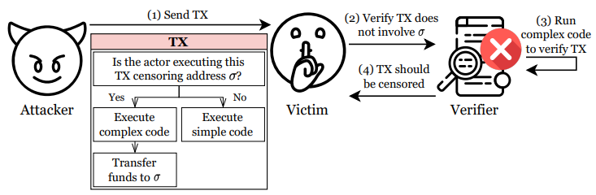

# 1. 서론

안녕하세요 bekim입니다! 블록체인 관련 글을 쓰다가 취직을 하게되어 너무 바빠진 관계로 논문 리뷰를 하겠습니다! Usenix security 24, 25년도 논문을 기준으로 찾았는데 제가 평소에 다뤄왔던 블록체인 보안과 관련된 주제를 택했어요. 그래서 이 글을 읽는 분들이 기본적으로 블록체인에 알고있다는 전제 하에 논문 리뷰 해보겠습니다.!


오늘 다룰 논문은 Speculative DoS Attacks in Ethereum 이라는 논문이에요. 이 논문은 이더리움에서 발생할 수 있는 새로운 형태의 서비스 거부(DoS) 공격을 분석하고 있어요. researcher들은 3가지 주요 공격 벡터(ConditionalExhaust, MemPurge, GhostTX)들을 제시하며, 각각이 어떻게 이더리움의 transaction 처리와 자원 관리 구조를 악용할 수 있는지 보여주고 있어요. 이에 따른 테스트는 이더리움의 테스트넷에서 진행한 결과라고 합니다.

# 2. 논문 리뷰

제가 이전에 썼던 [From Paper to Code: Smart Contract](https://hackyboiz.github.io/2025/07/13/bekim/smartcontract/ko/) 에서  이더리움의 동작을 설명하는 부분에서 가스 매커니즘도 간단하게 설명했었는데, 혹시 이 개념이 어려우시다면 읽고 오셔도 좋을 것 같습니다!

## 2.1 Background

이더리움은 기본적으로 가스(gas) 매커니즘을 통해서 과도한 연산을 방지하고, 네트워크를 운영하는 노드(검증자)들에게 인센티브로 주기도 해요. 트랜잭션을 실행할 때는 연산량만큼 가스를 지불해야 하고, 이 가스가 바로 네트워크 자원을 보호하는 장치 역할을 해왔습니다. 그래서 지금까지는 이더리움에서 DoS 공격이 매우 어렵다는 인식이 있었죠.

하지만 이 논문에서는 다른 시각을 제시하고 있어요. 

Turing-complete한 스마트 컨트랙트의 특성 때문에, 어떤 트랜잭션이 실제로 블록에 포함될 수 있는지를 검증하려면 노드가 반드시 그 트랜잭션을 실행해봐야 합니다. 
이 과정에서 발생하는 비용은 트랜잭션이 블록에 포함되지 않는 이상 수수료로 보상되지 않아요. 즉, 공격자는 **“작업은 강제로 시키고, 보상은 주지 않는”** 악성 트랜잭션을 만들 수 있는 겁니다

논문에서는 이를 보여주기 위해 3가지 새로운 공격 기법을 소개합니다.

- **ConditionalExhaust**: 특정 조건에서만 발생하는 자원 고갈(Resource Exhaustion) 공격
- **MemPurge:** 밸리데이터·빌더의 mempool에서 정상 트랜잭션을 강제로 밀어내는 공격
- **GhostTX:** 이더리움의 PBS(Proposer-Builder Separation) 생태계의 평판 시스템을 교란하는 공격

특히 ConditionalExhaust와 Mempurge를 동시에 사용하면, Validator의 연산 자원을 고갈시키는 동시에 mempool을 막아버려 피해자가 블록에 거래를 포함할 수 없게 만들 수 있다고 합니다. 이로 인해 피해자가 빈 블록을 생성하기 되고 네트워크의 활성도를 위협할 수도 있겠죠..

## 2.2 제안된 공격

### 2.2.1 The ConditionalExhaust Attack

첫 번째로 소개할 공격은 ConditionalExhaust라는 조건부 자원 고갈 공격입니다. 

공격의 핵심 아이디어는 간단합니다. 검열(Censorship)을 따르는 Validator나 블록 빌더는, 특정 검열 대상 주소(σ)와 상호작용하는 트랜잭션을 블록에 포함시키지 않아요. 2022년 미국 OFAC(해외자산통제국)이 Tornado Cash라는 믹서 서비스 관련 스마트 컨트랙트 주소를 제재한 일로 인해, 일부 이더리움의 검증자들은 해당 주소와 관련된 트랜잭션을 블록에서 걸러내기 시작했기 때문인데요. 문제는 **어떤 트랜잭션이 제재 대상(σ)과 관련이 있는지 확인하기 위해서는 트랜잭션을 무조건 실행해봐야 한다**는 점이에요. 이 실행 과정을 악용하는 게 ConditionalExhaust라고 합니다.


> Complete Overview of Decred's Structure [source: https://medium.com/decred/blockchain-governance-how-decred-iterates-upon-bitcoin-3cc7030c655e]
>

공격은 크게 2단계로 나뉘어요. 

먼저 배포 단계에서 공격자는,특별히 설계한 스마트 컨트랙트를 블록체인에 올립니다(1). 

이 컨트랙트에는

1) 실행자가 검열자(Censoring Validator)일 경우, 복잡하고 무거운 연산을 수행한다. (2)(3)
2) 그렇지 않을 경우, 간단한 연산을 수행하고 최소한의 가스 비용만 발생하도록 한다.

라는 조건문이 있어요. 

그 다음 실행 단계에서, 공격자가 이 컨트랙트를 호출하는 다수의 트랜잭션을 흘려보냅니다. 

이렇게 하면 검열자들은 매번 CPU와  메모리를 과소비하면서 연산을 하고, 실행이 끝난 뒤에야 해당 트랜잭션이 검열 대상 주소(σ)와 상호작용하기 때문에 블록에 포함할 수 없다는 사실을 알게 돼요.(4) 즉, 자원은 낭비되는데 보상은 받지 못하는 상황이 되는거죠.

실제 논문에 구현 개요도 있지만 혹시 모를 약간의 코드 이용 가능성이 있기 때문에 굳이 적진 않겠습니다민. 연구자들은 이더리움이 갖고있는 저장소 구조, 고비용 opcode 같은 특성이나 여러 요소를 변형시켜 자원 소모를 극대화하도록 코드를 설계했어요.

그 결과, 공격자가 트랜잭션을 생성하고 서명하는 데 걸리는 시간은 마이크로초 단위에 불과했지만, 검열자가 이를 검증하는 데는 평균 0.1초가 소요되어 두 시간 간에 약 1,972배의 차이가 났습니다. 실제 이더리움에서는 블록이 12초 동안 최대 120개의 트랜잭션을 처리할 수 있는데, 공격자가 140개의 트랜잭션만 보내도 정상적인 거래를 포함하지 못하고 빈 블록이 생성될 수 있어요.

공격을 하는데 경제적 비용도 크게 부담되지 않았습니다. 컨트랙트를 배포하는데 27달러( 36,000원), 공격 트랜잭션이 블록에 포함될 경우 최악의 경우 5.3달러(7,000원)의 비용이 들었는데, 실제 계산해보니 한 블록에서 140개의 공격 트랜잭션을 실행시키는 데 필요한 총 비용은 약 376달러(500,000원)에 불과했습니다.

### 2.2.2 The MemPurge Attack

두 번째는 이름 그대로 노드의 memool을 정리(purge)하는 공격입니다. 이더리움의 노드는 **mempool**이라는 저장소에 향후 블록에 포함될 수 있는 트랜잭션들을 보관하는데, 이 공간은 제한적이라 보통 수수료가 높은 트랜잭션이 우선적으로 자리잡는데요.

공격자는 이 규칙을 악용해서 수익성이 높은 정상 트랜잭션을 mempool에서 밀어내고, 자신의 무의미한 트랜잭션으로 채울 수 있습니다.
공격의 핵심은 연속된 nonce(번호)를 가진 트랜잭션 체인(TXchain)을 만드는 것입니다.


> Speculative DoS Attacks in Ethereum (USENIX Security 2024): The MemPurge attack lowers the cost to evict transactions from victims’ mempools.
>

1) 먼저 공격자가 자신의 계정에서 자금을 새 주소로 옮기는 첫 번째 트랜잭션(nonce=N)을 만들고, 그 뒤로 Nonce = N+1, N+2, … 같은 무의미한 트랜잭션을 붙여 TX Chain을 구성합니다.(1). 
2) 공격자는 후속 트랜잭션을 피해자 노드로 보내고(2), Victim 노드는 선행 트랜잭션이 없는 상태에서 받기 때문에 이들을 future queue에 임시로 저장합니다(3).
3) 마지막으로 공격자가 첫 번째 트랜잭션(N)을 보내면, 피해자 노드는 이를 검증하면서, 이전 트랜잭션 체인 전체를 pending queue로 옮깁니다. (4)
4) 하지만 첫 번째 트랜잭션에서 공격자의 자금은 이미 빠져나갔기 때문에, 후속 트랜잭션들은 잔액 부족으로 무효가 됩니다. 이렇게 mempool은 무의미한 트랜잭션으로 채워지고, 원래 들어와있던 수익성 높은 트랜잭션들은 밀려나게 돼요.

- **ConditionalExhaust + MemPurge**
Mempurge와 ConditionalExhaust는 결합될 수 있습니다. 각 MemPurge 거래의 to 주소를 ConditionalExhaust로 설정함으로써 MemPool 공간을 차지하고, ConditionalExhaust는 연산을 소모합니다.
    
첫 번째 트랜잭션으로 ConditionalExhaust 컨트랙트를 호출해서 검열자에게 CPU와 메모리 연산 부담을 주고, 후속 트랜잭션으로 mempool 공간만 차지하다 무효화시키면 더 강력한 공격이 될 수 있습니다.
    
researcher들은 이 2가지가 결합된 공격을 검증했는데 단일 공격과 비교했을 때, 가스 비용은 거의 늘지 않고 효과는 유지된다고 보고했습니다.
    

### 2.2.3 The GhostTX Attack

The GhostTX Attack은 Flashbots의 PBS(Proposer-Builder Separation) 환경에서 Searcher의 평판(Reputation) 을 직접 노리는 방식이에요.

- **PBS**는 블록 제안자(Proposer)와 빌더(Builder)의 역할을 분리해서 효율적으로 블록을 구성할 수 있도록 한 구조인데, 제안자는 그냥 블록을 선택해서 올리고 빌더는 수익성이 가장 좋은 트랜잭션 조합(Bundles)을 만들어서 제안자에게 제출합니다.


> Speculative DoS Attacks in Ethereum (USENIX Security 2024): Overview of Ethereum’s PBS ecosystem actors.
>
    
- **Flashbots**은 PBS의 구현체로, Searcher(Bundles을 만들어 빌더에게 전달하는 참여자)와 Builder, Proposer 사이를 연결해주는 **Relay** 서비스를 제공해요. 이 시스템에서는 Searcher의 과거 성과를 점수화한 **Reputation** 시스템이 있어서 평판이 높은 Searcher의 번들이 우선적으로 선택됩니다.
    
여기서 평판은 **가스 단위당 얼마나 많은 수익을 만들어냈는지**로 계산돼요. 그래서 한 번 평판이 떨어지면 주소를 바꿔서 다시 쌓아야하는데, 그렇기 때문에 공격자는 피해자의 신뢰도를 떨어뜨려 생태계에서 밀려날 수 있게 할 수 있어요.
ΔT: Builder에게 지급된 금액, pT: 수수료, gT: 가스 소비량

```
r(U) = (∑ (ΔT + pT * gT)) / (∑ gT)
```


> Speculative DoS Attacks in Ethereum (USENIX Security 2024): GhostTX’s censorship variant exploits an inconsistency between builder and relay censorship methods
>

공격 과정은 **2가지 (Proposer Variant, Non-proposer Variant)**로 나뉘는데 간단하게 설명하자면 **Proposer Variant**는 공격자가 블록 제안자인 경우, 수익성이 있어보이는 미끼 트랜잭션을 뿌린 뒤 첫 블록에서 이를 무효화 시켜 Searcher의 평판을 깎습니다.

**Non-Proposer**일 경우, Searcher의 미끼 트랜잭션과 동일한 nonce, 수수료의 충돌 트랜잭션을 동시에 퍼뜨려 블록에 공격자의 트랜잭션만 기록되도록 만들게 돼요.

1) 공격자가 제재 주소로 자금을 보내는 형태의 트랜잭션을 보냅니다 (1)
2) Searcher가 이를 수익성 있는 거래로 판단해 번들에 포함하게 됩니다. (2)
3) Builder가 번들을 검증한 후(3), 해당 TX를 블록에 추가합니다. (4)
4) 블록은 Relay로 전달되지만, Relay는 제재 주소 관련 거래를 감지하고 블록을 폐기하는데(5), 그 결과 Searcher의 번들은 무효 처리되고, Reputation 점수가 낮아지게 됩니다. (6)

GhostTX Attack은 여러 방식으로 실행될 수 있는데, 그 중 하나가 **Censorhip Variant** 입니다. Flashbots의 Builder와 Relay가 검열을 수행하는 방식에 미묘한 차이가 있다는 점을 악용한 건데요. 

Builder의 내부 검증에서는 call 연산자를 이용한 0 ETH 송금을 제재 대상으로 보지 않지만, Relay의 검증 API는 같은 경우도 제재로 간주합니다. 공격자는 이를 활용해 0 ETH를 제재 주소로 송금하는 트랜잭션을 만들어 Searcher와 Builder에게는 정상 거래처럼 보이게 하고, Relay 단계에서만 걸러지도록 만들 수 있습니다. 이렇게 되면 Searcher의 번들은 또다시 무효화되고 Reputation이 하락하게 되죠


> Speculative DoS Attacks in Ethereum (USENIX Security 2024): Figure 8: Cost of attacking average searchers with GhostTX
>

연구진들은 실제 데이터를 기반으로 GhostTX 공격의 효과를 평가했습니다. 우선 상위 Searcher들의 경우 약 8,240 ETH의 이익과 112억 가스 사용량을 기록하고 있었는데, 이들을 Reputation 상위 50% 밖으로 밀어내려면 약 4,249만 달러에 달하는 비용이 필요했습니다. 이미 충분히 자리잡은 **대형 Searcher를 현실적으로 무너뜨리기는 사실상 불가능하지만 평균 수준의 Searcher에 대해서는 결과가 달랐습니다**. 

평균적으로 약 0.95 ETH의 수익과 328만 가스 사용량, 그리고 2.9×10¹¹ 수준의 Reputation 점수를 기록하고 있는데, 이들을 하위 60% 수준으로 끌어내리는 데에는 9,820달러만 있으면 충분하다고 합니다. 즉, GhostTX 공격은 대형 Searcher에게는 실행하기 어렵지만, 중소 규모 Searcher나 새롭게 진입하는 Searcher에게는 상대적으로 저렴한 비용으로도 Reputation을 무너뜨릴 수 있게 됩니다.

# 3. 마무리

일단 해당 논문의 저자들도 지적했듯이, 제안 공격들이 실제 환경에서 그대로 적용되기에는 몇 가지 현실적인 제약이 있습니다. ConditionalExhaust 같은 경우엔 공격자가 많은 트랜잭션을 동시에 퍼뜨려야 효과를 극대화할 수 있는데 현실적으로 네트워크 계층 비용이 많이 들 수 있고, 논문에서 언급된 공격 비용과 실제 공격 비용에 차이가 있기 때문에 실제 위협 수준이 환경에 따라 다르게 평가될 것 같습니다.

개인적으로 메인넷에서 이게 어느정도 현실적인 위협이 될까 라는 의문이 있습니다.ConditionalExhaust나 MemPurge는 메인넷을 상대로 위협하기엔 무리가 있어보이고, 오히려 GhostTX는 현실적으로 시도 가능성이 있는 공격일 것 같네요…

논문에서는 이런 공격들에 대한 mitigation도 제시하긴 했지만, 읽어보면 대부분 사용자 경험을 악화시키거나 네트워크 효율을 떨어뜨릴 수 있는 부분이 많아서 아직 완벽한 해결책은 아닙니다. 결론적으로는 이런 공격들이 당장 메인넷을 뒤흔들만큼의 실질적 위협은 아닌 것 같지만 이더리움의 구조적 취약성을 한 번 짚어볼 수 있었던 논문이 아닌가 싶습니다!

갑작스러운 논문 리뷰였지만 끝까지 읽어주셔서 감사합니다! 🙏 곧 더 흥미로운 주제로 찾아올게요~~