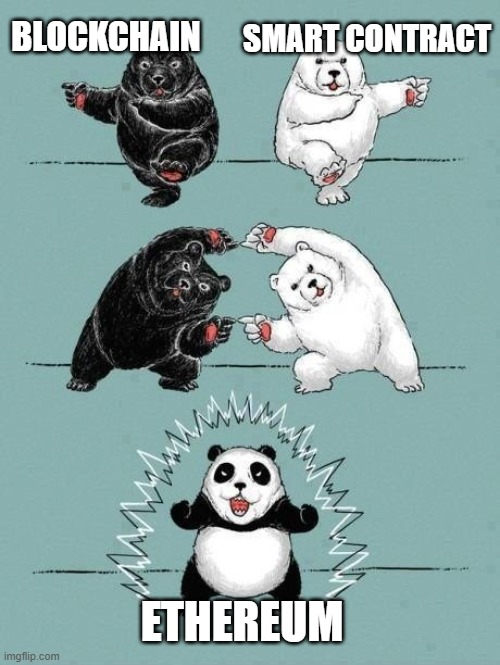
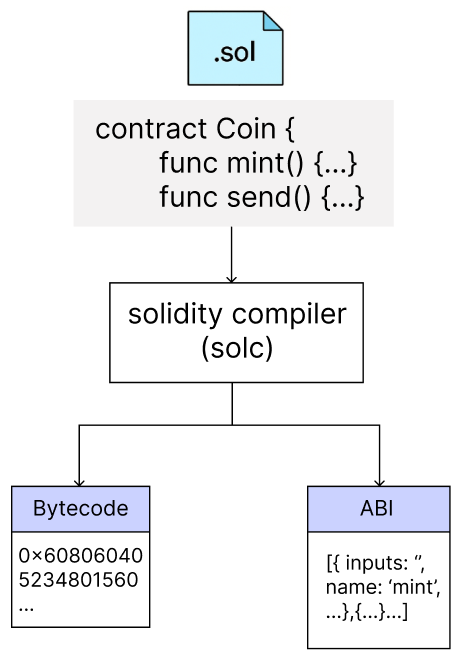
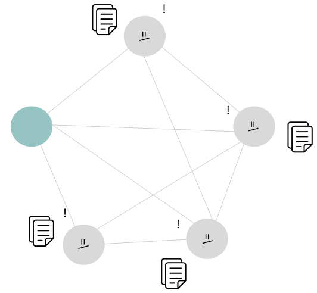

## Introduction

In the last post, we talked about blockchain and consensus algorithms, diving into how decentralized systems work. This time, I want to explore one of the most exciting technologies built on top of blockchain: **smart contracts**.

You know how traditional contracts usually involve paperwork, signatures, and sometimes a middleman? Smart contracts change all that. They let us turn agreements into code that runs automatically when certain conditions are met—no lawyers, no banks, no hassle.

In this post, I’ll walk you through how smart contracts work, share some interesting use cases, and touch on a few common security issues to watch out for.

## What Is a Smart Contract?

A smart contract is a piece of code designed to automatically execute a contract when predetermined conditions are met. The terms of a contract can be implemented in code and designed to execute automatically on the blockchain. Because of this, smart contracts can reduce the cost of intermediaries and fulfill contracts without a third party.

The concept of smart contracts was first proposed in 1994 by Nick Szabo (who, incidentally, is often cited as one of the alleged creators of Satoshi Nakamoto), but it was only a concept, and the technical realization came later. In 2013, Vitalik Buterin, the creator of Ethereum, published a white paper on his blog [outlining the concept of a new blockchain platform based on smart contracts](https://web.archive.org/web/20131228111141/http://vbuterin.com/ethereum.html). The blockchain platform called Ethereum was officially launched in 2015, and smart contracts started to be used on real blockchains in earnest.



Smart contracts are currently used on a variety of blockchain platforms besides Ethereum, and most of these contracts are executed based on code written in the form of if-then conditional statements. Because blockchain is a structure where multiple participants share and validate the same information, it is considered a very suitable environment for validating and executing contract terms.

### How smart contracts work

Smart contracts are typically created in a programming language, and the sequence of actions is as follows.

1. **Write the code**

```solidity
pragma solidity ^0.8.26;

contract Coin {
    // The keyword "public" makes variables
    // accessible from other contracts
    address public minter;
    mapping(address => uint) public balances;

    // Events allow clients to react to specific
    // contract changes you declare
    event Sent(address from, address to, uint amount);

    // Constructor code is only run when the contract
    // is created
    constructor() {
        minter = msg.sender;
    }

    // Sends an amount of newly created coins to an address
    // Can only be called by the contract creator
    function mint(address receiver, uint amount) public {
        require(msg.sender == minter);
        balances[receiver] += amount;
    }

    // Errors allow you to provide information about
    // why an operation failed. They are returned
    // to the caller of the function.
    error InsufficientBalance(uint requested, uint available);

    // Sends an amount of existing coins
    // from any caller to an address
    function send(address receiver, uint amount) public {
        require(amount <= balances[msg.sender], InsufficientBalance(amount, balances[msg.sender]));
        balances[msg.sender] -= amount;
        balances[receiver] += amount;
        emit Sent(msg.sender, receiver, amount);
    }
}
```

A contract written like the one above introduces several concepts

```solidity
address public minter;
```

This code declares a state variable minter of type address. The address type is 160 bits in size, non-mutable, and is used to store an account or contract address. Additionally, by adding the public keyword, the compiler automatically creates a getter function to retrieve this value externally.

```solidity
mapping(address => uint) public balances;
```

This code is a mapping that stores an address as a key and the amount of coins at that address as a value. It's also public, so we can look up balances by address externally.

```solidity
event Sent(address from, address to, uint amount);
```

This event is called in the last line of the send() function. When the Sent event is fired, the listener receives the sender, recipient, and amount information so they can track the transaction.

```solidity
constructor() {
    minter = msg.sender;
}
```

The Constructor code is only executed once when the contract is deployed. msg.sender is the address where the contract was deployed, which we store as a minter.

```solidity
function mint(address receiver, uint amount) public {
    require(msg.sender == minter);
    balances[receiver] += amount;
}
```

Mint new coins and send them to another address. `The require(msg.sender == minter)` condition here restricts only the distributor to call this function. And if the `balances[receiver]+amount` operation exceeds the maximum value of uint256, the transaction will be automatically reverted according to Solidity's built-in Checked Arithmetic safety.

```solidity
error InsufficientBalance(uint requested, uint available);
```

Define the error messages error and revert. For example, if a user tries to send more coins than they have, the transaction is canceled with an InsufficientBalance error.

```solidity
function send(address receiver, uint amount) public {
    require(amount <= balances[msg.sender], InsufficientBalance(amount, balances[msg.sender]));
    balances[msg.sender] -= amount;
    balances[receiver] += amount;
    emit Sent(msg.sender, receiver, amount);
}
```

You can send your own coins to another address. If the require condition is not met, the code will throw an InsufficientBalance error.

2. **Compile and deploy**

The code you write is converted into Bytecode and Application Binary Interface (ABI) by the Solidity compiler.

- Bytecode is low-level code that can be executed by the Ethereum Virtual Machine (EVM) and is used to deploy the contract to the blockchain.
- The ABI is the interface used to call the contract's functions from the outside, defining the function name and parameter format.

The generated bytecode is then propagated on the blockchain network in the form of a transaction, and when this transaction contains a block, the contract is given a unique address and registered on the blockchain.



3. **Call a transaction**

```solidity
function send(address receiver, uint amount) public {
        require(amount <= balances[msg.sender], InsufficientBalance(amount, balances[msg.sender]));
        balances[msg.sender] -= amount;
        balances[receiver] += amount;
        emit Sent(msg.sender, receiver, amount);
    }
```

A user who wants to call a specific function of a smart contract creates a transaction containing the function call information (target contract address, ABI-based function signature, gas information, etc. As shown in the example code, when a user creates a transaction to execute Coin.sol's send() function, the transaction is temporarily stored in the node's mempool and is picked up by the block producer (miner or validator) and included in the block. After the transaction enters the mempool, it is processed in the order of gas price!

→ mempool (Memory Pool): A place where transactions that have not yet been included in a block are temporarily stored.


Broadcast this transaction to the blockchain network.



4. **Smart Contract Execution (EVM)**

The block producer first executes the smart contract, and other validating nodes re-run the same to verify the legitimacy of the block. When the block producer processes a transaction, it runs its functions (such as send()) through the EVM. The EVM decodes the input, maps the functions to be called, and executes the contract's logic, including require conditional statements, state changes, and event logging.

```solidity
require(amount <= balances[msg.sender], InsufficientBalance(amount, balances[msg.sender]));
```

If this condition is met, the contract is fulfilled; otherwise, an InsufficientBalance error is thrown and all changes are rolled back.

5. **Gas handling**

EVMs also consume gas to run. This is used as an incentive for nodes (validators) to continuously run the network and to prevent excessive computation. The remaining gas is refunded according to the gasLimit set by the user and the actual consumption, and failed transactions also consume gas.

6. **Storing results**

When a transaction execution is successful, the following results are reflected on the blockchain

- State changes: Internal storage changes, for example, `balances[msg.sender] -= amount`, are reflected in a **state trie**.
- Event log: Events such as `emit Sent(...)` are written to a separate log store (receipts).

These data are embedded in blocks, making them a persistent record shared by all nodes, and can be verified or queried by anyone.

This makes smart contracts much more efficient than traditional contracts, as they are automatically executed when conditions are met. They can be executed without the need for intermediaries, and they are also more reliable, as they are transparent and immutable when based on the blockchain. Thanks to these advantages, smart contracts are increasingly being used in a variety of fields

## Use cases for smart contracts

Since smart contracts first gained traction on the Ethereum blockchain platform, they have expanded into a variety of fields.

1. **DeFi (Decentralized Finance)**

DeFi is a decentralized financial system that enables deposits, loans, asset trading, derivatives, etc. to be conducted on the blockchain without the need for centralized financial institutions such as traditional banks and securities firms. DeFi services write all financial transaction logic in smart contracts.

For example, on DeFi platforms like Aave or Compound, users can deposit cryptocurrency and automatically earn interest, while other users can borrow against collateral.

Another example is Uniswap, which allows users to automatically exchange cryptocurrencies without the need for a centralized exchange: the transactions are carried out through a pool of pre-deposited liquidity, and the exchange logic is handled by smart contracts. Similarly, Curve is a platform that specializes in exchanging stablecoins, and the exchange process is also automated by smart contracts.

2. **DAO (Decentralized Autonomous Organization)**

A DAO (Decentralized Autonomous Organization) is a form of organization where rules and decisions are automatically enforced by smart contracts rather than by a specific manager or operator like a traditional organization. Members participate in voting by holding DAO tokens, and if a proposed agenda meets certain conditions, the smart contract automatically executes it.

A prime example is MarkerDAO. MarkerDAO is a DAO built on the Ethereum blockchain that issues and manages DAI, a decentralized stablecoin. MarkerDAO keeps the value of DAI stable, and members vote on things like interest rate adjustments and system upgrades through smart contracts.

In this way, DAOs allow operations to be organized by code without human intervention.

3. **CryptoKitties**

CryptoKitties is an Ethereum-based blockchain game that launched in 2017 that utilizes smart contracts to collect, breed, and trade digital cats.

In the game, cats are represented by NFTs, each with its own unique characteristics and appearance. Users can breed two cats to create a new cat, where the combination of genetic information and the outcome of the breeding is automatically determined by the smart contract. The resulting cat is registered as a new NFT, and users can sell it to other users or keep it for themselves. The game was so popular that it overloaded the Ethereum network shortly after launch.

As you can see, smart contracts are being used in a variety of fields, including finance, organizational operations, gaming, and more. While blockchain is known for being a highly secure technology, smart contracts have actually been hacked a few times. In the following, I will explain the vulnerabilities of smart contracts with real-world examples.

## Vulnerabilities of Smart Contract

### 1. Reentrancy Attack

Reentrancy attack is a vulnerability that occurs when a smart contract makes a call to an external contract before updating its state. In this case, the external contract (if malicious) can re-enter the original function and perform actions such as withdrawal repeatedly based on the same state.

This vulnerability became a top security item to review after a 2016 DAO hack resulted in the theft of approximately $60 million.

Here's an example

- When a smart contract sends ETH or tokens to an external address (the smart contract), a function (fallback() or receive()) on the receiver side is automatically executed.
- At this point, the code inside the function is executed, so the flow of execution goes to the external contract.
- If the attacker uses this opportunity to call the original contract's function again, the original contract will be executed again in an uncleaned state because it has not yet finished executing the previous function.
- As a result, the attacker can continue to withdraw funds before balance verification.

The code below is part of splitDAO(), a function that was vulnerable to a reentry attack during the DAO hack.

```solidity
function splitDAO(uint _proposalID, address _newCurator) noEther onlyTokenholders returns (bool _success) {
    ...
		// [1]
    uint fundsToBeMoved = (balances[msg.sender] * p.splitData[0].splitBalance) / p.splitData[0].totalSupply;
    //Since the balance is never updated the attacker can pass this modifier several times 
    // [2]
    if (p.splitData[0].newDAO.createTokenProxy.value(fundsToBeMoved)(msg.sender) == false) throw;

    ...

    // Burn DAO Tokens
    // Funds are transferred before the balance is updated
    //[3]
    Transfer(msg.sender, 0, balances[msg.sender]);
    withdrawRewardFor(msg.sender); // be nice, and get his rewards
    // Only now after the funds are transferred is the balance updated
    totalSupply -= balances[msg.sender];
    paidOut[msg.sender] = 0;
    return true;
}
```

The splitDAO() function is executed when a user leaves a DAO and moves to a new DAO.

In \[1], it calls `fundsToBeMoved`, which calculates the amount of ether the user will receive. At this point, the `balances[msg.sender]` used is not yet decremented.

In \[2], sending the ether calls a function (`createTokenProxy`) in the external contract, which can be used by a malicious contract created by the attacker to call splitDAO() again.

The `balances[msg.sender]` will then still have the same value, allowing the same amount of funds to be withdrawn repeatedly in multiple requests.

It changes the internal state after \[3], but this happens after the external call has already ended, so it's completely ineffective as a defense.

**Mitigation**

1. **Use the Checks-Effects-Interactions pattern**
The smart contract must first change its internal state before interacting with the external contract. For this, it is important to write code in the following order: checks → Effects → Interaction.
- Checks: Validate inputs and conditions
- Effects: Updating state variables
- Interactions: call external contracts
2. **Using ReentrancyGuard**
ReentrancyGuard, provided by [OpenZeppelin](https://docs.openzeppelin.com/contracts/4.x/api/security#ReentrancyGuard), is a module that prevents re-entry attacks. By applying the `nonReentrant` modifier, you can block the same function from being called again when it is running.

### 2. Improper Access Control

An access control vulnerability is a vulnerability that occurs when a smart contract fails to adequately restrict access to certain functions or data.

This allows unauthorized users to access sensitive functions (e.g. token issuance, asset withdrawal, contract suspension, upgrades, etc.), threatening the security and integrity of the contract.

Below is a vulnerable version of a smart contract.

```solidity
// SPDX-License-Identifier: MIT
pragma solidity ^0.8.0;

contract Solidity_AccessControl {
    mapping(address => uint256) public balances;

    // Burn function with no access control
    function burn(address account, uint256 amount) public {
        _burn(account, amount);
    }
}
```

In this example, anyone can call the burn function and reduce or destroy the balance of tokens at any address. This contract is a classic example of exposing sensitive functionality without permission validation.

The code below is a modified version that allows only the contract owner to call burn via the onlyOwner modifier.

```solidity
// SPDX-License-Identifier: MIT
pragma solidity ^0.8.0;

// Import the Ownable contract from OpenZeppelin to manage ownership
import "@openzeppelin/contracts/access/Ownable.sol";

contract Solidity_AccessControl is Ownable {
    mapping(address => uint256) public balances;

    // Burn function with proper access control, only accessible by the contract owner
    function burn(address account, uint256 amount) public onlyOwner {
        _burn(account, amount);
    }
}
```

**Real-world example**

- The Parity Multisig Wallet hack in 2017 was attributed to the lack of access restrictions on the initialization function `initWallet()`. The attacker called the function to register himself as the owner of the wallet and stole approximately 150,000 ETH (approximately $30 million at the time).

**Mitigation**

1. **Use an authorization control module**
Use a proven access control framework such as OpenZeppelin's [`Ownable`](https://docs.openzeppelin.com/contracts/2.x/api/ownership#Ownable), `AccessControl`, or Role-Based Access Control (RBAC).
2. **It is important to design and implement access control mechanisms clearly and systematically within the smart contract.**

### 3. **Price oracle manipulation**

Smart contracts use oracles to fetch prices or other information from the outside world, especially in DeFi, where oracles are often used to fetch asset prices. If the oracle is manipulated, vulnerable, or unreliable, an attacker can inject false price information and cause the smart contract to behave incorrectly. This vulnerability can cause unauthorized withdrawals, excessive leverage, contract bankruptcy, liquidity pool depletion, and more.

The following example is sample code written to illustrate the concept.

```solidity
// SPDX-License-Identifier: MIT
pragma solidity ^0.8.0;
// [1]
interface IPriceFeed {
    function getLatestPrice() external view returns (int);
}

contract PriceOracleManipulation {
    address public owner;
    IPriceFeed public priceFeed;

    constructor(address _priceFeed) {
        owner = msg.sender;
        priceFeed = IPriceFeed(_priceFeed);
    }
		// [2]
    function borrow(uint256 amount) public {
        int price = priceFeed.getLatestPrice();
        require(price > 0, "Price must be positive");
	
        // Vulnerability: No validation or protection against price manipulation
        //[3]
        uint256 collateralValue = uint256(price) * amount;

        // Borrow logic based on manipulated price
        // If an attacker manipulates the oracle, they could borrow more than they should
    }

    function repay(uint256 amount) public {
        // Repayment logic
    }
}
```

The getLatestPrice() function in \[1] gets the latest price from an external system (oracle). If this oracle can be manipulated or is untrusted, an attacker can inject false price data into the contract.

When calling borrow() with \[2], we get the current price of the asset from the oracle; the price > 0 condition is simply a validation, and there is no defense against manipulated prices.

In \[3], the collateral value is calculated by multiplying the received price value by amount, and if this value is overestimated, the attacker can borrow more funds than they actually have. If the attacker injected false price data, this could result in overborrowing against collateral and lead to system asset exfiltration.

Below is code that improves upon the vulnerable version of the smart contract shown earlier.

```solidity
// SPDX-License-Identifier: MIT
pragma solidity ^0.8.0;

interface IPriceFeed {
    function getLatestPrice() external view returns (int);
}

contract PriceOracleManipulation {
    address public owner;
    IPriceFeed public priceFeed;
    // [1]
    int public minPrice = 1000; // Set minimum acceptable price
    int public maxPrice = 2000; // Set maximum acceptable price

    constructor(address _priceFeed) {
        owner = msg.sender;
        priceFeed = IPriceFeed(_priceFeed);
    }

    function borrow(uint256 amount) public {
        int price = priceFeed.getLatestPrice();
        // [2]
        require(price > 0 && price >= minPrice && price <= maxPrice, "Price manipulation detected");

        uint256 collateralValue = uint256(price) * amount;

        // Borrow logic based on valid price
    }

    function repay(uint256 amount) public {
        // Repayment logic
    }
}
```

\[1] set a threshold variable to prevent price manipulation, and \[2] added logic for price validation.

**Real-world example**

- In February 2023, the BonqDAO protocol suffered an oracle manipulation attack that caused $120 million in losses. The attacker artificially inflated the price of ALBT tokens through the oracle and over issued BEUR stablecoins as collateral. The attack was caused by the lack of oracle price validation.
- In May 2023, Baby Doge tokens suffered approximately $137,000 worth of damage due to an oracle manipulation attack.

**mitigation**

- Aggregating data from multiple independent oracles can reduce the risk of manipulation.
- Set minimum and maximum thresholds on the price received from oracles to prevent sudden price fluctuations that could affect smart contract logic.
- Introduce a time lock, whereby a delay between price updates prevents exploitation of instantaneous price fluctuations.
- To ensure the authenticity of the data received from the oracle, we utilize attestation methods such as cryptographic signatures.

In this article, we've covered the concept of smart contracts, how they work, and some of their most common security vulnerabilities. In fact, I initially wanted to cover more vulnerabilities of smart contracts, but due to the length of this article, I had to briefly summarize only three.

Next time, I'm thinking about covering more actual hacking cases and various vulnerabilities.

That being said, I don't know yet if that will be my next topic 😅 Thanks for reading this long research post!

### Reference

[https://docs.soliditylang.org/en/latest/introduction-to-smart-contracts.html](https://docs.soliditylang.org/en/latest/introduction-to-smart-contracts.html)

[https://github.com/pcaversaccio/reentrancy-attacks](https://github.com/pcaversaccio/reentrancy-attacks)

[https://owasp.org/www-project-smart-contract-top-10/](https://owasp.org/www-project-smart-contract-top-10/)

[https://medium.com/coinmonks/10-smart-contract-vulnerabilities-with-code-examples-38562685fca2](https://medium.com/coinmonks/10-smart-contract-vulnerabilities-with-code-examples-38562685fca2)