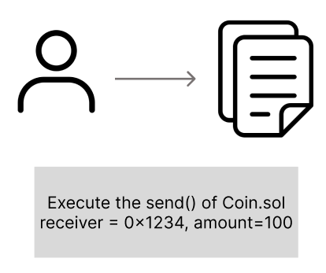

## Introduction

앞선 글에서 우리는 블록체인과 합의 알고리즘을 살펴보며, 탈중앙화된 구조에 대해 설명했어요. 이번에는 블록체인 위에 구축될 수 있는 핵심 기술인 스마트 컨트랙트에 대해 다뤄보려고 해요.

기존의 계약은 종이 문서와 서명으로 진행되었지만, 스마트 컨트랙트는 이 계약 조건을 코드로 구현하고, 특정 조건이 충족되면 중개자 없이 자동으로 실행되는 프로그램입니다.
이 글에서는 Smart Contract의 원리와 사례를 소개하고, 이에 대한 보안 취약점도 함께 살펴보겠습니다.

## 스마트 컨트랙트

스마트 컨트랙트는 미리 정해둔 조건이 충족되면 해당 계약이 자동으로 실행되도록 설계된 코드에요. 계약 조건을 코드로 구현해서 블록체인 상에서도 자동으로 실행되도록 설계할 수 있습니다. 이러한 특성 덕분에 스마트 컨트랙트는 중개 비용을 절감할 수 있고 제3자 없이 계약을 이행할 수 있어요.

스마트 컨트랙트의 개념은 1994년, 닉 사보(Nick Szabo)에 의해 처음으로 제안 되었어요. (여담이지만 Nick Szabo는 사토시 나카모토로 추정되는 인물 중 한 명으로 자주 언급되고 있어요) 하지만 이 때는 개념 뿐이었고, 기술적 실현은 그 이후에 이루어졌어요. 2013년 이더리움의 창시자인 비탈릭 부테린(Vitalik Buterin)은 자신의 블로그에 [스마트 컨트랙트를 기반으로 한 새로운 블록체인 플랫폼의 개념을 담은 백서](https://web.archive.org/web/20131228111141/http://vbuterin.com/ethereum.html)를 공개했어요. 이후 이더리움이라는 블록체인 플랫폼이 2015년에 정식으로 런칭되었고, 본격적으로 스마트 컨트랙트가 실제 블록체인 상에서 사용되기 시작했어요.


현재 스마트 컨트랙트는 이더리움 외에도 다양한 블록체인 플랫폼에서 쓰이고 있고, 이런 계약들은 대부분 if-then 조건문 형태로 작성된 코드를 기반으로 실행됩니다. 블록체인은 여러 참여자가 같은 정보를 공유하고 검증하는 구조이기 때문에, 계약 조건을 검증하고 실행하기에 매우 적절한 환경으로 여겨져요.

### 스마트 컨트랙트의 동작 방식

스마트 컨트랙트는 일반적으로 프로그래밍 언어로 만들어지는데 동작 순서를 간단하게 설명하자면 다음과 같습니다.

1. **코드 작성**

Solidity와 같은 언어로 정말 간단한 스마트 컨트랙트를 작성합니다.

```solidity
pragma solidity ^0.8.26;

contract Coin {
    // The keyword "public" makes variables
    // accessible from other contracts
    address public minter;
    mapping(address => uint) public balances;

    // Events allow clients to react to specific
    // contract changes you declare
    event Sent(address from, address to, uint amount);

    // Constructor code is only run when the contract
    // is created
    constructor() {
        minter = msg.sender;
    }

    // Sends an amount of newly created coins to an address
    // Can only be called by the contract creator
    function mint(address receiver, uint amount) public {
        require(msg.sender == minter);
        balances[receiver] += amount;
    }

    // Errors allow you to provide information about
    // why an operation failed. They are returned
    // to the caller of the function.
    error InsufficientBalance(uint requested, uint available);

    // Sends an amount of existing coins
    // from any caller to an address
    function send(address receiver, uint amount) public {
        require(amount <= balances[msg.sender], InsufficientBalance(amount, balances[msg.sender]));
        balances[msg.sender] -= amount;
        balances[receiver] += amount;
        emit Sent(msg.sender, receiver, amount);
    }
}
```

위처럼 작성된 컨트랙트에는 몇 가지 개념이 등장합니다.

```solidity
address public minter;
```

이 코드는 주소 타입의 상태 변수 minter를 선언합니다. address 타입은 160비트 크기로, 연산이 불가능하며, 계정 주소 혹은 컨트랙트 주소를 저장할 때 사용돼요. 또한 public 키워드를 붙이면 컴파일러가 자동으로 getter 함수를 생성해서 외부에서 이 값을 조회할 수 있어요

```solidity
mapping(address => uint) public balances;
```

이 코드는 address를 키로 하고, 해당 주소의코인 수량을 값으로 저장하는 매핑입니다. 마찬가지로 public이 붙었기 때문에 외부에서 balances를 주소 형태로 조회할 수 있어요

```solidity
event Sent(address from, address to, uint amount);
```

send()함수의 마지막 줄에서 호출되는 이벤트에요. Sent 이벤트가 발생하면 리스너는 전송자, 수신자, 금액 정보를 받아서 transaction을 추적할 수 있습니다.

```solidity
constructor() {
    minter = msg.sender;
}
```

생성자(Constructor) 코드는 컨트랙트가 배포될 때 한 번만 실행돼요. msg.sender는 컨트랙트를 배포한 주소이고, 이를 minter로 저장합니다.

```solidity
function mint(address receiver, uint amount) public {
    require(msg.sender == minter);
    balances[receiver] += amount;
}
```

새로운 코인을 발행하여 다른 주소로 전송합니다. 여기서 `require(msg.sender == minter)` 조건은 오직 배포자만이 이 함수를 호출할 수 있도록 제한해요. 그리고 만약 `balances[receiver]+amount` 연산이 uint256의 최대값을 넘는다면,  Solidity의 기본 연산 안전성(Checked Arithmetic)에 따라 트랜잭션은 자동으로 revert 됩니다.

```solidity
error InsufficientBalance(uint requested, uint available);
```

에러메시지 error와 revert를 정의합니다. 예를 들어서 사용자가 가진 코인보다 더 많은 양을 보내려고 할 경우에는 InsufficientBalance 오류와 함께 트랜잭션이 취소돼요.

```solidity
function send(address receiver, uint amount) public {
    require(amount <= balances[msg.sender], InsufficientBalance(amount, balances[msg.sender]));
    balances[msg.sender] -= amount;
    balances[receiver] += amount;
    emit Sent(msg.sender, receiver, amount);
}
```

자신이 보유한 코인을 다른 주소로 전송할 수 있습니다. 만약 require 조건을 충족하지 못한다면 InsufficientBalance 에러가 나는 코드에요.

2. **컴파일 및 배포**

작성한 코드는 Solidity 컴파일러를 통해 Bytecode와 Application Binary Interface (ABI)로 변환됩니다. 

- Bytecode는 이더리움 가상머신(EVM)이 실행할 수 있는 저수준 코드로, 컨트랙트를 블록체인에 배포할 때 사용돼요.
- ABI는 외부에서 컨트랙트의 함수를 호출할 때 사용되는 인터페이스로, 함수 이름과 파라미터 형식을 정의하고 있어요

이렇게 생성된 바이트 코드는 트랜잭션 형태로 블록체인 네트워크에 전파되며, 이 트랜잭션이 블록이 포함되면 해당 컨트랙트는 고유한 주소를 부여받아 블록체인에 등록됩니다.


3. **트랜잭션 호출**

```solidity
function send(address receiver, uint amount) public {
        require(amount <= balances[msg.sender], InsufficientBalance(amount, balances[msg.sender]));
        balances[msg.sender] -= amount;
        balances[receiver] += amount;
        emit Sent(msg.sender, receiver, amount);
    }
```

스마트 컨트랙트의 특정 함수를 호출하고자 하는 사용자는 함수 호출 정보(대상 컨트랙트 주소, ABI 기반 함수 시그니처, 가스 정보 등)를 담은 트랜잭션을 생성하여 네트워크에 브로드캐스트합니다. 예시 코드처럼 사용자가 Coin.sol의 send() 함수를 실행한다는 트랜잭션을 생성한다고 할 때, 트랜잭션은 노드의 mempool에 일시적으로 저장되고, 블록 생성자(miner 또는 validator)가 선택해 블록에 포함합니다. 이 때 트랜잭션이 mempool에 들어간 후, 수수료(gas price)가 높은 순서대로 처리돼요!

→ mempool(Memory Pool): 아직 블록에 포함되지 않은 트랜잭션들이 임시로 저장되는 공간



 이 트랜젝션을 블록체인 네트워크에 브로드캐스팅을 합니다. 


4. **스마트 컨트랙트 실행 (EVM)**

블록 생성자가 먼저 스마트 컨트랙트를 실행하고, 다른 검증 노드들은 이를 동일하게 재실행하여 블록의 정당성을 검증합니다. 블록 생성자는 트랜잭션을 처리할 때, EVM을 통해 해당 함수(send() 등)를 실행합니다. EVM은 입력값을 디코딩하여 호출할 함수를 매핑하고, require 조건문, 상태 변경, 이벤트 기록 등 컨트랙트의 로직을 실행합니다.

```solidity
require(amount <= balances[msg.sender], InsufficientBalance(amount, balances[msg.sender]));
```

이 조건이 충족되면 계약이 이행되고, 그렇지 않으면 InsufficientBalance 오류가 나 revert되고 모든 변경이 롤백돼요.

5. **가스 처리**

또한 EVM의 실행에는 가스(Gas)가 소모됩니다. 이는 지속적으로 네트워크를 운영하는 노드(검증자)들에게 인센티브로 주어지고, 과도한 연산을 방지할 수도 있어요. 사용자가 설정한 gasLimit과 실제 소모량에 따라 남은 가스는 환불되며, 실패한 트랜잭션도 가스는 소모됩니다.

6. **결과 저장**

트랜잭션 실행이 성공하면, 다음과 같은 결과가 블록체인에 반영됩니다.

- 상태 변화: 예를 들어 `balances[msg.sender] -= amount` 같은 내부 저장소 변화는 상태 트라이(**state trie)**에 반영됩니다.
- 이벤트 로그: `emit Sent(…)` 와 같은 이벤트는 별도의 로그 저장소(receipts)에 기록됩니다.

이런 데이터들은 블록에 포함되어 모든 노드가 공유하는 영구적인 기록이 되고, 누구든지 이를 검증하거나 조회할 수 있습니다. 

스마트 컨트랙트는 이러한 특성을 바탕으로, 조건이 충족되면 자동으로 실행된다는 점에서 전통적인 계약 방식보다 아주 효율적이에요. 특히 중개자 없이도 계약을 실행할 수 있고, 블록체인을 기반으로 할 경우 투명성 과 변경 불가능성이 보장되기 때문에 신뢰성도 높은 편입니다. 이런 장점 덕분에, 스마트 컨트랙트는 점점 다양한 분야로 활용 범위를 넓혀가고 있어요

## 스마트 컨트랙트의 활용 사례

스마트 컨트랙트가 이더리움이라는 블록체인 플랫폼을 통해 처음으로 활용 기반을 갖춘 이후로, 스마트 컨트랙트는 다양한 분야로 확장되었습니다. 

1. **DeFi (탈중앙화 금융)**

DeFi는 기존의 은행, 증권사 같은 중앙화된 금융기관 없이도, 블록체인을 기반으로 예금, 대출, 자산거래, 파생 상품 등을 수행할 수 있게 해주는 탈 중앙화된 금융 시스템입니다. DeFi 서비스는 모든 금융 거래 로직을 스마트 컨트랙트로 작성하고 있어요.

예를 들어, Aave나 Compound같은 DeFi 플랫폼에서는 사용자가 암호화폐를 예치하면 자동으로 이자를 받을 수 있고, 다른 사용자는 담보를 걸고 대출을 받을 수 있어요

또 다른 예로는 Uniswap이 있어요. 이 서비스는 중앙 거래소 없이도 암호화폐를 자동으로 교환할 수 있게 해주는 시스템인데, 거래는 미리 예치된 유동성 풀을 통해서 진행되고, 교환 로직 역시 스마트 컨트랙트로 처리돼요. 이와 유사하게 Curve는 스테이블 코인 간의 교환에 특화된 플랫폼으로, 거래 과정 또한 스마트 컨트랙트에 의해 자동으로 이루어집니다.

2. **DAO (탈중앙화된 자율조직)**

DAO (Decentralized Autonomous Organization)는 전통적인 조직처럼 특정 관리자나 운영자가 아니라, 스마트 컨트랙트에 의해 규칙과 의사 결정이 자동으로 집행되는 조직 형태입니다. 구성원들은 DAO 토큰을 보유함으로써 투표에 참여하고, 제안된 안건이 일정 조건을 충족하면 스마트 컨트랙트가 그 내용을 자동으로 실행합니다.

대표적인 예시로는 MarkerDAO가 있습니다. MarkerDAO는 이더리움 블록체인 기반의 DAO로, 탈중앙화된 스테이블 코인인 DAI를 발행하고 관리합니다. MarkerDAO는 DAI의 가치를 안정적으로 유지하면서 구성원들이 스마트 컨트랙트를 통해 이자율 조정이나 시스템 업그레이드 등에 대해 투표해요.

이처럼 DAO는 사람의 개입 없이도 코드에 의해 운영이 조직될 수 있는 형태입니다. 

3. **CryptoKitties**

CryptoKitties는 2017년 등장한 이더리움 기반의 블록체인 게임이에요. 이 게임은 스마트 컨트랙트를 활용해 디지털 고양이를 수집하고 교배하며 거래할 수 있는 시스템으로 구현되었어요.

이 게임에서 고양이는 각각 고유한 특성과 외형을 지닌 NFT로 표현돼요. 사용자는 두 마리의 고양이를 교배시켜 새로운 고양이를 탄생시킬 수 있고, 이 때 유전 정보의 조합과 교배 결과는 스마트 컨트랙트에 의해 자동으로 결정됩니다. 이렇게 생성된 고양이는 새로운 NFT로 등록되고, 사용자는 이 고양이를 다른 사용자에게 판매하거나 보유할 수 있어요. 이 게임은 출시 직후 큰 인기를 끌며 이더리움 네트워크에 과부하를 일으킬 정도였어요.

위와 같이 스마트 컨트랙트는 금융, 조직 운영, 게임 등 다양한 분야에서 활발하게 활용되고 있어요. 블록체인은 보안성이 뛰어난 기술로 알려져 있지만, 스마트 컨트랙트에서는 실제로 몇 차례 해킹 사례가 발생한 바 있습니다. 다음은 실제 사례와 함께 smart contract의 취약점을 설명하겠습니다.

## Smart Contract의 취약점

### 1. Reentrancy Attack

Reentrancy Attack(재진입 공격)은 스마트 컨트랙트가 자신의 상태(state)를 업데이트 하기전에 외부 컨트랙트로 호출을 수행할 때 발생하는 취약점입니다. 이 경우, 외부 컨트랙트(악의적인 경우)가 원래 함수로 다시 재진입하여, 같은 상태를 기반으로 출금 등의 동작을 반복적으로 수행할 수 있어요. 

이 취약점은 2016년 DAO 해킹 사건으로 인해 약 6000만 달러가 탈취당하면서, 가장 먼저 검토해야할 보안 항목이 되었습니다.

그 예시는 아래와 같아요.

- 스마트 컨트랙트가 외부 주소 (스마트 컨트랙트)로 이더(ETH)나 토큰을 전송하면, 수신자 쪽의 함수 (fallback() 또는 receive())가 자동으로 실행됩니다.
- 이 때 그 함수 안의 코드가 실행되므로, 실행 흐름이 외부 컨트랙트로 넘어갑니다.
- 공격자는 이 기회를 이용해 다시 원래 컨트랙트의 함수를 재호출하면, 원래 컨트랙트는 아직 이전 함수 실행이 끝나지 않았기 때문에, 상태가 정리되지 않은 상태에서 또 실행되게 됩니다.
- 그 결과, 잔액 검증 이전에 계속 자금을 빼내는 등의 공격이 가능해집니다.

아래 코드는 DAO 해킹 당시 취약했던 함수 splitDAO()의 일부로, 재진입 공격에 취약했던 구조입니다.

```solidity
function splitDAO(uint _proposalID, address _newCurator) noEther onlyTokenholders returns (bool _success) {
    ...
		// [1]
    uint fundsToBeMoved = (balances[msg.sender] * p.splitData[0].splitBalance) / p.splitData[0].totalSupply;
    //Since the balance is never updated the attacker can pass this modifier several times 
    // [2]
    if (p.splitData[0].newDAO.createTokenProxy.value(fundsToBeMoved)(msg.sender) == false) throw;

    ...

    // Burn DAO Tokens
    // Funds are transferred before the balance is updated
    //[3]
    Transfer(msg.sender, 0, balances[msg.sender]);
    withdrawRewardFor(msg.sender); // be nice, and get his rewards
    // Only now after the funds are transferred is the balance updated
    totalSupply -= balances[msg.sender];
    paidOut[msg.sender] = 0;
    return true;
}
```

splitDAO() 함수는 사용자가 DAO를 탈퇴하고 새로운 DAO로 이동할 때 실행됩니다.

\[1]에서는 사용자가 받을 이더 금액인 `fundsToBeMoved`을 계산하는,. 이 때 사용되는 `balances[msg.sender]`는 아직 줄어들지 않은 상태입니다. 

\[2]에서 이더를 전송하면서 외부 컨트랙트의 함수(`createTokenProxy`)를 호출하게 되는데, 이 때 공격자가 만든 악성 컨트랙트가 splitDAO()를 다시 호출할 수 있습니다.

그러면 `balances[msg.sender]`는 여전히 값이 그대로이기 때문에, 동일한 금액을 여러 번 요청에 자금을 반복해서 인출할 수 있게 돼요.

\[3] 이후에 내부 상태를 변경하지만, 이미 외부 호출이 끝난 후에 발생하므로, 방어에는 전혀 효과가 없습니다. 

**Mitigation**

1. **Checks-Effects-Interactions 패턴 사용**
스마트 컨트랙트는 외부 컨트랙트와 상호작용 하기 전에 내부 상태를 먼저 변경해야합니다. 이를 위해 checks → Effects → Interaction 순서로 코드를 작성하는 것이 중요합니다.
- Checks: 입력값과 조건 검증
- Effects: 상태 변수 업데이트
- Interactions: 외부 컨트랙트 호출
2. **ReentrancyGuard 사용**
[OpenZeppelin](https://docs.openzeppelin.com/contracts/4.x/api/security#ReentrancyGuard)에서 제공하는 ReentrancyGuard는 재진입 공격을 방지하는 모듈입니다. `nonReentrant` modifier를 적용하면, 함수가 실행 중일 때 동일한 함수가 다시 호출되는 것을 차단할 수 있습니다.

### 2. Improper Access Control

Access control vulnerability (접근 제어 취약점)는 스마트 컨트랙트에서 특정 기능이나 데이터에 대한 접근을 적절하게 제한하지 못할 때 발생하는 취약점입니다.

이로 인해 권한이 없는 사용자도 민감한 기능(ex. 토큰 발행, 자산 인출, 계약 정지, 업그레이드 등)에 접근할 수 있어 계약의 보안성과 무결성을 위협합니다.

아래는 취약한 버전의 스마트 컨트랙트입니다.

```solidity
// SPDX-License-Identifier: MIT
pragma solidity ^0.8.0;

contract Solidity_AccessControl {
    mapping(address => uint256) public balances;

    // Burn function with no access control
    function burn(address account, uint256 amount) public {
        _burn(account, amount);
    }
}
```

이 예제는 누구나 burn 함수를 호출할 수 있으며, 아무 주소의 토큰 잔액을 줄이거나 파괴할 수 있습니다. 이 컨트랙트는 권한 검증 없이 민감한 기능을 노출한 전형적인 예시입니다.

아래 코드는 onlyOwner modifier를 통해 오직 컨트랙트 소유자만 burn을 호출할 수 있도록 수정된 버전입니다.

```solidity
// SPDX-License-Identifier: MIT
pragma solidity ^0.8.0;

// Import the Ownable contract from OpenZeppelin to manage ownership
import "@openzeppelin/contracts/access/Ownable.sol";

contract Solidity_AccessControl is Ownable {
    mapping(address => uint256) public balances;

    // Burn function with proper access control, only accessible by the contract owner
    function burn(address account, uint256 amount) public onlyOwner {
        _burn(account, amount);
    }
}
```

**실제 사례**

- 2017년 발생한 Parity Multisig Wallet 해킹은 초기화 함수 `initWallet()`에 접근 제한이 없었던 것이 원인이었습니다. 이 때 공격자는 해당 함수를 호출해 자신을 지갑의 소유자로 등록했고, 약 15만 ETH(당시 약 3천만 달러)를 탈취했습니다.

**Mitigation**

1. **권한 제어 모듈 사용**
OpenZeppelin의 [`Ownable`](https://docs.openzeppelin.com/contracts/2.x/api/ownership#Ownable), `AccessControl`, `RBAC`(Role-Based Access Control) 같은 검증된 접근 제어 프레임워크를 사용합니다.
2. **스마트 컨트랙트 내에 명확하고 체계적으로 접근 제어 매커니즘을 설계하고 구현하는 것이 중요합니다.**

### 3. **Price oracle manipulation**

스마트 컨트랙트는 외부로부터 가격이나 기타 정보를 가져올 때 오라클을 사용합니다. 특히 DeFi에서 자산 가격을 가져오기 위해 오라클을 자주 사용하는데, 이 오라클이 조작되거나, 취약하거나, 신뢰성이 부족하다면 공격자가 거짓 가격 정보를 주입해 스마트 컨트랙트의 잘못된 동작을 유발합니다. 이 취약점으로 인해 무단 인출, 과도한 레버리지, 컨트랙트 파산, 유동성 풀 고갈 등의 피해를 일으킬 수 있습니다.

다음 예시는 개념을 설명하기 위해 작성된 샘플 코드입니다. 

```solidity
// SPDX-License-Identifier: MIT
pragma solidity ^0.8.0;
// [1]
interface IPriceFeed {
    function getLatestPrice() external view returns (int);
}

contract PriceOracleManipulation {
    address public owner;
    IPriceFeed public priceFeed;

    constructor(address _priceFeed) {
        owner = msg.sender;
        priceFeed = IPriceFeed(_priceFeed);
    }
		// [2]
    function borrow(uint256 amount) public {
        int price = priceFeed.getLatestPrice();
        require(price > 0, "Price must be positive");
	
        // Vulnerability: No validation or protection against price manipulation
        //[3]
        uint256 collateralValue = uint256(price) * amount;

        // Borrow logic based on manipulated price
        // If an attacker manipulates the oracle, they could borrow more than they should
    }

    function repay(uint256 amount) public {
        // Repayment logic
    }
}
```

\[1]의 getLatestPrice() 함수로 외부 시스템(오라클)에서 최신 가격을 가져옵니다. 이 오라클을 조작할 수 있거나 신뢰할 수 없다면, 공격자는 허위 가격 데이터를 컨트랙트에 주입할 수 있습니다.

\[2]로 borrow()를 호출할 때, 오라클로부터 자산의 현재 가격을 받아옵니다. price > 0 조건은 단순히 유효성 검사고, 조작된 가격에 대한 방어가 없습니다.

\[3]에서는 받아온 가격 값과 amount를 곱해서 담보 가치를 계산하는데, 이 값이 과대평가되면 공격자는 실제보다 더 많은 자금을 빌릴 수 있습니다. 만약 공격자가 허위 가격 데이터를 주입했다면, 담보 대비 초과 대출이 발생하고 시스템 자산 유출로 이어질 수 있습니다.

아래는 앞서 보여준 취약한 버전의 스마트 컨트랙트를 보완한 코드입니다.

```solidity
// SPDX-License-Identifier: MIT
pragma solidity ^0.8.0;

interface IPriceFeed {
    function getLatestPrice() external view returns (int);
}

contract PriceOracleManipulation {
    address public owner;
    IPriceFeed public priceFeed;
    // [1]
    int public minPrice = 1000; // Set minimum acceptable price
    int public maxPrice = 2000; // Set maximum acceptable price

    constructor(address _priceFeed) {
        owner = msg.sender;
        priceFeed = IPriceFeed(_priceFeed);
    }

    function borrow(uint256 amount) public {
        int price = priceFeed.getLatestPrice();
        // [2]
        require(price > 0 && price >= minPrice && price <= maxPrice, "Price manipulation detected");

        uint256 collateralValue = uint256(price) * amount;

        // Borrow logic based on valid price
    }

    function repay(uint256 amount) public {
        // Repayment logic
    }
}
```

\[1] 가격 조작을 방지하기 위해 기준값 변수를 정하고 \[2] 가격 검증을 위한 로직을 추가했습니다.

**실제 사례**

- 2023년 2월 BonqDAO 프로토콜에 오라클 조작 공격이 발생해 1억 2천만 달러의 손실을 입혔습니다. 공격자는 오라클을 통해 ALBT 토큰 가격을 인위적으로 부풀리고, 이를 담보로 BEUR 스테이블 코인을 과도하게 발행했습니다. 이 공격의 원인은 오라클 가격 검증 부재였습니다.
- 2023년 5월 Baby Doge 토큰이 오라클 조작 공격으로 인해 약 13만 7천 달러 상당의 피해를 입었습니다.

**mitigation**

- 여러 개의 독립적인 오라클로부터 데이터를 집계하면 조작 위험을 줄일 수 있습니다.
- 스마트 컨트랙트 로직에 영향을 줄 수 있는 급격한 가격 변동을 방지하기 위해, 오라클로부터 받은 가격에 최소값 및 최대값 임계 조건을 설정합니다.
- 타임락(time lock)을 도입하여, 가격 업데이트 사이에 지연을 두면 즉각적인 가격 변동을 악용하는 것을 막을 수 있습니다.
- 오라클로부터 받은 데이터의 신뢰성을 보장하기 위해, 암호학적 서명 등 증명 방식을 활용합니다.

이번 연구글에서는 스마트 컨트랙트의 개념과 동작 방식, 그리고 대표적인 보안 취약점 몇 가지를 다뤘어요. 사실 처음에는 스마트 컨트랙트의 취약점을 좀 더 다루고 싶었는데 분량 문제로 3가지만 간단히 정리할 수밖에 없었습니다..

다음에는 실제 해킹 사례와 다양한 취약점을 더 다뤄볼까 생각중이에요. 

라고 말했지만 다음 주제가 꼭 그렇게 될지는 아직 모르겠습니다. 😅 긴 연구글 읽어주셔서 감사합니다!

### Reference

[https://docs.soliditylang.org/en/latest/introduction-to-smart-contracts.html](https://docs.soliditylang.org/en/latest/introduction-to-smart-contracts.html)

[https://github.com/pcaversaccio/reentrancy-attacks](https://github.com/pcaversaccio/reentrancy-attacks)

[https://owasp.org/www-project-smart-contract-top-10/](https://owasp.org/www-project-smart-contract-top-10/)

[https://medium.com/coinmonks/10-smart-contract-vulnerabilities-with-code-examples-38562685fca2](https://medium.com/coinmonks/10-smart-contract-vulnerabilities-with-code-examples-38562685fca2)