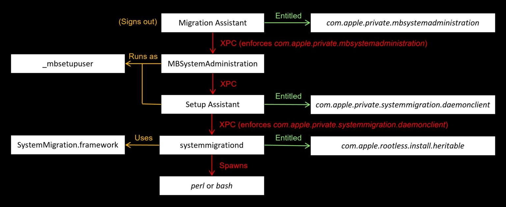

[macOS: Part0 - TCC Bypass](https://hackyboiz.github.io/2025/01/19/clalxk/MacOS_TCC-Bypass_en/)

macOS: Part1 - SIP Bypass ← Now!

Hello, I'm clalxk! After covering TCC Bypass, I've summarized SIP Bypass. Moving forward, I plan to study vulnerabilities that mainly occur on macOS, so stay tuned for Part 2!

In this post, I'll introduce the concept of SIP and explain the overall flow of a vulnerability through a SIP Bypass example. I'll also explain what Entitlement is and the role it plays in this process, among other things.


## **System Integrity Protection (SIP)**

SIP is a core security feature of macOS that prevents even root users from modifying or deleting critical system files. It protects the system by using Apple's sandboxing technology, securing the entire platform from root access (conceptually similar to how SELinux protects the system).

By exploiting this vulnerability, an attacker can bypass SIP, access system-protected directories, and perform various malicious actions, such as installing rootkits, bypassing TCC, and creating persistent malware. SIP-enabled systems are sometimes referred to as **rootless** because even if an attacker gains root privileges, these privileges are limited, and system files and directories cannot be modified.

### **Relationship Between SIP and Entitlements**

SIP protects the following paths:

- /System, /bin, /sbin, and /usr (with some exceptions)
- The system kernel and core frameworks
- Files that contain attributes set by SIP

*To fully disable SIP, settings must be changed from Recovery Mode—this is not possible in a normal runtime environment.*

However, because processes like system updates require access to SIP-protected directories, Apple introduced specific permissions that are exempt from SIP restrictions. 

These are:

- com.apple.rootless.install: Allows bypassing SIP filesystem checks
- com.apple.rootless.install.heritable: Inherits com.apple.rootless.install in child processes

Granting specific permissions to files or processes is called assigning an “[**Entitlement**](https://developer.apple.com/documentation/bundleresources/entitlements).”
Entitlements cannot be legally forged, as they are embedded during the app signing process. Apple extensively uses entitlements in macOS to enhance system security by granting internal privileges to highly specific processes.

In particular, the com.apple.rootless.install.heritable entitlement allows not only the designated process but also its child processes to inherit com.apple.rootless.install, thereby bypassing SIP filesystem protections.

We'll look at an example of how this entitlement was bypassed shortly!

### Where SIP Settings Are Stored

SIP’s activation status and detailed permissions are stored as **bitflags**.

- On Intel Macs, these settings are saved in the csr-active-config variable in NVRAM.
- On Apple Silicon (ARM) Macs, they are configured by reading the lp-sip0 value from the Device Tree during boot.

In other words, the method of accessing SIP settings varies depending on the platform.

These bitflags are defined in the **csr.h** header file in the **XNU kernel source code**.

> *XNU is the kernel for macOS and iOS, and is an open-source–based operating system kernel developed by Apple.*
> 

### List of SIP Bitflags

The table below shows the major flags used to control specific SIP functionalities, as defined in the XNU source code.

| **Bit Name (in XNU code)** | **Description** |
| --- | --- |
| `CSR_ALLOW_UNTRUSTED_KEXTS` | Allows loading of unsigned kernel extensions (KEXTs) |
| `CSR_ALLOW_UNRESTRICTED_FS` | Grants unrestricted access to protected filesystem paths |
| `CSR_ALLOW_TASK_FOR_PID` | Allows access to task ports for specific PIDs (used for debugging) |
| `CSR_ALLOW_KERNEL_DEBUGGER` | Enables kernel debugging |
| `CSR_ALLOW_UNRESTRICTED_DTRACE` | Allows unrestricted use of DTrace (a debugging and tracing tool) |
| `CSR_ALLOW_UNRESTRICTED_NVRAM` | Lifts read/write restrictions on NVRAM variables |
| `CSR_ALLOW_UNAUTHENTICATED_ROOT` | Allows booting from unsigned APFS root snapshots |

These flags can be enabled in special cases, such as for debugging or security research, but in a standard environment, all of them are disabled (set to 0) by default.

If you want to check the current SIP status on your macOS system, you can use the following command:

```bash
$ csrutil status

System Integrity Protection status: enabled.
```

- **enabled**: SIP is enabled and the default protections are in place.
- **disabled**: SIP is disabled.

On Intel-based Macs, since SIP settings are stored in NVRAM variables, you can use the following command:

```bash
$ nvram csr-active-config

csr-active-config  w%00%00%00
```

This value is a **hexadecimal bitflag** that indicates which SIP features are disabled. For example, a value of 0x77 means that multiple SIP protections have been turned off.

On Apple Silicon Macs, SIP settings are read from the Device Tree (lp-sip0), so the above command will not return this information.


## SIP Bypass Example 

Let's analyze the drop_sip binary, which uses the com.apple.rootless.install.heritable entitlement, to see how it bypasses SIP.

```bash
DeviceProcessEvents
| where FileName =~ "drop_sip"
| project InitiatingProcessFileName, ProcessCommandLine, SHA256
```

drop_sip is a binary **signed directly by Apple**.


This binary is a signed executable that is **natively located at**

`/System/Library/PrivateFrameworks/SystemMigrationUtils.framework/Resources/Tools/drop_sip.`

The binary **uses csops() to configure SIP-related flags and spawn child processes** with those settings.


Through the `csops` system call, the `p_csflags` member is modified, effectively enabling or configuring SIP behavior.


The parent process was `systemmigrationd`, which **inherited the SIP bypass permission through** `com.apple.rootless.install.heritable` and passed it down to its child processes. As a result, drop_sip and its child processes were executed in an environment where SIP protections could be bypassed.

```bash
DeviceProcessEvents
| where InitiatingProcessFileName =~ "systemmigrationd"
| summarize Hits=count(), Cmdline=any(ProcessCommandLine) by FileName
```

Using the query above, we tracked the child processes of systemmigrationd.

During this investigation, we discovered that **the Bash and Perl interpreters** (/bin/bash and /usr/bin/perl) were being executed as child processes.
This was a significant clue, because **interpreters can be exploited for code injection via environment variable manipulation**.

| **FileName** | **Hits** | **Cmdline** |
| --- | --- | --- |
| bash | 498 | /bin/bash /System/Library/.../firstbootDirectoryServer |
| perl | 171 | /usr/bin/perl /usr/libexec/migrateLocalKDC ... |

By exploiting environment variables like BASH_ENV for Bash or PERL5OPT for Perl, an attacker can execute arbitrary shell scripts in child processes.


SIP Bypass Example Using BASH_ENV


SIP Bypass Example Using PERL5OPT

```bash
launchctl setenv PERL5OPT '-Mwarnings;system("/private/tmp/migraine.sh")'
```

When such commands are executed, the script injected by the attacker (e.g., /private/tmp/migraine.sh) is run within a SIP-protected environment during Perl's startup.

---

The SIP bypass vulnerability introduced earlier uses child processes of the `systemmigrationd` daemon as the attack entry point.
However, there's a catch — **this daemon is only active when a migration is actually triggered**. Since typical migrations only occur **after the user is fully logged out**, it becomes **difficult for a remote attacker to manipulate or automate this process in real-time**.

Let's analyze the full migration flow to identify a **bypass point that can be automated**.

### Summary of the Full Migration Flow



1. **Migration Assistant**
This is the primary application that launches the migration wizard.
→ It triggers user logout and internally calls the `SACLOStartLogoutWithOptions` method.
→ This app has the `com.apple.private.mbsystemadministration` entitlement.
2. **MBSystemAdministration**
    - Acts as a **proxy** for Migration Assistant, forwarding requests to the **Setup Assistant**.
    - It runs as the `_mbsetupuser`, enabling GUI interaction.
    - Communication occurs via XPC, and requests are **rejected** if the appropriate entitlement is missing.
3. **Setup Assistant**
    - Executes the actual migration logic and communicates with `systemmigrationd`.
    - Requires the `com.apple.private.systemmigration.daemonclient` entitlement.
    - Requests are sent via **XPC**.
4. **systemmigrationd**
    - Receives migration requests and processes them using the **SystemMigration.framework**.
    - Creates a migration request file in `/Library/SystemMigration/Queue` and transitions it to an **“In-Flight”**state for processing.
    - During this process, **Bash or Perl scripts may be executed** — **this is the point where an attacker can inject environment variable–based payloads**.

As we've seen, during the migration process, `systemmigrationd` receives XPC requests internally through the `SystemMigrationDaemon` object provided by `SystemMigration.framework` .


```bash
rax = [SystemMigrationDaemon sharedDaemon];
[rax startListeningForConnections];
```

The daemon receives client requests through its own framework and executes migration scripts (such as Bash or Perl) accordingly.

### Attempt to Patch Migration Assistant


To automate the SIP bypass, Microsoft attempted to remove the function `SACLOStartLogoutWithOptions()`, which is responsible for triggering user logout during the migration process.

The idea was that bypassing this function might allow migration to proceed **without requiring the user to log out**. However, the attempt failed for three key reasons:

1. **Code Signing Failure**
macOS enforces strict validation of system binary code signatures.
As soon as a binary is modified, its signature becomes invalid, and the system blocks its execution.
2. **PAC (Pointer Authentication Code) Validation Failure**
On modern Apple Silicon (macOS arm64e), **PAC is enabled by default**. Unsigned or tampered binaries **fail PAC verification and cannot be executed**.
3. **Loss of Entitlements**
The Migration Assistant binary requires the `com.apple.private.mbsystemadministration` entitlement in order to **communicate with MBSystemAdministration via XPC**.
However, during extraction, modification, and repackaging, this entitlement is **lost**, resulting in communication failure.

As a result, simply removing the logout logic or modifying the Migration Assistant binary was **not a viable solution**.

Instead, based on the insights gained from this attempt, an alternative bypass was explored: directly launching the Setup Assistant and automating the process using AppleScript and environment variable–based payload injection.

This approach enables an attacker to **trigger** `systemmigrationd` **and inject payloads at the point where Bash/Perl scripts are executed—without requiring user logout or interaction**.

## Apple's Response

Upon identifying the above vulnerability, Apple implemented two key mitigations:

1. **Blocked environment variable inheritance in launchd**
Previously, an attacker could use the launchctl setenv command to set environment variables such as BASH_ENVor PERL5OPT, which would then be inherited by systemmigrationd child processes, allowing malicious code execution.
Apple mitigated this by **modifying launchd to ignore these environment variables entirely**, effectively blocking this attack vector.

```bash
launchctl setenv WHATEVER blah
# error:
Could not set environment: 150: Operation not permitted while System Integrity Protection is engaged

```

1. Removed SIP bypass capabilities from within drop_sip

## **In Conclusion**

In this post, we explored a wide range of topics — from the concept of SIP to entitlements, bypass techniques, practical exploitation, and Apple’s patch response.

In the next research post, we'll return with a deep dive into **Sandbox Escape**. Stay tuned!

### Reference

https://powerofcommunity.net/poc2024/Csaba%20Fitzl,%20Apple%20Disk-O%20Party.pdf

https://github.com/LearningKijo/SecurityResearcher-Note/blob/main/SecurityResearcher-Note-Folder/Day14-macOS-SIP-Bypass-Insights.md

https://www.youtube.com/watch?v=zxZesAN-TEk

https://www.offsec.com/blog/macos-kernel-debugging-with-sip/

https://objective-see.org/blog/blog_0x14.html

https://www.microsoft.com/en-us/security/blog/2023/05/30/new-macos-vulnerability-migraine-could-bypass-system-integrity-protection/

https://media.defcon.org/DEF%20CON%2031/DEF%20CON%2031%20presentations/Jonathan%20Bar%20Or%20Michael%20Pearse%20Anurag%20Bohra%20-%20Getting%20a%20Migraine%20-%20uncovering%20a%20unique%20SIP%20bypass%20on%20macOS.pdf