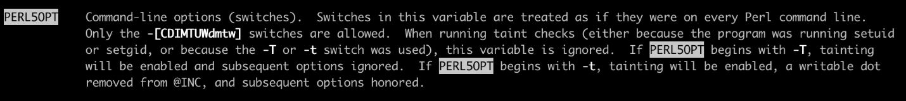
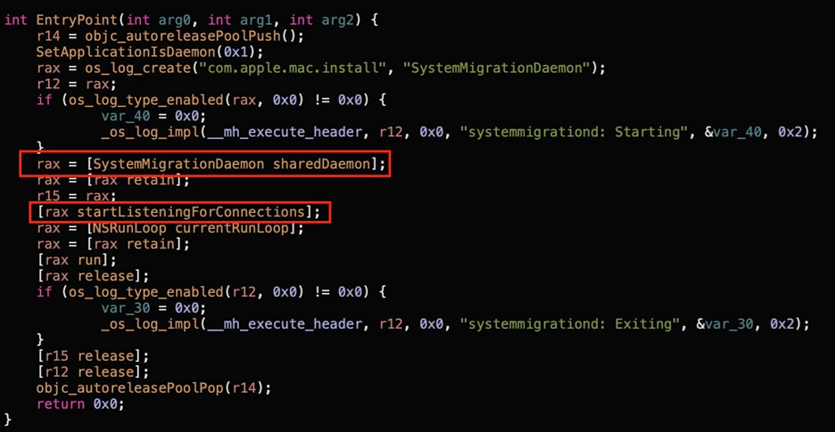

[macOS: Part0 - TCC Bypass](https://hackyboiz.github.io/2025/01/19/clalxk/MacOS_TCC-Bypass_ko/)

macOS: Part1 - SIP Bypass ← Now!

안녕하세요, clalxk입니다! TCC Bypass에 이어 SIP Bypass에 대해 정리해보았습니다. 앞으로 macOS에서 주로 발생하는 취약점에 대해 공부해보려고 합니다! Part2도 기대해주세요 ㅎㅎ 

이번 글에서는 SIP의 개념과 SIP Bypass 예제를 통해 취약점의 전반적인 흐름과 이 과정에서 Entitlement가 무엇인지 어떤 역할을 수행하는 지 등에 대해 알아보려 합니다. 

---

## System Integrity Protection, SIP

SIP는 루트 사용자조차 시스템의 핵심 파일을 수정하거나 삭제하지 못하도록 제한하는 macOS의 핵심 보안 기능입니다. Apple 샌드박스를 활용하여 전체 플랫폼을 보호함으로써 시스템을 루트로부터 보호하는 방식입니다. (SELinux가 시스템을 보호하는 방식과 개념적으로 유사) 

이 취약점을 활용하면 공격자는 SIP를 우회하고, 시스템 보호 디렉토리에 접근해 루트킷 설치, TCC 우회, 지속형 멀웨어 생성을 포함한 다양한 악성 행위를 수행할 수 있습니다. SIP가 적용된 시스템은 시스템 파일 및 디렉터리를 수정할 수 없으며, 심지어 root 권한을 얻더라도 이러한 권한이 제한되어 ‘**rootless**’라고도 불립니다.

### SIP와 Entitlement의 관계

SIP는 다음과 같은 경로를 보호합니다.

- /System, /bin, /sbin, /usr(일부 제외)
- 시스템 커널 및 핵심 프레임워크
- SIP가 설정한 속성이 포함된 파일

> *SIP를 완전히 비활성화하려면 복구 모드에서만 설정 변경이 가능하며, 일반적인 런타임 환경에서는 불가능합니다.*
> 

그러나 시스템 업데이트 등에는 SIP로 보호되는 디렉터리에 액세스해야하기 때문에 예외적으로 SIP의 제한을 받지 않는 특정 권한을 도입했습니다. 해당 권한은 아래와 같습니다. 

- com.apple.rootless.install : SIP 파일시스템 검사를 우회하는 권한
- com.apple.rootless.install.heritable : 자식 프로세스에 com.apple.rootless.install 상속

특정 파일 혹은 프로세스에 어떠한 권한을 부여하는 것을 “[**Entitlement**](https://developer.apple.com/documentation/bundleresources/entitlements)”라고 합니다. Entitlement는 앱 서명 프로세스에 포함되기 때문에 합법적으로 위조할 수 없습니다. Apple은 macOS에서 보안을 강화하기 위해 Entitlement를 광범위하게 사용하며, 매우 구체적인 프로세스에 내부 권한을 부여합니다. 특히 위에서 언급된  `com.apple.rootless.install.heritable`는 해당 프로세스뿐 아니라 자식 프로세스에 `com.apple.rootless.install`을 상속하여 SIP 파일시스템 보호를 우회할 수 있도록 합니다.

조금 후에 이 Entitlement를 어떻게 우회했는지 예제를 통해 살펴보도록 하겠습니다! 

### SIP 설정 저장 위치

SIP의 활성화 및 세부 허용 사항은 **bitflag** 형태로 설정되어 저장됩니다.

- **Intel Mac**에서는 NVRAM의 `csr-active-config` 변수에 저장
- **Apple Silicon (ARM) Mac**에서는 부팅 시 Device Tree에서 `lp-sip0` 값을 읽어 구성

즉, 플랫폼에 따라 SIP 설정을 읽는 경로가 다릅니다.

이 비트 플래그들은 **XNU 커널 소스 코드의 csr.h** 헤더 파일에서 정의되어 있습니다.

> *XNU는 macOS와 iOS의 커널로, Apple이 개발한 오픈소스 기반의 운영체제 커널입니다.
> 

### SIP 비트플래그 목록

슬라이드 하단의 표는 실제 SIP 기능 제어에 사용되는 주요 플래그들입니다.

| **Bit 이름 (XNU 코드 상)** | **기능 설명** |
| --- | --- |
| CSR_ALLOW_UNTRUSTED_KEXTS | 서명되지 않은 커널 확장(KEXT) 로딩 허용 |
| CSR_ALLOW_UNRESTRICTED_FS | 보호된 파일 시스템 경로에 대한 무제한 접근 허용 |
| CSR_ALLOW_TASK_FOR_PID | 특정 PID에 대한 task 포트(디버깅 용도) 접근 허용 |
| CSR_ALLOW_KERNEL_DEBUGGER | 커널 디버깅 활성화 허용 |
| CSR_ALLOW_UNRESTRICTED_DTRACE | DTrace(디버깅 및 트레이싱 도구)의 무제한 사용 허용 |
| CSR_ALLOW_UNRESTRICTED_NVRAM | NVRAM 변수의 읽기·쓰기 제한 해제 |
| CSR_ALLOW_UNAUTHENTICATED_ROOT | 서명되지 않은 APFS 루트 스냅샷 부팅 허용 |

이러한 플래그는 보안을 무력화하거나 디버깅을 위해 특별한 상황에서 설정할 수 있지만, 일반적인 환경에서는 기본적으로 모두 비활성화 상태(0)입니다. 

현 macOS 시스템에서 SIP 활성 상태를 확인해보고 싶다면 아래 명령어를 사용할 수 있습니다. 

```bash
$ csrutil status

System Integrity Protection status: enabled.
```

- enabled: SIP가 활성화되어 있고, 기본 보호가 적용 중
- disabled: SIP가 비활성화되어 있음

intel 기반 Mac에서는 SIP 설정이 NVRAM 변수에 저장되므로, 아래 명령어를 사용하시면 됩니다.

```bash
$ nvram csr-active-config

csr-active-config  w%00%00%00
```

이 값은 **16진수 비트플래그**로 SIP의 어떤 기능이 꺼져 있는지 나타냅니다. 예를 들어 0x77이면 여러 SIP 보호 기능이 해제된 상태입니다. Apple Silicon Mac에서는 lp-sip0을 Device Tree에서 읽기 때문에 위 명령어로는 확인되지 않습니다.

## SIP Bypass 예제

`com.apple.rootless.install.heritable` 를 사용하고 있는 ‘drop_sip’ 바이너리를 분석하여 어떻게 SIP를 우회했는지 살펴보려 합니다. 

```bash
DeviceProcessEvents
| where FileName =~ "drop_sip"
| project InitiatingProcessFileName, ProcessCommandLine, SHA256
```

drop_sip는 Apple에서 직접 서명한 바이너리입니다. 


이 바이너리는 `/System/Library/PrivateFrameworks/SystemMigrationUtils.framework/Resources/Tools/drop_sip` 경로에 기본적으로 존재하는 서명된 바이너리였습니다. 해당 바이너리는 **csops()를 사용해 SIP 관련 플래그를 설정하고 자식 프로세스를 실행하는 기능을 수행**합니다.


.csops 시스템 호출로 인한 `p_csflags` 멤버 수정을 수행하게 되며 SIP를 활성화합니다.


상위 프로세스는 `systemmigrationd`였으며, **com.apple.rootless.install.heritable** 를 통해 SIP 우회 권한을 하위 프로세스에게 상속하고 있었습니다. 이로 인해 drop_sip 및 하위 프로세스들은 SIP를 우회할 수 있는 환경에서 실행됩니다. 

```bash
DeviceProcessEvents
| where InitiatingProcessFileName =~ "systemmigrationd"
| summarize Hits=count(), Cmdline=any(ProcessCommandLine) by FileName
```

이후로 위 쿼리를 통해 systemmigrationd의 자식 프로세스를 추적했습니다.

이 과정에서 Bash와 Perl 인터프리터가(/bin/bash, /usr/bin/perl)자식 프로세스로 실행되는 것을 발견했습니다! 이건 중요한 힌트였는데요, 왜냐하면 **인터프리터는 환경 변수 조작을 통해 코드 주입이 가능**하기 때문입니다.

| **FileName** | **Hits** | **Cmdline** |
| --- | --- | --- |
| bash | 498 | /bin/bash /System/Library/.../firstbootDirectoryServer |
| perl | 171 | /usr/bin/perl /usr/libexec/migrateLocalKDC ... |

Bash의 `BASH_ENV`나 Perl의 `PERL5OPT` 환경 변수를 악용하면, 자식 프로세스에서 공격자가 원하는 쉘 스크립트를 실행할 수 있습니다.


BASH_ENV를 활용한 우회 예시



PERL5OPT를 활용한 우회 예시

```bash
launchctl setenv PERL5OPT '-Mwarnings;system("/private/tmp/migraine.sh")'
```

이제 위와 같은 명령이 실행되면, Perl이 기동될 때 공격자가 삽입한 스크립트(/private/tmp/migraine.sh)가 SIP 보호 영역 내에서 실행됩니다.

---

앞서 소개한 SIP 우회 취약점은 `systemmigrationd`라는 데몬의 자식 프로세스를 공격 진입점으로 삼고 있습니다. 하지만 문제는 **이 데몬이 작동하려면 마이그레이션이 실제로 트리거되어야 한다는 점인데요**. 기존의 마이그레이션은 **사용자가 완전히 로그아웃한 후**에만 진행되기 때문에, **원격 공격자가 실시간으로 조작하거나 자동화하기 어려운 특징**을 가지고 있었습니다. 마이그레이션 전체 흐름을 분석해 **자동화 가능한 우회 지점을 찾아보겠습니다!**

### 마이그레이션 전체 흐름 요약


1. **Migration Assistant**
마이그레이션 마법사를 실행하는 기본 앱입니다.
→ 로그아웃을 트리거하며, 내부적으로 `SACLOStartLogoutWithOptions` 메서드를 호출합니다.
→ 이 앱은 `com.apple.private.mbsystemadministration`라는 Entitlement를 가지고 있습니다.
2. **MBSystemAdministration**
    - Migration Assistant의 요청을 **proxy**하여 **Setup Assistant**로 전달합니다. `_mbsetupuser`로 실행되며, GUI 상호작용이 가능해집니다.
    - XPC를 통해 통신하며, 요청을 검증할 때 Entitlement가 없으면 **거부**합니다.
3. **Setup Assistant**
    - 실제 마이그레이션 로직을 실행하며, `systemmigrationd`와 통신합니다.
    - `com.apple.private.systemmigration.daemonclient` Entitlement를 요구합니다. 이때 요청은 **XPC**를 통해 전달됩니다.
4. **systemmigrationd**
    - 마이그레이션 요청을 수신하고, **SystemMigration.framework**를 통해 작업을 수행합니다.
    - /Library/SystemMigration/Queue 디렉토리에 마이그레이션 요청 파일을 생성하고, 이를 **“In-Flight”** 상태로 바꿔 처리합니다. 이 과정에서 필요에 따라 **bash나 perl 스크립트를 실행**하는데, `이 점이 바로 공격자가 환경 변수 기반 페이로드를 삽입할 수 있는 지점`입니다.

살펴본 대로, 마이그레이션 과정에서 systemmigrationd는 내부적으로 `SystemMigration.framework`의 `SystemMigrationDaemon` 객체를 통해 XPC 요청을 수신합니다.  



```bash
rax = [SystemMigrationDaemon sharedDaemon];
[rax startListeningForConnections];
```

이처럼 데몬은 자체 프레임워크를 통해 클라이언트 요청을 수신하고, 그에 따라 마이그레이션 스크립트(bash/perl 등)를 실행합니다.

### Migration Assistant 패치 시도


SIP 우회를 자동화하기 위해, Microsoft는 마이그레이션 과정에서 **로그아웃을 유도하는 함수인** `SACLOStartLogoutWithOptions()`를 제거하려 시도했습니다.

이 함수를 우회하면 **사용자 로그아웃 없이 마이그레이션을 트리거할 수 있을 것**으로 기대했지만, 3가지의 이유로 실패했습니다. 이유는 다음과 같습니다.

1. **코드 서명 실패 (codesign failure)**
macOS는 시스템 바이너리의 서명을 강력하게 검증합니다.
바이너리를 수정하는 순간 서명이 깨지고 실행 자체가 차단됩니다.
2. **PAC(Pointer Authentication Code) 미검증 문제**
최신 Apple Silicon(macOS arm64e)에서는 **PAC 기능이 활성화**되어 있습니다. 서명되지 않은 바이너리는 **PAC 검증을 통과하지 못하고 실행되지 않습니다.**
3. **엔타이틀먼트 상실**
    
    Migration Assistant 바이너리는 `com.apple.private.mbsystemadministration` Entitlement를 가지고 있어야 **MBSystemAdministration와의 XPC 통신이 가능**합니다. 하지만 바이너리를 추출·수정·재조립하는 과정에서 이 Entitlement가 **손실되어 통신이 차단**됩니다.
    

결과적으로, 단순히 로그아웃 코드를 제거하거나 Migration Assistant를 수정하는 방식은 현실적으로 불가능했습니다.. 이 과정에서 얻은 것을 바탕으로 추가 분석을 통해 Setup Assistant를 직접 실행하는 우회 방법(AppleScript, 환경 변수 기반 페이로드 등을 활용한 자동화)을 적용한다면 공격자는 ‘시스템 로그아웃, 사용자 개입’ 없이 systemmigrationd 데몬을 트리거하고, bash/perl 실행 시점에 페이로드를 삽입할 수 있게 됩니다. 

## Apple의 대응

위 취약점을 확인한 Apple은 약 2가지 정도의 패치를 진행했습니다. 

1. **launchd에 환경 변수 전달 자체를 금지**
    - 기존에는 공격자가 launchctl setenv 명령을 사용해 BASH_ENV, PERL5OPT 등 특정 환경 변수를 설정한 뒤, systemmigrationd의 자식 프로세스에서 악성 코드를 실행할 수 있었습니다. 하지만 Apple은 **launchd가 환경 변수를 무시하도록 내부 로직을 변경**하여, 아예 이 방법 전체를 차단했습니다.
    
    ```bash
    launchctl setenv WHATEVER blah
    # 오류 발생:
    Could not set environment: 150: Operation not permitted while System Integrity Protection is engaged
    ```
    
2. **drop_sip 내부에서 사전에 SIP 우회 capability를 제거**

## 마무리하며

이번 글에서는 SIP의 개념부터 Entitlement, 우회 및 활용 방안, 패치 결과까지 다양하게 알아봤습니다. 

다음 연구글에서는 Sandbox Escape을 주제로 돌아오겠습니다! 

### Reference

https://powerofcommunity.net/poc2024/Csaba%20Fitzl,%20Apple%20Disk-O%20Party.pdf

https://github.com/LearningKijo/SecurityResearcher-Note/blob/main/SecurityResearcher-Note-Folder/Day14-macOS-SIP-Bypass-Insights.md

https://www.youtube.com/watch?v=zxZesAN-TEk

https://www.offsec.com/blog/macos-kernel-debugging-with-sip/

https://objective-see.org/blog/blog_0x14.html

https://www.microsoft.com/en-us/security/blog/2023/05/30/new-macos-vulnerability-migraine-could-bypass-system-integrity-protection/

https://media.defcon.org/DEF%20CON%2031/DEF%20CON%2031%20presentations/Jonathan%20Bar%20Or%20Michael%20Pearse%20Anurag%20Bohra%20-%20Getting%20a%20Migraine%20-%20uncovering%20a%20unique%20SIP%20bypass%20on%20macOS.pdf