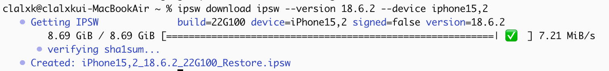
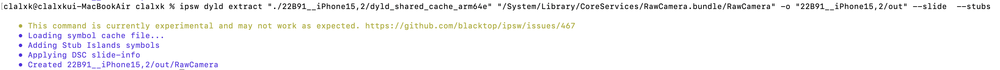
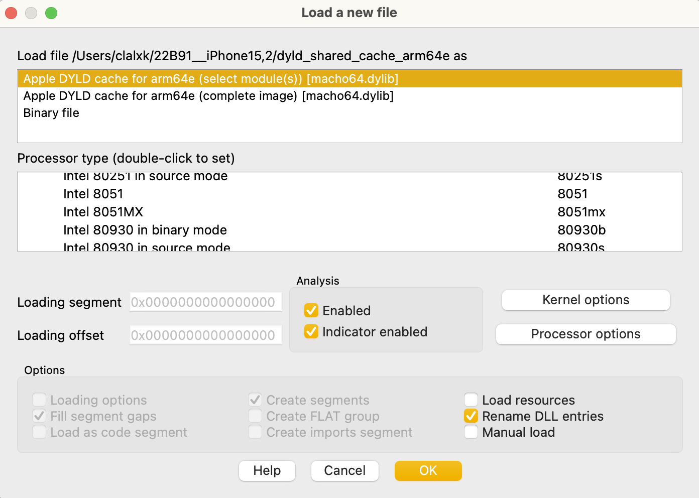
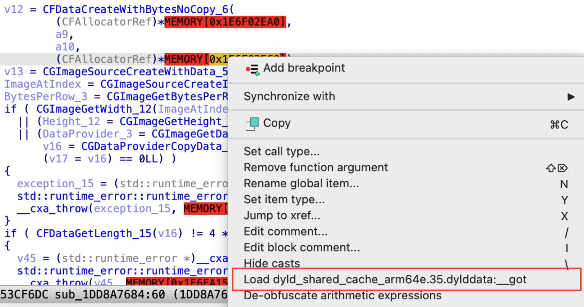
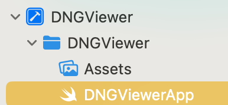
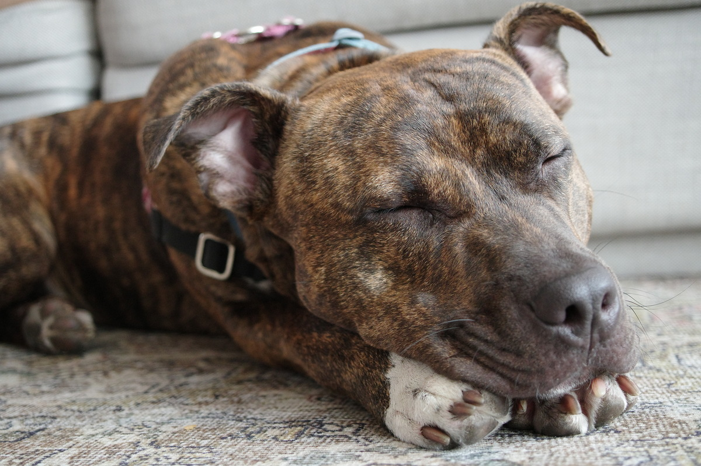

Hello~ After finishing the macOS series, we’re back this time with **ImageIO**.

On **August 20th**, a vulnerability was discovered in the ImageIO framework used by iOS, macOS, and iPadOS.

It was reportedly exploited in the wild to target specific individuals — let’s analyze what kind of vulnerability it was!

Shall we begin? 😎

---

# 0. [ImageIO](https://developer.apple.com/documentation/imageio)

**ImageIO** is Apple’s **image processing framework** used across macOS, iOS, and iPadOS.

It provides APIs for **reading, writing, accessing metadata, compression, and decoding**

for a wide range of image formats. It serves as the image processing backend for many system apps and features — including **Core Graphics**, **Photos**, **Preview**, **Safari**, **Messages**, **AirDrop**, **Mail**, and **iCloud.**

# 1. CVE-2025-43300


This vulnerability is an **Out-of-Bounds Write** in the JPEG Lossless (`SOF3`) decoder

(`CDNGLosslessJpegUnpacker`) of Apple’s ImageIO framework, specifically within **RawCamera**.

It occurs when the DNG file’s TIFF tag (`SamplesPerPixel`) does **not match** the number of components declared in the internal JPEG stream — leading to incorrect loop boundaries and thus a buffer overwrite.

It was patched in **iOS 18.6.2**, released on **August 20, 2025**.

- Vulnerable version: **iOS 18.6.1**
- Patched version: **iOS 18.6.2**

We first wanted to identify **where the patch was applied**.

Using the public project [**ipsw-diffs**](https://github.com/blacktop/ipsw-diffs/tree/main),

we compared the binaries between **18.6.1** and **18.6.2**.


Everything else remained unchanged — only **RawCamera** was modified.

**RawCamera**

> /System/Library/CoreServices/RawCamera.bundle/RawCamera
> 

```bash
-1738.140.3.0.0
-  __TEXT.__text: 0x1e2d70
-  __TEXT.__auth_stubs: 0x1850
+1738.140.3.0.11
+  __TEXT.__text: 0x1e3470
+  __TEXT.__auth_stubs: 0x1870
   __TEXT.__objc_methlist: 0x16e4
   __TEXT.__const: 0x15326
-  __TEXT.__gcc_except_tab: 0x2d440
+  __TEXT.__gcc_except_tab: 0x2d588
   __TEXT.__oslogstring: 0xec0
   __TEXT.__cstring: 0xee23
   __TEXT.__dof_RawCamera: 0x8f7
-  __TEXT.__unwind_info: 0xb1d0
+  __TEXT.__unwind_info: 0xb1e8
   __TEXT.__eh_frame: 0x278
   __TEXT.__objc_classname: 0x4b9
   __TEXT.__objc_methname: 0x3918
   __TEXT.__objc_methtype: 0xdd3
   __TEXT.__objc_stubs: 0x2da0
-  __DATA_CONST.__got: 0x9b0
+  __DATA_CONST.__got: 0x9c8
   __DATA_CONST.__const: 0x2a18
   __DATA_CONST.__objc_classlist: 0x1e0
   __DATA_CONST.__objc_catlist: 0x20
   __DATA_CONST.__objc_imageinfo: 0x8
   __DATA_CONST.__objc_selrefs: 0xcf8
   __DATA_CONST.__objc_superrefs: 0xf0
-  __DATA_CONST.__objc_arraydata: 0x3948
-  __AUTH_CONST.__auth_got: 0xc40
+  __DATA_CONST.__objc_arraydata: 0x3950
+  __AUTH_CONST.__auth_got: 0xc50
   __AUTH_CONST.__const: 0x35978
   __AUTH_CONST.__cfstring: 0x18080
   __AUTH_CONST.__objc_const: 0x48b0
-  __AUTH_CONST.__objc_arrayobj: 0x570
-  __AUTH_CONST.__objc_intobj: 0x39f0
+  __AUTH_CONST.__objc_arrayobj: 0x588
+  __AUTH_CONST.__objc_intobj: 0x3a20
   __AUTH_CONST.__objc_doubleobj: 0x480
   __AUTH_CONST.__objc_dictobj: 0x4d58
   __AUTH_CONST.__objc_floatobj: 0xc0

   - /System/Library/Frameworks/UniformTypeIdentifiers.framework/UniformTypeIdentifiers
   - /System/Library/PrivateFrameworks/AppleJPEG.framework/AppleJPEG
   - /System/Library/PrivateFrameworks/AppleJPEGXL.framework/AppleJPEGXL
+  - /System/Library/PrivateFrameworks/CMPhoto.framework/CMPhoto
   - /System/Library/PrivateFrameworks/CoreAnalytics.framework/CoreAnalytics
   - /System/Library/PrivateFrameworks/MobileAsset.framework/MobileAsset
   - /usr/lib/libSystem.B.dylib

   - /usr/lib/libobjc.A.dylib
   - /usr/lib/libxml2.2.dylib
   - /usr/lib/libz.1.dylib
-  UUID: 1BE38EB6-51C0-3069-A50F-CA3B000E0847
-  Functions: 6433
-  Symbols:   781
+  UUID: AF5B7B35-3549-329B-B706-F877FA8DF849
+  Functions: 6435
+  Symbols:   786
   CStrings:  7487
 
Symbols:
+ _CMPhotoDecompressionContainerCreateImageForIndex
+ _CMPhotoDecompressionContainerGetImageCount
+ _CMPhotoDecompressionSessionCreate
+ _CMPhotoDecompressionSessionCreateContainer
+ _CVPixelBufferGetDataSize
+ _kCMPhotoContainerFormatString_JFIF
+ _kCMPhotoDecompressionContainerOption_AllowedFormatsAndCodecs
+ _kCMPhotoDecompressionOption_OutputPixelFormat
- _CGImageGetBytesPerRow
- _CGImageGetHeight
- _CGImageGetWidth
```

Since the diff does not show code-level changes, we moved to **IDA Pro** for deeper inspection.




We used **ipsw** to download both 18.6.1 and 18.6.2 firmwares.





The `dyld_shared_cache` is a cache file that bundles frequently used system libraries and frameworks together for faster loading during iOS/macOS boot. It contains optimized versions of `.dylibs` and frameworks, allowing faster app startup and reduced memory usage.
Since the actual system loads these cached binaries, we can extract RawCamera directly from the cache for comparison and analysis.

Although it can also be extracted using `ipsw dyld extract`, in this research, we analyzed it

directly by loading `dyld_shared_cache` in IDA.

## 1.1 bindiff


The binary was exported in **BinExport** format for diffing.


Due to limited space, we referred to public analysis from Quarkslab
: [https://blog.quarkslab.com/patch-analysis-of-Apple-iOS-CVE-2025-43300.html](https://blog.quarkslab.com/patch-analysis-of-Apple-iOS-CVE-2025-43300.html)

Out of six modified functions, two — `sub_1DD8A7684` and `sub_1DD95DC1C` — were significantly changed. We focused our analysis on these two.

## 1.2 Analysis




We loaded `dyld_shared_cache` extracted from ipsw for analysis:
*→ Apple DYLD Cache for arm64e (select module(s)) → RawCamera*




A new **pixel buffer size verification step** was added.

See the following section for detailed code comparison.

### **Code Analysis**

`sub_1DD8A7684` → `sub_1DD8A76DC` 

```cpp
# iOS 18.6.1 G90

void __fastcall sub_1DD8A7684(...)
// shortened: legacy CGImage path
{
    v13 = CGImageSourceCreateWithData(...);
    ImageAtIndex = CGImageSourceCreateImageAtIndex(v13, 0, 0);
    BytesPerRow = CGImageGetBytesPerRow(ImageAtIndex);
    if (CFDataGetLength(data) != 4 * width * height)
        throw RawCameraException;
    ...
}
```

```c
# iOS 18.6.2 G100
void __fastcall sub_1DD8A76DC(...)
// shortened: new CMPhoto + CVPixelBuffer path
{
    CMPhotoDecompressionSessionCreate(...);
    CMPhotoDecompressionContainerCreateImageForIndex(...);
    BytesPerRow = CVPixelBufferGetBytesPerRow(buf);
    DataSize = CVPixelBufferGetDataSize(buf);
    if (DataSize != expected)
        throw RawCameraException;
    ...
}
```

### Key Differences

1. **CGImage → CMPhoto + CVPixelBuffer**
    - **G90 (18.6.1):**
        
        Uses CoreGraphics pipeline (`CGImageSourceCreateImageAtIndex` + `CGDataProviderCopyData`)
        
        and directly iterates raw `CFData` bytes.
        
    - **G100 (18.6.2):**
        
        Introduces **CMPhoto** decompression pipeline:
        
        `CMPhotoDecompressionSessionCreate → CMPhotoDecompressionContainerCreateImageForIndex` → `CVPixelBuffer`.
        
        Accesses pixels through **CVPixelBufferLockBaseAddress()**, ensuring safer memory handling.
        
2. **Buffer Size Validation Added**
    
    ```cpp
    if (CFDataGetLength(data) != 4 * width * height) throw RawCameraException;
    ```
    
    - **Before:** Only checked `CFDataGetLength() == 4 * width * height`.
        
        This ignored row padding (`bytesPerRow`) and format variations.
        
    
    ```cpp
    BytesPerRow = CVPixelBufferGetBytesPerRow(buf);
    DataSize    = CVPixelBufferGetDataSize(buf);
    
    // expected = f(width, height)  // sub_1DD8A8C14
    // bpp = 4                       // v68=4 → sub_1DD8A8C7C
    if (DataSize != expected) throw RawCameraException;
    ```
    
    - **After:** Validates using `CVPixelBufferGetDataSize()` against an internally computed expected value (considering stride).
        
        → Prevents overrun caused by underestimated buffer size.
        
3. **Pixel Channel Order**
    - **Old:** Assumed RGB order, manual pointer increments.
    - **New:** Explicitly treats buffer as BGRA, reading channels in fixed offsets (B→G→R).

---

**Summary:**

The patch migrated from **CoreGraphics raw byte decoding** to a **CoreMedia Photo pipeline**

and added **explicit data size/stride checks**, eliminating unbounded writes from mismatched DNG metadata.

Through the analysis of the modified code, we were able to understand the general behavior of the function.

In summary, **G90 (iOS 18.6.1)** decodes the image through the **CGImage** path and directly iterates over the **CFData** buffer. The verification process only checks two things — the **match of width and height**, and whether **CFDataGetLength() == 4 × W × H** — while actual memory access is performed using a **row-based offset (**`BytesPerRow`**)**. Because of this, for certain images (depending on color space, subsampling, or row padding), the validation may **pass successfully, but the actual access can exceed the bounds of CFData**.

In contrast, **G100 (iOS 18.6.2)** fixes this issue by switching the decoding pipeline from **CGImage → CMPhoto (JFIF only) → CVPixelBuffer**, and comparing the **actual total buffer size (**`CVPixelBufferGetDataSize`**)** against an **expected value** computed internally based on width, height, and other parameters.

---

### Root Cause

(Analyzed based on the G90 version)

During analysis, we observed that `sub_1DD8A7684` makes a function call through a **vtable**.

In C++, every object typically begins with a **vptr (virtual table pointer)**.

Virtual function calls are made at runtime through that pointer — something like `this->vptr[slot]`.

However, since the RawCamera binary is **fully stripped**, only addresses are visible,

making direct analysis difficult.

```cpp
[ex]
(*(*this)+0xE0)(this, buf, w, h)
```

which conceptually means:

```cpp
[ex]
this->vptr->unpack_lossless(this, buf, w, h)
```

To make it more readable and traceable, I defined the vtable as a structure (class) in IDA using an IDAPython script.

The script did the following:

1. Parse the vtable and create a corresponding struct.
2. Apply `struct CDNGLosslessJpegUnpacker *this` as the first parameter for all virtual functions.

Once this is done, the call expression `(*(*this)+0xE0)(this)` appears as `this->vptr->fn_028(this, …)`, and fields like `this->field_d8` become explicit — making slot mapping and call tracing much easier.

Now, let’s identify where the vulnerable function is actually invoked in the call tree.


Filtering for “Lossless” quickly reveals the target class

`CDNGLosslessJpegUnpacker`.

Following the references leads to the function `sub_1DD95DE88`.

**Detailed Code (sub_1DD95DE88)**

```cpp
void __fastcall sub_1DD95DE88(os_signpost_id_t a1, __int64 a2, __int64 a3, __int64 a4)
{
  .
  .
  .
  
  if ( *(_DWORD *)(a1 + 216)
    || (*(unsigned int (__fastcall **)(os_signpost_id_t))(*(_QWORD *)a1 + 224LL))(a1) == 2
    || (v12 = *(_QWORD *)(a1 + 240) - *(_QWORD *)(a1 + 232), v12 == 4) )
  {
    sub_1DD9009D4(a1, a2, a3, a4);
  }
  else
  {
    v14 = *(_DWORD *)(a1 + 44);
    v13 = *(_DWORD *)(a1 + 48);
    v15 = *(_DWORD *)(a1 + 224);
    v16 = *(_DWORD *)(a1 + 228);
    *(_QWORD *)&v35 = v12 >> 2;
    sub_1DD8731E0(&v36, &v35);
    if ( *(_QWORD *)(a1 + 240) - *(_QWORD *)(a1 + 232) != *(_QWORD *)(a1 + 264) - *(_QWORD *)(a1 + 256)
      || (unsigned int)(v14 - 100000) < 0xFFFE7961
      || (unsigned int)(v13 - 100000) < 0xFFFE7961
      || v15 - 100000 < 0xFFFE7961
      || v16 - 100000 < 0xFFFE7961
      || (v28 = v11, v17 = (unsigned int)v36, v36 >= 20000) )
    {
      exception_15 = (std::runtime_error *)__cxa_allocate_exception_15(0x10uLL);
      std::runtime_error::runtime_error(exception_15, "RawCameraException");
      __cxa_throw(exception_15, MEMORY[0x1E6FA15F0], MEMORY[0x1E6FA1480]);
    }
    v29 = a4;
    if ( (((v13 + v16 - 1) / v16) >> (*(_DWORD *)(a1 + 216) != 0)) * ((v14 + v15 - 1) / v15) != v36 )
    {
      v27 = (std::runtime_error *)__cxa_allocate_exception_15(0x10uLL);
      std::runtime_error::runtime_error(v27, "RawCameraException");
      __cxa_throw(v27, MEMORY[0x1E6FA15F0], MEMORY[0x1E6FA1480]);
    }
    group = dispatch_group_create();
    v30 = dispatch_queue_create("Lossless DNG Tile Unpacker Queue", MEMORY[0x1E6FA52F0]);
```

The function performs **three checks**:

1. `[this+0xD8] != 0`
2. `vtable[28](this) == 2`
3. `[this+0xF0] - [this+0xE8] == 4`

If **any** of these conditions is true, it calls `sub_1DD9009D4()` and **exits safely**.

Otherwise, it proceeds to the **“Tile Queue”** path — which includes the vulnerable function chain.

```c
; Check 1
LDR   W8, [X23,#0xD8]
CBNZ  W8, loc_1DD95DF78

; Check 2
LDR   X16, [X23]
AUTDA X16, X17
LDR   X8, [X16,#0xE0]!  ; vtable[0xE0/8] -> slot 28
MOV   X0, X23
BLRAA X8, X17
CMP   W0, #2
BEQ   loc_1DD95DF78

; Check 3
LDP   X9, X8, [X23,#0xE8]
SUB   X8, X8, X9
CMP   X8, #4
B.NE  loc_1DD95E008
```

If none of the above branches are taken, the function reaches a section where a dispatch queue named `"Lossless DNG Tile Unpacker Queue"` is created — this is the path that eventually leads to the vulnerable unpacking logic.

```
// sub_1DD95DE88 simplified
if ([this+0xD8] != 0
 || vtable[28](this) == 2
 || ([this+0xF0]-[this+0xE8]) == 4)
{
    sub_1DD9009D4(...); // safe path
} else {
    // Vulnerable path
    dispatch_group_create();
    dispatch_queue_create("Lossless DNG Tile Unpacker Queue", ...);
    sub_1DD95E410 → sub_1DD95DCD8 → sub_1DD95E4A4 or sub_1DD95B198
    → sub_1DD95EA64 → sub_1DDA4EF58
}
```

Thus, when all three conditions fail,
the code spawns a tile-based decompression queue that ultimately triggers the vulnerable unpack routine.

### What is the Tile Queue?

The **tile queue** splits a large image into small rectangular **tiles** (TileWidth × TileLength).

Each tile is decoded, color-corrected, and placed in the output buffer.

The vulnerable path processes each tile independently but assumes metadata consistency between **SamplesPerPixel** and **NumComponents** — which, when mismatched, causes a buffer overflow.

**Simplified Call Tree**

```c
0x1DD95DE88
    0x1DD95E410
        0x1DD95DCD8
            0x1DD95E4A4 or 0x1DD95B198
                0x1DD95EF54 or 0x1DD95EA64
                    0x1DDA4EF58
```

---


Boom 💥 — and with a clearer head, let’s continue ><

---

Before diving into the PoC,

let’s briefly recap the **background concepts** necessary to understand this behavior.

---

## Background Concepts

### 1. Pixels, Channels (Samples), and Bit Depth

- **Pixel**: The smallest visual unit of an image.
- **Channel (Sample)**: A single numeric component representing one aspect of a pixel (R, G, B, etc.).
    
    → `SamplesPerPixel` = number of channels per pixel
    
    → `BitsPerSample` = number of bits used to represent each channel
    

Examples:

| Type | SamplesPerPixel | BitsPerSample | Bytes per Pixel |
| --- | --- | --- | --- |
| Grayscale | 1 | 8 | 1 |
| RGB 8bpc | 3 | 8 | 3 |
| RGBA 16bpc | 4 | 16 | 8 |

These metadata values determine **buffer size**, **stride (bytes per row)**, and **loop boundaries** in decompression.

### 2. DNG

DNG (Digital Negative) is **Adobe’s RAW image container format**, built upon **TIFF/EP** structure.

It stores raw sensor data (e.g., Bayer CFA), thumbnails, and color correction metadata.

Key tags:

- **RowsPerStrip / TileWidth / TileLength**
- **StripOffsets / TileOffsets**
- **StripByteCounts / TileByteCounts**
- **SamplesPerPixel / BitsPerSample**

The decoder uses these values to calculate

**buffer offsets**, **BytesPerRow**, and **total data size** for writing.

### 3. RAW and Compression

RAW data is unprocessed, high bit-depth sensor output (e.g., 12/14/16 bits per pixel, typically 1 sample per pixel).

To save space, DNG supports **lossless compression**, most notably **JPEG Lossless (SOF3)**.

- Compression = 1 → Uncompressed
- Compression = 7 → JPEG (Baseline or Lossless)
- Compression = 8 → Deflate (ZIP)
- Compression = 34892 → JPEG Baseline (Lossy)

✅ The vulnerability resides in the **Lossless JPEG (SOF3)** decoding path.

---

## 1.3 PoC


Normal DNG files typically **do not** reach the vulnerable path.

However, by tweaking metadata tags (for example, `SamplesPerPixel`) so that the initial checks pass, we can force the code path to invoke the vulnerable function.

I ran this on my phone without updating it (because I had no space 😂).


My device is on **iOS 18.1.1**.



Using the small DNG viewer app above, I loaded the PoC DNG and observed the following:

```c
import SwiftUI
import UniformTypeIdentifiers
import Combine
import UIKit
import CoreImage
import CoreImage.CIFilterBuiltins

@main
struct DNGViewerApp: App {
    var body: some Scene {
        WindowGroup {
            ContentView()
        }
    }
}

final class RawRenderer: ObservableObject {
    private let context = CIContext(options: [
        .cacheIntermediates: false
    ])

    @Published var image: UIImage?
    @Published var log: String = ""

    func render(from url: URL) {
        log = "Loading: \(url.lastPathComponent)\n"
        
        guard let raw = CIRAWFilter(imageURL: url, options: [:]) else {
            log += "CIRAWFilter unavailable or failed to open URL\n"
            return
        }
  
        guard let ciImage = raw.value(forKey: kCIOutputImageKey) as? CIImage else {
            log += "Failed to get CIImage\n"; return
        }
        let extent = ciImage.extent.integral
        guard let cg = context.createCGImage(ciImage, from: extent) else {
            log += "Failed to create CGImage\n"; return
        }
        image = UIImage(cgImage: cg)
        log += "Rendered: \(Int(extent.width))×\(Int(extent.height))\n"
    }
}

struct ContentView: View {
    @StateObject var renderer = RawRenderer()
    @State private var showPicker = false

    var body: some View {
        VStack(spacing: 12) {
            if let img = renderer.image {
                Image(uiImage: img)
                    .resizable()
                    .scaledToFit()
                    .background(Color.black.opacity(0.05))
                    .cornerRadius(12)
                    .padding(.horizontal)
            } else {
                Text("Open a DNG").foregroundColor(.secondary)
                    .padding(.top, 40)
            }

            HStack {
                Button("Open DNG") { showPicker = true }
                .buttonStyle(.borderedProminent)

                Button("Clear") { renderer.image = nil; renderer.log = "" }
                .buttonStyle(.bordered)
            }

            ScrollView {
                Text(renderer.log)
                    .font(.system(.caption, design: .monospaced))
                    .frame(maxWidth: .infinity, alignment: .leading)
                    .padding()
                    .background(Color.black.opacity(0.03))
                    .cornerRadius(8)
            }
            .frame(maxHeight: 160)
            .padding(.horizontal)
        }
        .sheet(isPresented: $showPicker) {
            DocumentPicker { url in
                if let url { renderer.render(from: url) }
            }
        }
    }
}

struct DocumentPicker: UIViewControllerRepresentable {
    var onPick: (URL?) -> Void

    func makeCoordinator() -> Coordinator { Coordinator(onPick: onPick) }
    func makeUIViewController(context: Context) -> UIDocumentPickerViewController {
        // DNG UTI는 전통적으로 "com.adobe.raw-image".
        // iOS 14+에선 UTType.image(또는 item)로 열어도 무방.
        let vc = UIDocumentPickerViewController(forOpeningContentTypes: [
            UTType(importedAs: "com.adobe.raw-image"), // DNG
            .image, .item
        ])
        vc.allowsMultipleSelection = false
        vc.delegate = context.coordinator
        return vc
    }
    func updateUIViewController(_ uiViewController: UIDocumentPickerViewController, context: Context) {}

    final class Coordinator: NSObject, UIDocumentPickerDelegate {
        let onPick: (URL?) -> Void
        init(onPick: @escaping (URL?) -> Void) { self.onPick = onPick }
        func documentPicker(_ controller: UIDocumentPickerViewController, didPickDocumentsAt urls: [URL]) {
            onPick(urls.first)
        }
        func documentPickerWasCancelled(_ controller: UIDocumentPickerViewController) { onPick(nil) }
    }
}

```


Here is the image that was used.

Using this viewer to load the PoC DNG file, I observed the following details:

- `CLosslessJpegUnpacker` at `0x1DD902E78`
- `CDNGLosslessJpegUnpacker` at `0x1DD95DE88`
- `CDNGLosslessJpegUnpacker::unpackTile` at `0x1DD95B198`
- `CLosslessJpegRestartUnpacker` at `0x1DD95F784`

**Trigger conditions:**

- JPEG marker: **SOF3 (Lossless JPEG)** present
- DHT (Define Huffman Table(s)) present
- SOS (Start Of Scan) valid
- **BitsPerSample = 16**
- **SamplesPerPixel = 2** (TIFF tag)
- **NumComponents = 1** (SOF3/JPEG stream)

The root cause is a mismatch between how the loop termination condition is computed versus how the inner loop performs writes:


- The outer pixel loop is bounded by **NumComponents** = 1 (so it expects one component per pixel),
- but the inner write routine assumes **SamplesPerPixel** = 2 and writes **two 16-bit samples per pixel**, advancing the destination pointer as if there are two samples per pixel.

As a result, each row ends up writing **twice** the expected number of bytes → **out-of-bounds writes** occur at the row boundary.

Following the flow, you can trace the chain like:

```
0x1DD95B198 → 0x1DD95B6C4 → 0x1DD95B8DC → 0x1DD95B944 → 0x1DD95BCCC
```

(Trace through these offsets to map how the pixel decoder iterates and performs the writes.)



The sample image I used is from DPReview:

[https://www.dpreview.com/sample-galleries/4949897610/pentax-k-3-mark-iii-sample-gallery/1638788346](https://www.dpreview.com/sample-galleries/4949897610/pentax-k-3-mark-iii-sample-gallery/1638788346)

(Used that image as a starting point to craft a DNG variant for the PoC.)

### Summary
In short, **CVE-2025-43300** is an OOB Write caused by a mismatch between TIFF metadata and the internal JPEG Lossless stream:

- `SamplesPerPixel = 2` (DNG tag) but `NumComponents = 1` (SOF3 stream)
- Loop termination is computed against **components(=1)** but the inner write loop writes **16-bit × 2 samples per pixel**, causing **double writes per row** → **OOB write**.

Using `dyld_shared_cache` diffs and vtable typeing, I traced the vulnerable path to the **CDNGLosslessJpegUnpacker → Tile Unpacker** and identified the exact trigger conditions and dataflow.

Apple patched the issue in **iOS 18.6.2** by:

1. Switching from the fragile `CGImage` + `CFData` raw traversal pipeline to a **CMPhoto → CVPixelBuffer** pipeline (more robust, standardized pixel buffer APIs).
2. Adding explicit **data size / stride validation** (compare `CVPixelBufferGetDataSize()` to an internally computed expected value that takes stride into account).
3. Changing pixel access order/assumptions to match the actual buffer layout.

If you are on a real device, update to **iOS 18.6.2 or later** — the patched code prevents attempts to reach this unsafe write path. (I should update mine too — I’ll do that soon 😂)

That wraps up this short research note — the path was a fun exercise in dyld cache extraction, vtable reconstruction, and low-level JPEG/DNG decoding logic. I learned a lot following the call chain and seeing how a subtle metadata mismatch can cause memory corruption.

### Reference

https://github.com/b1n4r1b01/n-days/blob/main/CVE-2025-43300.md

https://blog.quarkslab.com/patch-analysis-of-Apple-iOS-CVE-2025-43300.html

https://github.com/DarkNavySecurity/PoC/tree/main/CVE-2025-43300

https://github.com/msuiche/elegant-bouncer