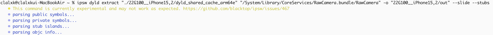
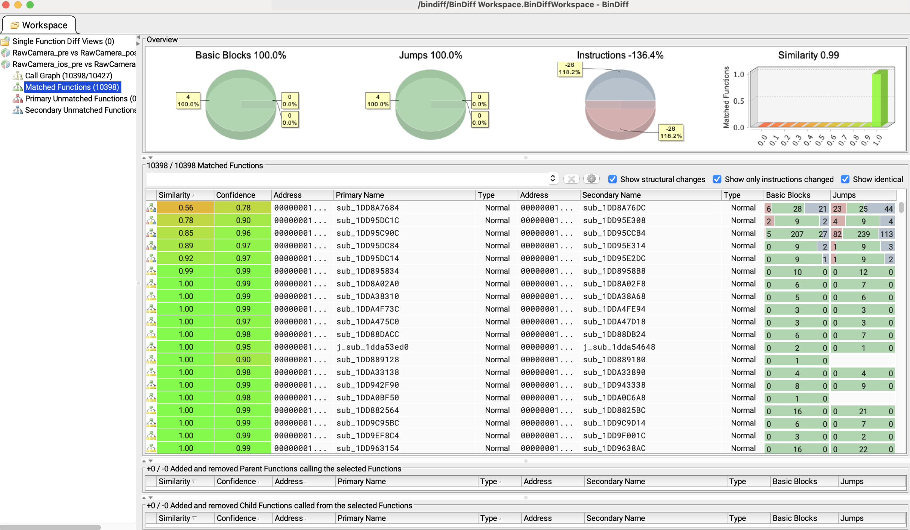
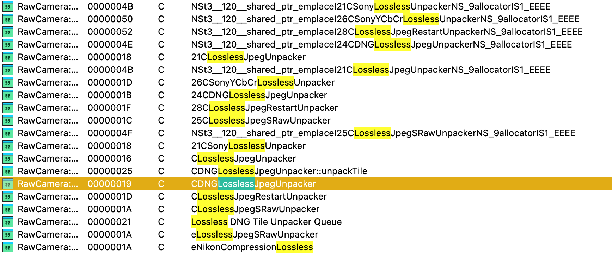
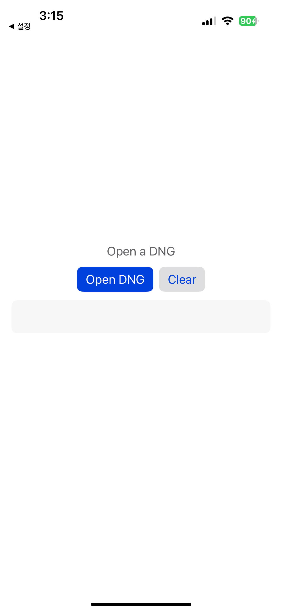

안녕하세요~ MacOS 시리즈를 마치고 이번엔 ImageIO로 돌아왔습니다.

오늘은 지난 8월 20일, iOS/MacOS/iPadOS 등에서 사용되는 ImageIO 프레임워크에서 발견된 취약점으로, 특정 인물을 타겟으로 악용된 게 발견되어 화제가 되었는데요. 어떤 취약점이었는지 분석해보도록 하겠습니다! 

자.. 그럼 시작해볼까요.. !!!  

---

# 0. [ImageIO](https://developer.apple.com/documentation/imageio)

ImageIO는 Apple의 macOS, iOS, iPadOS 등에서 사용되는 **이미지 처리 프레임워크**로, 다양한 이미지 형식의 읽기, 쓰기, 메타데이터 접근, 압축 및 디코딩을 수행합니다. Apple의 Core Graphics 및 Photos, Preview, Safari, Messages, AirDrop, Mail, iCloud와 같은 시스템 앱과 기능의 이미지 처리 백엔드로 폭넓게 사용되고 있습니다.

# 1. CVE-2025-43300


해당 취약점은 Apple ImageIO 프레임워크인 RawCamera의 JPEG Lossless (`SOF3`) 디코더(`CDNGLosslessJpegUnpacker`)에서 발견된 OOB Write 취약점으로, DNG 파일의 TIFF 태그(`SamplesPerPixel`)와 내부 JPEG 스트림의 component 수가 불일치할 때 잘못된 루프 상한 때문에 출력 버퍼를 넘겨 쓰게 됩니다. 

지난 8월 20일에 iOS 18.6.2 버전으로 업데이트(패치) 되었습니다.

- 취약점이 발생한 버전: 18.6.1
- 패치 된 버전: 18.6.2


우선 18.6.2 버전에서 어느 부분이 패치되었는지 확인하고자 합니다.

ipsw 버전 별로 diff한 결과를 올려주는 [**ipsw-diffs**](https://github.com/blacktop/ipsw-diffs/tree/main)를 통해 18.6.1과 18.6.2의 diff 내용을 대략적으로 확인해봤습니다.

**RawCamera**

> /System/Library/CoreServices/RawCamera.bundle/RawCamera
> 

```bash
-1738.140.3.0.0
-  __TEXT.__text: 0x1e2d70
-  __TEXT.__auth_stubs: 0x1850
+1738.140.3.0.11
+  __TEXT.__text: 0x1e3470
+  __TEXT.__auth_stubs: 0x1870
   __TEXT.__objc_methlist: 0x16e4
   __TEXT.__const: 0x15326
-  __TEXT.__gcc_except_tab: 0x2d440
+  __TEXT.__gcc_except_tab: 0x2d588
   __TEXT.__oslogstring: 0xec0
   __TEXT.__cstring: 0xee23
   __TEXT.__dof_RawCamera: 0x8f7
-  __TEXT.__unwind_info: 0xb1d0
+  __TEXT.__unwind_info: 0xb1e8
   __TEXT.__eh_frame: 0x278
   __TEXT.__objc_classname: 0x4b9
   __TEXT.__objc_methname: 0x3918
   __TEXT.__objc_methtype: 0xdd3
   __TEXT.__objc_stubs: 0x2da0
-  __DATA_CONST.__got: 0x9b0
+  __DATA_CONST.__got: 0x9c8
   __DATA_CONST.__const: 0x2a18
   __DATA_CONST.__objc_classlist: 0x1e0
   __DATA_CONST.__objc_catlist: 0x20
   __DATA_CONST.__objc_imageinfo: 0x8
   __DATA_CONST.__objc_selrefs: 0xcf8
   __DATA_CONST.__objc_superrefs: 0xf0
-  __DATA_CONST.__objc_arraydata: 0x3948
-  __AUTH_CONST.__auth_got: 0xc40
+  __DATA_CONST.__objc_arraydata: 0x3950
+  __AUTH_CONST.__auth_got: 0xc50
   __AUTH_CONST.__const: 0x35978
   __AUTH_CONST.__cfstring: 0x18080
   __AUTH_CONST.__objc_const: 0x48b0
-  __AUTH_CONST.__objc_arrayobj: 0x570
-  __AUTH_CONST.__objc_intobj: 0x39f0
+  __AUTH_CONST.__objc_arrayobj: 0x588
+  __AUTH_CONST.__objc_intobj: 0x3a20
   __AUTH_CONST.__objc_doubleobj: 0x480
   __AUTH_CONST.__objc_dictobj: 0x4d58
   __AUTH_CONST.__objc_floatobj: 0xc0

   - /System/Library/Frameworks/UniformTypeIdentifiers.framework/UniformTypeIdentifiers
   - /System/Library/PrivateFrameworks/AppleJPEG.framework/AppleJPEG
   - /System/Library/PrivateFrameworks/AppleJPEGXL.framework/AppleJPEGXL
+  - /System/Library/PrivateFrameworks/CMPhoto.framework/CMPhoto
   - /System/Library/PrivateFrameworks/CoreAnalytics.framework/CoreAnalytics
   - /System/Library/PrivateFrameworks/MobileAsset.framework/MobileAsset
   - /usr/lib/libSystem.B.dylib

   - /usr/lib/libobjc.A.dylib
   - /usr/lib/libxml2.2.dylib
   - /usr/lib/libz.1.dylib
-  UUID: 1BE38EB6-51C0-3069-A50F-CA3B000E0847
-  Functions: 6433
-  Symbols:   781
+  UUID: AF5B7B35-3549-329B-B706-F877FA8DF849
+  Functions: 6435
+  Symbols:   786
   CStrings:  7487
 
Symbols:
+ _CMPhotoDecompressionContainerCreateImageForIndex
+ _CMPhotoDecompressionContainerGetImageCount
+ _CMPhotoDecompressionSessionCreate
+ _CMPhotoDecompressionSessionCreateContainer
+ _CVPixelBufferGetDataSize
+ _kCMPhotoContainerFormatString_JFIF
+ _kCMPhotoDecompressionContainerOption_AllowedFormatsAndCodecs
+ _kCMPhotoDecompressionOption_OutputPixelFormat
- _CGImageGetBytesPerRow
- _CGImageGetHeight
- _CGImageGetWidth
```

다른 부분은 바뀐 게 없고 **RawCamera**만 수정되었습니다. 

코드 레벨이 보이지 않아서 ida를 통해 확인해보려고 합니다.


ipsw를 사용해서 18.6.1 과 18.6.2 버전을 다운받아 사용했습니다. 




`dyld_shared_cache` 는 iOS/macOS가 부팅 시 **자주 쓰는 시스템 라이브러리·프레임워크를 한 덩어리로 미리 묶어 둔 캐시 파일**입니다. 각종 `.dylib` / Framework들이 **최적화**된 상태로 들어 있어 앱 시작이 빨라지고 메모리 사용이 줄어드는 특징을 가지고 있습니다. 실제 기기에서 로드되는 코드가 바로 이 캐시 안의 이미지들이라, 캐시에서 RawCamera 이미지를 추출하여 분석/비교할 수 있습니다.

이렇게 ipsw dyld extract을 통해 RawCamera를 추출할 수도 있지만, 본 연구글에서는 ida에서 바로 dyld_shared_cache를 로드하여 분석하겠습니다.

## 1.1 bindiff


바이너리를 BinExport 포맷으로 추출하여 디핑을 진행했습니다.



용량이 부족하여 bindiff는 공개된 분석 글의 내용을 참고했습니다. 
출처: [https://blog.quarkslab.com/patch-analysis-of-Apple-iOS-CVE-2025-43300.html](https://blog.quarkslab.com/patch-analysis-of-Apple-iOS-CVE-2025-43300.html)

변경사항이 있던 것은 6개의 함수였지만, 이 중에서도 크게 수정된 함수는 `sub_1DD8A7684` 와 `sub_1DD95DC1C` 였습니다. 이 두개의 함수를 중심으로 분석해보겠습니다. 

## 1.2 Analysis


ipsw에서 추출한 `dyld_shared_cache` 를 활용하여 분석하고자 합니다.

*Apple DYLD Cache for arm64e (select module(s)) → RawCamera* 


이미지 픽셀 버퍼사이즈를 검증하는 단계가 추가되었습니다.  

상세 코드는 아래를 참고해주세요.

### 코드 분석

`sub_1DD8A7684` → `sub_1DD8A76DC` 

```cpp
# iOS 18.6.1 G90

void __fastcall sub_1DD8A7684(
        _QWORD *a1,
        __int64 a2,
        unsigned int a3,
        __int64 a4,
        unsigned int a5,
        int a6,
        int a7,
        int a8,
        const UInt8 *a9,
        CFIndex a10)
{
  .
  .
  .
  
  v12 = CFDataCreateWithBytesNoCopy_6(
          (CFAllocatorRef)*kCFAllocatorDefault_ptr,
          a9,
          a10,
          (CFAllocatorRef)*kCFAllocatorNull_ptr);
  v13 = CGImageSourceCreateWithData_5(v12, 0LL);
  ImageAtIndex = CGImageSourceCreateImageAtIndex(v13, 0LL, 0LL);
  BytesPerRow_3 = CGImageGetBytesPerRow_3(ImageAtIndex);
  if ( CGImageGetWidth_12(ImageAtIndex) != a5
    || (Height_12 = CGImageGetHeight_12(ImageAtIndex), Height_12 != a6)
    || (DataProvider_3 = CGImageGetDataProvider_3(ImageAtIndex),
        v16 = CGDataProviderCopyData_2(DataProvider_3),
        (v17 = v16) == 0LL) )
  {
    exception_15 = (std::runtime_error *)__cxa_allocate_exception_15(0x10uLL);
    std::runtime_error::runtime_error(exception_15, "RawCameraException");
    __cxa_throw(exception_15, `typeinfo for'std::runtime_error, std::runtime_error::~runtime_error);
  }
  if ( CFDataGetLength_15(v16) != 4 * a5 * a6 )
  {
    v45 = (std::runtime_error *)__cxa_allocate_exception_15(0x10uLL);
    std::runtime_error::runtime_error(v45, "RawCameraException");
    __cxa_throw(v45, `typeinfo for'std::runtime_error, std::runtime_error::~runtime_error);
  }
  v18 = operator new(0xCuLL);
  *(_QWORD *)v18 = 0LL;
  *((_DWORD *)v18 + 2) = 0;
  v19 = (float32x2_t *)operator new(0xCuLL);
  v20 = (float *)v19;
  v46 = v13;
  v47 = v12;
  v21 = (float64x2_t *)a1[231];
  v50 = a5;
  if ( a1[232] - (_QWORD)v21 < 0x11uLL )
  {
    v22 = 0LL;
    v23 = 0.0;
  }
  else
  {
    v22 = vcvt_f32_f64(*v21);
    *(float32x2_t *)v18 = v22;
    v23 = v21[1].f64[0];
    *((float *)v18 + 2) = v23;
  }
  v24 = (float32x2_t)vdup_n_s32(0x437F0000u);
  *v19 = vdiv_f32(v24, vsub_f32(v24, v22));
  v19[1].f32[0] = 255.0 / (float)(255.0 - v23);
  if ( a6 )
  {
    v52 = 0LL;
    v25 = 0;
    v26 = 0;
    if ( v50 >= a3 )
      v27 = a3;
    else
      v27 = v50;
    v49 = v17;
    do
    {
      v28 = (*(__int64 (__fastcall **)(_QWORD *))(*a1 + 40LL))(a1);
      BytePtr_16 = CFDataGetBytePtr_16(v17);
      if ( v50 )
      {
        v31 = &BytePtr_16[BytesPerRow_3 * v52];
        v32 = (_WORD *)(a2 + 2LL * (v25 + a8 + (v26 + a7) * a3) * v28);
        v33 = v50;
        do
        {
          LOBYTE(v30) = *v31;
          v34 = *((float *)v18 + 1);
          v35 = v20[1];
          v36 = (float)((float)LODWORD(v30) - *(float *)v18) * *v20;
          v37 = 255.0;
          if ( v36 <= 255.0 )
            v38 = v36;
          else
            v38 = 255.0;
          if ( v36 >= 0.0 )
            v39 = v38;
          else
            v39 = 0.0;
          *v32 = *((_WORD *)a1 + (unsigned int)(int)v39 + 156);// R channel: LUT[clamp((R - blackR) * gainR)] -> store 16-bit
          LOBYTE(v39) = v31[1];
          v40 = (float)((float)LODWORD(v39) - v34) * v35;
          if ( v40 <= 255.0 )
            v41 = v40;
          else
            v41 = 255.0;
          if ( v40 >= 0.0 )
            v42 = v41;
          else
            v42 = 0.0;
          v32[1] = *((_WORD *)a1 + (unsigned int)(int)v42 + 412);// G channel: LUT[clamp((G - blackG) * gainG)] -> store 16-bit
          LOBYTE(v42) = v31[2];
          v43 = (float)((float)LODWORD(v42) - *((float *)v18 + 2)) * v20[2];
          if ( v43 <= 255.0 )
            v37 = v43;
          if ( v43 >= 0.0 )
            v30 = v37;
          else
            v30 = 0.0;
          v32[2] = *((_WORD *)a1 + (unsigned int)(int)v30 + 668);// B channel: LUT[clamp((B - blackB) * gainB)] -> store 16-bit
          if ( ++v25 >= v27 )
          {
            v25 = 0;
            v32 = (_WORD *)(a2
                          + 2LL * (a8 + (++v26 + a7) * a3) * (*(unsigned int (__fastcall **)(_QWORD *))(*a1 + 40LL))(a1));
          }
          else
          {
            v32 += 3;
          }
          v31 += 4;
          --v33;
        }
        while ( v33 );
      }
      ++v52;
      v17 = v49;
    }
    while ( v52 != Height_12 );
  }
  operator delete(v20);
  operator delete(v18);
  if ( v17 )
    CFRelease_60(v17);
  if ( v47 )
    CFRelease_60(v47);
  if ( v46 )
    CFRelease_60(v46);
  if ( ImageAtIndex )
  {
    if ( ((vars8 ^ (2 * vars8)) & 0x4000000000000000LL) != 0 )
      __break(0xC471u);
    CFRelease_60(ImageAtIndex);
  }
}
```

```c
# iOS 18.6.2 G100

void __fastcall sub_1DD8A76DC(
        _QWORD *a1,
        __int64 a2,
        unsigned int a3,
        __int64 a4,
        unsigned int a5,
        unsigned int a6,
        int a7,
        int a8,
        const UInt8 *a9,
        CFIndex a10)
{
  .
  .
  .
  
    v13 = CFDataCreateWithBytesNoCopy_6(
          (CFAllocatorRef)*kCFAllocatorDefault_ptr_0,
          a9,
          a10,
          (CFAllocatorRef)*kCFAllocatorNull_ptr);
  if ( (unsigned int)CMPhotoDecompressionSessionCreate_1(v12, 0LL, &v73) )
  {
    exception_15 = (std::runtime_error *)__cxa_allocate_exception_15(0x10uLL);
    std::runtime_error::runtime_error(exception_15, "RawCameraException");
    __cxa_throw(
      exception_15,
      (struct type_info *)`typeinfo for'std::runtime_error,
      (void (__fastcall *)(void *))std::runtime_error::~runtime_error);
  }
  v74[5] = *kCMPhotoDecompressionContainerOption_AllowedFormatsAndCodecs_ptr;
  v74[3] = *kCMPhotoContainerFormatString_JFIF_ptr;
  v74[4] = &off_1F5F47C00;
  v14 = sub_1DDABA420(OBJC_CLASS___NSDictionary_ptr_0);
  v15 = (void *)objc_claimAutoreleasedReturnValue_94(v14);
  v74[6] = v15;
  v16 = sub_1DDABA420(OBJC_CLASS___NSDictionary_ptr_0);
  v17 = (void *)objc_claimAutoreleasedReturnValue_94(v16);
  objc_release(v15);
  if ( (unsigned int)CMPhotoDecompressionSessionCreateContainer_1(v73, v17, v13, 0LL, &v72) )
  {
    v52 = (std::runtime_error *)__cxa_allocate_exception_15(0x10uLL);
    std::runtime_error::runtime_error(v52, "RawCameraException");
    __cxa_throw(
      v52,
      (struct type_info *)`typeinfo for'std::runtime_error,
      (void (__fastcall *)(void *))std::runtime_error::~runtime_error);
  }
  v70 = 0LL;
  if ( (unsigned int)CMPhotoDecompressionContainerGetImageCount_0(v72, &v70) || v70 <= 0 )
  {
    v53 = (std::runtime_error *)__cxa_allocate_exception_15(0x10uLL);
    std::runtime_error::runtime_error(v53, "RawCameraException");
    __cxa_throw(
      v53,
      (struct type_info *)`typeinfo for'std::runtime_error,
      (void (__fastcall *)(void *))std::runtime_error::~runtime_error);
  }
  v74[1] = *kCMPhotoDecompressionOption_OutputPixelFormat_ptr;
  v74[2] = &off_1F5F487D0;
  v18 = sub_1DDABA420(OBJC_CLASS___NSDictionary_ptr_0);
  v19 = objc_claimAutoreleasedReturnValue_94(v18);
  if ( (unsigned int)CMPhotoDecompressionContainerCreateImageForIndex_1(v72, 0LL, v19, 2LL, &v71) )
  {
    v54 = (std::runtime_error *)__cxa_allocate_exception_15(0x10uLL);
    std::runtime_error::runtime_error(v54, "RawCameraException");
    __cxa_throw(
      v54,
      (struct type_info *)`typeinfo for'std::runtime_error,
      (void (__fastcall *)(void *))std::runtime_error::~runtime_error);
  }
  BytesPerRow_11 = CVPixelBufferGetBytesPerRow_11(v71);
  DataSize_0 = CVPixelBufferGetDataSize_0(v71);
  v69 = a6;
  v74[0] = a5;
  v21 = *(_QWORD *)sub_1DD8A8C14(v74, &v69);
  v68 = 4;
  v74[0] = v21;
  if ( DataSize_0 != *(_QWORD *)sub_1DD8A8C7C(v74, &v68) )
  {
    v55 = (std::runtime_error *)__cxa_allocate_exception_15(0x10uLL);
    std::runtime_error::runtime_error(v55, "RawCameraException");
    __cxa_throw(
      v55,
      (struct type_info *)`typeinfo for'std::runtime_error,
      (void (__fastcall *)(void *))std::runtime_error::~runtime_error);
  }
  v22 = (float *)operator new(0xCuLL);
  *(_QWORD *)v22 = 0LL;
  v22[2] = 0.0;
  v23 = (float *)operator new(0xCuLL);
  v24 = v23;
  __asm { FMOV            V0.2S, #1.0 }
  *(_QWORD *)v23 = _D0;
  v23[2] = 1.0;
  v30 = (float64x2_t *)a1[231];
  if ( a1[232] - (_QWORD)v30 < 0x11uLL )
  {
    v31 = 0LL;
    v32 = 0.0;
  }
  else
  {
    v31 = vcvt_f32_f64(*v30);
    *(float32x2_t *)v22 = v31;
    v32 = v30[1].f64[0];
    v22[2] = v32;
  }
  v33 = (float32x2_t)vdup_n_s32(0x437F0000u);
  *(float32x2_t *)v23 = vdiv_f32(v33, vsub_f32(v33, v31));
  v23[2] = 255.0 / (float)(255.0 - v32);
  if ( CVPixelBufferLockBaseAddress_11(v71, 0LL) )
  {
    v56 = (std::runtime_error *)__cxa_allocate_exception_15(0x10uLL);
    std::runtime_error::runtime_error(v56, "RawCameraException");
    __cxa_throw(
      v56,
      (struct type_info *)`typeinfo for'std::runtime_error,
      (void (__fastcall *)(void *))std::runtime_error::~runtime_error);
  }
  v57 = (void *)v19;
  v58 = v13;
  BaseAddress_11 = (char *)CVPixelBufferGetBaseAddress_11(v71);
  if ( a6 )
  {
    v35 = 0LL;
    v36 = 0;
    v37 = 0;
    if ( a5 >= a3 )
      v38 = a3;
    else
      v38 = a5;
    v62 = BaseAddress_11 + 2;
    v59 = a5;
    do
    {
      v39 = (*(__int64 (__fastcall **)(_QWORD *))(*a1 + 40LL))(a1);
      v61 = v35;
      if ( a5 )
      {
        v41 = v62;
        v42 = (_WORD *)(a2 + 2LL * (v36 + a8 + (v37 + a7) * a3) * v39);
        do
        {
          LOBYTE(v40) = *v41;
          v43 = (float)((float)LODWORD(v40) - v22[2]) * v24[2];
          v44 = 255.0;
          if ( v43 <= 255.0 )
            v45 = v43;
          else
            v45 = 255.0;
          if ( v43 >= 0.0 )
            v46 = v45;
          else
            v46 = 0.0;
          *v42 = *((_WORD *)a1 + (unsigned int)(int)v46 + 668);
          LOBYTE(v46) = *(v41 - 1);
          v47 = (float)((float)LODWORD(v46) - v22[1]) * v24[1];
          if ( v47 <= 255.0 )
            v48 = v47;
          else
            v48 = 255.0;
          if ( v47 >= 0.0 )
            v49 = v48;
          else
            v49 = 0.0;
          v42[1] = *((_WORD *)a1 + (unsigned int)(int)v49 + 412);
          LOBYTE(v49) = *(v41 - 2);
          v50 = (float)((float)LODWORD(v49) - *v22) * *v24;
          if ( v50 <= 255.0 )
            v44 = v50;
          if ( v50 >= 0.0 )
            v40 = v44;
          else
            v40 = 0.0;
          v42[2] = *((_WORD *)a1 + (unsigned int)(int)v40 + 156);
          if ( ++v36 >= v38 )
          {
            v36 = 0;
            v42 = (_WORD *)(a2
                          + 2LL * (a8 + (++v37 + a7) * a3) * (*(unsigned int (__fastcall **)(_QWORD *))(*a1 + 40LL))(a1));
          }
          else
          {
            v42 += 3;
          }
          v41 += 4;
          --a5;
        }
        while ( a5 );
      }
      v35 = v61 + 1;
      v62 += BytesPerRow_11;
      a5 = v59;
    }
    while ( v61 + 1 != a6 );
  }
  operator delete(v24);
  operator delete(v22);
  objc_release(v57);
  objc_release(v17);
  if ( v58 )
    CFRelease_60(v58);
  if ( v73 )
    CFRelease_60(v73);
  if ( v72 )
    CFRelease_60(v72);
  CVPixelBufferUnlockBaseAddress_11(v71, 0LL);
  if ( v71 )
    CFRelease_60(v71);
}
```

코드를 분석해보니 크게 3가지 정도가 변경된 것을 알 수 있었습니다. 

1. **CGImage* → CMPhoto + CVPixelBuffer**
    
    **G90 (18.6.1)**
    
    - CGImageSourceCreateWithData → CGImageSourceCreateImageAtIndex로 CGImage를 만든 뒤
        
        CGImageGetDataProvider → CGDataProviderCopyData로 **평면 바이트 버퍼(CFData)**를 직접 얻습니다.
        
    - 폭·높이와 CFDataGetLength() == 4*w*h만 검사하고 그대로 바이트 포인터를 순회합니다.
    
    **G100 (18.6.2)**
    
    - 새로운 **CMPhoto** 디코딩 파이프라인을 사용합니다.
        - CMPhotoDecompressionSessionCreate
        - CMPhotoDecompressionSessionCreateContainer (컨테이너 옵션에 **JFIF** 지정)
        - CMPhotoDecompressionContainerCreateImageForIndex → **CVPixelBuffer** 획득
    - 이후 CVPixelBufferLockBaseAddress / GetBaseAddress로 **픽셀 버퍼를 잠그고 안전하게 접근**합니다.
    - __stack_chk_guard도 추가
2. **버퍼 크기 검증 추가**
    
    **G90 (18.6.1)**
    
    ```cpp
    if (CFDataGetLength(data) != 4 * width * height) throw RawCameraException;
    ```
    
    - 단순히 4*w*h와 CFData 길이만 비교합니다.
    - bytesPerRow나 출력 포맷 변화에 따른 실제 데이터 크기 변동을 반영하지 못합니다.
    
    **G100 (18.6.2)**
    
    ```cpp
    BytesPerRow = CVPixelBufferGetBytesPerRow(buf);
    DataSize    = CVPixelBufferGetDataSize(buf);
    
    // expected = f(width, height)  // sub_1DD8A8C14
    // bpp = 4                       // v68=4 → sub_1DD8A8C7C
    if (DataSize != expected) throw RawCameraException;
    ```
    
    - **실제 픽셀버퍼의 총 데이터 크기**(CVPixelBufferGetDataSize)와, 내부 헬퍼(sub_1DD8A8C14/7C)가 계산한 **기대치**를 비교합니다.
    - 기대치는 width/height/bpp(=4)뿐 아니라 **stride(행별 바이트 수)** 같은 현실 요소를 포함하도록 설계된 형태로 보입니다.
    - 불일치 시 즉시 예외를 던져 후속 쓰기 경로 진입을 막습니다.
    
    → CFData의 추상적 길이 비교 → CVPixelBuffer의 실제 메모리 배치 기반 비교로 패치되었습니다. 
    
3. **픽셀 포맷/채널 접근 순서**
    
    **G90 (18.6.1)**
    
    - BytePtr에서 **R, G, B** 순으로 읽고(LUT 오프셋 +156 / +412 / +668), 16-bit로 변환하여 dst += 3 형태로 저장합니다.
    - 행 이동은 BytesPerRow * y를 더해 처리
    
    **G100 (18.6.2)**
    
    - CVPixelBufferGetBaseAddress()로 기반 주소를 얻은 뒤, **base + 2에서 시작**해 B → G → R 순으로 읽습니다.
        - v41(=base+2) → **B** → LUT(+668)
        - (v41-1)(=base+1) → **G** → LUT(+412)
        - (v41-2)(=base+0) → **R** → LUT(+156)
        - 이후 v41 += 4 (다음 픽셀)
    
    → 입력 포맷을 명시적으로 BGRA/ RGBA 계열로 간주하고 채널 오프셋을 고정합니다. 
    

변경 점이 있던 코드 분석을 통해 대략적으로 어떤 동작을 수행하는 지 확인했습니다. 

요약하자면, G90(18.6.1)은 CGImage 경로로 디코딩한 뒤 CFData를 직접 순회합니다. 

이때 검증하는 것은 사실상 ‘폭과 높이의 일치’ 와 ‘CFDataGetLength() == 4 × W × H‘ 이렇게 두 가지 뿐이었고, 실제 메모리 접근이 행 단위 오프셋(`BytesPerRow`)를 사용한다는 점이었습니다. 

이 부분에서 특정 이미지(색공간·서브샘플링·행 패딩 등) **검증은 통과하지만 실제 접근은 CFData 범위를 벗어날 수 있게 됩니다.** 

이러한 부분을 패치한 G100(18.6.2)에서는 디코딩을 CMPhoto(+ JFIF 한정) → CVPixelBuffer로 전환하였고, 실제 버퍼 총 바이트 수(`CVPixelBufferGetDataSize`)를 내부 헬퍼가 계산한 기대 크기(폭·높이 등)와 비교합니다. 

---

### Root Cause

(G90 버전에서 진행했습니다.)

코드 분석 중에 `sub_1DD8A7684` 가 vtable로 함수를 호출하는 것을 확인했습니다. 

C++ 객체는 첫 필드가 보통 vptr(vtable 포인터)이고, 가상함수 호출은 런타임에 this->vptr[slot]을 통해 간접 호출되는데 RawCamera 바이너리는 strip 되어 심볼이 지워져있어서 주소값으로 보이기에 분석하기가 쉽지 않습니다. 

```cpp
[ex]
(*(*this)+0xE0)(this, buf, w, h)
```

```cpp
[ex]
this->vptr->unpack_lossless(this, buf, w, h)
```

그래서 함수가 어디서 어떻게, 어떤 인자를 가지는 지 등을 분석하기 위해 위처럼 vtable을 구조체화하는 과정을 먼저 진행하려고 합니다.  

IDAPython으로 구현했습니다.

1. vtable 파싱 후 구조체화
2. 모든 가상 함수에 첫 인자 `struct CDNGLosslessJpegUnpacker *this` 적용 (this를 클래스 포인터로 타입화)

이렇게 적용하면 `(*(*this)+0xE0)(this)` 가 `this->vptr->fn_028(this, …)` 이런식으로 보이고, 필드 접근도 `this->field_d8`처럼 명시되어 슬롯 매핑과 추적이 쉬워집니다.

이제 취약한 함수가 어디서 호출되는 지 콜트리를 확인해보려고 합니다. 



먼저 Lossless를 필터링 걸어, 취약하다고 공개된 `CDNGLosslessJpegUnpacker` 를 찾을 수 있었습니다. 

해당 문자열을 따라가면 `sub_1DD95DE88` 함수에 도달하게 됩니다.

상세 코드는 아래를 참고해주세요.

```cpp
void __fastcall sub_1DD95DE88(os_signpost_id_t a1, __int64 a2, __int64 a3, __int64 a4)
{
  .
  .
  .
  
  if ( *(_DWORD *)(a1 + 216)
    || (*(unsigned int (__fastcall **)(os_signpost_id_t))(*(_QWORD *)a1 + 224LL))(a1) == 2
    || (v12 = *(_QWORD *)(a1 + 240) - *(_QWORD *)(a1 + 232), v12 == 4) )
  {
    sub_1DD9009D4(a1, a2, a3, a4);
  }
  else
  {
    v14 = *(_DWORD *)(a1 + 44);
    v13 = *(_DWORD *)(a1 + 48);
    v15 = *(_DWORD *)(a1 + 224);
    v16 = *(_DWORD *)(a1 + 228);
    *(_QWORD *)&v35 = v12 >> 2;
    sub_1DD8731E0(&v36, &v35);
    if ( *(_QWORD *)(a1 + 240) - *(_QWORD *)(a1 + 232) != *(_QWORD *)(a1 + 264) - *(_QWORD *)(a1 + 256)
      || (unsigned int)(v14 - 100000) < 0xFFFE7961
      || (unsigned int)(v13 - 100000) < 0xFFFE7961
      || v15 - 100000 < 0xFFFE7961
      || v16 - 100000 < 0xFFFE7961
      || (v28 = v11, v17 = (unsigned int)v36, v36 >= 20000) )
    {
      exception_15 = (std::runtime_error *)__cxa_allocate_exception_15(0x10uLL);
      std::runtime_error::runtime_error(exception_15, "RawCameraException");
      __cxa_throw(exception_15, MEMORY[0x1E6FA15F0], MEMORY[0x1E6FA1480]);
    }
    v29 = a4;
    if ( (((v13 + v16 - 1) / v16) >> (*(_DWORD *)(a1 + 216) != 0)) * ((v14 + v15 - 1) / v15) != v36 )
    {
      v27 = (std::runtime_error *)__cxa_allocate_exception_15(0x10uLL);
      std::runtime_error::runtime_error(v27, "RawCameraException");
      __cxa_throw(v27, MEMORY[0x1E6FA15F0], MEMORY[0x1E6FA1480]);
    }
    group = dispatch_group_create();
    v30 = dispatch_queue_create("Lossless DNG Tile Unpacker Queue", MEMORY[0x1E6FA52F0]);
```

`sub_1DD95DE88` 함수에서는 아래와 같은 3가지를 확인합니다. 

- [this+0xD8] != 0
    
    ```cpp
    0x1DD95DF30  LDR   W8, [X23,#0xD8]
    0x1DD95DF34  CBNZ  W8, loc_1DD95DF78
    ```
    
    → 0이 아니면 바로 `loc_1DD95DF78` 경로로 갑니다.
    
- vtable 오프셋 0xE0(슬롯 인덱스 28) 호출 결과가 2인지 비교
    
    ```cpp
    0x1DD95DF38  LDR   X16, [X23]           ; vtable = [this]
    0x1DD95DF44  AUTDA X16, X17             ; (PAC 해제)
    0x1DD95DF48  LDR   X8,  [X16,#0xE0]!    ; fn = vtable[0xE0/8] ← 슬롯 28
    0x1DD95DF50  MOV   X0,  X23             ; this
    0x1DD95DF5C  BLRAA X8, X17              ; 간접 호출
    0x1DD95DF60  CMP   W0,  #2              ; 반환값 == 2 ?
    0x1DD95DF64  B.EQ  loc_1DD95DF78
    ```
    
    → 반환값이 2면 `loc_1DD95DF78`로 분기합니다.
    
- ([this+0xF0] - [this+0xE8]) == 4 체크
    
    ```cpp
    0x1DD95DF68  LDP   X9, X8, [X23,#0xE8]  ; X9=[E8], X8=[F0]
    0x1DD95DF6C  SUB   X8, X8, X9           ; (F0 - E8)
    0x1DD95DF70  CMP   X8, #4
    0x1DD95DF74  B.NE  loc_1DD95E008
    ```
    
    → 차이가 4가 아니면 loc_1DD95E008 경로로 빠지고, 4이면 위의 분기들과 동일하게 통과하여 loc_1DD95DF78 경로로 이어집니다.
    

```
// sub_1DD95DE88
if ([this+0xD8] != 0               // 0xD8 플래그
 || vtable[28](this) == 2          // 슬롯 28 호출 반환값
 || ([this+0xF0]-[this+0xE8]) == 4 // 길이/오프셋 일치
) {
    // 타일 큐 안 탐 (취약 경로 아님)
    sub_1DD9009D4(...);
} else {
    // 타일 큐 경로 → 취약 경로로 진입 가능
    dispatch_group_create();
    dispatch_queue_create("Lossless DNG Tile Unpacker Queue", ...);
    // 각 타일 작업 블록 내부:
    sub_1DD95E410 → sub_1DD95DCD8 → (HW) sub_1DD95E4A4 또는 (SW) sub_1DD95B198
    // 최종 픽셀 변환:
    ≤8bpp: sub_1DD95EF54 → LUT 게이트 sub_1DDA4EF58
    ≥9bpp: sub_1DD95EA64 → LUT 게이트 sub_1DDA4EF58
}
```

이 조건이 성립하는 분기에서 “Lossless DNG Tile Unpacker Queue”라는 타일 단위 해제 큐가 만들어지고, 그 하위 경로가 취약한 함수로 이어지게 됩니다.
****

이때 타일 큐는 한 장짜리 큰 이미지를 TileWidth × TileLength 크기의 작은 조각으로 쪼개서, 타일별로 디코드 → 색보정 → 출력 버퍼 배치 등의 과정을 수행한다고 보시면 됩니다.  

```c
0x1DD95DE88
    0x1DD95E410
        0x1DD95DCD8
            0x1DD95E4A4 or 0x1DD95B198
                0x1DD95EF54 or 0x1DD95EA64
                    0x1DDA4EF58
```

따라서 콜트리는 위와 같이 분석했습니다. 

---


Boom..

새로운 머리로 다시 가보죠.. ><

---

위에서 이미지나 DNG 등을 여러번 언급했었는데요. 다음 단계로 넘어가려면 배경 개념이 필요해서 간단히 정리하고 넘어가겠습니다.

1. **이미지 관련 (픽셀 / 채널(=샘플) / 비트 깊이)**
    - **픽셀**: 이미지의 최소 단위.
    - **채널(샘플)**: 픽셀을 구성하는 수치 성분 1개(R, G, B 등).
        
        → SamplesPerPixel = 픽셀당 채널 수
        
        → BitsPerSample = 채널 하나를 몇 비트로 표현하는지(정밀도)
        
    - 예시
        - Grayscale: SamplesPerPixel=1, BitsPerSample=8 → 픽셀당 1바이트
        - RGB 8bpc: SamplesPerPixel=3, BitsPerSample=8 → 픽셀당 3바이트
        - RGBA 16bpc: SamplesPerPixel=4, BitsPerSample=16 → 픽셀당 8바이트
    
    → **이 메타값들로 버퍼 크기/stride/루프 경계**를 계산합니다.
    
2. **DNG** 
    - **Adobe가 만든 RAW 이미지 컨테이너 포맷입니다**. 내부는 사실상 **TIFF/EP 기반**이라 태그(메타데이터)로 구조가 표현되고, 카메라 센서가 뱉은 가공 전 원시 데이터(베이어/CFA 등)와 썸네일, 색 보정 정보 등을 한 파일에 담습니다.
    - 데이터 단위: **Strips, Tiles**
    - 관련 핵심 태그
        - 크기 계열: RowsPerStrip 또는 TileWidth/TileLength
        - 위치/크기: StripOffsets/TileOffsets, StripByteCounts/TileByteCounts
        - 픽셀 포맷: SamplesPerPixel, BitsPerSample, (필요 시 PlanarConfiguration 등)

**→** Offsets/ByteCounts를 읽고, BytesPerRow(stride) 계산을 통해 어디에 얼마나 쓸지를 정합니다.

1. **RAW / 압축**
    - RAW는 카메라 센서에서 나온 가공 전 데이터라 보통 12/14/16bpp 같은 높은 비트 심도(대개 CFA 베이어라 픽셀당 1 샘플)를 갖기 때문에 용량이 큽니다. 그래서 DNG는 비압축도 허용하지만, 실제론 무손실 압축(예: Lossless JPEG, Deflate)으로 저장하는 경우가 많습니다.
        - Compression=1 → 비압축
        - **Compression=7 → JPEG (Baseline DCT 또는 Lossless JPEG(SOF3))**
        - Compression=8 → Deflate/ZIP
        - Compression=34892 → Baseline DCT JPEG (lossy)
    
    → 이번 취약점은 **Lossless JPEG(SOF3)에서 발생**했습니다.
    

---

## 1.3 PoC


보통의 DNG 파일로는 취약점까지 도달하지 못합니다. 하지만 메타 태그(SamplesPerPixel) 조정 등으로 그 검증 구간을 통과하면, 취약한 함수가 실제로 호출되는 경로를 실행할 수 있습니다.

그럼 지금까지 분석한 내용을 기반으로 제 핸드폰에서 실행해보도록 하겠습니다.

이때를 위해 업데이트를 안했습니다 (= 용량없음) 


제 버전은 18.1.1 입니다. 


우선 DNG 파일을 열 DNGViewer를 간단하게 구현하여 사용했습니다.

```c
import SwiftUI
import UniformTypeIdentifiers
import Combine
import UIKit
import CoreImage
import CoreImage.CIFilterBuiltins

@main
struct DNGViewerApp: App {
    var body: some Scene {
        WindowGroup {
            ContentView()
        }
    }
}

final class RawRenderer: ObservableObject {
    private let context = CIContext(options: [
        .cacheIntermediates: false
    ])

    @Published var image: UIImage?
    @Published var log: String = ""

    func render(from url: URL) {
        log = "Loading: \(url.lastPathComponent)\n"
        
        guard let raw = CIRAWFilter(imageURL: url, options: [:]) else {
            log += "CIRAWFilter unavailable or failed to open URL\n"
            return
        }
  
        guard let ciImage = raw.value(forKey: kCIOutputImageKey) as? CIImage else {
            log += "Failed to get CIImage\n"; return
        }
        let extent = ciImage.extent.integral
        guard let cg = context.createCGImage(ciImage, from: extent) else {
            log += "Failed to create CGImage\n"; return
        }
        image = UIImage(cgImage: cg)
        log += "Rendered: \(Int(extent.width))×\(Int(extent.height))\n"
    }
}

struct ContentView: View {
    @StateObject var renderer = RawRenderer()
    @State private var showPicker = false

    var body: some View {
        VStack(spacing: 12) {
            if let img = renderer.image {
                Image(uiImage: img)
                    .resizable()
                    .scaledToFit()
                    .background(Color.black.opacity(0.05))
                    .cornerRadius(12)
                    .padding(.horizontal)
            } else {
                Text("Open a DNG").foregroundColor(.secondary)
                    .padding(.top, 40)
            }

            HStack {
                Button("Open DNG") { showPicker = true }
                .buttonStyle(.borderedProminent)

                Button("Clear") { renderer.image = nil; renderer.log = "" }
                .buttonStyle(.bordered)
            }

            ScrollView {
                Text(renderer.log)
                    .font(.system(.caption, design: .monospaced))
                    .frame(maxWidth: .infinity, alignment: .leading)
                    .padding()
                    .background(Color.black.opacity(0.03))
                    .cornerRadius(8)
            }
            .frame(maxHeight: 160)
            .padding(.horizontal)
        }
        .sheet(isPresented: $showPicker) {
            DocumentPicker { url in
                if let url { renderer.render(from: url) }
            }
        }
    }
}

struct DocumentPicker: UIViewControllerRepresentable {
    var onPick: (URL?) -> Void

    func makeCoordinator() -> Coordinator { Coordinator(onPick: onPick) }
    func makeUIViewController(context: Context) -> UIDocumentPickerViewController {
        // DNG UTI는 전통적으로 "com.adobe.raw-image".
        // iOS 14+에선 UTType.image(또는 item)로 열어도 무방.
        let vc = UIDocumentPickerViewController(forOpeningContentTypes: [
            UTType(importedAs: "com.adobe.raw-image"), // DNG
            .image, .item
        ])
        vc.allowsMultipleSelection = false
        vc.delegate = context.coordinator
        return vc
    }
    func updateUIViewController(_ uiViewController: UIDocumentPickerViewController, context: Context) {}

    final class Coordinator: NSObject, UIDocumentPickerDelegate {
        let onPick: (URL?) -> Void
        init(onPick: @escaping (URL?) -> Void) { self.onPick = onPick }
        func documentPicker(_ controller: UIDocumentPickerViewController, didPickDocumentsAt urls: [URL]) {
            onPick(urls.first)
        }
        func documentPickerWasCancelled(_ controller: UIDocumentPickerViewController) { onPick(nil) }
    }
}

```




[https://www.dpreview.com/sample-galleries/4949897610/pentax-k-3-mark-iii-sample-gallery/1638788346](https://www.dpreview.com/sample-galleries/4949897610/pentax-k-3-mark-iii-sample-gallery/1638788346)

사용한 이미지입니다. 

이 뷰어로 poc dng 파일을 로드하면서 확인한 내용들은 아래와 같습니다.

- CLosslessJpegUnpacker: `0x1DD902E78`
- CDNGLosslessJpegUnpacker: `0x1DD95DE88`
- CDNGLosslessJpegUnpacker::unpackTile: `0x1DD95B198`
- CLosslessJpegRestartUnpacker: `0x1DD95F784`

**트리거 조건**: SOF3(무손실), DHT 존재, SOS 유효, **BitsPerSample=16**, **SamplesPerPixel=2**, **NumComponents=1**

‘픽셀 루프 조건’은 **컴포넌트 개수(1)** 를 기준으로 잡아놓고, 루프 내부의 증가/쓰기는 **샘플 수(2)** 를 가정해 **16비트 × 2채널**을 기록함 → 한 행(row)마다 **예상의 2배**를 기록하여 **OOB Write**가 발생합니다. 

이 동작들을 따라가 보면 아래와 같은 흐름을 확인 할 수 있습니다.


- **마커 파싱**: SOF3(0xFFC0), DHT(0xFFC4), SOS(0xFFDA) 확인 및 Huffman 테이블
- **버퍼 계산/할당**: 대략 width × height × SamplesPerPixel(=2) 기준으로 확보
- **1픽셀 디코드 후 행 단위 루프**
    - 사실상 ‘**컴포넌트 수 ≥ 2’**
    - **NumComponents=1**, **SamplesPerPixel=2** 조합
    - 루프의 종료 조건은 컴포넌트=1에 맞춰져 있지만, 내부 동작은 픽셀마다 16비트 값 두 개를 쓰고 포인터를 2샘플씩 이동
    
    → 결과적으로 각 행에서 **2배 초과 기록** → 행 끝을 넘어 **OOB Write 가능**
    

(`0x1DD95B198` → `0x1DD95B6C4` → `0x1DD95B8DC` ~ `0x1DD95B944` → `0x1DD95BCCC`  이렇게 따라서 분석하면 됩니다. )

### 마무리

정리하면, CVE-2025-43300은 **SamplesPerPixel=2 ↔ SOF3 NumComponents=1** 불일치로 좁게 잡힌 상태에서 **16bpp×2채널**을 행마다 써 버려 stride를 넘어가는 **OOB Write**가 터지는 문제였습니다.

이번 글에서는 dyld 캐시 diff와 vtable 타입화를 통해 **CDNGLosslessJpegUnpacker → 타일 언패커 경로**를 분석하고, 실제 트리거 조건 및 패턴을 확인했습니다.

iOS 18.6.2에서는 **CMPhoto+CVPixelBuffer** 전환과 **DataSize/stride 검증**을 추가해 해당 경로를 차단했으니, 실사용 기기는 18.6.2 이상 업데이트를 권장합니다! 저도 이젠.. 업데이트하려고요 ㅋㅋ.. 

오늘 살펴본 취약점은 실제로 악용되어 이슈가 있었던 취약점이었는데요. iOS를 처음 디버깅해봐서 다소 어려웠지만 나름대로 흥미로운 과정이었습니다. 다음에도 열심히 공부해볼게요~! 

### Reference

https://github.com/b1n4r1b01/n-days/blob/main/CVE-2025-43300.md

https://blog.quarkslab.com/patch-analysis-of-Apple-iOS-CVE-2025-43300.html

https://github.com/DarkNavySecurity/PoC/tree/main/CVE-2025-43300

https://github.com/msuiche/elegant-bouncer