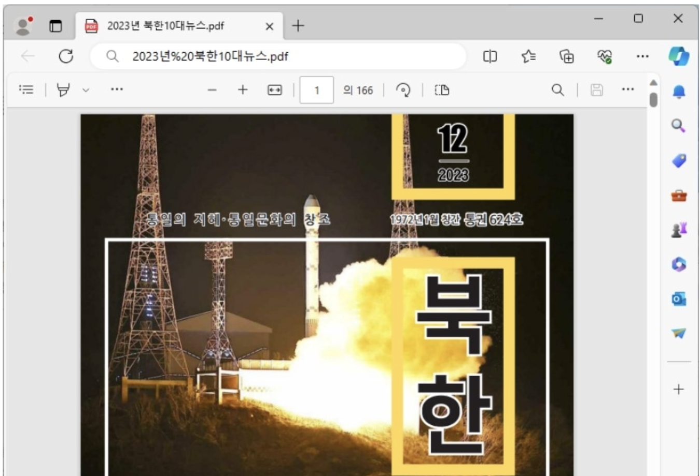

안녕하세요! CHIMITA 입니다 :D
오늘은 4월 1일, 월요일이에요.
1일과 월요일이라니 새로운 마음으로 무언가 시작하기 딱 좋은 날이죠~
지금부터 해킹짹짹과 함께 공부하는건 어떤가요?!🐥

그럼 짹짹해킹 시작합니다! 🐔
~~오늘은 만우절이랍니다! 키키~~

## 이번 주 짹짹 PICK🐥

> 🔒 Apple M 시리즈 칩의 새로운 'GoFetch' 취약점으로 인해 비밀 암호화 키 유출

2024-03-25 | TheHackerNews | [기사보기](https://thehackernews.com/2024/03/new-gofetch-vulnerability-in-apple-m.html) 

🍎 Apple의 M 시리즈 칩에서 ‘**GoFetch**’라는 취약점이 발견되었어요!

해당 취약점은 암호화 구현 로직을 대상으로 [DMP(Data Memory-dependent Prefetcher)](#짹짹이에게-물어봐)라는 기능을 활용해 CPU 캐시에 저장된 데이터를 추출하는 부채널(Side-Channel) 공격의 일종입니다. DMP를 사용하여 데이터를 유출하는 [Augury](https://www.prefetchers.info/)라는 공격을 기반으로 두고 있다고 해요. 👀

## 
> 🔒 국내 유명 입시학원인 대성학원의 온라인 강의사이트, 수강생 개인정보 유출

2024-03-29 | 한국경제 | [기사보기](https://www.hankyung.com/article/2024032840561)

공격자의 크리덴셜 스터핑 공격과 홈페이지 게시판에 대한 [XSS(Cross Site Scripting) 공격](#짹짹이에게-물어봐)으로 회원 **9만5000여 명**의 개인정보가 유출됐다고 해요. 😱 대성학원 측은 **유출을 인지하고 72시간 뒤 유출통지를 완료**하는 등의 안전조치와 유출통지 의무를 제대로 지키지 않은 것으로 밝혀졌다고 해요…😨 

## 
> ⚠️ 北 APT37 해커조직, RoKRAT 파일리스 공격

2024-03-27 | 보안뉴스 | [기사보기](https://www.boannews.com/media/view.asp?idx=128238)

👾 APT37 해커조직이 북한연구단체, 북한이탈주민 초빙강의 등의 파일로 위장하여 교묘하게 북한과 관련있는 자들을 공격했다고 해요!! 이들은 ZIP 압축 파일 내부에 [**LNK 확장자의 악성 파일**](#짹짹이에게-물어봐)을 저장한 뒤에 클라우드 저장소를 공격 거점으로 악용했다고 합니다.☠️

## 
> 🗣 깃허브 노리는 공격자들, 각종 전략 다 활용해 공급망 공격 시도

2024-03-26 | 보안뉴스 | [기사보기](https://www.boannews.com/media/view.asp?idx=128178&kind=) 

공격자들은 브라우저 쿠키를 훔쳐 계정 탈취를 시도하거나, 여러 패키지나 커밋들에 악성 코드를 심거나, 가짜 파이썬 패키지를 만들거나, 다른 Repository에서 가짜 프로젝트를 실행한 뒤 연결시키는 등의 다양한 방법을 사용하여 [공급망 공격](#짹짹이에게-물어봐)을 시도하고 있다고 합니다. 😈

## 
> 🗣 악성 패키지 업로드 급증으로 PyPI 가입 중단

2024-03-28 | TheHackerNews | [기사보기](https://thehackernews.com/2024/03/pypi-halts-sign-ups-amid-surge-of.html)

[PyPI](#짹짹이에게-물어봐)는 악성 패키지 급증으로 인해 새로운 사용자 등록을 일시적으로 중단했습니다! 🚫

10시간 후 문제가 해결되었고, 악성 패키지는 [타이포스쿼팅](#짹짹이에게-물어봐) 기술을 이용하여(ex. Matplotlib → *Matplotlig*, tensorflow → *tensourflow*) 사용자들을 속였다고 합니다. 이런 패키지가 100개 이상 발견되었다고 해요 🫢

## 짹짹이에게 물어봐   

**DMP(Data Memory-dependent Prefetcher)**

메모리 접근 패턴을 기반으로 데이터를 미리 읽어와 CPU 캐시에 저장하는 Prefetcher 기능

**크리덴셜 스터핑 공격**

피싱 사이트나 악성 소프트웨어를 통해 사용자의 민감한 정보를 훔치는 공격 기법

**XSS(Cross Site Scripting) 공격**

사용자의 입력값을 그대로 출력할 때 공격자가 악성 스크립트를 삽입하여 사용자의 브라우저에서 실행되도록 하는 공격

**공급망 공격(Supply Chain Attack)**

소프트웨어나 하드웨어 공급망을 이용해 악성 코드를 삽입하여 최종 사용자 시스템을 침해하는 공격

**타이포스쿼팅(Typosquatting)**

오타로 인한 도메인 주소 오용으로 사용자를 악성 웹사이트로 유인하는 공격 기법

**LNK 확장자**

Windows에서 바로가기 아이콘에 대한 파일 확장자

**PyPI (Python Package Index)**

파이썬 패키지의 공식 저장소

## 지식 PLUS ➕

[무선 충전기 해킹, 과연 가능할까...](https://www.boannews.com/media/view.asp?idx=127521&kind=0)

[Microsoft SharePoint 취약점 공격](https://thehackernews.com/2024/03/cisa-warns-hackers-actively-attacking.html)

[악성봇 감염, 전월 대비 78.01% 증가](https://www.boannews.com/media/view.asp?idx=128118)

[진화하는 더문 멀웨어 변종, 아수스 라우터 6천여대 감염](https://www.dailysecu.com/news/articleView.html?idxno=154660)

[DDoS 공격으로부터 마인크래프트 서버 보호](https://thehackernews.com/2024/03/crafting-shields-defending-minecraft.html)

## 대외활동 및 세미나 짹짹 PICK🐥

2024 KISIA 대학생 기자단 | [바로 보기](https://kisia.or.kr/announcement/association/578/)

2024 핵테온 세종 국제 사이버보안 위크 | [바로 보기](https://hacktheon.org/index.php)