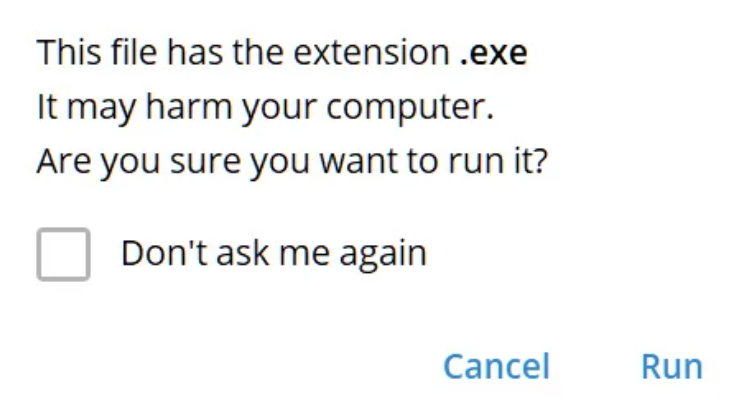
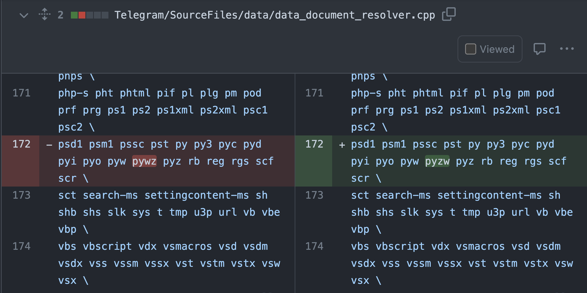
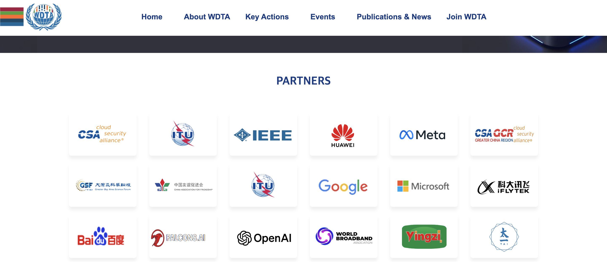
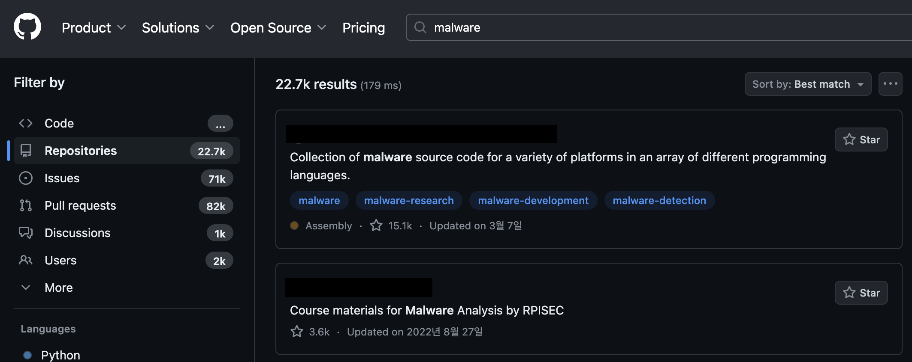
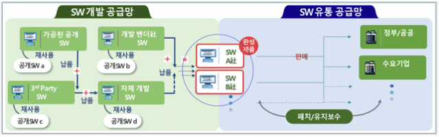

안녕하세요! clalxk 입니다 😀
완연한 봄이 벚꽃과 함께 저물고 푸릇푸릇한.. 시험기간이 돌아왔네요 🥹
시험 공부에 지칠 때! 해킹짹짹을 읽어보는 건 어떤가요? 🧐
시험기간에도 해킹짹짹과 함께해요!🐣🐥

## **이번 주 짹짹 PICK🐥**

> ✈️ 텔레그램, 악성파일 실행할 수 있는 제로데이 취약점 발견…

2024.04.15 | 보안뉴스 | [기사보기](https://www.boannews.com/media/view.asp?idx=128844&direct=mobile)

텔레그램 사용하시는 분?! 👀 ~~저요 ✋🏻~~
윈도우용 텔레그램에서 취약점이 발견되었어요!! 어떤 취약점일까요? 🤔

텔레그램에서 미리 지정해둔 확장자(exe, bin 등)를 실행할 경우 보안 경고창이 뜨는데요. ⚠️

**‘[pyzw](#짹짹이에게-물어봐)’** 확장자가 위 사진처럼 철자 오류로 인해 ‘**pywz’**로 되어있어서 보안 경고창 없이 바로 Python으로 실행되었다고 해요😱 또, pyzw 파일을 **'video/mp4' MIME 유형**으로 위장하여, 비디오 파일로 전송할 수 있었다고 해요! 영상을 보려고 클릭한 순간.. 파이썬 스크립트가 실행되다니…🫠 

다행히 현재는 pyzw 파일을 전송할 경우 ‘.untrusted’ 확장자를 추가하여, 열기 위해 사용할 프로그램을 선택하도록 수정되었어요😎 파일을 실행하기 전 확장자 확인과 주기적인 [소스코드 오디팅](#짹짹이에게-물어봐)이 필요할 것 같네요!

[참고](https://www.bleepingcomputer.com/news/security/telegram-fixes-windows-app-zero-day-used-to-launch-python-scripts/?&web_view=true#google_vignette)

## 
> 🗣 세계디지털기술아카데미(WDTA), 국제 AI 보안 표준 발표

2024.04.17 | Zdnet Korea | [기사보기](https://zdnet.co.kr/view/?no=20240418015506)

4월 17일 스위스 제네바에서 열린 제27차 유엔과학기술회의에서 세계디지털기술아카데미(WDTA)는 '생성형 AI 애플리케이션 보안 테스트'와 'LLM 모델 보안 테스트' 등 두 가지 국제 표준을 발표했다고 해요😲 

이 두 가지 표준은 [LLM 모델](#짹짹이에게-물어봐) 및 생성형 AI 애플리케이션의 글로벌 AI 보안 평가 및 테스트의 새로운 기준이 될 것이라고 소개했어요. 

미국과 중국 기업인 오픈AI, 구글, 메타, 마이크로소프트, 엔비디아, 아마존, 알리바바그룹의 앤트그룹, 아이플라이텍, 바이두, 텐센트, 오포, 그리고 버클리대 등 수십 개 기업 및 기관의 전문가가 공동으로 참여했다고 하네요! 

[참고](https://www.wdtacademy.org/)

## 
> ⚠️ GitHub의 검색 기능 악용해 악성코드 퍼트리는 공격자들
    
2024.04.13 | SecurityAffairs | [기사보기](https://securityaffairs.com/161792/cyber-crime/githubs-search-results-distribute-malware.html)

GitHub에서 검색을 통해 자료를 찾아본 경험 있으신가요? 🧐 
만약.. 이 검색 결과가 조작된 것이라면..?! 😱🫠

실제로 GitHub Actions를 활용하여 현재 날짜와 시간 또는 임의의 작은 변경 사항으로 수정하여, 비교적 자주 Repository를 자동으로 업데이트 한다고 해요. 뿐만 아니라, Star를 얻기 위해 유령 계정을 생성하여 신뢰성을 높이는 등 교묘하게 사용자들을 속였다고 해요…😧 
이렇게 사용자를 속인 공격자는 주로  Repository의 ’**.csproj** 또는 **.vcxproj’** 파일(Visual Studio 프로젝트에서 일반적으로 사용되는 파일) 내에 난독화한 악성코드를 숨겼다고 해요.

앞으로 공격자가 의도한 Repository인지 주의를 기울여야 할 것 같네요😰

## 
> 🗣 정부, S-BOM 보안 가이드라인 발표

2024.04.18 | Zdnet Korea | [기사보기](https://zdnet.co.kr/view/?no=20240418174503)

SBOM!🌰 다들 들어보셨나요?

SBOM은 **S**oftware **B**ill **O**f **M**aterials의 약자로, **소프트웨어의 구성 요소를 나타내는 메타데이터**를 의미해요!
예를 들어 설명하자면 ’영양 성분표’와 비슷한데요. 
판매자(공급자)는 잘 구성한 영양 성분을 내세워 홍보를 할 수도 있고, 이를 본 사용자는 성분에 따라 구매를 결정하거나 혹은 구매 후에 어떠한 문제가 발생하면 영양 성분을 살펴보기도 하죠! 이처럼 SBOM은 소프트웨어의 구성요소에 대한 정보를 담고 있고, 소프트웨어의 취약점과 위협 요소를 보다 쉽게 추적할 수 있도록 도와주는 역할을 해요 🍯

해당 가이드라인은 총 4개의 장으로 구성되었으며 공급망 보안 정책방향, 국내 전문가들의 연구결과, 국산 SW에 대한 SBOM 실증 및 SW 공급망 보안 포럼 논의 결과, SW 공급망 보안 테스트베드 시범운영 및 민관 정책협의체 논의 결과 등에 대한 내용이 담겨있다고 해요! 

## 
> ⚠️ WEB 3.0 게임 개발자들, 암호화폐 노리는 피싱 공격의 표적이 되고있어

2024.04.16 | 보안뉴스 | [기사보기](https://www.boannews.com/media/view.asp?idx=128918&kind=1&sub_kind=)

러시아의 공격자가 [WEB 3.0](#짹짹이에게-물어봐) 게임 개발자를 대상으로, 운영체제 관계 없이 [인포스틸러 악성코드](#짹짹이에게-물어봐)를 유포하고 있다고 해요! 😨 
자연스러운 피싱 공격으로 성공적인 악성코드 유포를 위해, 공격자가 여러가지 준비를 했다고 하는데요…🫢
[NFT 컬렉션](#짹짹이에게-물어봐)을 발행하고, 해당 컬렉션에 공식 웹 사이트를 피싱 사이트로 위장하여 사용자들을 속여 악성코드를 다운로드 하도록 유도한다고 해요. 

NFT 컬렉션 외에도 WEB 3.0의 게임 개발자 채용 공고와 게임의 이름을 한글자만 바꾸어 SNS와 Discord를 운영하며 사용자들이 속기 쉽도록 준비했다고 해요…😧

이들의 최종적인 목적은 얻어낸 정보를 통해 암호화폐 지갑에 들어있는 자금을 훔치는 것이라고 하네요!💰

## 짹짹이에게 물어봐  

**소스코드 오디팅 (Source Code Auditing)** 

소스코드를 검토하고 분석하여 오류나 보안 취약점을 탐색하는 기법

**.pyzw 확장자** 

Python 스크립트, 파이썬 소스 코드 파일

**WEB 3.0**

인공지능과 블록체인을 기반으로 맞춤형 정보를 제공하고 데이터 소유를 개인화하는 3세대 인터넷

**인포스틸러 악성코드** 

정보 탈취형 악성코드, 웹 브라우저나 이메일 클라이언트 같은 프로그램에 저장되어 있는 사용자 계정 정보나 가상화폐 지갑 주소, 파일과 같은 사용자의 정보들을 탈취

**NFT 컬렉션** 

동일한 스마트 컨트랙트, 작가(아티스트, 유명인사 등) 또는 유사한 컨텐츠 기준으로 NFT를 묶은 단위

**LLM (Large Language Models)** 

대규모 데이터셋으로 학습되었으며 대규모 파라미터를 가진 언어 모델

### 지식 PLUS ➕

[LG CNS, ‘DAP GenAI 플랫폼’으로 생성형 AI 해답 제시](https://www.boannews.com/media/view.asp?idx=128934&kind=&sub_kind=)

[과기정통부, 4배 이상 빠른 와이파이7 국내 상용화 문 연다](https://www.boannews.com/media/view.asp?idx=128924&kind=2&sub_kind=)

[소프트캠프-에쓰핀테크놀로지, 생성형 AI 보안 분야 사업 업무협약](https://www.boannews.com/media/view.asp?idx=128941&kind=3&sub_kind=)

[스냅태그, 카카오브레인 칼로 통해 생성한 이미지 출처 확인 가능](https://www.boannews.com/media/view.asp?idx=128901&kind=&sub_kind=)

[랜섬웨어 공격자에게 돈 냈는데도 협박이 이어지고 있어](https://www.boannews.com/media/view.asp?idx=128902&kind=&sub_kind=)

[범람하는 AI 규제·가이드...KISA, 'AI 보안 가이드라인' 만든다](https://ddaily.co.kr/page/view/2024041714491720474)

## 이번주 짹짹 CTF & 컨퍼런스 🐥

🚩 [.HACK CTF](https://dreamhack.io/ctf/518) | 24.04.27 ~ 2024.04.28 09:00 (24h)

⭐️ [.HACK Conference](https://dothack.io/) | 2024.05.27 ~ 2024.05.28 

🚩 [2024 HackTheon Sejong 국제 대학생 사이버보안 경진대회(CTF)](https://hacktheon.org/info.php) |  2024.04.27 09:00 (9h)

⭐️ [2024 HackTheon Sejong 국제 컨퍼런스](https://hacktheon.org/i_info.php) |  2024.06.19 ~ 2024.06.20 

## 4월 교육 🐥

[Upside 아카데미](https://upside.center/) | theori, 두나무 | 2024.04.26 까지 접수

[K-Shield Jr. 12기](https://www.kshieldjr.org/) | KISA, 컬처메이커스 | 2024.04.25 까지 접수

[AI Fellowship 6기](https://www.sktaifellowship.com/) | SKT | 2024.05.06 까지 접수
