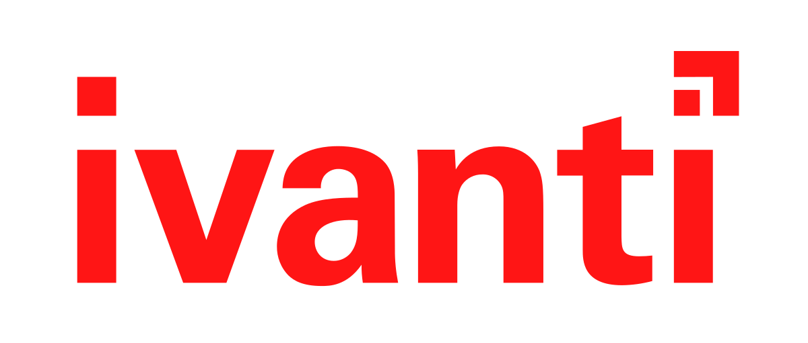
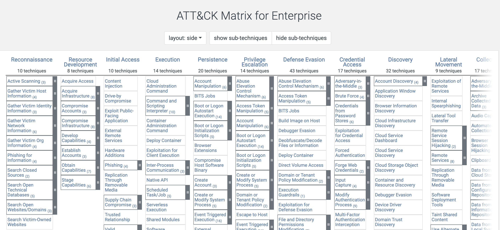
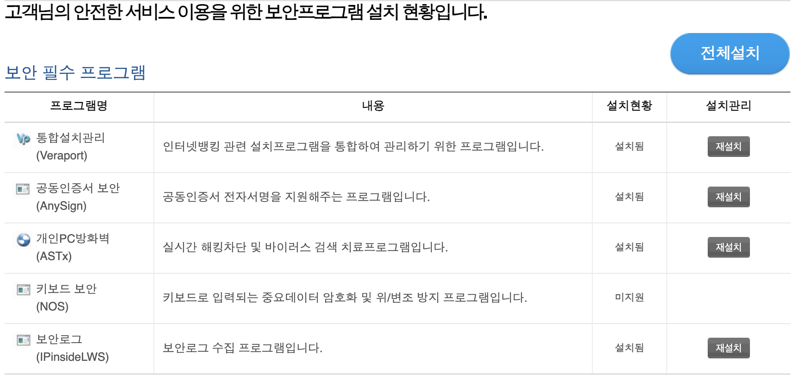
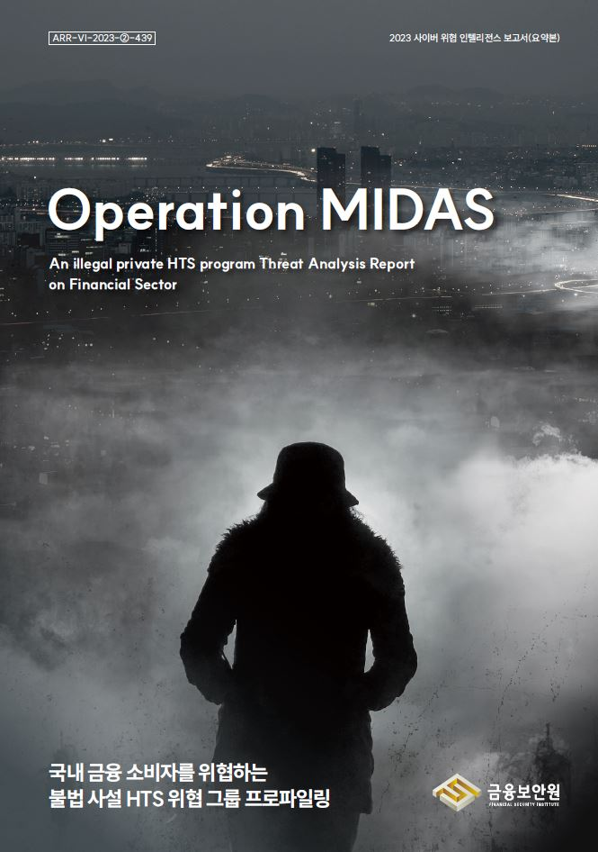

안녕하세요! clalxk 입니다 :D 
어느덧 4월이 끝나가네요..🫢🥲
해킹짹짹과 함께한 4월은 어떠셨나요? 😊
다가올 5월에도 해킹짹짹과 함께 해요! 🐥

## 이번 주 짹짹 PICK🐥

> ⚠️ MITRE, Ivanti zero-day를 통해 시스템 침해

2024.04.19 | SecurityAffairs | [기사보기](https://securityaffairs.com/162045/security/mitre-security-breach-ivanti-zero-days.html)

Ivanti 가 또 등장했어요! ([지난 뉴스레터 참고](https://hackyboiz.github.io/2024/04/15/romi0x/newsletter0415/))
이번에는 Ivanti zero-day 취약점을 활용하여 MITRE를 공격했다고 해요 🫢

Ivanti 의 Connect Secure([VPN](#짹짹이에게-물어봐)) 제품에서 전부터 꾸준히 취약점이 발견되었어요.😱

이 제품을 사용하고 있던 MITRE에도 영향을 미친, 이 취약점은 [세션 하이재킹 공격](#짹짹이에게-물어봐)으로 [MFA 인증](#짹짹이에게-물어봐)을 우회하고, 관리자 권한을 이용하여 MITRE 내부 VMware 인프라로 침투 할 수 있었다고 하네요..🫠

또, 연구 및 프로토타입에 사용되는 네트워크 실험, 연구 및 가상화 환경(NERVE)을 조사하는 외국 국가 위협 공격자를 발견했어요.👀 이 조직은 즉시 NERVE를 오프라인 상태로 전환하는 등 대응 조치를 취했고, 관련 정보의 피해 범위를 파악하기 위한 조사는 아직 진행 중이에요.🧐

*** [CVE-2023-46805](https://cve.mitre.org/cgi-bin/cvename.cgi?name=CVE-2023-46805) :** CVSS 8.2 | 인증 우회 취약점

*** [CVE-2024-21887](https://cve.mitre.org/cgi-bin/cvename.cgi?name=CVE-2024-21887) :** CVSS 9.1 | 여러 웹 구성 요소에서 발견된 명령 주입 취약점

[참고](https://cloud.google.com/blog/topics/threat-intelligence/ivanti-post-exploitation-lateral-movement?hl=en)

## 
> ⚠️ **금융사 보안 프로그램, 버전 관리 소홀**

2024.04.24 | ETNews | [기사보기](https://www.etnews.com/20240423000221)

PC에서 은행 관련 업무 혹은 인증서 관련 업무 진행해보신 적 있나요?
이 경우, 통합 보안 프로그램을 필수로 설치 해야만 원하는 기능에 도달할 수 있는 사이트들을 많이 찾아볼 수 있는데요. 👾 

만약.. 필수로 설치해야만 하는 보안 프로그램이 취약한 버전이라면…!😱🫠

실제로 금융사 홈페이지에서 **애니사인(AnySing)**을 다운로드 받아 확인한 결과, W은행과 O저축은행은 '1.1.3.3' 버전인 반면 S화재는 '1.1.2.9' 버전이었다고 해요.. 🫢

## 
> 🗣️ **금융보안원, 금융 사기 수법을 심층 분석한 인텔리전스 보고서 공개**

2024.04.22 | 데일리시큐 | [기사보기](https://www.dailysecu.com/news/articleView.html?idxno=155310)

금융보안원은 2023년 국내에서 발생한 신종 금융 사기와 관련된 범죄조직의 수법과 운영 방식을 심층 분석한 내용을 담은 [사이버위협 인텔리전스](#짹짹이에게-물어봐) 보고서 2편을 공개했어요! 

| 오퍼레이션 포이즌 애플 | 오퍼레이션 마이다스 |
| --- | --- |
|  |  |

| 오퍼레이션 포이즌 애플 | 피싱페이지가 삽입된 국내 중·소규모 쇼핑몰 50여 곳을 통해 신용카드 정보가 탈취되고 부정 결제까지 이어지는 신종사기를 면밀히 분석 |
| --- | --- |
| 오퍼레이션 마이다스 | 120여 종의 불법 HTS(홈트레이딩시스템) 프로그램 및 인프라를 분석하여 불법 HTS 사기 조직의 투자자 유인 수법부터 거액의 투자금 편취까지 이어진 전반적인 범죄 수법 분석 |

전반적인 범죄 수법부터 피싱과 신용카드 정보 탈취, 부정 결제 등 다양한 주제를 면밀히 분석하였다고 하니 금융에 관심이 있다면 가볍게라도 한 번씩 읽어보는 것은 어떤가요?! 🧐😎

## 
> ⚠️ 라자루스·안다리엘·김수키까지 北 해커조직, 국내 방산업체 83곳 공격

2024.04.23 | 보안뉴스 | [기사보기](https://www.boannews.com/media/view.asp?idx=129172)

북한의 해커조직으로 잘 알려진 라자루스, 안다리엘, 김수키 등 모두 특징이 있다는 것 알고 계시나요?!

이번 뉴스로 각 조직이 가진 특징을 살펴 볼 수 있을 것 같아요 😎

대한민국의 **방산 기술력 탈취**를 공동의 목표로 설정하여 각기 다른 공격 형태를 보여주었어요. 
 

| 조직명 | 설명 |
|:---|:---|
| 라자루스  | 망 연계 시스템의 관리 소홀을 틈타 내부망으로 침입한 후 중요자료를 수집해 국외 클라우드 서버로 자료 업로드 |
| 안다리엘  | 1. 직원이 사용하는 계정을 탈취해 악성코드 감염  2. 업체 직원의 개인 상용 메일(네이버, 카카오 등) 계정정보를 탈취하고 사내 메일로 접속해 메일 송수신 자료 탈취 |
| 김수키  | 사내에서 사용하는 그룹웨어 메일 서버의 취약점(로그인 없이 외부에서 메일로 송수신한 대용량 파일을 다운로드 가능) |
  
  
조직별로 다른 공격 형태를 보여주었지만 일반적인 공격 흐름으로 보이기도 하죠.

그런데, 왜 북한 해커 조직으로 특정되는 지 궁금하시죠? ~~ㅎㅎ~~ 🧐
 

| 증거 |
|:---:|
| *2014년 한국수력원자력 해킹 공격 때 사용된 IP와 동일한 점, 북한 해커조직이 주로 사용하는 NukNukesped, Tiger RAT 종류중의 특정 악성코드를 사용한 점, SW 취약점 이용해 경유지 서버 구축 방식, 북한이 주로 사용하는 보안인증 취약점 공격 방식, 자체 수사, 유관기관 첩보 등* | 

분석을 통해 위와 같은 증거들을 확보했고, 북한의 배후를 추적할 수 있다고 해요!

## 
> 🗣️ **국정원, 우주안보 업무 규정 개정**

2024.04.24 | 아시아경제 | [기사보기](https://www.asiae.co.kr/article/2024042409022562088)

우주에 관심있으신 분?! 🌠

지난 24일, 과학계와 법제처에 따르면 ‘**우주 안보 업무규정**’(대통령령 제34434호)이 개정되었어요 🚀

해당 규정은 우주 안보 위협에 대한 정확하고 시의성 있는 정보를 생산해 우주에서의 국가경쟁력 우위를 확보하고자 하는 목표를 가지고 있다고 해요. 

이 목표를 이루기 위해 어떤 내용이 담겨져 있을까요?🧐

**우주 위협 대응, 암호 기술 개발** 등을 포함해 우주 위협으로부터 국가 우주자산 보호를 위한 활동 근거 등의 내용이 담겨져 있다고 하네요! ✨

## 짹짹이에게 물어봐   

**세션 하이재킹 공격 (Session Hijacking Attack)** 

공격자가 두 컴퓨터 간의 유효한 세션을 장악할 때 발생하며, 공격 대상의 아이디와 패스워드를 몰라도 시스템에 접근하여 자원이나 데이터를 사용할 수 있는 공격

**MFA 인증**

사용자에게 암호 이외의 추가 정보를 입력하도록 요구하는 다중 단계 계정 로그인 과정

**VPN (Virtual Private Network)**

가상 사설 네트워크로, 데이터가 지나가는 암호화된 터널을 만들어 사용자의 IP 주소를 숨겨 익명성 보장

**애니사인(AnySing)**

공동인증서 전자 서명을 지원해주는 프로그램

**사이버 위협 인텔리전스**

기업을 대상으로 하는 사이버 보안 위협에 관한 상세 지식으로 이루어진 데이터

### 지식 PLUS ➕

[생성 AI 분야 고급 인재양성 지원사업, 2024년 예산은 35억원](https://www.boannews.com/media/view.asp?idx=129318)

[구글, 크롬 브라우저에서 발견된 위험한 취약점 패치](https://www.boannews.com/media/view.asp?idx=129307)

[FBI, 무허가 암호화폐 거래소 이용 자제 권고문 발표](https://www.boannews.com/media/view.asp?idx=129308)

[C#12, 신규 기능 '기본 생성자’ 혹평..."역대 최악의 기능"](https://zdnet.co.kr/view/?no=20240428052130)

[북한 라자루스, 새로운 Kaolin RAT 유포](https://thehackernews.com/2024/04/north-koreas-lazarus-group-deploys-new.html)

## 이번주 짹짹 CTF 🐥

[DEF CON CTF Qualifier 2024](https://nautilus.institute/) | 24.05.03 ~ 2024.05.06 00:00 (48h)

## 4월 교육 🐥

[BoB 13기](https://www.kitribob.kr/board/detail/1/9079?current_page=1&per_page=15&st=subject&q=#) | KITRI | 2024.05.28까지 접수

