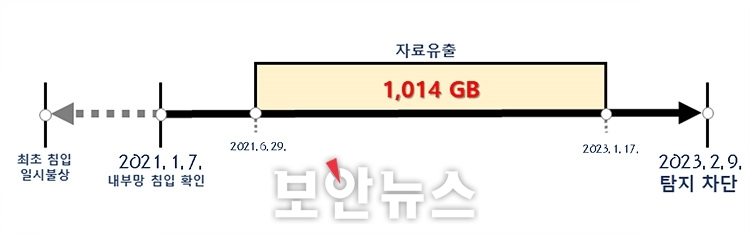
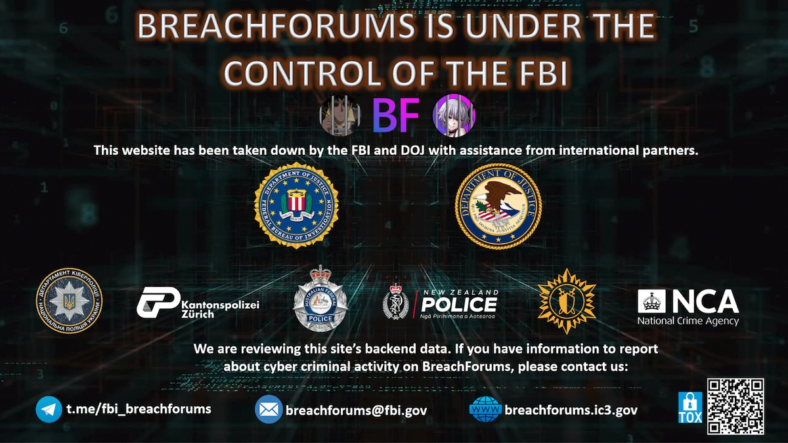

안녕하세요, clalxk 입니다 😆

이제 초여름이 지나고 여름이 가까워지고 있어요 **☀️**

산뜻한 지금도, 다가올 여름도 해킹짹짹과 함께 해요! 

## 이번 주 짹짹 PICK🐥

> ⚠️ **지난해 법원 전산망 해킹... 2년여간 1,014GB 분량 및 5,171개 문서 탈취**

2024.05.12 | 보안뉴스 | [기사보기](https://m.boannews.com/html/detail.html?mtype=1&idx=129709)

법원 전산망이 공격당했어요! 

수사 결과에 따르면 공격자는 적어도 2021년 1월 7일 이전부터 법원 전산망에 침입했다네요 😱 

당시 상세한 기록은 이미 삭제되어 정확한 최초 침입 시점과 원인은 밝힐 수 없었지만, 2023년 2월 9일까지 약 2년간 발각되지 않았던 악성 프로그램이 백신에 탐지되어 유출 사실을 확인할 수 있었다고 해요 🫢

무려 1,014GB의 법원 자료가 법원 전산망 외부로 전송되었고, 이를 역추적하여 5,171개 파일(약 4.7GB)을 법원 전산망 외부에서 발견했어요… 이렇게 유출된 파일 중에는 ‘*개인정보가 포함된 자필진술서, 채무증대 및 지급불능 경위서, 혼인관계증명서, 진단서 등* ’ 이 포함되었어요. 유출된 정보를 바탕으로 2차 피해가 생길 수 있으니 유의해야 할 것 같네요😰

또, 전산망 관리자 계정의 비밀번호는 'P@ssw0rd', '123qwe', 'oracle99' 등 속칭 깨기 쉬운 문자열로 구성되어 있었어요. 특히 일부 계정은 2016년 8월부터 6년 넘게 'P@ssw0rd' 비밀번호를 바꾸지 않았다고 해요 👀  OMG..😱 

해당 사건은 북한이 배후에 있는 것으로 밝혀졌어요. 이번 범행에 사용된 악성 프로그램, 서버 결제내역(가상자산), IP 주소 등을 기존 북한발로 규명된 해킹 사건과 종합적으로 비교 및 분석한 결과 북한의 라자루스 그룹인 것으로 확인되었다고 해요 🫠

## 
> 🗣️ **북한 IP에서 노출된 클라우드 스토리지 서버 내부에서 발견된 것들**

2024.05.17 | 데일리시큐 | [기사보기](https://www.dailysecu.com/news/articleView.html?idxno=156016)

북한 IT 인력들이 타 국가로 위장 취업한다는 사실을 들어보셨나요? 👀

최근 미 법무부가 전 세계 수사기관과 협력해 북한 IT 인력의 위장 취업 및 사이버 활동을 지원한 혐의를 받는 용의자들을 사기 혐의 등으로 기소했다고 발표했어요!

이들은 북한으로부터 돈을 지원받아 노트북을 구입했으며, 이후 북한 인력이 이 노트북으로 원격 접속해 구직 활동을 했다고 해요🫢 

구글 맨디언트(Mandiant)의 연구원들이 북한 IP 클라우드 스토리지 서버를 찾아내 1달 간 트래픽을 수집하고 조사한 결과에 따르면, 여러 국가에 기반을 둔 다양한 프로젝트와 관련된 자료들을 확인할 수 있었다고 해요 😲 

위 사진은 발견된 자료 중 하나로, 북한의 애니메이터가 작업한 내용이에요. 

이런 식으로 작업한 문서들을 확인해 보니 미국의 ‘인빈서블’, 일본의 ‘달리아 인 블룸‘, BBC의 ’옥토넛‘ 등의 애니메이션과 관련된 프로젝트 내용이 확인되었고, 작업한 모든 파일의 주석이 중국어로 작성되어 있는 것을 보아 주요 제작사에서 직접 원격으로 근무한 것이 아닌 몇 단계를 거친 하청 업무를 한 것으로 파악되고 있어요 😱 

## 
> ⚠️ **Intel, 90개 이상의 취약점에 대한 41가지의 보안 권고 발표**

2024.05.15 | SecurityWeek | [기사보기](https://www.securityweek.com/intel-publishes-41-security-advisories-for-over-90-vulnerabilities/)

Intel 제품군에서 90개 이상의 취약점이 발견되었고, 이를 패치한 41개의 Released가 발표되었어요! 

발견된 취약점 중 가장 critical 한 등급을 부여 받은 것은 [CVSS](#짹짹이에게-물어봐) 10에 해당하는 [CVE-2024-22476](#짹짹이에게-물어봐) 이라고 해요 😲  

이 취약점은 모델 크기를 줄이고 CPU 또는 GPU에 배포하기 위한 딥 러닝 추론 속도를 높이기 위해 모델 최적화를 수행하는 AI 제품인 Neural Compressor에서 확인되었다고 하네요🤔

또, Intel은 이 치명적인 취약점으로 인해 인증되지 않은 공격자가 "원격 액세스를 통해 권한 상승을 활성화"할 수 있다고 밝혔어요!

자세한 패치 사항은 [참고 링크](https://www.intel.com/content/www/us/en/security-center/default.html)를 통해 확인해주세요! 

## 
🗣️ **유명 해킹 포럼 ‘BreachForums’, 국제 공조로 폐쇄**

2024.05.16 | SecurityWeek | [기사보기](https://www.securityweek.com/breachforums-shut-down-in-apparent-law-enforcement-operation/)

‘BreachForums’ 들어보신 분 있나요?!

BreachForums은 [다크웹](#짹짹이에게-물어봐) 상에서 사이버 범죄자들이 개인정보를 비롯한 각종 데이터들을 사고 파는 곳이에요. ☹️ 폐쇄되기 이전에는 하루에도 수십 건씩 전세계의 데이터를 사고 파는 글들이 올라왔어요.. 😓 

이 곳을 폐쇄하기 위해 뉴질랜드, 호주, 영국, 스위스, 우크라이나, 아이슬란드 등과 FBI의 국제 공조 작업을 통해 BreachForums를 폐쇄할 수 있었다고 해요! 😎

하지만, RaidForums이 폐쇄되고 BreachForums이 생겼듯이 언제 또 비슷한 사이트가 만들어져 운영될 지 몰라요 ☹️

## 
> 🗣️ **내 가족 목소리까지 흉내낸 AI 신종 피싱 주의!**

2024.05.16 | 보안뉴스 | [기사보기](https://www.boannews.com/media/view.asp?idx=129836)

최근 [딥페이크](#짹짹이에게-물어봐), [딥보이스](#짹짹이에게-물어봐)를 활용한 AI 보이스피싱이 성행하고 있으며, 인공지능 기술을 통해 자녀의 얼굴과 목소리를 조작해 가족들에게 돈을 요구하는 신종 AI 피싱이 발생하고 있다고 해요! 

특히 SNS가 활발히 사용되고 있다보니 개인정보를 업로드 하지 않도록 관리가 필요해요. 특히 음성 및 영상물을 업로드하지 않도록 주의해야 할 것 같네요! 🫠

## 짹짹이에게 물어봐   

**CVSS** 

취약점의 심각성을 평가하기 위한 표준화된 점수 체계

**CVE-2024-22476**

[https://nvd.nist.gov/vuln/detail/CVE-2024-22476](https://nvd.nist.gov/vuln/detail/CVE-2024-22476)

**다크웹**

일반적인 인터넷 브라우저로는 접근이 불가능하며 암호화된 네트워크에 존재하여 특정 브라우저(예: Tor, I2P 등)를 통해서만 접근 가능한 웹

**딥페이크**

인공지능을 기반으로 인물의 얼굴이나 특정 부위를 합성하는 기술

**딥보이스**

인공지능 기술로 특정한 사람의 목소리를 발화에 합성한 기술 

### 지식 PLUS ➕

[개인정보 유출사건 관련 중요 알림? KISA 사칭 피싱 메일 유포... 북한발 공격 추정](https://www.boannews.com/media/view.asp?idx=129881)

[미국에서 북한 정권 먹여살리려 신원 도용했던 일당 체포돼](https://www.boannews.com/media/view.asp?idx=129869)

[D-Link 라우터와 ivanti EPMM 시스템 보안 취약점 주의...해킹과 정보유출 우려](https://www.dailysecu.com/news/articleView.html?idxno=156059)

[Apple, 앱스토어 및 애플 페이 보안 강화…"4년간 70억 달러 규모 앱스토어 부정 구매 차단"](https://www.dailysecu.com/news/articleView.html?idxno=156027)

['과징금 75억'…매서워진 개인정보 보호 규제, 공공기관은 제외?](https://www.yna.co.kr/view/AKR20240512045400530)

## **5월 교육** 🐥

[BoB 13기](https://www.kitribob.kr/board/detail/1/9079?current_page=1&per_page=15&st=subject&q=#) | KITRI | 2024.05.28까지 접수