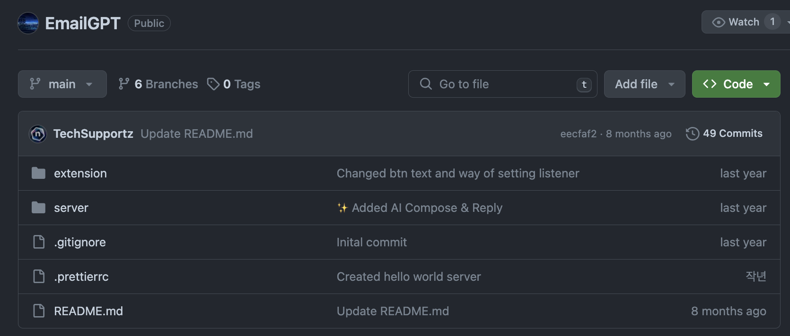
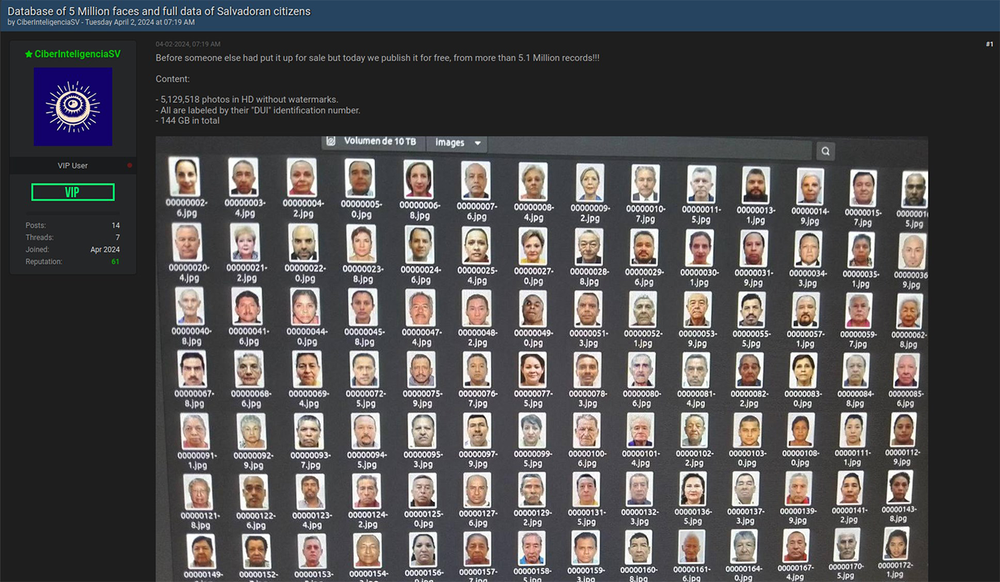
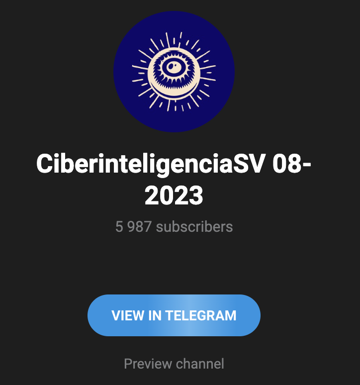
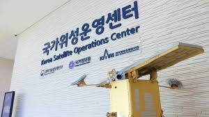
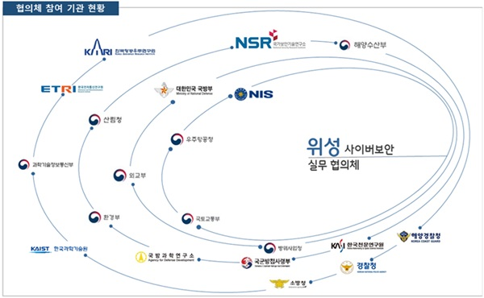
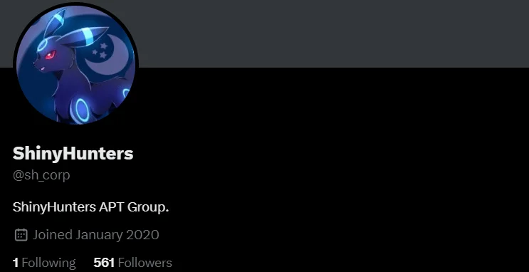
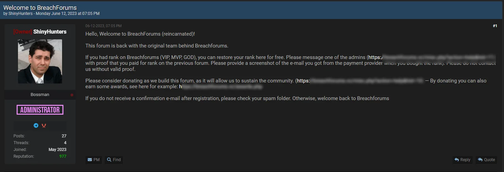

안녕하세요, clalxk 입니다 😆

이번 주는 EmailGPT의 Prompt Injection부터 우주 산업 사이버 보안, BreachForums까지 다양하게 준비했습니다! 👽

날이 점점 더워지는데 시원한 곳에서 해킹짹짹 어떤가요~? 🐣

## 이번 주 짹짹 PICK🐥

> ⚠️ EmailGPT, Prompt Injection 취약점 발견

2024.06.06 | HACKREAD | [기사보기](https://hackread.com/emailgpt-flaw-user-data-at-risk-remove-extension/)

EmailGPT 사용해보신 분 계신가요? 👀

[**EmailGPT**](https://github.com/Coeeter/emailgpt)는 OpenAI의 GPT-3.5 모델을 사용하여 Gmail 내에서 이메일을 작성할 수 있도록 지원하는 **API 서비스**이자 **Google Chrome 확장 프로그램**이에요! 

이 프로그램에서 **Prompt Injection** 취약점이 발견되었어요! ([CVE-2024-5184](https://nvd.nist.gov/vuln/detail/CVE-2024-5184)) 👾🫢

**Prompt Injection** 은 특정 Prompt(명령)를 주입하여 모델의 출력을 의도적으로 조작하는 행위를 말하는데요.

개발 초기 모델로 쉽게 예를 들자면, ‘넌 어떤 데이터로 학습했어?’, ‘너가 학습한 방식을 설명해줘.’ 이런 식으로 Prompt를 입력하면 해당 모델의 비밀스런 정보들을 알아낼 수 있어요. 

EmailGPT에서는 이 취약점이 어떤 영향을 미쳤을까요? 🧐

Prompt Injection을 통해 EmailGPT 서비스 전체 로직을 장악할 수 있고, 악의적인 정보를 요청하는 Prompt를 입력하면 요청한 정보를 응답으로 제공했다고 해요 🫢 이를 응용하여 데이터를 빼돌리고 스팸 메일을 전송하는 등 추가적인 피해가 이어지고 있어요 😱 

현재 EmailGPT 개발자들과 연락이 닿지 않아, 패치가 언제 이루어질 지 알 수 없어요…😱

해당 프로그램이 [Github](https://github.com/Coeeter/EmailGPT)에 공개되어 있어서, 접근하는 모든 인터넷 사용자가 이 취약점을 악용할 수 있다고 해요 😱*100

하지만 우리 짹짹이와 여러분은 접근하지 말아요~ 🐣

## 
> 🗣️ 🇸🇻, 전 국민 생체정보 탈취 사건… (한국 아님 주의) 

2024.06.06 | 보안뉴스 | [기사보기](https://www.boannews.com/media/view.asp?idx=129652)

**🇸🇻** 엘살바도르에서 **전국민 80%의 생체 정보와 개인 식별 정보가 유출**되었어요! 😱🫢👀

**CiberinteligenciaSV**라는 이름으로 활동하는 자가 다크웹을 통해 엘살바도르 국민 500만 명 이상의 정보들을 약 1.4GB 유출했다고 해요 🫠 이는 엘살바도르 전체 인구의 80%에 해당하는 수치인데요..

유출된 1.4GB 중에는 고화질 사진만 5,129,518장이 포함되어 있으며, 각 사진에는 엘살바도르 ‘**주민 등록 번호**’를 비롯한 ‘**이름, 생년월일, 전화번호, 이메일 주소, 거주지 주소**’도 저장되어 있었어요. 더 치명적인 건, ‘**생체 인증 정보**’도 같이 들어있었다는 것인데요.

**얼굴 인식을 위한 자료들이 개인별로 정리**되어 있었고, 각 자료들에 개인을 식별하기에 충분한 정보까지도 알맞게 첨부되어 있었다고 해요. 누구라도 마음만 먹으면 이 정보를 가지고 개인을 특정해 접근할 수 있을만큼 심각한 유출 사례에요 😱

아직까지 CiberinteligenciaSV가 누구인지, 어느 나라와 어느 팀에 거처를 두고 있는지 등 정확히 밝혀진 것이 없지만, 스페인어로 ‘우리는 어떠한 활동가 그룹에도 속해 있지 않으며, 공개된 정보를 포워딩 할 뿐’, ‘이미 과카마야 그룹(Guacamaya Group)이 이전에 인터넷에 공개한 정보이므로 우리가 지금 전달하는 정보는 공개된 정보다’라고 텔레그램을 통해 주장하고 있어요. 이렇게 그룹에 속해 있음을 부인하고 있긴 하지만 CiberinteligenciaSV의 텔레그램 채널은 '[https://t.me/guacamayal'](https://t.me/guacamayal) 링크를 사용하고 있어요. 참 전략적으로 사람들을 혼란스럽게 하고 있네요. 😠😥

CiberinteligenciaSV는 사진을 특정 인물 혹은 특정 데이터셋과 연결시켜주는 기능을 하는 것으로, 여러 정보들을 보다 쉽게 찾고 검색하고 매칭시키는 스크립트도 함께 공개했어요. 

자세한 내용은 [링크](https://www.biometricupdate.com/202405/el-salvador-data-breach-includes-selfies-and-id-numbers-for-80-of-countrys-population)에서 확인해주세요!

* Guacamaya Group : 남미 지역에서 활동하는 핵티비스트 단체 중 하나

## 
> 🚀 민간 기업 주도 ‘New Space’ 시대, 우주 사이버안보 중요성 더욱 커져

2024.05.28 | 보안뉴스 | [기사보기](http://www.boannews.com/media/view.asp?idx=130024&direct=mobile)

우주 산업에서 국가 주도 체제 경쟁이었던 ‘Old Space’ 시대가 가고, **민간 기업**이 뛰어드는 ‘**New Space**’ 시대가 오고 있다고 해요! 💫 민간기업이 항공우주(Aerospace) 산업을 주도하는 시대가 바로 New Space인데요. 

전 세계 곳곳에 광대역 인터넷 서비스를 제공하는 스타링크(Starlink) 인공위성을 발사하는 스페이스X, 텔레샛(Telesat)과 아마존, 버진 갤럭틱 등 민간 기업의 활동이 더욱 커지고 있다고 해요. 

왜 민간 기업의 활동이 더욱 커졌을까요? 🧐 

미국 정부가 민간 우주기업에 미국항공우주국(National Aeronautics and Space Administration, NASA)의 기술 이전을 허용한 것이 민간 위성 발사가 증가하며 관련 산업이 성장할 수 있었어요!

그럼 우리나라 우주 산업은 어떨까요? 🇰🇷

과학기술정보통신부(이하 과기정통부)의 ‘***2023 우주산업 실태조사***’에 따르면 우주 산업에 참여하고 있는 국내 기업·기관 수는 2014년 248개에서 2022년 442개로 증가했다고 해요 🌙🌠 

이렇게 기업·기관이 점차 많아지며 우주 사이버 보안의 중요성도 커지고 있어요. 

지난 3월, 북한으로부터 [국가위성운영센터가 공격](https://biz.chosun.com/science-chosun/science/2024/03/26/QH6X2YD5A5FLDJLDYJXJPMJA5M/)을 당했던 사실 알고계신가요?

국정원과 과기정통부가 협력해 조사에 착수했지만, 자세한 내용은 공개되지 않았어요. 

뉴 스페이스 시대로의 전환과 함께 우주산업 관련 분야를 노리는 사이버 공격도 늘어나면서 글로벌 주요국들은 우주 사이버 공격에 대응하기 위해 다양한 정책적 노력을 기울이고 있다고 해요 😃 

**🇺🇸 미국**은 ‘국가안보전략’, ‘우주 정책 지침’, ‘국가사이버안보전략’, **🇪🇺 유럽** 연합(EU)은 ‘더 강력하고 탄력적인 유럽연합 보장과 안보·방위를 위한 EU 우주 전략’을 발표했으며, **🇩🇪 독일**은 ‘국가 우주 전략’을 발표했어요!

우리나라도 얼마 전, [**위성 사이버보안 강화 위한 관계기관 협의체를 출범**](https://www.dailysecu.com/news/articleView.html?idxno=156563)했다고 하네요!

## 
> 🗣️ 되살아난 ‘BreachForums’..?,  Ticketmaster 5억 6천만명 데이터 유출?!

2024.05.30 | bankinfosecurity | [기사보기](https://www.bankinfosecurity.com/stolen-ticketmaster-data-advertised-on-rebooted-breachforums-a-25363)

[지난 뉴스레터](https://hackyboiz.github.io/2024/05/20/clalxk/newsletter0520/)에서 소개된 BreachForums! 다들 기억하고 계신가요~? 😉

국제 공조로 폐쇄된지 2주가 채 지나지 않아, 다시 부활하여 각종 데이터들을 사고 팔고 있다고 해요..😞

근데.. 정말 부활한 걸까요..? 🤯

BreachForums의 관리자로 알려진 **ShinyHunters**라는 사이버 범죄 그룹이 **Ticketmaster**의 고객 정보 5억 건을 판매하는 글을 올렸어요 🤨 하지만 판매글에 업로드 된 데이터들은 이미 **SpidermanData**라는 사이버 범죄자가 타 다크웹 사이트에 업로드 했던 데이터와 같았고, 또 복구된 BreachForums는 이전과 다르게 사용자 등록 전에는 콘텐츠 열람이 불가능하도록 변경되었어요. 이런 점들로 인해 정말 부활한 것인지 의심이 들어요 🤔 

이를 두고 여러 의견이 모아졌어요. 

[Malwarebytes](https://www.malwarebytes.com/)(보안 기업)는 FBI가 사이버 범죄자를 사칭하는 허위 광고를 통해 범죄자들을 끌어들여 잡는 일종의 ‘함정 수사 방식‘을 사용한 건지, 진짜 되살아난 것인지 확신할 수 없어서 결국에는 **ShinyHunters가 단순히 관심을 끌려고 올린 것이**다라는 결론을 내렸다고 해요.

(실제로, 2018년에는 함정 수사 방식을 활용하여 Hansa Market 이라는 다크웹을 폐쇄할 수 있었다고 하네요 😎)

그래도 BreachForums의 진짜 부활 가능성이 없는 것은 아니에요.

Malwarebytes와 반대로, Flashpoint(보안 기업)는 다크웹에서 사이버 범죄자들끼리 진행하는 대화를 쭉 따라가다보면 각종 루머를 접할 수 있는데, BreachForums의 상황도 꽤나 자주 거론되는 것을 볼 수 있었다고 해요. 운영진이 도메인을 바꿨다느니, 오히려 미국 사법기관들에 복수를 계획하고 있다느니 하는 말들이 나오고 있으며, BreachForums가 새로운 이름으로 재탄생할 거라는 말도 있습니다. *breachnation.io,* *databreached.io* 등 구체적인 도메인 이름도 언급될 정도라고 하네요 *~~헉~~* 😱

ShinyHunters가 공개한 Ticketrmaster의 5억 6천건 가량을 판매하는 글로 인해 보안 업계에서 여러 분석 결과를 도출해냈지만, 아직 BreachForums이 부활했다고 확언하지 못하고 있어요 🤯

여러분은 어떻게 생각하시나요?!🧐

[참고](https://socradar.io/dark-web-profile-shinyhunters/)

## 짹짹이에게 물어봐   

**Prompt Injection** 

특정 Prompt(명령)를 주입하여 모델의 출력을 의도적으로 조작하는 행위

**CVE-2024-5184**

[https://nvd.nist.gov/vuln/detail/CVE-2024-5184](https://nvd.nist.gov/vuln/detail/CVE-2024-5184)

**Google Chrome 확장 프로그램**

구글 크롬 브라우저를 수정하는 브라우저 확장 프로그램

### 지식 PLUS ➕

[MS 오피스 크랙 버전 설치 시, 코인마이너·원격제어 악성코드 감염](https://www.boannews.com/media/view.asp?idx=130288)

[브리치포럼즈, 사법기관의 공조로 폐쇄된 지 2주만에 부활했나](https://www.boannews.com/media/view.asp?idx=130274)

[한-아프리카 정상회의 계기, 아프리카 사이버보안 협력](https://www.boannews.com/media/view.asp?idx=130403)

[日 암호화폐 거래소 DMM, 4,200억 비트코인 털려](https://www.boannews.com/media/view.asp?idx=130289)

[보이스피싱 범죄에 칼 빼든 정부, AI·데이터 활용 위해 대대적 협력](https://www.boannews.com/media/view.asp?idx=130294)

[인터뷰 의뢰 사칭한 북한 김수키 해킹조직 공격 포착돼…](https://www.dailysecu.com/news/articleView.html?idxno=156598)

## **6월 컨퍼런스 | 대회** 🐥

[사이버보안컨퍼런스](https://e.chosunbiz.com/tc-events/2024-%ec%82%ac%ec%9d%b4%eb%b2%84%eb%b3%b4%ec%95%88%ec%bd%98%ed%8d%bc%eb%9f%b0%ec%8a%a4/?preview=true) | 조선비즈 | 2024.06.20

[AI 아이디어랩](https://www.xn--ai-h41ir8ydiaw0lto5awzac9ida382tyjj.com/) | 코드게이트 | ~ 2024.06.30 접수

[제10회 대학생 프로그래밍 경진대회](https://research.samsung.com/scpc) | 삼성전자 | ~ 24.07.04

[암호분석경진대회](https://cryptocontest.kr/challenge/) | 한국정보보호학회 | ~24.08.31 

[금융권 보안 취약점 신고포상제 (버그바운티)](https://www.fsec.or.kr/bbs/1014) | 금융보안원 | ~24.08.31

[금융보안아카데미 2기](https://www.fsec.or.kr/bbs/detail?menuNo=66&bbsNo=11489) | 금융보안원 | ~ 24.06.17 접수