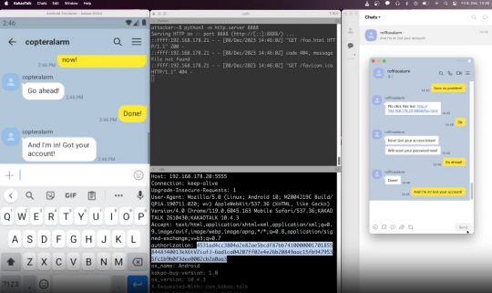
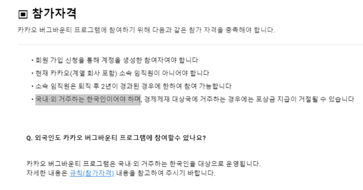
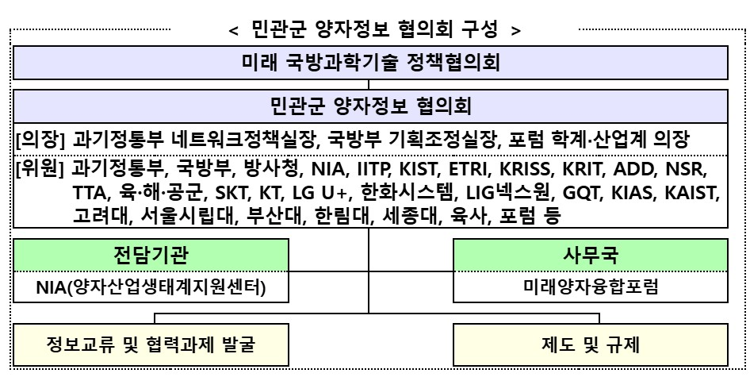
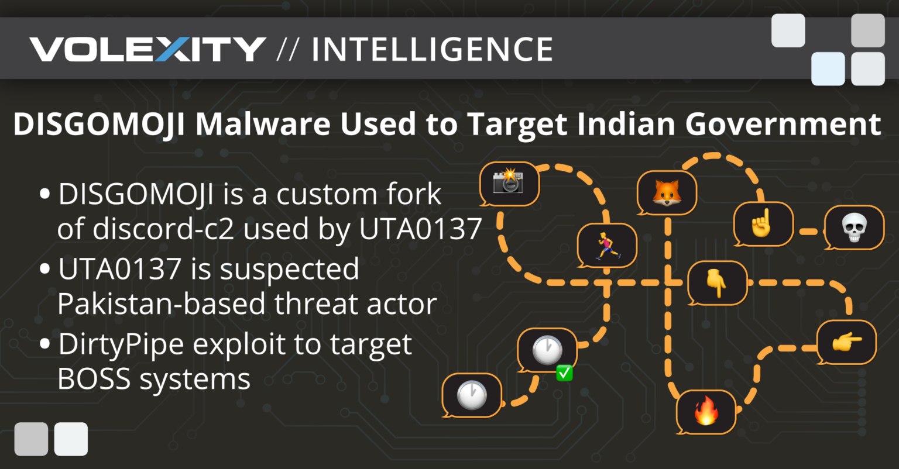
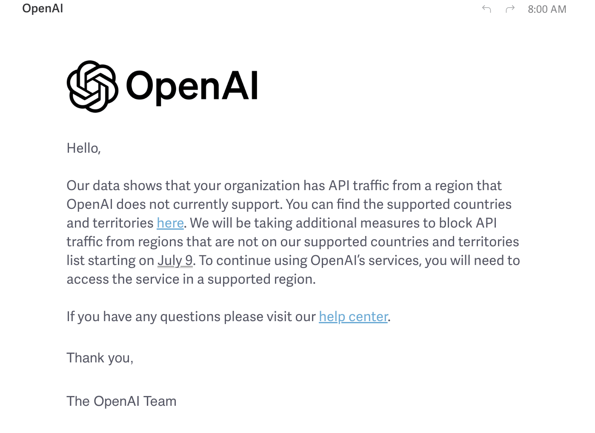

안녕하세요, clalxk 입니다 :D
7월 1일, 월요일이에요!
왠지 럭키비키한 7월이 될 것 같네요 ㅎㅎ 

## 이번 주 짹짹 PICK🐥

>⚠️ KT, 조직적 해킹팀 꾸려 통신망 감청·악성코드 유포 의혹

2024.06.24 | JTBC | [기사보기](https://www.youtube.com/watch?v=qaF0NSLZ4cU) | [영상보기](https://www.youtube.com/watch?v=qaF0NSLZ4cU)

최근 화제가 되고있는 사건인데요. 

KT가 웹하드 혹은 스트리밍(실시간 재생) 서비스의 데이터 전송을 효율화해주는 '**그리드 프로그램**' 사용자에게 통신 장애를 일으킨 혐의로 경찰 수사를 받고 있어요. 해당 사건은 약 4년 전인 2020년 부터 시작되었어요.

지난 2020년 5월 국내 웹하드 수십 곳이 먹통이 되었던 거 아시나요?

KT가 그리드 프로그램 사용자들의 통신에 고의로 장애를 일으킨것인데요 😱 약 60만 명에 달하는 이용자들이 웹하드 이용 시 서비스 오류를 겪었어요. 이 과정에서 KT가 그리드 프로그램을 막는 일종의 '악성 코드'를 배포했다는 의혹도 제기되고 있어요.

이후 경찰을 통해 밝혀진 해킹 공격을 한 곳은 다름 아닌 KT의 데이터센터 중 하나인 분당 IDC 센터였어요. 이곳에서 국내 웹하드 수십 곳에 해킹 공격을 진행한 것으로 확인되었어요. KT가 직접 일부 고객들에게 '악성 코드'를 심은 셈인거죠. 이때 **'악성코드 개발'** 담당과, **'유포와 운영'** 담당, 그리고 KT 이용자들이 주고받는 데이터를 실시간으로 들여다보는 **'감청'** 담당으로 역할을 구분하여 팀으로 진행을 했다고 해요. 이 과정에서 악성코드를 쉽게 유포하기 위해 웹하드 이용자들과 서버가 주고받는 데이터를 KT가 바꾼 의혹도 받고 있어요..

그러나 KT 측은 웹하드 업체의 그리드 서비스 자체가 악성 프로그램이기 때문에 이를 제어하기 위해선 어쩔 수 없었다는 입장을 밝혔어요. 

하지만 **KT 데이터센터**와 **본사**를 차례로 압수수색을 한 경기남부청은 **KT가 통신비밀보호법과 정보통신망법 등을 위반**했을 가능성이 있다고 수사를 이어가고 있어요 👮

KT는 과거에도 그리드 프로그램 사용을 두고 웹하드 업체와 갈등을 빚었어요. 지난 2015년 가입자용 인터넷 회선의 상업용 이용을 금지한 이용약관에 위배된다는 이유로 웹하드 서비스용 그리드 서버의 IP만을 골라 차단했었다고 하네요.

경찰은 지난해 11월 KT 직원과 KT 당시 협력업체 직원 등을 포함한 13명을 특정해 검찰에 송치했어요.

통신사들을 관리·감독하는 과학기술정보통신부는 지난해 9월 이 사안을 알았지만, 수사중이라는 이유로 어떤 조치도 하지 않은 걸로 확인되었다고 해요.. 🤯

해당 사건이 어떻게 진행되는 지 뉴스를 통해 계속 확인해야 할 것 같네요. 

해킹짹짹과 함께 해요~🐥

## 
> ⚠️ 카카오톡에서 ‘원클릭’ 취약점 발견... 그러나 외국인이라 보상 없어

2024.06.28 | 디지털타임스 | [기사보기](https://m.dt.co.kr/contents.html?article_no=2024062802109931081012)

카카오톡에서 ‘원클릭’ 취약점이 발견되었어요!

다른 이용자 계정을 탈취해 주고받은 메시지를 훔쳐볼 수 있었다고 하는데요…😱 

해당 취약점은 카카오톡 10.4.3 버전의 **딥링크 유효성 검사 문제**로 인해 원격 공격자가 웹뷰에서 임의의 자바스크립트를 실행하고, HTTP 요청 헤더의 **액세스 토큰을** **유출**할 수 있는 문제였어요.

이 토큰을 공격자의 기기에 등록함으로써 다른 사용자 계정을 탈취하고 채팅 메시지를 읽는 데 사용할 수 있었다고 해요. 이 취약점은 [CVE-2023-51219](https://nvd.nist.gov/vuln/detail/CVE-2023-51219)로 명명되었어요.

취약점의 더 자세한 내용은 [링크](https://stulle123.github.io/posts/kakaotalk-account-takeover/)에서 확인해주세요!

카카오톡은 자사 웹과 앱 서비스의 보안 취약점을 사전에 발굴하고 조치하기 위한 버그바운티 프로그램을 운영하고 있어요! 이에 따라 보안 전문가, 이용자가 카카오 서비스의 보안 취약점을 발견해 제보하면 위험도와 발굴 난이도 등을 종합적으로 검토해 최소 5만 원에서 최대 1,000만 원의 포상금을 제보자에게 지급한다고 해요. 다만 버그바운티 프로그램에 참여할 수 있는 참여자는 국내외 거주하는 **한국인으로 한정**되어 있어요.

제보자는 지난해 12월 카카오에 이 취약점을 보고했으나, 한국 국적자만 포상금을 받을 수 있어 결국 아무런 보상도 받지 못했다고 해요 🥲 

제보자가 깃허브에 글을 게시하면서 화제가 되었는데, 카카오톡이 국내 이용자가 대부분인 플랫폼인 만큼 어쩔 수 없다는 의견도 나오는 한편, 해외에서 카카오톡의 취약점을 발견하더라도 보상을 받을 수 없어 적극적으로 이를 제보하지 않아 결국 취약점이 악용될 수 있다는 우려도 나오고 있어요 😀

참고로 카카오와 동일하게, 한국인터넷진흥원(KISA)이 운영하는 취약점 신고포상제 역시 참가 대상을 국내, 외 거주하는 한국인으로 한정하고 있어요. 

그러나 해외 기업에서는 대부분 버그바운티에 국적 제한을 두고 있지 않으며, 국내의 경우 삼성 모바일이 운영하는 보안 취약성 보고 보상 프로그램이 대한민국 정부의 제재를 받은 국가의 거주자를 제외하면 제보자의 국적을 따로 제한하고 있지 않다고 해요! 😮

## 
> 🗣️ 양자과학기술을 미래 국방 게임체인저로…‘민관군 양자정보협의회’ 공식 출범

2024.06.27 | 데일리시큐 | [기사보기](https://www.dailysecu.com/news/articleView.html?idxno=157257)

양자 과학 기술! 다들 한번씩은 들어보셨을 것 같은데요 😀 

양자 과학 기술이란 양자역학적 특성을 바탕으로 기존 기술의 이론적 한계를 돌파하는 초정밀 계측(양자센서), 양자기기간 초신뢰연결(양자통신), 초고속연산(양자컴퓨터)을 가능하게 하는 기술이에요. 

최근 정부는 큰 파급력에 주목하였고, 이 기술을 3대 게임체인저 중 하나로 지정하여 인력을 육성하고자 노력을 기울이고 있다고 해요 😮

미국 국방부는 국방기술전략에서 양자과학기술을 14대 국방 핵심기술의 하나로 선정(2023년)하였고, 영국도 국가양자전략에서 양자센서의 국방적용을 목표로 설정(2023년)하였으며, 프랑스는 양자항법의 해군 수상 함정 적용계획을 발표(2022년)하는 등 해외 주요국은 양자과학기술의 국방 적용을 위해 노력하고 있어요. 

우리 정부도 양자과학기술의 국방 분야 적용을 위한 노력을 지속해 왔는데요! 😎

과기정통부는 작년 ‘대한민국 양자과학기술 전략’의 7대 추진 방향 중 하나로‘국방·안보 도입 추진’을 포함하였고, 국방부는 작년 10대 국방전략기술 중의 하나로 양자과학기술을 선정하여 기술의 국방 적용성에 주목하고 있어요. 

과기정통부는 국방부와 공동으로, 양자과학기술의 국방분야 적용·확산을 위한 ‘**민관군 양자정보협의회‘**를 6월 27일 출범한다고 해요! 

이는 2024년 4월 체결한 과기정통부·국방부 장관간 국방과학기술 협력 MOU 후속조치로서 양자과학기술 개발과 산업창출, 국방혁신의 선순환 구조를 구축하는 데 기여할 것으로 기대된다고 하네요 😲

## 
> ⚠️ 이모티콘을 활용해 해킹하는 신종 리눅스 악성코드 등장 😱
    
2024.06.17 | 데일리시큐 | [기사보기](https://www.dailysecu.com/news/articleView.html?idxno=156885)

헉 이모티콘을 활용하는 악성코드라니요 😱😰😨

'**디스고모지(DISGOMOJI)**'라는 악성코드가 발견되었어요! 이 악성코드는 리눅스 시스템을 대상으로 하며, 디스코드(Discord)와 이모티콘을 이용한 명령 및 제어(C2) 메커니즘을 통해 감염된 장치를 제어한다고 해요.

디스고모지의 특징은 오픈소스 프로젝트인 discord-c2를 활용해 디스코드를 C2 플랫폼으로 사용하는 것인데요, 공격자가 제어하는 디스코드 서버에 연결되어 특정 이모지 기반 명령을 수행해요. 아홉 개의 이모지가 다양한 명령을 나타내며, 이를 통해 쉘 명령 실행, 스크린샷 촬영, 파일 탈취 등의 작업을 수행한다고 해요! 😮

명령어를 이모지로 대체하다니… 정말 창의적이네요!

사용된 명령어는 아래와 같아요.

1) 🏃‍♂️ : 피해자의 장비에서 명령을 실행한다. 이 때 명령 수행을 위한 아규먼트를 따로 받는다.

2) 📸 : 피해자의 화면을 캡쳐해 서버로 업로드 한다.

3) 👇 : 피해자의 장비로부터 파일을 다운로드 받아 공격자의 서버로 업로드 한다.

4) ☝️ : 피해자의 장비에 파일을 심는다.

5) 👉 : 피해자 장비의 파일을 원격 파일 스토리지 서비스인 오시(Oshi)로 옮긴다.

6) 👈 : 피해자 장비의 파일을 또 다른 원격 파일 스토리지 서비스인 트랜스퍼(transfer.sh)로 옮긴다.

7) 🔥 : 공격자가 미리 정의한 내용에 해당하는 모든 파일을 찾아 공격자의 서버로 전송한다.

8) 🦊 : 피해자 장비 내 파이어폭스 프로파일들을 모두 압축해 공격자에게 전송한다.

9) 💀 : 멀웨어의 모든 프로세스를 종료시킨다.

디스고모지가 이 명령을 받아 처리하면 시계 모양 이모티콘을 다시 서버로 내보내어, 공격자는 이 이모티콘을 받아 “명령이 잘 수행되고 있다”는 걸 확인 할 수 있어요. 또한 명령이 성공적으로 실행되면 디스고모지가 초록색 네모 박스에 체크 표시가 된 모양의 이모티콘을 공격자에게 전송한다고 해요! 🫠😮

이 악성코드는 파키스탄 해킹 그룹 **UTA0137**이 제작한 것으로 보이고 있어요. 파키스탄 해커들이 자주 노리는 인도의 정부 기관들은 공무원들이 리눅스 기반 데스크톱을 업무에 활용하도록 하고 있는데, 마침 이 디스고모지 악성코드가 ZIP 압축 파일 내 UPX로 패킹된 ELF 실행 파일을 포함한 피싱 이메일을 통해 배포되었다고 하네요! 

자세한 내용은 [링크](https://www.volexity.com/blog/2024/06/13/disgomoji-malware-used-to-target-indian-government/)에서 확인해주세요!

## 
> 🗣️ OpenAI, 중국, 러시아, 이란 사용자의 ChatGPT 액세스 중단

2024.06.26 | bankinfosecurity | [기사보기](https://www.bankinfosecurity.com/openai-drops-chatgpt-access-for-users-in-china-russia-iran-a-25631)

오픈AI가 러시아와 중국, 이란 등 서비스 지원 대상에서 제외된 국가 사용자에게 7월 9일 이후 접근을 차단할 것이라고 이메일로 통보했다고 해요 🫢

이메일 내용이 오픈AI 커뮤니티 포럼에 게시되었는데요!

‘자사 데이터에 따르면 귀사 API 트래픽이 현재 오픈AI가 지원하지 않는 지역에서 발생하고 있음을 확인했다며 지원되는 국가와 지역 목록을 밝히고 7월 9일부터 지원되지 않는 국가와 지역으로부터의 API 트래픽을 차단하기 위한 추가 조치를 취할 것’ 이라는 내용이 담겨져 있었다고 하네요. 

이메일에서 공개 된 [서비스 지원 목록](https://platform.openai.com/docs/supported-countries)에는 미국, 캐나다, EU 국가, 아시아, 아프리카 일부 등 전 세계 많은 국가는 있지만 **중국, 러시아, 북한, 이란** 등 일부 국가의 이름은 찾아볼 수 없었어요. 

보도에선 이번에 오픈AI가 중국을 포함한 4개국으로부터의 접근을 차단하기로 결정한 건 미국과 중국간 긴장이 고조되고 있는 것과 지난 2월 보도된 이 [기사](https://www.aitimes.com/news/articleView.html?idxno=157207)가 영향을 미쳤을 것이라고 추정하고 있어요 🫠

## 이번 주 짹짹이의 하루 🐥

> ⭐ **월** | [보안업데이트 안되는 구형 안드로이드 기기 노리는 래틀 RAT…랜섬웨어 공격 주의](https://www.dailysecu.com/news/articleView.html?idxno=157113)

래틀 RAT는 구형 안드로이드 기기를 겨냥한 오픈소스 원격 액세스 트로이 목마로, 인스타그램, 왓츠앱 등을 통해 확산되며 파일 암호화, 위치 추적 등의 기능을 수행한다. 사용자는 최신 보안 업데이트를 유지하고 신뢰할 수 없는 소스에서 APK를 다운로드하지 않도록 주의해야 한다.

> ⭐ **화** | [프레스타샵 페이스북 모듈 보안취약점 악용해 신용카드 정보 탈취 중…주의](https://www.dailysecu.com/news/articleView.html?idxno=157168&page=3&total=102987)

온라인 쇼핑몰을 쉽게 구축하는 프로그램으로 잘 알려진 프레스타샵(PrestaShop)의 페이스북 모듈인 pkfacebook에서 심각한 취약점이 발견됐다. SQL 인젝션을 통해 전자상거래 웹사이트에 카드 스키머를 설치하고 신용카드 정보를 탈취하는 데 악용하고 있다. ([CVE-2024-36680](https://nvd.nist.gov/vuln/detail/CVE-2024-36680))

> ⭐ **수** | [최근 사이버 공격 위협 5가지... 대부분 금전 탈취 목적](https://m.boannews.com/html/detail.html?tab_type=1&idx=130809)

기업의 사이버 보안 침해사고가 지속적으로 증가하고 있다. 한국인터넷진흥원(이하 KISA)에 따르면 2020년 630건에서 2021년 640건, 2022년 1142건, 2023년 1,227건으로 급증하는 추세다. 금전탈취 목적의 사이버공격을 당하는 산업군을 살펴보면 의료 98%, 제조 96%, 교육 92%, 정부·공공기관 68% 순으로 집계됐다.

> ⭐ **목** | [온라인 주문‧배달 서비스, 자율규제로 개인정보보호 강화한다](https://www.dailysecu.com/news/articleView.html?idxno=157256)

주문중개플랫폼사와 주문통합관리시스템사 및 배달대행플랫폼사 간 주문정보 송․수신도 애플리케이션 프로그래밍 인터페이스(API) 후킹 등 수신 주체가 식별되지 않는 방식에서 어떤 정보를 어떤 업체가 주고받았는지 확인 가능한 에이피아이(API) 연동 방식으로 개선하여 안전하게 데이터가 전송되도록 보호조치를 강화하였다.

> ⭐ **금** | [스마트 홈 기기의 심각한 사이버 보안 취약점 발견](https://www.cepro.com/networking/critical-cybersecurity-vulnerabilities-in-smart-home-devices-uncovered-in-new-research/)

NETGEAR와 Bitdefender 기업에서 [2024 IoT 보안 환경 보고서](https://www.netgear.com/hub/network/2024-iot-threat-report/)를 발표했다. 이 보고서는 스마트 홈 시스템의 취약성과 공격 시나리오를 밝혀내기 위해 전 세계적으로 91억 개 이상의 보안 이벤트를 생성하는 약 5천만 개의 IoT 장치에 대한 분석을 진행했다.

## 짹짹이에게 물어봐  

**그리드 프로그램**

이용자가 다른 이용자와 데이터를 주고받을 수 있도록 지원하는 소프트웨어로, 통신업체의 서버가 아닌 사용자의 서버를 활용해 서버에 몰리는 부하를 분산하는 것

**딥링크**

특정 페이지에 도달 할 수 있는 링크(URL)

**게임체인저**

시장의 흐름을 통째로 바꾸거나 판도를 뒤집어 놓을 만한 결정적 역할을 한 사람, 사건, 서비스, 제품 등을 가리키는 것

**액세스 토큰**

사용자나 애플리케이션이 특정 자원에 접근할 수 있는 권한을 증명하는 디지털 키

### 지식 PLUS ➕

[병원용 Temperature Monitors'의 취약점, 패치 존재하지 않아](https://www.bankinfosecurity.com/no-patches-for-hospital-temperature-monitors-critical-flaws-a-25632)

[거대 축구 행사 UEFA, 최근 다크웹의 해커들이 주목하고 있어](https://www.boannews.com/media/view.asp?idx=130953)

[Apple, 도청을 허용할 수 있는 AirPods 블루투스 취약점 패치](https://thehackernews.com/2024/06/apple-patches-airpods-bluetooth.html)

[온라인 주문·배달 분야, ‘민관협력 자율규제’로 개인정보 보호 얼마나 강화됐나](https://www.boannews.com/media/view.asp?idx=130915&skind=6)

[AI 노리는 대표적 공격 3가지는? AI 모델 공유 플랫폼, AI 취약점, 데이터 오염](https://www.boannews.com/media/view.asp?idx=130808)

## **7월 컨퍼런스 | 대회** 🐥

[제10회 대학생 프로그래밍 경진대회](https://www.boannews.com/media/view.asp?idx=130368&kind=3&sub_kind=) | 삼성전자 | ~ 24.07.04

[암호분석경진대회](https://cryptocontest.kr/challenge/) | 한국정보보호학회 | ~2408.31 

[금융권 보안 취약점 신고포상제 (버그바운티)](http://www.itdaily.kr/news/articleView.html?idxno=223547) | 금융보안원 | ~24.08.31

[국제 사이버범죄대응 심포지엄](https://iscr.cyber.go.kr/) | 경찰청 | 24.07.01 사전 등록 시작 (24.08.27 ~ 24.08.29)