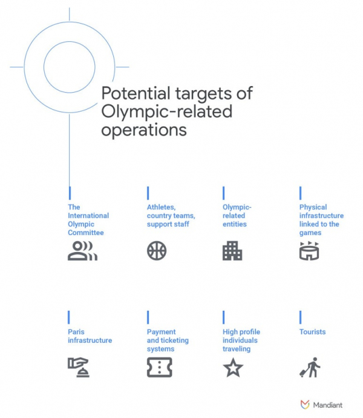
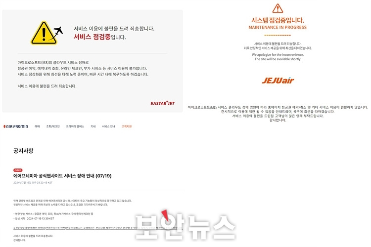
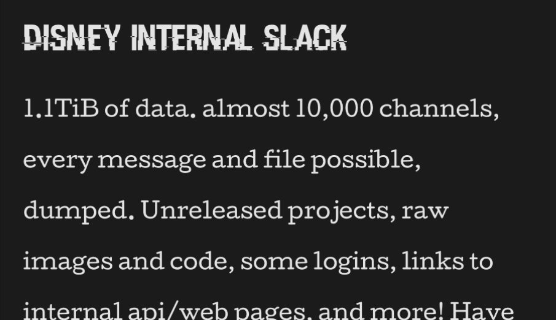

안녕하세요, clalxk 입니다 :D

7월도 벌써 끝을 향해 가네요.
7월의 끝에도 해킹짹짹과 함께 해요 ~~

이번 주도 다양한 주제로 꽉꽉 담았습니다!

## 이번 주 짹짹 PICK🐥

> 🗣️ **"도쿄보다 10배 더"...파리 올림픽, 사이버 범죄 '초긴장'**

2024.07.13 | ZDNET Korea | [기사보기](https://zdnet.co.kr/view/?no=20240712100250)

7월 24일에 올림픽이 개막해요!

지난 평창 올림픽 개막식 20분 전, 해킹으로 인해 조직위원회와 파트너사들의 컴퓨터 수백대가 마비되는 사태가 있었어요. 이 사태로 인해 일부 관객들이 티켓 인쇄에 불편을 겪었어요.  당시 평창 올림픽조직위원회는 러시아의 웜 공격으로 인해 수천 대의 컴퓨터 데이터가 사라지며 올림픽 서버 관리에 혼란을 겪었어요. 이 사태의 배후는 러시아의 소행으로 밝혀졌어요 😡 

이후로 도쿄, 베이징 올림픽에서도 꾸준한 해킹으로 인해 시스템이 마비되는 일이 잦았다고 해요. 2020 도쿄 올림픽 당시 약 4억5천만 건의 해킹이 발생했다고 하네요.. 🤯

파리 올림픽 협력 보안 업체인 Cisco는 '2020 도쿄 올림픽' 때보다 8~10배 정도 많은 사이버 공격이 예상된다고 전망했어요. 프랑스 당국은 다가오는 파리올림픽 기간 중 전례 없이 많은 사이버 범죄가 예상됨에 따라, 프랑스 정부는 사이버 범죄 전담 헌병대를 꾸리고 있어요 😎 

해당 헌병대가 가짜 올림픽 티켓 예매 사이트 일제 단속에 나서 338곳을 적발했어요. 적발된 가짜 티켓 사이트 338곳 중 51곳을 폐쇄하고 140곳은 사법 당국에 통보했다고 해요! 이번 단속 작업에는 200명 이상 규모의 군 헌병대가 동원됐다고 하네요 🫢

평창 올림픽 해킹 사태를 [영상](https://www.youtube.com/watch?v=Qq0lvSI6MS8)으로 확인해보세요!

## 
> ⚠️ **크라우드 스트라이크 팔콘 업데이트 했다가 PC 블루스크린... 전 세계 ‘파장’**
    
2024.07.19 | 보안뉴스 | [기사보기](https://m.boannews.com/html/detail.html?tab_type=1&idx=131477)

글로벌 보안 기업 크라우드 스트라이크의 팔콘 센서 업데이트 문제로 인해 전 세계 PC에 블루스크린이 표시되며 엄청난 파장이 일고 있어요. 특히 TV 방송국, 은행, 항공사 등이 영향을 받으며 방송 중단, 업무 마비 등 문제가 커지며 피해가 확산되었다네요 🫠

크라우드 스트라이크의 팔콘 센서(CrowdStrike Falcon Sensor) 업데이트 이후 **커널 드라이버 파일 csagent.sys**로 인해 전 세계 수많은 사용자의 Windows 시스템에 블루 스크린이 표시되었다고 해요.

윈도우(Windows) 부팅 시 블루스크린오브데스(BSOD) 문제를 겪고 있는 것인데요. 

업데이트된 팔콘 센서와 특정 윈도우 시스템 프로세스 간의 충돌에서 비롯된 것으로 보인다고 해요 🫢

이를 해결하기 위한 긴급 조치 방안이 2가지 정도 있어요!

1. 안전 모드에서 문제가 되는 SW 파일을 삭제
    - 안전 모드로 부팅 → 복구 화면에서 ‘고급 복구 옵션 보기’를 클릭 → 고급 복구 옵션 메뉴에서 ‘문제 해결’을 선택 → ‘고급 옵션’을 선택 → ‘시작 설정’을 선택하고 ‘다시 시작’을 클릭 → 재부팅 후 4 또는 F4 키를 눌러 안전 모드에서 PC 시작
2. 안전 모드에서 명령 프롬프트(관리자) 또는 Windows PowerShell(관리자)를 실행
    - C:Windows-System32-drivers-CrowdStrike 디렉터리로 이동 → C-00000291*.sys 패턴과 일치하는 파일 검색 후 삭제
    

해당 사건으로 인해 윈도우 10을 사용하는 기업과 조직은 업무 중단, 데이터 손실, 불편함을 호소했어요. 소셜 미디어와 포럼에는 불만과 도움 요청이 쏟아졌고, 그 중 한 대형 금융회사는 모든 직원의 컴퓨터가 동시에 BSOD를 겪으며 업무가 완전히 중단되었다고 해요. 또 다른 IT 기업은 복구 과정에서 중요 데이터 일부를 손실하여 큰 혼란을 겪었고, 학교와 병원 등 공공기관 역시 피해를 입어 교육 및 의료 서비스에 차질이 빚어졌다고 하네요. 

크라우드 스트라이크는 문제를 신속히 인정하고 해결책을 마련 중이라고 밝혔어요!

## 
> 🗣️ **사이버 보안업체 'Wiz'… 구글, 32조에 인수 추진**

2024.07.19 | 동아일보 | [기사보기](https://www.chosun.com/economy/tech_it/2024/07/16/BMPLHBWDRJCMFAZLORH3AGFXJ4/?outputType=amp)

구글의 모회사인 알파벳이 사이버 보안 스타트업 ‘Wiz’ 인수를 추진한다고 해요!

알파벳은 클라우드(가상 서버)의 보안을 전문으로 하는 기업이에요. 클라우드 시장에서 아마존·마이크로소프트(MS)에 밀려 ‘만년 3등’인 구글이 공격적인 인수합병(M&A)으로 경쟁자를 따라잡으려는 움직임으로 풀이되고 있어요.

14일 월스트리트저널(WSJ)은 알파벳이 230억달러(약 31조8044억원)에 Wiz를 인수하는 협상을 진행 중이라고 보도했다. 이는 구글이 진행한 M&A 가운데 역대 최대 규모라고 해요 🫢🤑

 

Wiz는 이스라엘에서 설립한 기업으로, 올해 120억달러의 기업 가치를 인정받은 ‘데카콘(기업 가치 100억달러 이상)’ 스타트업이에요. 인공지능(AI)을 활용해 클라우드상 보안 취약점과 공격을 자동으로 감지하고 대응하는 기술을 보유하고 있으며, 포천(Fortune) 100대 기업 중 40%를 고객사로 두고 있어요.

창업 18개월 만에 연 매출 1억달러를 찍었고, 지난해 매출은 3억5000만달러(약 4839억원)를 기록했어요. 월스트리트저널은 “클라우드 컴퓨팅은 중요한 성장 사업이지만, 알파벳은 경쟁사에 뒤처져 있다”며 “이번 인수는 알파벳의 클라우드 컴퓨팅 사업에 도움이 될 것”이라고 보도했다고 하네요!

## 
> ⚠️ **디즈니, 내부 시스템 해킹 당했다…슬랙 내용도 유출**

2024.07.16 | IT조선 | [기사보기](https://it.chosun.com/news/articleViewAmp.html?idxno=2023092119576)

월트디즈니가 해킹조직으로부터 미공개 프로젝트 정보 등 1.2테라바이트(TB) 규모의 5년치 데이터를 해킹당했다고 해요 😱 

디즈니를 해킹한 조직은 NullBulge로 알려졌어요.

NullBulge는 최근 몇 주 동안 디즈니의 슬랙 채널에서 얻은 것으로 주장하는 문서의 스크린샷을 온라인에 게시했으며, 여기에는 프로젝트 설명, 계획, 디즈니랜드 파리의 방문건, 예약·수익 데이터가 포함되어 있었어요 🫣  

[링크](https://nullbulge.se/blog.html)에서 NullBulge가 공개한 글을 확인 할 수 있어요!

[영상](https://m.youtube.com/watch?v=ZGScvWIyw2E)에서 자세한 내용을 확인해볼까요?  👀

## 짹짹이에게 물어봐   

**BSOD**

Blue Screen of Death, 윈도우 운영체제에서 시스템 오류로 인해 나타나는 화면

### 지식 PLUS ➕

[사고로 유출 된 깃허브 토큰](https://m.boannews.com/html/detail.html?tab_type=1&idx=131370)

[내 손으로 피싱 파일 실행? 붙여넣기로 감염되는 다크게이트 악성코드 유포](https://m.boannews.com/html/detail.html?tab_type=1&idx=131437)

[온라인 강의 플랫폼 ‘클래스유’, 회원 개인정보 대거 유출](https://m.boannews.com/html/detail.html?tab_type=1&idx=131329)

## **7월 컨퍼런스 | 대회** 🐥

[암호분석경진대회](https://cryptocontest.kr/challenge/) | 한국정보보호학회 | ~24.08.31 

[금융권 보안 취약점 신고포상제 (버그바운티)](http://www.itdaily.kr/news/articleView.html?idxno=223547) | 금융보안원 | ~24.08.31

[국제 사이버범죄대응 심포지엄](https://iscr.cyber.go.kr/) | 경찰청 | 24.07.01 사전 등록 시작 (24.08.27 ~ 24.08.29)