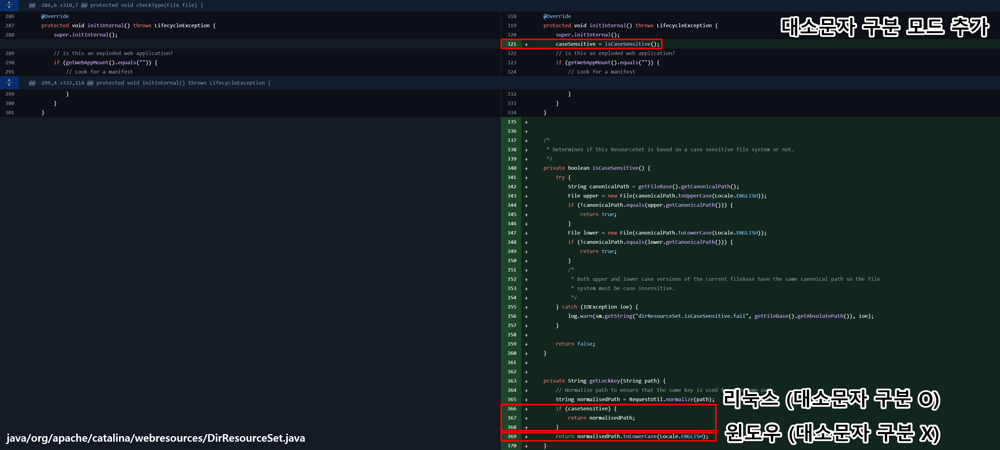
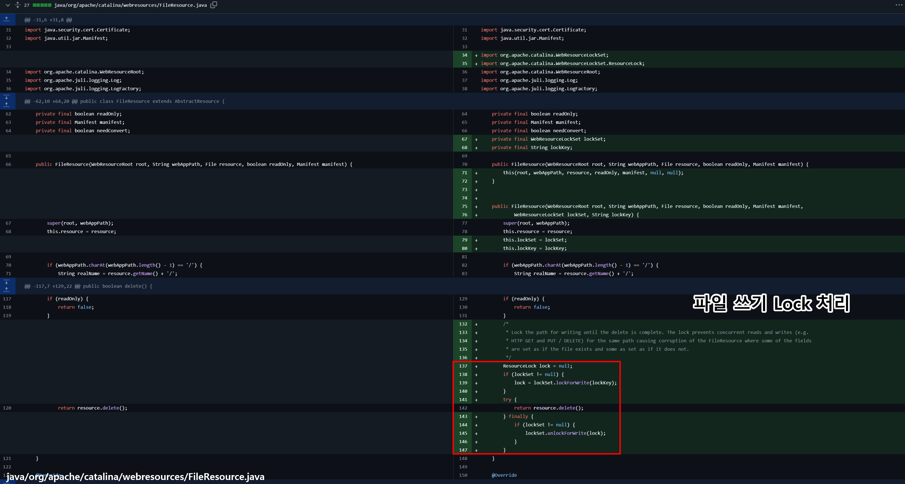
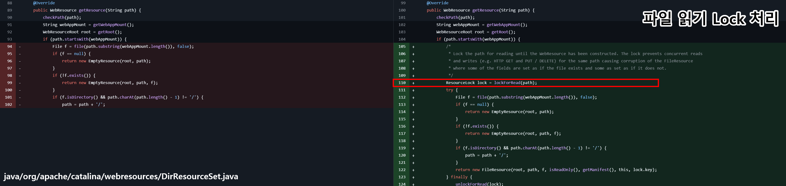

## URL

- https://github.com/advisories/GHSA-5j33-cvvr-w245
- https://github.com/advisories/GHSA-27hp-xhwr-wr2m

## Target

- Tomcat 11 < 11.0.2
- Tomcat 10 < 10.1.34
- Tomcat 9 < 9.0.98


## Explain

**CVE-2024-50379**는 Apache Tomcat에서 발생하는 **Time-of-Check to Time-of-Use (TOCTOU)** 레이스 컨디션 취약점으로, 대소문자를 구분하지 않는 파일시스템(Windows)에서 DefaultServlet의 쓰기 권한(readonly=false)이 활성화되었을 때 작동됩니다.

이 취약점은 특정 경로에 대소문자를 조작한 쓰기(PUT/DELETE)와 읽기(GET) 요청을 동시에 실행할 경우 발생하며, 임의의 JSP 파일을 업로드하고 실행함으로써 원격 코드 실행이 가능하게 만듭니다.

**CVE-2024-56337**는 CVE-2024-50379 취약점을 보완하기 위한 패치 후 추가로 발견된 문제를 해결하기 위해 발표된 것으로 Java의 속성 값 sun.io.useCanonCaches의 설정값이 true로 되어있을 경우 경로가 캐싱 되는 문제가 있어 CVE-2024-50379에서 발생하는 경로 문제가 반복되는 것을 해결하기 위해 발표되었습니다.


```
    <servlet>
        <servlet-name>default</servlet-name>
        <servlet-class>org.apache.catalina.servlets.DefaultServlet</servlet-class>
        <init-param>
            <param-name>debug</param-name>
            <param-value>0</param-value>
        </init-param>
        <init-param>
            <param-name>listings</param-name>
            <param-value>false</param-value>
            <param-name>readonly</param-name>
            <param-value>false</param-value> <!-- 취약한 설정 -->
        </init-param>
        <load-on-startup>1</load-on-startup>
    </servlet>

```

[위와 같이](https://github.com/apache/tomcat/blob/main/conf/web.xml) readonly가 false일 경우 DefaultServlet에 의해 파일 쓰기가 가능해집니다. DefaultServlet의 경우 정적 파일(CSS/JS/HTML 등)을 처리하기 위한 서블릿고 JSP 파일을 처리하는 서블릿은 JspServlet입니다. 

예를 들어, **evil.JSP와** 같이 확장자명이 대문자로 이루어진 파일을 업로드하고 요청할 경우 정적 파일로 응답이 와야 합니다. 다만, 이 과정에서 **`경로를 해석하는 로직에 문제`**가 있어 **`윈도우 운영체제`환경에서 같이 파일 경로에 대소문자 구분이 없는 경우 `evil.JSP가 evil.jsp로 해석되어 JSP 컴파일`**되는 과정이 발생합니다.

취약점이 발생하는 과정을 요약하면 다음과 같습니다.

1. PUT evil.JSP
    - Tomcat에서 **`DefaultServlet`**을 통해 정적 파일 업로드
    - Windows에는 대소문자 구분이 없어 evil.jsp와 evil.JSP는 동일한 파일로 취급됨
2. GET evil.jsp
    - 내부적으로 경로를 체크할 때 사용하는 함수 getCanonicalPath, getAbsolutePath를 사용할 때 윈도우 파일시스템의 특징과 자바의 캐싱 문제로 evil.jsp가 evil.JSP로 resolve 될 수도 있고, 아닐 수도 있음 (레이스 컨디션)
    - 클라이언트가 evil.jsp에 요청했으나 evil.JSP를 읽고 Tomcat에서 **`JspServlet이 JSP 컴파일`**하여 응답.
3. 레이스 컨디션
    - 위 과정이 동시에 이루어지거나 엇갈리면 Tomcat은 evil.jsp를 처리하려다 evil.JSP를 읽고 로드하게 되는 타이밍이 발생할 수도 있음.

위 문제를 해결하기 위해 윈도우와 같이 파일시스템 상에서 대소문자 구분을 하지 않는 경우를 고려하여 경로상 문자열을 모두 소문자 처리하는 것으로 변경했습니다.



레이스 컨디션 문제를 해결하기 위해 읽기와 쓰기 작업을 처리하는 로직에 ResourceLock 클래스를 추가하여 원자적인 처리를 하도록 변경했습니다.




또한, 경로를 가져올 때 사용되는 메소드 getCanonicalPath의 값을 캐싱 하는 설정 sun.io.useCanonCaches 값을 false로 변경하라는 권고를 발표했습니다. 해당 기능은 getCanonicalPath 메소드를 사용할 때 결과값을 캐싱 하는 기능입니다.

- 윈도우 시스템 변수에서 **`JAVA_OPTS`**를 추가하거나 기존 값에`-Dsun.io.useCanonCaches=false` 를 추가하여 해당 속성을 비활성화할 수 있습니다.
    - Java8: 기본값 true
    - Java11: 기본값 true
    - Java17: 기본값 false
    - Java21: 해당 기능 없음


## Reference

- https://medium.com/@patelvidhi4288/deep-dive-poc-of-cve-2024-50379-exploit-tomcat-vulnerability-9-8-severity-776cfcfcf3ed
- https://mp.weixin.qq.com/s/d7dneaUgF2TD2KGdT1qiQw
- https://xz.aliyun.com/t/16900?time__1311=Gui%3D0KYIqAxUx05DK7RxIgYyqvKYurpD
- https://unk.org.cn/2024/12/26/CVE-2024-50379/


