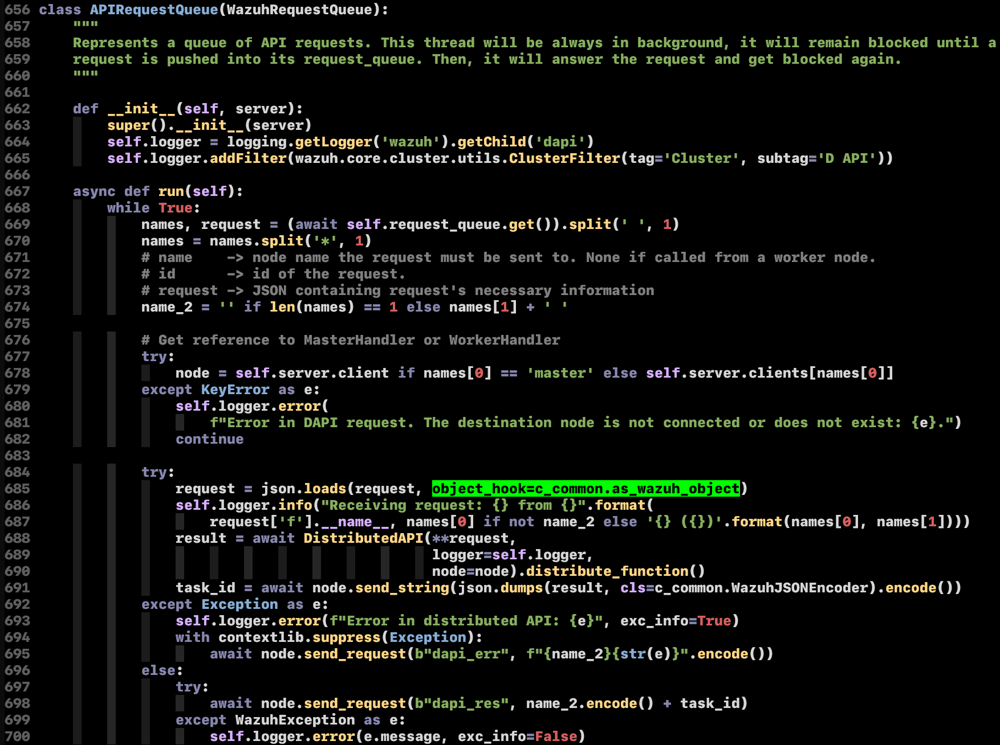
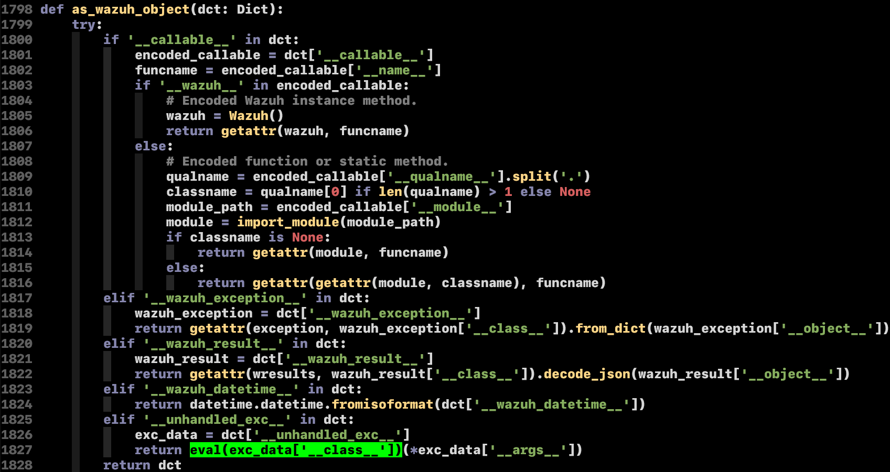
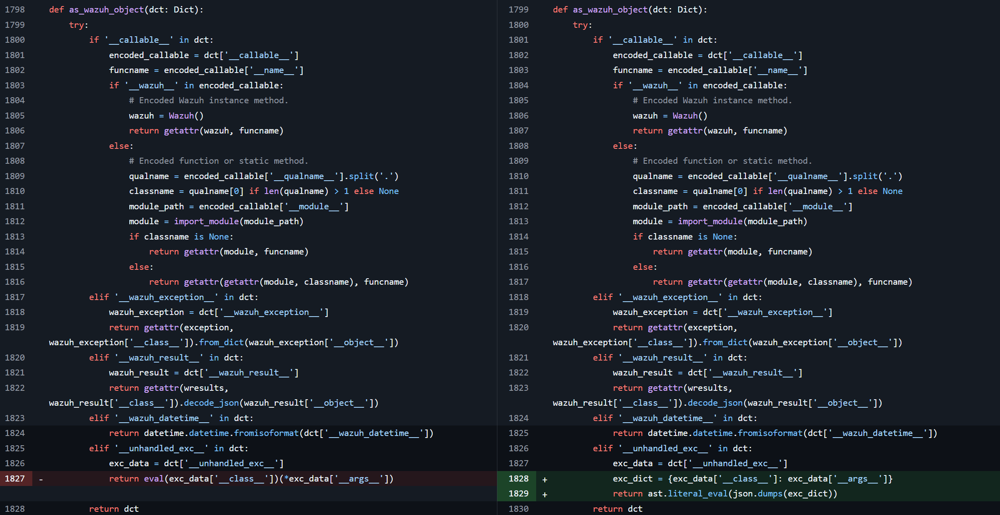

## URL

- https://github.com/wazuh/wazuh/security/advisories/GHSA-hcrc-79hj-m3qh

## Target

- Wazuh 4.4.0 이상 4.9.1 이하 버전


## Explain

CVE-2025-24016는 오픈소스 SIEM(Security Information and Event Management)인 Wazuh에서 발생하는 안전하지 않은 역직렬화로 인한 RCE 취약점입니다. Wazuh는 크게 Wazuh Agent, Wazuh Manager, Elasticsearch & Kibana로 구성되어 있습니다.

해당 취약점의 근본 원인은 Wazuh Manager에서 `eval` 함수를 사용함으로써 발생합니다. Wazuh Manager의 일부 API는 JSON 요청을 역직렬화(`json.loads()`)할 때, `object_hook` 옵션을 통해 `as_wazuh_object` 함수를 호출하여 후처리를 수행합니다.




`as_wazuh_object` 함수는 JSON 내부에 `__unhandled_exc__` 키가 있을 경우, 그 안의 `__class__`와 `__args__` 값을 사용해 `eval`함수를 호출합니다. 이 과정에서 사용자 입력을 그대로 `eval`에 전달하므로 임의 명령 실행이 가능합니다.




예를 들어, 아래와 같은 JSON을 API 요청으로 전달하면 `os.system("bash")`가 실행되어 RCE가 발생할 수 있습니다.

```
{
  "__unhandled_exc__": {
      "__class__": "os.system",
      "__args__": [
	      "bash"
		]
	}
}
```

해당 취약점은 `eval`함수를 `literal_eval`함수로 패치하며 제한된 타입(strings, bytes, numbers, tuples, lists, dicts, sets, booleans, None and Ellipsis)만 처리할 수 있도록 보안했습니다.




## Reference

- https://github.com/0xjessie21/CVE-2025-24016


