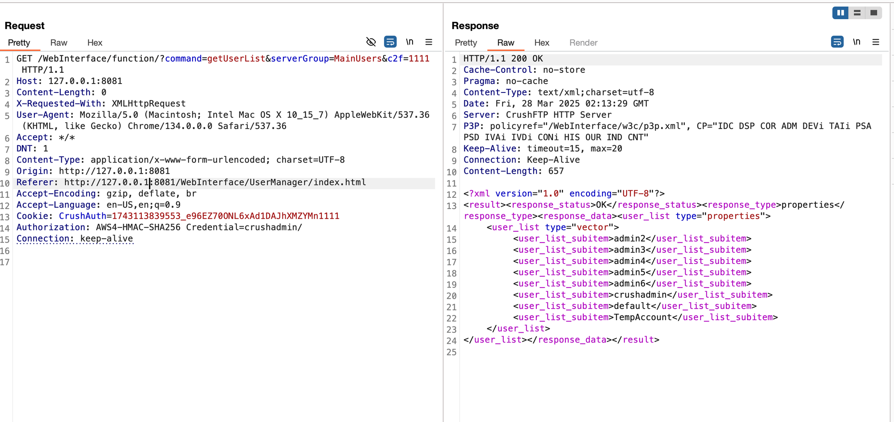

## URL

- https://projectdiscovery.io/blog/crushftp-authentication-bypass

## Target

- CrushFTP 11.0.0 ≤ 11.3.0
- CrushFTP 10.0.0 ≤ 11.8.3

## Explain
>*본 취약점은 3월 21일 CVE-2025-2825로 부여된 바 있습니다. 취약점을 발견한 Outpost24는 관련 내용을 CrushFTP에 제보하여 고객들에게 보안 권고 안내와 MITRE를 통해 CVE 발급을 진행하던 중, Vulncheck사는 ITW에서 악용되고 있어 빠른 조치가 필요하다며 자체적으로 CVE-2025-2825를 발급 했습니다.*
>
>*이후 3월 27일 Mitre는 Vuluncheck사에서 부여한 CVE-2025-2825는 Reject하고 CVE-2025-31161로 부여를 하여 **현재는 CVE-2025-31161**로 추적되고 있습니다.*

CrushFTP는 AWS S3와 호환되는 API를 제공합니다. 이 API를 구현하는 과정에서 **인증 관련 플래그가** 파라미터 오버로딩으로 잘못 처리돼 인증 우회가 발생합니다. 공격자는 이를 악용해 관리자 권한 탈취 및 파일 탈취가 가능합니다.

- AWS S3 인증 헤더

```
Authorization: AWS4-HMAC-SHA256 Credential=<AccessKey>/<Date>/<Region>/s3/aws4_request, SignedHeaders=<Headers>, Signature=<Signature>
```

AWS의 S3 API 인증 과정은 Authorization 헤더 내 Credential 키의 값인 AccessKey를 통해 사용자를 식별한 뒤 해당 값과 Signature를 서버에서 검증하며 인증을 수행합니다. CrushFTP 구현에서는 `Credential=<username>[~password]/…` 형태를 허용하며, `<username>`과 `~password`를 분리해 내부 인증에 사용합니다.

### 취약점 발생 코드 (loginCheckHeaderAuth 메소드)

```java
if (this.headerLookup.containsKey("Authorization".toUpperCase()) &&
    this.headerLookup.getProperty("Authorization".toUpperCase()).trim().startsWith("AWS4-HMAC")) {

    String s3_username = this.headerLookup.getProperty("Authorization".toUpperCase()).trim();
    String s3_username2 = s3_username.substring(s3_username.indexOf("=") + 1);
    String s3_username3 = s3_username2.substring(0, s3_username2.indexOf("/"));

    String user_pass = null;
    String user_name = s3_username3;
    boolean lookup_user_pass = true; //파라미터 오버로딩 유발 플래그

    // if문에 들어가지 않을 경우 특정 lookup_user_pass는 true로 유지
    if (s3_username3.indexOf("~") >= 0) {
        user_pass = user_name.substring(user_name.indexOf("~") + 1);
        user_name = user_name.substring(0, user_name.indexOf("~"));
        lookup_user_pass = false;
    }
		
		// lookup_user_pass가 true로 전달될 경우 파라미터 오버로딩 발생되며 인증우회
    if (this.thisSession.login_user_pass(lookup_user_pass, false, user_name, lookup_user_pass ? "" : user_pass)) {
    }
}
```

위 코드는 S3 스타일의 API 사용자가 요청을 했을 때 헤더의 Authorizion 헤더를 처리하는 로직이며 취약점이 발생하는 주요 내용은 다음과 같습니다.

파라미터 오버로딩을 유발하는 플래그 **`lookup_user_pass`** 

- true: 패스워드를 내부 저장소에서 조회
- false: 패스워드를 조회하지 않고 전달받은 AccessKey 값 내 패스워드를 사용

Authorization 헤더의 Credential 키의 값(s3_username3 변수)을 추출하여 user_name, user_pass 파싱

- Credential 키 값(<AcessKey>)에는 {username~passwrod}로 구성되어 있으며, ~가 존재하지 않을 경우 if문을 타지 않게 되며 **`lookup_user_pass`** 플래그가 **`true`**로 유지

login_user_pass 메소드에 lookup_user_pass 플래그가 전달되지만 ****login_user_pass 메소드에서는 해당 파라미터를 anyPass로 사용하고 있어 **`파라미터 오버로딩이 발생`**합니다.

### login_user_pass 메소드

```java
public boolean login_user_pass(boolean anyPass, boolean doAfterLogin, String user_name, String user_pass) throws Exception {                                                                                                                                2     if (user_name.length() <= 2000) {
        ...
        int length = user_pass.length();
        ServerStatus serverStatus = ServerStatus.thisObj;
        if (length <= ServerStatus.IG("max_password_length") || user_name.startsWith("SSO_OIDC_")) {
            Log.log("LOGIN", 3, new Exception(String.valueOf(LOC.G("INFO:Logging in with user:")) + user_name));
            uiPUT("last_logged_command", "USER");

            ...
						// 인증 로직 (anyPass 활성화시 우회)
            boolean verified = verify_user(user_name, verify_password, anyPass, doAfterLogin);
            if (verified && this.user != null) {
                return true;
            }
        }
    }
    return false;
}
```

anyPass를 전달받은 login_user_pass 메소드는 verify_user에 해당 플래그를 전달합니다.

### verify_user 메소드 일부

```java
if (anyPass && user.getProperty("username").equalsIgnoreCase(the_user)) {
    return user;
}
```

anyPass가 활성화 되어있을 경우 특정 username으로 로그인이 이루어집니다.

### PoC



공격자는 다음과 같은 헤더를 통해 인증우회가 가능합니다.

- 경로: &c2f={} // 쿠키 헤더값과 동일하게 구성
- Cookie헤더: CrushAuth키 값을 {13자리_랜덤숫자}_{30자리_랜덤값}{c2f} 구성
- Authorization 헤더: AWS4-HMAC-SHA256 Credentail={username}/

### 패치

취약점 패치 내용은 다음과 같습니다.

1) lookup_password 기능 비활성화

```java
// lookup_password 기능을 기본적으로 비활성화 하는 설정을 추가했습니다.
default_settings.put("s3_auth_lookup_password_supported", "false");
```

2) Authorization 헤더 내 Credential 키 값 구성 검증

```java
// Authorization 헤더의 Credential 키 값에 ~가 존재하지 않을 경우 에러를 반환하도록 수정
if (s3_username3.indexOf("~") >= 0) {
    user_pass = user_name.substring(user_name.indexOf("~") + 1);
    user_name = user_name.substring(0, user_name.indexOf("~"));
    lookup_user_pass = false;
} else {
    ServerStatus serverStatus = ServerStatus.thisObj;
    if (!ServerStatus.BG("s3_auth_lookup_password_supported")) {
        return;
    }
}
```

3) 인증 로직 변경

```java
Properties tmp_user = UserTools.ut.getUser(this.thisSession.server_item.getProperty("linkedServer", ""), user_name);
if (tmp_user != null && lookup_user_pass) {
    // lookup_password 수행 (패스워드 저장소에서 유저의 패스워드를 조회)
    user_pass = com.crushftp.client.Common.encryptDecrypt(tmp_user.getProperty("password"), false);
}
if (tmp_user != null && user_pass != null) {
    // 아이디/패스워드 검증 수행
}
```
