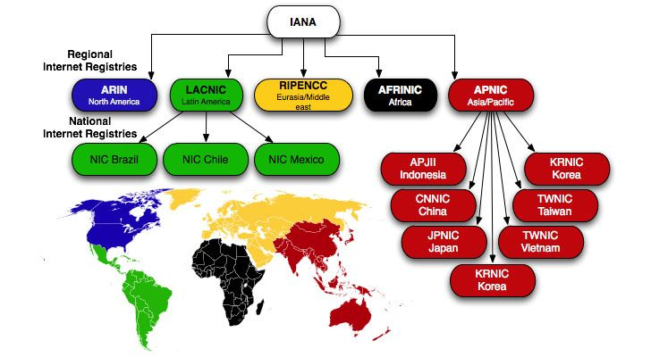

Hello, I’m empty 👋. In the field of security, we often need to analyze suspicious IP addresses. When using various IP lookup services, the verdict on whether an IP is malicious may differ, but “country information, ASN information, ISP information” are consistently provided. I became curious about where and how this data is obtained and served, so I decided to investigate.

# 🔍 Ways to Look Up IP Information

Broadly speaking, IP information can be retrieved via:

1. IP information lookup services
2. IP information databases
3. The Whois protocol

Each method offers different speeds, accuracy, and freshness of data, so it’s important to choose the method that best fits your needs.

## 🌐 IP Information Lookup Services

Some services provide reputation (malicious or fraud-related) information, others provide port scanning results, and others geographic location information. However, country, ASN, and ISP name are virtually always provided, no matter which service you use.

| **Type of Service** | **Examples** |
| --- | --- |
| Reputation Check | Virustotal, AbuseIPDB |
| Port Scanner | Censys, Shodan, Criminal IP |
| IP Geolocation | MaxMind, ipinfo, IP2Location, IPQualityScore |

Although the data scope and content may differ subtly by service, almost every IP lookup service commonly returns the IP’s country, ASN, and ISP name. Personally, I often use the `ipinfo` service via a simple `curl` command in the terminal.


Interestingly, different services can display different countries or location info for the exact same IP. For example, when looking up an IP address from the Hong Kong-based cloud provider SonderCloud Limited on VirusTotal, it shows as being in the United States, while ipinfo displays Hong Kong.


These discrepancies arise from a range of factors. Even if a company is registered in Hong Kong, its actual server could be physically located in the US, or vice versa. Additionally, some services base the IP’s country not on the physical location but on the country in which the business is registered, or on the IP block assignment recorded by a Regional Internet Registry (RIR).

On top of that, the update frequency and data collection methods vary by service, so even the same IP may give different results from different sources.

## 💾 Database Lookup

Here, “database” doesn’t refer to applications like MySQL or PostgreSQL; rather, it refers to a prestructured “IP information database file” that lists IP addresses along with details such as country and ASN. These can be implemented in various formats—like JSON, CSV, or MMDB—and are commonly used in `.mmdb` format.


**MMDB** is a file format developed and published by MaxMind. Because it’s an open format, MaxMind and many other IP information services provide their IP database files in `.mmdb` format. Many security devices that require real-time performance load the mmdb file into memory for super-fast lookups (on the order of less than 0.00n seconds per IP).

- Example Lookup Code:

```python
import maxminddb

ip = "8.8.8.8"

with maxminddb.open_database("country_asn.mmdb") as reader:
    result = reader.get(ip)
    print(result)
```

- Output:

```jsx
{
  "as_domain": "google.com",
  "as_name": "Google LLC",
  "asn": "AS15169",
  "continent": "NA",
  "continent_name": "North America",
  "country": "US",
  "country_name": "United States"
}
```

However, because data such as ASN can change daily, you need to periodically update your local database file to stay current.

## 🛰️ Whois Protocol (TCP, 43)

Lastly, there’s the Whois protocol. When you query an IP address using Whois, it sends a request to the appropriate RIR’s Whois server, which then returns detailed information about the IP. Since the data is maintained directly by an RIR, it’s typically highly accurate.


Windows doesn’t include a built-in Whois command, so I sometimes use the NirSoft tool **IPNetInfo**, which is particularly handy for bulk lookups.


Because Whois is a query-based method that communicates with a remote server, network latency is inevitable; and if the server is under heavy load or the queries are excessive, your requests might get blocked. For instance, the IPNetInfo product page states:

> Sometimes the ARIN Whois server may be down and fail to respond to IPNetInfo’s WHOIS queries, which prevents IPNetInfo from retrieving IP addresses. If this happens, try again later.
> 

Below is a summary of each method:

| **Method** | **Freshness** | **Accuracy** | **Speed** | **Notes** |
| --- | --- | --- | --- | --- |
| **1) External Service** | 👍 (frequently updated) | 👍 (various sources) | 👎 (network latency) | - Many services are updated in real-time or very often, so you can get the latest data - However, there may be network delays depending on traffic or server conditions - Excessive queries or poor server conditions can cause slow or blocked responses |
| **2) Build Your Own DB** | 👎 (periodic updates) | 🤔 (aggregated data) | 👍 (local lookups) | - Very fast since you’re querying locally - If the update cycle is too long, freshness and accuracy can suffer |
| **3) Whois Server** | 👍 (RIR data) | 👍 (official info) | 👎 (network latency) | - Highly accurate, since the info comes directly from RIRs - Excessive queries or server issues can cause slow or blocked responses |

Therefore, if you frequently query IPs and need quick responses in an environment where external internet access might not be possible, building your own local country database is the best approach. Below, I’ll show you how to collect source data from RIRs and build an IP-country information database in your local environment.

# 🌐 Understanding How IP Addresses Are Managed

The public IP addresses we use—around 3.7 billion—are limited resources. To manage them effectively, a central coordinating body is required. That role is filled by **ICANN (Internet Corporation for Assigned Names and Numbers)** in the United States.



ICANN manages top-level internet resources like IP addresses, DNS, and protocol numbers. Because ICANN can’t manage all IP addresses directly, the **IANA (Internet Assigned Numbers Authority)**—an organization under ICANN—allocates IP address ranges to **RIRs (Regional Internet Registries)** by region.

There are currently five RIRs: **ARIN (North America)**, **RIPENCC (Europe)**, **LACNIC (Latin America)**, **AFRINIC (Africa)**, and **APNIC (Asia)**. Of these, LACNIC and APNIC maintain **NIRs (National Internet Registries)** to further subdivide responsibilities at a national level:

- APNIC includes KRNIC (Korea), CNNIC (China), JPNIC (Japan), TWNIC (Taiwan), VNNIC (Vietnam), etc.
- LACNIC includes NIC Brazil (Brazil), NIC Chile (Chile), NIC Mexico (Mexico)

In other words, IP addresses are managed in this chain: **ICANN → IANA → RIR → NIR → ISP**.

# 🏗️ Building an IP-Country Database

Each RIR routinely uploads statistics in a specific format to a specific path (named `stats`) on their FTP server, at a specific time (23:59:59), under a specific file name.


You can learn more about file format details by checking out APNIC’s [RIR statistics exchange format](https://www.apnic.net/about-apnic/corporate-documents/documents/resource-guidelines/rir-statistics-exchange-format/).

# 💻 Creating a Program to Query an IP ↔ Country Database

Now that we know the data sources (RIR FTP servers) and the file formats, we can build a tool. For example, you could:

1. Every day at 09:00 (UTC+9), download each `delegated-{REGISTRY}-latest` file from every RIR’s FTP server
2. Extract each country / IPv4 / IP range from the downloaded file
3. Convert the IP range (start ~ end) into decimal, sort, then save to a file
4. Load the country-IP-range pairs into memory
5. Use binary search

Here’s some sample code:

```python
# builtin modules
import os
import ipaddress
import asyncio
from datetime import datetime

# install modules
import aiohttp

intervals = []

today = datetime.now().strftime("%Y%m%d")

RIR_URLS = [
    "https://ftp.apnic.net/stats/apnic/delegated-apnic-extended-latest",
    "https://ftp.arin.net/pub/stats/arin/delegated-arin-extended-latest",
    "https://ftp.lacnic.net/pub/stats/lacnic/delegated-lacnic-extended-latest",
    "https://ftp.ripe.net/pub/stats/ripencc/delegated-ripencc-extended-latest",
    "https://ftp.afrinic.net/stats/afrinic/delegated-afrinic-extended-latest",
]

MAPPING_DATABASE = f"./rsc/{today}_mapping.db"

# Download
async def fetch(session, url):
    async with session.get(url) as response:
        print(f"[{response.status}] - {url}")
        content = await response.read()
        filename = url.split("/")[-1]
        filepath = f"./rsc/{today}_{filename}"
        with open(filepath, "wb") as f:
            f.write(content)
    return

# Download coroutine
async def download():
    async with aiohttp.ClientSession() as session:
        await asyncio.gather(*(fetch(session, url) for url in RIR_URLS))
    print("Download Complete")
    return

# Load database
def init_database():
    if not os.path.exists("./rsc"):
        os.mkdir("./rsc")

    # If the IP database set exists, load it into memory
    if os.path.exists(MAPPING_DATABASE):
        print("Databse load")
        with open(MAPPING_DATABASE, "r") as f:
            for line in f:
                start_ip, end_ip, country = line.strip().split(",")
                intervals.append((int(start_ip), int(end_ip), country))
        return

    # If it doesn't exist, download, process, and save
    asyncio.run(download())
    for rir_url in RIR_URLS:
        filename = rir_url.split("/")[-1]
        filepath = f"./rsc/{today}_{filename}"
        with open(filepath, "r") as f:
            for line in f:
                line = line.strip().split("|")
                if len(line) != 8 or line[2] != "ipv4":
                    continue
                country = line[1]
                ip = line[3]
                ip_range = line[4]
                start_ip = int(ipaddress.IPv4Address(ip))
                end_ip = (int(ipaddress.IPv4Address(ip)) + int(ip_range)) - 1
                result = (start_ip, end_ip, country)
                intervals.append(result)

    # Save the data
    intervals.sort(key=lambda x: x[0])
    with open(MAPPING_DATABASE, "w") as f:
        for interval in intervals:
            line = f"{interval[0]},{interval[1]},{interval[2]}"
            f.write(line + "\n")
    print("Databse load")
    return

# Search
def search(search_ip):
    result = None
    try:
        search_ip = int(ipaddress.IPv4Address(search_ip))
    except:
        return None
    left, right = 0, len(intervals) - 1
    while left <= right:
        mid = (left + right) // 2
        start_ip, end_ip, country = intervals[mid]
        if start_ip <= search_ip <= end_ip:
            result = country
            break
        elif start_ip > search_ip:
            right = mid - 1
        else:
            left = mid + 1
    return result

def main():
    init_database()
    while True:
        ipv4 = input("Insert IPv4: ")
        r = search(ipv4)
        print(r)

if __name__ == "__main__":
    main()

```


Once downloaded from the RIRs, you’ll see that around 253,714 IP ranges (covering the roughly 3.7 billion public IPs) exist. That effectively means you can figure out the country of any public IP. Interestingly, the program I wrote above seems to perform 30–250 times faster lookups than queries using `.mmdb`.

My guess is that MMDB might have more granularly subdivided IP ranges and also stores additional data (like ASN), so that could explain the difference.

# ✨ Conclusion

RIR data only contains information such as which IP addresses were assigned (e.g., IP block allocations). It doesn’t tell you which ASNs those IPs belong to. To figure that out, you’d need to collect data from BGP (Border Gateway Protocol) tables. Because this post has already grown quite long, I’ll continue this topic in a future article.

For sanity’s sake, I personally recommend regularly downloading an `.mmdb` file from ipinfo or another provider, if feasible.
