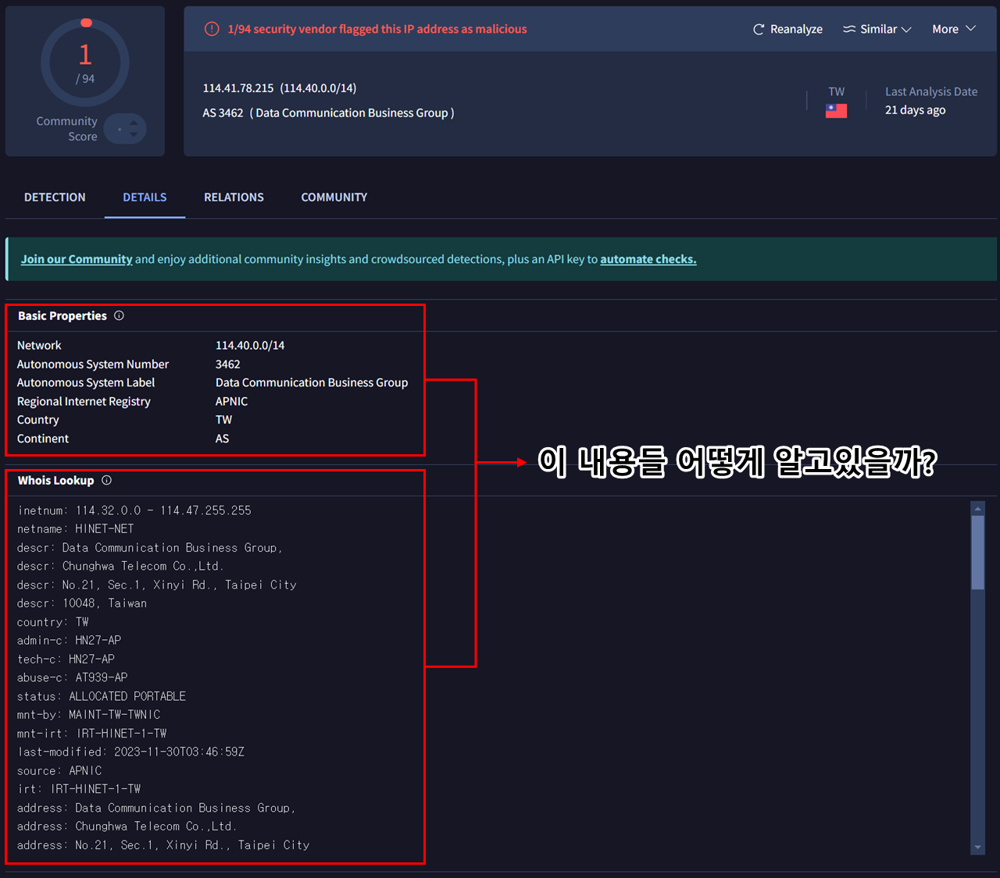
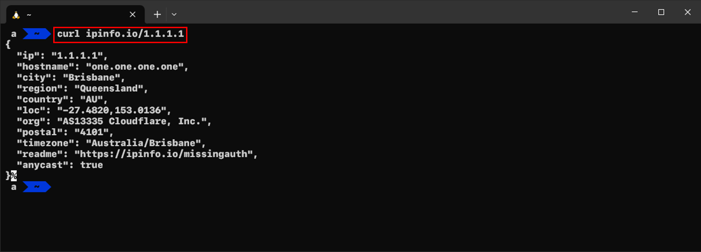
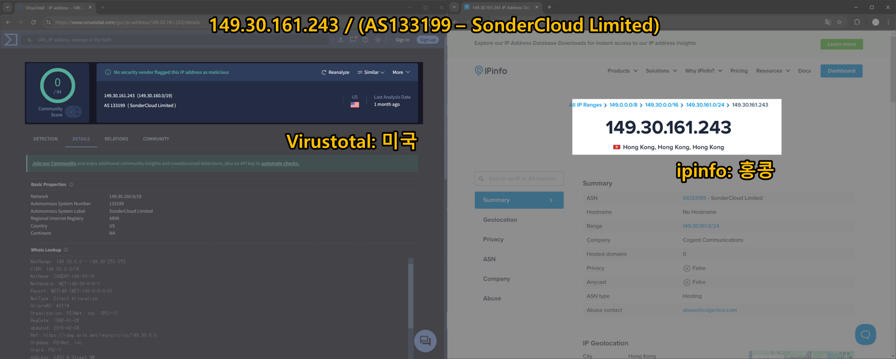
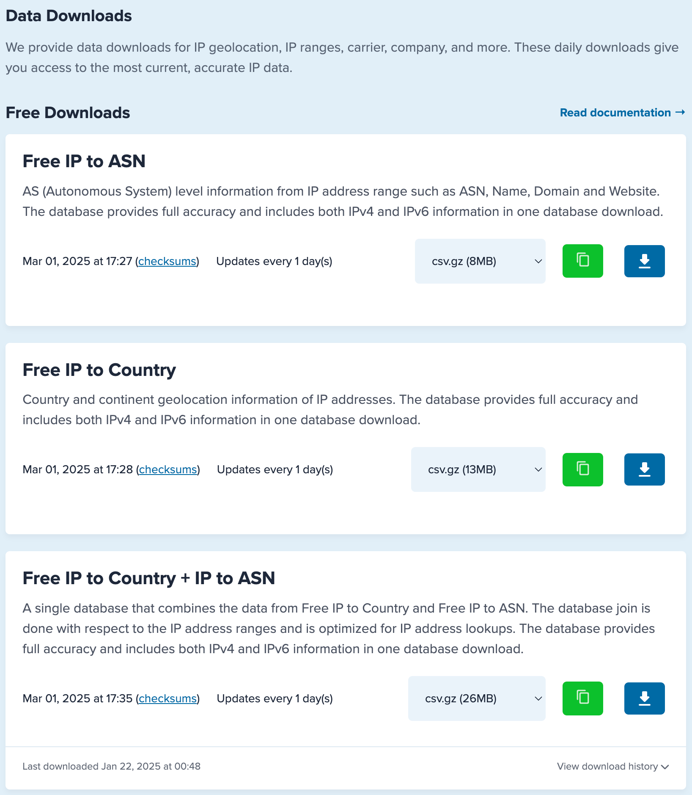
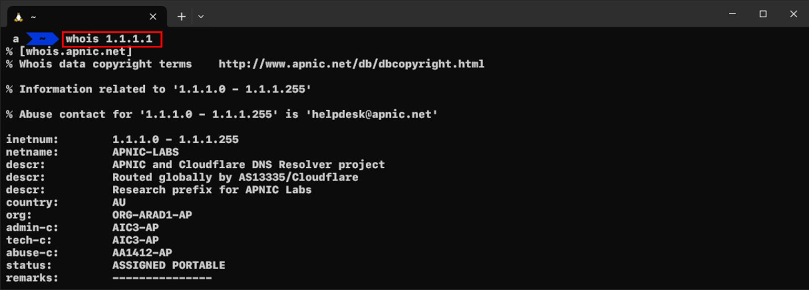
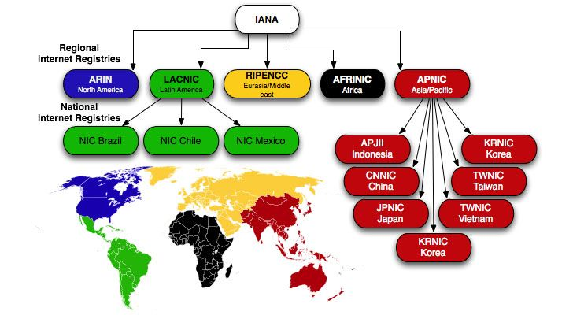
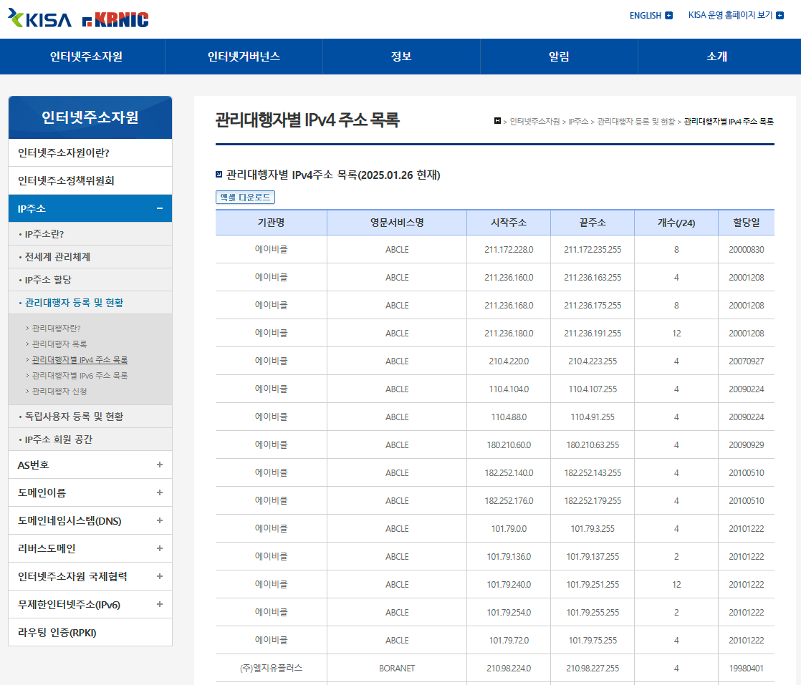
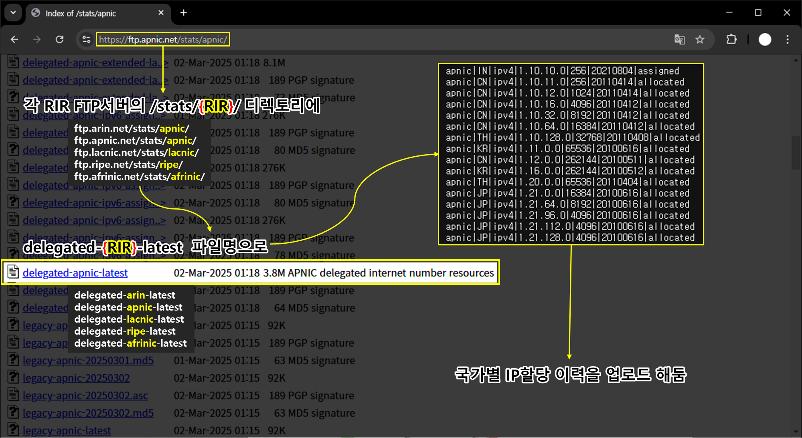
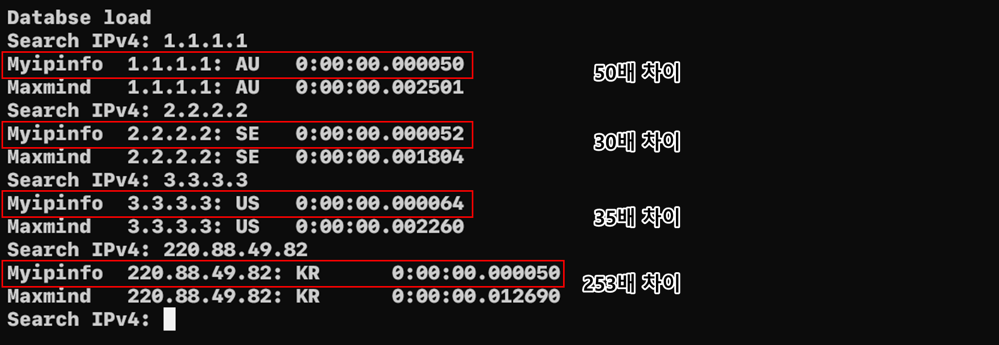

안녕하세요. empty입니다👋.  보안 업무를 하다 보면 의심스러운 IP를 분석하는 일이 잦은데요. 여러 IP 조회 서비스를 이용해 보면 악성 여부의 결과는 서로 다를 수 있으나 “국가 정보, ASN 정보, ISP 정보”는 모두 동일하게 제공됩니다. 이러한 데이터는 어디서 어떻게 구해서 제공해 주는지 궁금증이 생겨 직접 알아봤습니다.

# 🔍 IP 정보를 조회하는 방법들

IP 정보를 조회하는 방식은 크게 IP 정보 조회 서비스, 데이터베이스 조회, Whois 프로토콜 세 가지로 구분할 수 있습니다. 각각의 방법은 속도, 정확성, 최신성이 다르므로 상황에 맞춰 선택해야 합니다.

## 🌐 IP 정보 조회 서비스

IP 정보를 조회하는 서비스들은 악성 여부나 사기 관련 평판 정보를, 일부는 포트 스캔 결과를, 또 일부는 지리적 위치 정보를 제공하는 등의 차이가 있습니다. 하지만 공통적으로 국가, ASN, ISP 명 등의 기본 정보는 동일하게 제공됩니다.

| **서비스 종류** | **주요 서비스 명** |
| --- | --- |
| 평판 조회 | Virustotal, AbuseIPDB |
| 포트 스캐너 | Censys, Shodan, Criminal IP |
| IP 지리정보 | MaxMind, ipinfo, IP2Location, IPQualityScore |

서비스 종류에 따라 제공되는 데이터 범위와 내용에는 미묘한 차이가 있으나, 거의 모든 IP 조회 서비스는 공통적으로 국가, ASN, ISP 명 정도는 제공합니다. 개인적으로는 터미널에서 curl 명령어로 간단히 조회할 수 있는 ipinfo 서비스를 자주 활용합니다.



흥미로운 점은 서비스별로 IP 국가 정보나 위치 정보가 서로 다르게 표시될 때가 종종 있다는 것입니다. 예를 들어, 홍콩의 클라우드 업체 SonderCloud Limited IP 주소를 VirusTotal에 조회할 경우 미국으로 표시되고, ipinfo에서는 홍콩으로 표시되고 있습니다.



이러한 차이가 나타나는 이유는 복합적입니다. 법인이 홍콩에 있더라도 물리적 서버 위치가 미국일 수도 있고, 그 반대일 수도 있습니다. 또한, 서비스 제공자가 IP 국가 정보를 표시할 때 물리적 위치가 아니라 사업자 등록 국가 또는 RIR에 할당된 IP 블록 기준으로 표기하는 경우도 있습니다.

거기에 더해 데이터베이스를 업데이트하는 주기나 정보 수집 방식이 서비스마다 다르기 때문에, 같은 IP라도 서로 다른 결과가 나올 수 있습니다. 

## 💾 데이터베이스 조회

데이터베이스라 함은 MySQL, PostgreSQL 같은 DB 애플리케이션이 아니라, **IP-국가-ASN** 등과 같은 IP의 정보를 구조화 시켜 미리 정리한 “IP 정보 데이터베이스 파일”을 의미합니다. 편의에 따라 json, csv, mmdb 등 자유롭게 구현하여 사용되고 있으며, 주로 mmdb 파일을 사용합니다.



MMDB는 MaxMind 사에서 개발하여 공개한 파일 포맷입니다. 공개된 파일 포맷이다 보니, MaxMind를 포함한 여러 IP 정보 조회 서비스 업체들이 MMDB 파일로 데이터베이스 파일을 제공해 주고 있습니다. mmdb 파일을 메모리에 올린 뒤, 조회를 하기 때문에 IP 하나를 조회하는 데 소요되는 시간이 0.00n초 미만이기 때문에 많은 실시간 성이 중요한 보안장비들은 mmdb를 활용하고 있습니다.

- 조회 코드 예시

```python
import maxminddb

ip = "8.8.8.8"

with maxminddb.open_database("country_asn.mmdb") as reader:
    result = reader.get(ip)
    print(result)
```

- 출력

```jsx
{
  "as_domain": "google.com",
  "as_name": "Google LLC",
  "asn": "AS15169",
  "continent": "NA",
  "continent_name": "North America",
  "country": "US",
  "country_name": "United States"
}
```

다만, IP의 정보(ASN 등)는 경우 매일 실시간으로 갱신되고 변경사항이 발생하기 때문에 위와 같은 파일을 주기적으로 갱신해 줘야 한다는 수고로움이 존재합니다. 

## 🛰️ Whois 프로토콜(TCP,43)을 통한 조회

마지막으로 Whois 프로토콜 활용입니다. Whois 프로토콜에 IP 주소를 넣어 질의할 경우 지역 레지스트리(RIR)의 Whois 서버에 IP의 상세 정보를 반환합니다. RIR에서 관리를 하다 보니, 정확도가 높은 정보라고 볼 수 있겠습니다. 



윈도우에는 Whois 커맨드가 내장되어 있지 않기 때문에 Nirsoft 사에서 개발한 IPNetInfo라는 도구를 종종 사용하곤 합니다. 특히, 일괄적인 조회를 할 때 굉장히 유용합니다.


Whois 프로토콜은 결국 서버에 질의를 하는 방식이기 때문에 필연적으로 네트워크 지연이 발생하고, 서버의 상태가 좋지 않거나 과도한 요청을 보낼 경우 요청이 차단되는 경우가 발생할 수도 있어, IPNetInfo 소개 페이지에는 다음과 같은 설명이 기재되어 있습니다.

> *때때로 ARIN의 WHOIS 서버가 다운되어 IPNetInfo의 WHOIS 요청에 응답하지 않아 IPNetinfo가 IP 주소를 검색하지 못하는 경우가 있습니다. 그럴 경우 나중에 다시 시도하면 됩니다.*
> 

각 조회 방법별 특징을 요약하자면 다음과 같습니다.

| **방식** | **최신성** | **정확성** | **속도** | **설명** |
| --- | --- | --- | --- | --- |
| **1) 외부 서비스 조회** | 👍 (수시 갱신) | 👍 (다양한 소스) | 👎 (네트워크 대기) | - 여러 서비스가 실시간 또는 자주 갱신되는 DB를 기반으로 하여 최신 정보 확보 가능 트래픽/서버 상태에 따라 조회 지연 발생 가능 과도한 조회나 서버 상태에 따라 응답 지연·차단 발생 가능 |
| **2) DB 직접 구축** | 👎 (주기 갱신 필요) | 🤔 (데이터 취합) | 👍 (로컬 조회) | - 로컬 환경에서 조회하므로 속도가 매우 빠름 데이터 업데이트 주기가 길면 최신성·정확성 저하 가능 |
| **3) Whois 서버 조회** | 👍 (RIR 데이터) | 👍 (공식 할당정보) | 👎 (네트워크 대기) | - RIR 공식 정보를 직접 받아 정확도가 높은 편 과도한 조회나 서버 상태에 따라 응답 지연·차단 발생 가능 |

따라서, IP 조회가 빈번하게 이루어지고 빠른 응답 속도가 요구되며, 외부 인터넷 통신이 불가능한 환경이라면 자체적으로 국가 데이터베이스를 구축하는 것이 가장 좋은 방법입니다. 이를 위해 RIR에서 원천 데이터를 수집하고, 로컬 환경에서 IP의 국가 정보 데이터베이스를 만드는 방법을 소개하도록 하겠습니다.

# 🌐 IP 주소 관리 체계 이해하기

우리가 사용하는 퍼블릭 IP 주소 자원은 약 37억 개로 제한된 공공자원입니다. 이러한 자원을 효율적으로 관리하려면 중앙에서 조율할 수 있는 기구가 필요합니다. 그 역할을 하는 곳이 미국의 **인터넷 주소관리 기구(ICANN, Internet Corporation for Assigned Names and Numbers)**입니다.



ICANN은 IP 주소, DNS, 프로토콜 번호 등의 인터넷 리소스를 관리하는 최상위 기구입니다. 여기서 모든 IP를 관리할 수 없으니 ICANN 산하의 **인터넷 번호 할당 기관(IANA, Internet Assigned Numbers Authority)**이 전 세계를 지역별로 나누어 각 **지역 인터넷 등록 기관(RIR, Regional Internet Registries)**에 IP 주소 대역을 할당하고 있습니다.

현재 RIR은 **ARIN(북미)**, **RIPENCC(유럽)**, **LACNIC(남미)**, **AFRINIC(아프리카),** **APNIC(아시아)** 각 5개의 기관으로 구성되어 있습니다. 이 중에서 LACNIC, APNIC은 국가 인터넷 레지스트리(NIR, National Internet Registries)라는 기관을 두고 다시 세부적으로 분류하여 관리하고 있습니다.

- APNIC: KRNIC(우리나라), CNNIC(중국), JPNIC(일본), TWNIC(대만), VNNIC(베트남) 등
- LACNIC: NIC Brazil(브라질, Nic Chile(칠레), NIC Mexico(멕시코)

즉, ICANN → IANA → RIR → NIR → ISP 순으로 IP 주소가 관리되고 있다고 이해하시면 됩니다.



우리나라의 경우 RIR에게 할당받은 IP를 KRNIC(한국인터넷진흥원)에서 관리하고 있으며, 해당 IP들을 관리 대행자(ISP)에게 재 할당하고 있습니다. KRNIC 사이트에서 보다 자세한 내용을 확인할 수 있으니, 궁금하신 분이 있으면 접속해서 확인해 보셔도 좋을 것 같습니다.

> https://krnic.kisa.or.kr/jsp/business/management/ispInfo.jsp
> 

# 🏗️ IP 주소 국가 데이터베이스 구축하기

앞서 언급한 RIR(은 레지스트리별 FTP 서버에 통계 정보를 특정 경로(stats)에 특정 시점(23:59:59 UTF+0)에 특정한 이름으로 포맷으로 업로드하기로 약속되어 있습니다.



포맷과 관련된 자세한 내용은 APNIC의 [RIR statistics exchange format](https://www.apnic.net/about-apnic/corporate-documents/documents/resource-guidelines/rir-statistics-exchange-format/)에서 자세히 살펴볼 수 있습니다. 

# 💻 IP ↔ 국가 데이터베이스 조회 프로그램 만들기

이제 원천 데이터 수집처와 데이터 포맷을 확인했으니 구현을 할 차례입니다. 

다음과 같은 

1. 매일 09:00(UTC+9)에 RIR들의 FTP 서버에서 delegated-{REGISTRY}-latest 파일 다운로드
2. 다운로드 된 파일에서 국가 / IPv4 / IP 대역 추출
3. IP 대역(시작 ~ 끝)을 10진수화 시켜 정렬 후 파일로 저장
4. 국가, IP 대역 쌍을 메모리에 로드한 뒤
5. 이진탐색

이를 코드로 구현하면 다음과 같습니다.

```python
# builtin modules
import os
import ipaddress
import asyncio
from datetime import datetime

# install modules
import aiohttp

intervals = []

today = datetime.now().strftime("%Y%m%d")

RIR_URLS = [
    "https://ftp.apnic.net/stats/apnic/delegated-apnic-extended-latest",
    "https://ftp.arin.net/pub/stats/arin/delegated-arin-extended-latest",
    "https://ftp.lacnic.net/pub/stats/lacnic/delegated-lacnic-extended-latest",
    "https://ftp.ripe.net/pub/stats/ripencc/delegated-ripencc-extended-latest",
    "https://ftp.afrinic.net/stats/afrinic/delegated-afrinic-extended-latest",
]

MAPPING_DATABASE = f"./rsc/{today}_mapping.db"

# 다운로드
async def fetch(session, url):
    async with session.get(url) as response:
        print(f"[{response.status}] - {url}")
        content = await response.read()
        filename = url.split("/")[-1]
        filepath = f"./rsc/{today}_{filename}"
        with open(filepath, "wb") as f:
            f.write(content)
    return

# 다운로드 코루틴
async def download():
    async with aiohttp.ClientSession() as session:
        await asyncio.gather(*(fetch(session, url) for url in RIR_URLS))
    print("Download Complete")
    return

# 데이터베이스 로드
def init_database():
    if not os.path.exists("./rsc"):
        os.mkdir("./rsc")

    # IP 데이터베이스 셋이 존재할 경우 메모리 로드
    if os.path.exists(MAPPING_DATABASE):
        print("Databse load")
        with open(MAPPING_DATABASE, "r") as f:
            for line in f:
                start_ip, end_ip, country = line.strip().split(",")
                intervals.append((int(start_ip), int(end_ip), country))
        return

    # IP 데이터베이스 셋이 존재하지 않을 경우 다운로드 후 저장 및 가공
    asyncio.run(download())
    for rir_url in RIR_URLS:
        filename = rir_url.split("/")[-1]
        filepath = f"./rsc/{today}_{filename}"
        with open(filepath, "r") as f:
            for line in f:
                line = line.strip().split("|")
                if len(line) != 8 or line[2] != "ipv4":
                    continue
                country = line[1]
                ip = line[3]
                ip_range = line[4]
                start_ip = int(ipaddress.IPv4Address(ip))
                end_ip = (int(ipaddress.IPv4Address(ip)) + int(ip_range)) - 1
                result = (start_ip, end_ip, country)
                intervals.append(result)

    # 데이터베이스셋 저장
    intervals.sort(key=lambda x: x[0])
    with open(MAPPING_DATABASE, "w") as f:
        for interval in intervals:
            line = f"{interval[0]},{interval[1]},{interval[2]}"
            f.write(line + "\n")
    print("Databse load")
    return

# 탐색
def search(search_ip):
    result = None
    try:
        search_ip = int(ipaddress.IPv4Address(search_ip))
    except:
        return None
    left, right = 0, len(intervals) - 1
    while left <= right:
        mid = (left + right) // 2
        start_ip, end_ip, country = intervals[mid]
        if start_ip <= search_ip <= end_ip:
            result = country
            break
        elif start_ip > search_ip:
            right = mid - 1
        else:
            left = mid + 1
    return result

def main():
    init_database()
    while True:
        ipv4 = input("Insert IPv4: ")
        r = search(ipv4)
        print(r)

if __name__ == "__main__":
    main()

```



RIR에서 다운로드 받은 데이터를 확인할 경우 253,714개의 IP 대역(약 37억개)이 확인됩니다. 공개된 퍼블릭 IP의 국가 정보는 확인 가능한 것과 다름없는 셈입니다. 또한, 공교롭게도 제가 작성한 프로그램이 MMDB로 조회하는 것보다 30 ~ 250배 가량 빠른 속도로 조회가 되었습니다.

추측하기엔 MMDB에는 IP 대역이 조금 더 세부적으로 나눠져 있고, 다른 정보(ASN)들도 함께 조회가 가능하다 보니 이런 결과가 나오지 않았을까 조심스레 생각해 봅니다.

# ✨ 결론

RIR 데이터에는 IP와 ASN을 할당했다 라는 내용만 포함되어 있어, 특정 IP가 어떤 ASN에 속해있는지는 알 수가 없습니다. 이 정보를 확인하려면 BGP(Border Gateway Protocol)테이블에서 수집이 필요한데요. 내용이 너무 길어지다 보니, 다음 연구글에서 이어가도록 하겠습니다.

정신건강을 위해서 가급적이면 ipinfo에서 mmdb 파일을 주기적으로 다운로드 받는 걸 권장합니다.
