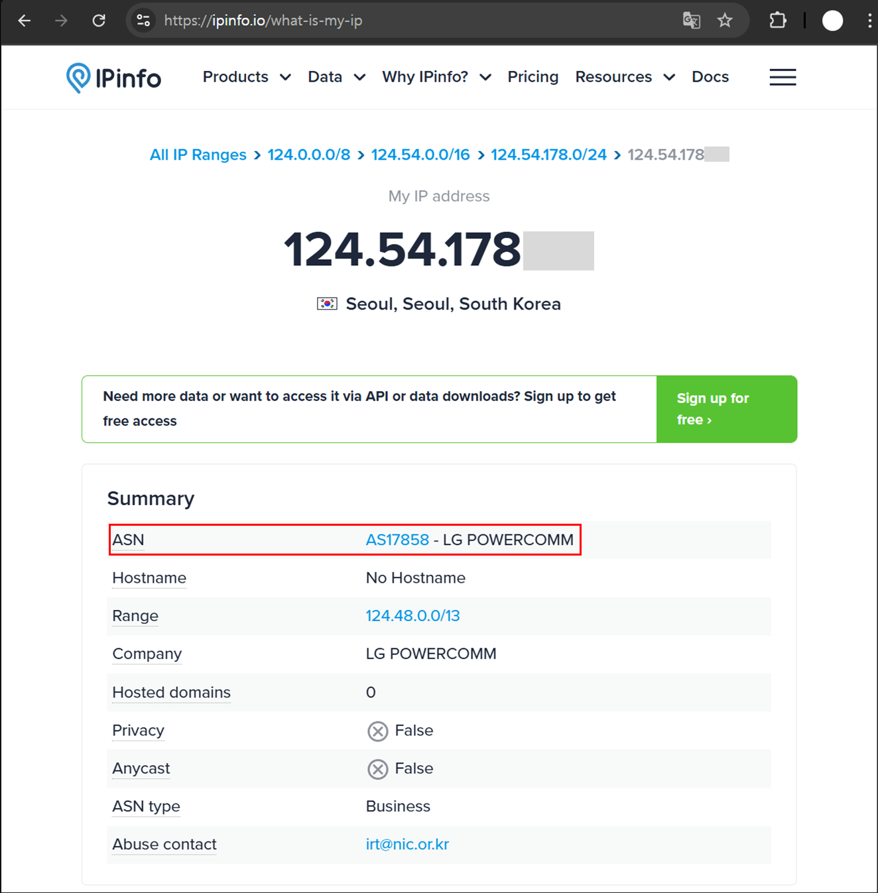
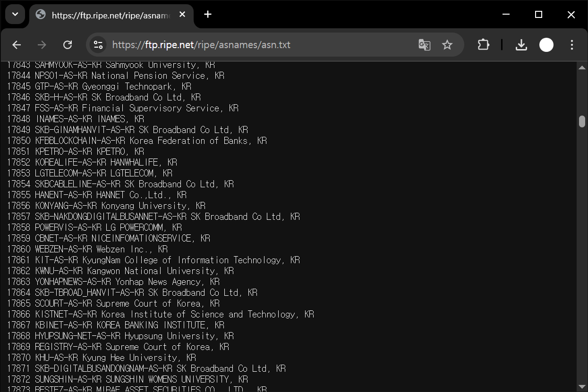

# 👋 Prologue

In my previous post, [Building an IP-to-Country Database](https://hackyboiz.github.io/2025/03/02/empty/Creating_an_IP_Country_Information_Database_KO/), we created a program that uses the RIR *delegated-*.csv* files to map IP addresses to countries. But in real-world operations, country data alone often isn’t enough to make informed decisions.

Consider a few examples:

- **Malicious IPs** can’t be reliably distinguished as cloud-hosted or residential, risking false positives and overblocking.
- You can’t pivot to additional threats lurking within the same AS, hampering threat-hunting efforts.
- You can’t group indicators by CIDR or AS to block attacker infrastructure in bulk.

In short, when assessing an IP, you need more than just its country; you need auxiliary indicators as well. One of the most widely used is AS (Autonomous System) information, which can be gathered via BGP (Border Gateway Protocol). In this post, we’ll explore practical ways to obtain and use AS data through BGP.

# 🌐 Autonomous System

The Internet we use is a collection of logical networks called Autonomous Systems (ASes). Each AS represents a network domain operated independently by an ISP, enterprise, or public organization, and the interconnection of these ASes forms the global Internet.


> [https://www.wallarm.com/what/bgp-routing-explanation](https://www.wallarm.com/what/bgp-routing-explanation)
> 

For example, the IP address I use at home 124.54.178.xxx belongs to **AS17858**, which is operated by LG Powercom (now LG Uplus). AS17858 contains roughly ten million IP addresses, divided into 207 individual prefixes.



AS numbers are managed as 4-byte integers, so values from **AS1 up to AS 4,294,967,296 are reserved**. Like IP addresses, these numbers are administered by Regional Internet Registries (RIRs). In Korea, you can request your own unique ASN from the Korea Internet & Security Agency (KISA) once you meet the following requirements:

- Operate infrastructure capable of running an independent network on the Internet
- Be connected to—or have concrete plans to connect to two or more distinct networks
- Be able to set and manage your own routing policies autonomously


If you satisfy these criteria, **individuals can also receive and operate an ASN**. One real-world example is **AS 215343**, a network run by **Minjae Kim** for research purposes. Interestingly, this ASN was assigned not by KISA but by the European RIR, **RIPE NCC**—the exact reason isn’t publicly documented.


> Description of AS 215343: [https://prezi.com/p/uh9o2mavv3x2/as215343-isp/](https://prezi.com/p/uh9o2mavv3x2/as215343-isp/)
> 

# **🚗** BGP(Border Gateway Protocol)

To send traffic to an AS that isn’t directly connected to yours, the routers in between need route information that tells them which ASes to traverse. **BGP (Border Gateway Protocol)** is the Internet-standard routing protocol that lets neighboring ASes exchange this path information, so each router can choose the best route according to local policy.


> [https://devopedia.org/border-gateway-protocol](https://devopedia.org/border-gateway-protocol)
> 

Depending on whether the exchange happens inside or outside an AS, BGP is classified as **IBGP (Internal BGP)** or **EBGP (External BGP)**. Routers in each AS *announce* messages like the one below to their peers so everyone can find the optimal path (the **AS Path**).

```bash
TIME: 07/10/25 14:00:00
TYPE: TABLE_DUMP_V2/IPV4_UNICAST
PREFIX: 3.166.152.0/23
SEQUENCE: 7558
FROM: 45.83.33.27 AS208821
ORIGINATED: 07/09/25 00:01:40
ORIGIN: IGP
ASPATH: 208821 206119 9121 1299 16509
NEXT_HOP: 45.83.33.27
COMMUNITY: 1299:35000 9121:50000 9121:50008
```

Key fields in a BGP update include:

- **PREFIX:** the announced network (CIDR block)
- **FROM:** IP address and AS number of the peer that sent this route
- **ORIGIN:** route origin attribute—*IGP*, *EGP*, or *INCOMPLETE*
- **AS PATH:** list of AS numbers the route has traversed (leftmost is closest)
- **NEXT HOP:** the actual next-hop IP to forward packets to

tells us that packets destined for **3.166.152.0/23** (origin-AS 16509) should first go to **45.83.33.27** (AS 208821), and from there traverse **AS 208821 → AS 206119 → AS 9121 → AS 1299 → AS 16509**.

A traceroute to **AS 215343 (Minjaes Network)** from my home connection shows the packets moving through **AS 17858 (LG Powercom) → AS 3786 (LG Dacom) → AS 4637 (Telstra) → AS 20473 (Vultr) → AS 215343 (Minjaes Network)**.


Curiously, although this is traffic from Korea to Korea, it detours through Hong Kong and Japan before returning to Korea. That’s because AS 215343 advertises its prefixes via a transit arrangement with **AS 20473**, and BGP propagates that route, leading to the path we observe.

- *(Depending on where you capture BGP data, certain hops—like AS 4637—may not appear.)*


> 출처: https://api.bgpview.io/assets/graphs/AS215343_Combined.svg
> 

In short, BGP works like a global navigation system: every AS advertises the IP prefixes it owns along with path attributes, enabling everyone else to find the best route. In the next section, we’ll use this BGP data to **build our own IP-to-Country-and-AS mapping database**.

# **🔧** Building an IP-to-Country Database Based on BGP Data

Because Autonomous-System numbers are assigned by Regional Internet Registries (RIRs), we will—as in Part 1—download the allocation files directly from each registry. RIPE’s repository, for instance, publishes a daily, comma-separated list containing every AS in the world.



> [https://ftp.ripe.net/ripe/asnames/asn.txt](https://ftp.ripe.net/ripe/asnames/asn.txt)
> 

Border-Gateway-Protocol (BGP) data comes from the **RouteViews Archive**, a project run by the University of Oregon. RouteViews peers with numerous ISPs, collects their BGP feeds, and makes the data publicly available. The archive has been active since 2001 and still updates every two hours.


> [http://ftp.routeviews.org/bgpdata/](http://ftp.routeviews.org/bgpdata/)
> 

RouteViews distributes its snapshots in the **MRT (Multi-Threaded Routing Toolkit Routing Information Export Format)** defined by RFC 6396. MRT is a structured binary format, so you can either process it with the **bgpdump** tool or write your own parser.


With the raw sources in place, we can build the database using the following workflow:

1. Download the AS data
2. Parse the AS data
3. Download the BGP archive data
4. Parse the BGP archive data
5. Transform the ASN-to-prefix records (convert IP ranges to integers)
6. Store the ranges in a structure that supports binary search

Coding these steps will give us a complete IP-to-Country-and-AS mapping database.

```python
# -*- coding: utf-8 -*-

# builtin modules
from ipaddress import ip_network, IPv4Address
from datetime import datetime

import os
import bz2
import readline

# install modules
import mrtparse
import requests

intervals=[]
ASN_TABLE={}
ASN_INFO_DB = "asn.txt"
IPINFO_DB = "ipinfo_db.txt"

def search(ip):
    result = None
    try:
        search_ip = int(IPv4Address(ip))
    except Exception as e:
        print(e)
        return None
    left, right = 0, len(intervals) - 1
    while left <= right:
        mid = (left + right) // 2
        start_ip, end_ip, asn = intervals[mid]
        if start_ip <= search_ip <= end_ip:
            result=(start_ip, end_ip, asn)
            break
        elif start_ip > search_ip:
            right = mid - 1
        else:
            left = mid + 1
    if result:
        start_ip, end_ip, asn = result
        prefix = f"{IPv4Address(start_ip)}/{32 - (end_ip - start_ip).bit_length()}"
        result={ "ip":ip, "prefix":prefix, "country":None, "asn":asn, "asn_description":None }
        result.update(ASN_TABLE[asn])
        return result
    return result

# MRT data parse
def parse_rib_v4(path):
    TDV2_PEER_IDX = mrtparse.TD_V2_ST["PEER_INDEX_TABLE"]  # 1
    TDV2_RIB_V4 = mrtparse.TD_V2_ST["RIB_IPV4_UNICAST"]    # 2
    TABLE_DUMP_V2 = mrtparse.MRT_T["TABLE_DUMP_V2"]        # 13
    with bz2.open(path, "rb") as fd:
        for record in mrtparse.Reader(fd):
            if record.err:
                continue
            RECORD_TYPE = next(iter(record.data["type"].keys()))
            RECORD_SUB_TYPE = next(iter(record.data["subtype"].keys()))
            if (RECORD_TYPE != TABLE_DUMP_V2) or (RECORD_SUB_TYPE != TDV2_RIB_V4):
                continue
            prefix = f"{record.data['prefix']}/{record.data['length']}"
            for entry in record.data["rib_entries"]:
                pidx = entry["peer_index"]
                as_path_attr = next((a for a in entry["path_attributes"] if 2 in a["type"]), None)
                path = []
                if as_path_attr:
                    for seg in as_path_attr["value"]:
                        path.extend(seg["value"])
                yield {"prefix":prefix, "asn":path[-1]}
                break # Since it does not deal with paths, each prefix is processed only once.

def download_asn_list():
    r = requests.get("https://ftp.ripe.net/ripe/asnames/asn.txt")
    r.raise_for_status()
    if r.status_code == 200:
        with open("asn.txt", "wb") as f:
            f.write(r.content)
    return

def build_ipinfo_db():

    # When used in practice, the RIB data is updated every 2 hours.
    r = requests.get("http://ftp.routeviews.org/bgpdata/2025.07/RIBS/rib.20250711.1000.bz2")
    with open("rib.20250711.1000.bz2", "wb") as f:
        f.write(r.content)

    with open(IPINFO_DB,"a") as f:
        for record in parse_rib_v4("rib.20250711.1000.bz2"):
            asn = record['asn']
            prefix = ip_network(record['prefix'])
            ip_start = int(prefix[0])
            ip_end = int(prefix[-1])
            f.write(f"{ip_start},{ip_end},{asn}\n")
    return

# Load memory
def init_database():
    if not os.path.exists(ASN_INFO_DB):
        download_asn_list()
    if not os.path.exists(IPINFO_DB):
        build_ipinfo_db()

    with open(ASN_INFO_DB, 'r') as f:
        for line in f:
            line = line.strip()
            if ',' not in line:
                continue
            asn, description = line.split(' ', 1)
            description, country = description.rsplit(', ', 1)
            ASN_TABLE[asn] = {"country": country, "asn_description": description}
        print("ASN table loadd")

    with open(IPINFO_DB, "r") as f:
        for line in f:
            start_ip, end_ip, asn = line.strip().split(",")
            intervals.append((int(start_ip), int(end_ip), asn))
    print("Databse load")
    return

def main():
    init_database()
    while True:
        ip = input("Search: ")
        ip_info=search(ip)
        print(ip_info)

if __name__ == "__main__":
    main()
```

# **👋** Final thoughts

In this article, the IP-lookup tool we built in Part 1 has been upgraded: when you query an IP address it now returns the ASN, prefix, and an ASN description in addition to the country code.

```json
{
  "ip": "1.1.1.1",
  "prefix": "1.1.1.0/24",
  "country": "US",
  "asn": "13335",
  "asn_description": "CLOUDFLARENET"
}
```

Compared to the IP information lookup service ipinfo.io, we found that the same basic information is provided.


Services like ipinfo.io also offer additional metadata such as physical location, ISP, and indicators of VPN or proxy usage. While such data is built upon each provider’s proprietary expertise and technology, the fundamental IP-to-country and AS information is likely generated using a methodology similar to what is introduced in this post.
