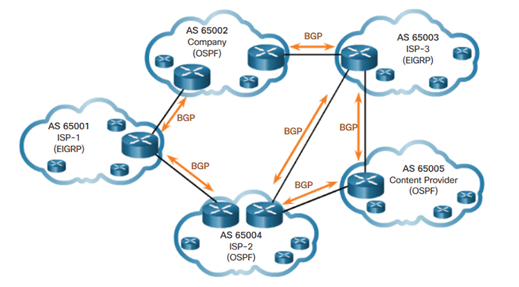
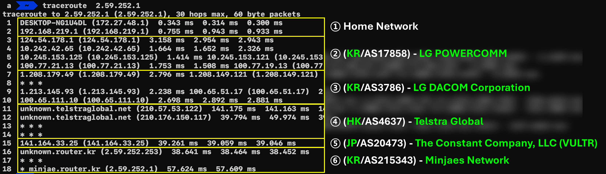

# 👋 프롤로그

지난 포스팅([IP 국가 DB 만들기](https://hackyboiz.github.io/2025/03/02/empty/Creating_an_IP_Country_Information_Database_KO/))에서는 RIR에서 수집 가능한 `delegated-*.csv`파일을 통해 IP의 국가 정보를 조회할 수 있는 프로그램을 만들었습니다. 하지만, IP의 **국가 정보 하나만으론** 실제 환경에서 유의미하게 활용할 수는 없습니다.

단편적으로 다음과 같은 예를 들 수 있습니다. 

- **악성 IP**가 클라우드 호스팅인지 가정용 회선인지 구분 불가 → 오차단 리스크 존재
- 같은 AS에 숨어 있는 추가 위협 피봇팅 불가 → 위협 헌팅 불가
- 공격 지표를 CIDR, AS 단위로 묶어 차단 불가 → 공격자 인프라 일괄 차단 불가

즉, IP의 정보를 확인할 땐, 국가 정보 이외에도 다양한 보조 지표가 필요하며 그중 많이 사용되는 지표인 AS(Autonomous System)정보를 BGP(Border Gateway Protocol)를 통해 확보하는 방법론에 대해 살펴보도록 하겠습니다.

# 🌐 Autonomous System

우리가 사용하는 **인터넷은 AS(Autonomous System)라는 논리적 네트워크들의 집합**으로 이루어져 있습니다. 각 AS는 통신사, 기업, 기관 등에서 **독립적으로 운영하는 네트워크 단위**를 뜻하며, 이들이 서로 연결되어 전 세계 인터넷을 구성합니다.


> [https://www.wallarm.com/what/bgp-routing-explanation](https://www.wallarm.com/what/bgp-routing-explanation)
> 

예를 들어, 제가 집에서 사용하는 **IP 주소 124.54.178.xxx는 LG파워콤(LG유플러스)이 운영하는 AS17858에 소속**되어 있습니다. AS17858에는 약 1,000만 개의 IP 주소가 포함되어 있으며, 이는 207개의 프리픽스(prefix)로 나뉘어 관리됩니다.


AS는 4바이트 숫자로 관리하여 **AS1 ~ AS4,294,967,296까지 사용할 수 있도록 예약**되어 있습니다. 이 번호 또한, ip와 마찬가지로 지역레지스트리(RIR)에 의해 관리되고 있으며, 우리나라의 경우 다음과 같은 요건을 갖출 경우 한국인터넷진흥원에 신청하여 고유한 ASN을 부여받을 수 있습니다.

- 인터넷상에서 독립적인 네트워크를 구축할 수 있는 설비를 운용
- 두개 이상의 서로 다른 망과 연결 또는 연결계획이 있어야 함
- 독자적인 라우팅 경로설정이 가능하여야 함


자격 요건을 갖추면 **개인도 AS 번호(ASN)를 할당받아** 운영할 수 있습니다. 실제 사례로 **AS 215343**은 **김민재**라는 분이 연구 목적으로 신청해 운용 중인 네트워크입니다. 정확한 사유는 모르겠지만, 한국인터넷진흥원이 아닌 유럽의 RIR (RIPE NCC)를 통해 부여받은 것으로 확인됩니다.


> AS215343에 대한 설명: [https://prezi.com/p/uh9o2mavv3x2/as215343-isp/](https://prezi.com/p/uh9o2mavv3x2/as215343-isp/)
> 

# **🚗** BGP(Border Gateway Protocol)

인터넷에서 직접 연결되지 않은 AS로 트래픽을 보내려면, 중간에 어떤 AS를 거칠지에 대한 경로 정보가 필요합니다. BGP(Border Gateway Protocol)는 인접한 AS 간에 이러한 경로 정보를 주고받아, 각 라우터가 정책에 따라 가장 적합한 경로를 선택하게 해 주는 인터넷 표준 라우팅 프로토콜입니다.



> [https://devopedia.org/border-gateway-protocol](https://devopedia.org/border-gateway-protocol)
> 

내부향, 외부향에 따라 IBGP(Internal BGP), EBGP(External BGP)로 나뉩니다. 각 AS라우터들은 아래와 같은 BGP메세지를 인접 라우터에게 광고(Announcing)하여 최적의 경로(AS Path)를 찾아갈 수 있도록 안내합니다.

```bash
TIME: 07/10/25 14:00:00
TYPE: TABLE_DUMP_V2/IPV4_UNICAST
PREFIX: 3.166.152.0/23
SEQUENCE: 7558
FROM: 45.83.33.27 AS208821
ORIGINATED: 07/09/25 00:01:40
ORIGIN: IGP
ASPATH: 208821 206119 9121 1299 16509
NEXT_HOP: 45.83.33.27
COMMUNITY: 1299:35000 9121:50000 9121:50008
```

위 메세지에서 봐야할 주요 항목은 다음과 같습니다.

- **PREFIX:** Announcing된 네트워크(CIDR)
- **FROM:** 이 경로를 보낸 피어 라우터의 IP 및 AS 번호.
- **ORIGIN:** 경로 기원 속성(IGP, EGP, INCOMPLETE 중 하나)
- **ASPATH:** 목적지까지 거쳐온 AS 번호 리스트(왼쪽이 가장 근접)
- **NEXT_HOP:** 이 경로로 보낼 실제 다음 홉 IP

PREFIX 3.166.152.0/23(AS16509)로 향하는 패킷은 45.83.33.27(AS208821)을 거쳐 AS208821 → AS206119 → AS9121 → AS1299 → AS16509 순으로 가야한다는 안내를 하는 상황입니다.

예시를 통해 살펴보도록 하겠습니다. AS215343(Minjaes Network)로 향하는 패킷을 traceroute를 통해 살펴보면, AS17858(LG Powercomm) → AS3786(LG Dacom) → AS4637(Telstra) → AS20473(Vultr) → AS215343(Minjaes Network) 순으로 패킷이 전달됩니다.



흥미로운 점은, 저희 집에서 Minjes Network간의 통신은, 한국에서 한국으로 전달되는 패킷이지만, 홍콩 → 일본을 경유하여 다시 한국으로 되돌아오는 상태입니다. 이는 AS215343이 AS20473과 트랜짓을 맺은 뒤, 해당 경로를 통해 BGP전파를 하고 있어 위와 같은 통신이 이루어지고 있는 상태입니다.

- BGP 데이터를 관측하고 제공해주는 서비스에서 위치에 따라 경로가 보이지 않을 수 있습니다. (AS4637이 보이지 않는 이유)


> 출처: https://api.bgpview.io/assets/graphs/AS215343_Combined.svg
> 

정리하자면, BGP는 전 세계에 있는 AS들이 서로 자신이 관리하는 네트워크의 IP프리픽스와 경로의 속성을 광고하여 최적의 경로로 찾아올 수 있도록 안내하는 일종의 네비게이션과 같은 프로토콜입니다. 이제 다음 단계로, 방금 살펴본 BGP 데이터를 활용해 **IP-국가·AS 매핑 DB를 직접 구축**해 보겠습니다.

# **🔧** BGP 데이터 기반 IP 국가 데이터베이스 만들기

AS의 할당 정보는 지역레지스트리(RIR)에서 부여를 하기 때문에, part1과 같이 지역레지스트리의 저장소에서 다운로드 받아 활용하도록 하겠습니다. ripe의 저장소에는 Comma(,)로 구분 가능한 형태의 전 세계 AS정보가 매일 업데이트 되고 있습니다. 


> [https://ftp.ripe.net/ripe/asnames/asn.txt](https://ftp.ripe.net/ripe/asnames/asn.txt)
> 

BGP 데이터는 미국의 Oregon 대학교에서 RouteViews Archive라는 프로젝트에서 수집할 수 있습니다. 이 프로젝트는 여러 ISP업체와 피어링을 맺은 뒤 수집된 BGP 데이터를 공개하는 프로젝트입니다. 2001년 부터 시작되어 현재 까지도 꾸준히 업로드가 이루어지고 있으며, 2시간마다 최신 데이터가 갱신되고 있습니다.


> [http://ftp.routeviews.org/bgpdata/](http://ftp.routeviews.org/bgpdata/)
> 

routeviews가 제공하는 아카이브 파일은 RFC6396에 정의된 MRT(Multi-Threaded Routing Toolkit Routing Information Export Format)라는 포맷 형태로 제공됩니다. 구조화된 바이너리 데이터여서 bgpdump도구를 사용하거나, 파서를 제작해서 활용할 수도 있습니다. 


이제, 데이터베이스를 만들기 위한 원천 데이터 확보는 모두 끝났으며, 다음과 같은 로직으로 코드를 작성하면 완성입니다.

1. AS 정보 다운로드
2. AS 정보 파싱
3. BGP아카이브 데이터 다운로드
4. BGP아카이브 데이터 파싱
5. ASN, Prefix 데이터 가공 (IP대역 10진수화)
6. 이진탐색

이를 코드로 구현하면 다음과 같습니다.

```python
# -*- coding: utf-8 -*-

# builtin modules
from ipaddress import ip_network, IPv4Address
from datetime import datetime

import os
import bz2
import readline

# install modules
import mrtparse
import requests

intervals=[]
ASN_TABLE={}
ASN_INFO_DB = "asn.txt"
IPINFO_DB = "ipinfo_db.txt"

# 이진탐색
def search(ip):
    result = None
    try:
        search_ip = int(IPv4Address(ip))
    except Exception as e:
        print(e)
        return None
    left, right = 0, len(intervals) - 1
    while left <= right:
        mid = (left + right) // 2
        start_ip, end_ip, asn = intervals[mid]
        if start_ip <= search_ip <= end_ip:
            result=(start_ip, end_ip, asn)
            break
        elif start_ip > search_ip:
            right = mid - 1
        else:
            left = mid + 1
    if result:
        start_ip, end_ip, asn = result
        prefix = f"{IPv4Address(start_ip)}/{32 - (end_ip - start_ip).bit_length()}"
        result={ "ip":ip, "prefix":prefix, "country":None, "asn":asn, "asn_description":None }
        result.update(ASN_TABLE[asn])
        return result
    return result

# MRT 데이터 파싱
def parse_rib_v4(path):
    TDV2_PEER_IDX = mrtparse.TD_V2_ST["PEER_INDEX_TABLE"]  # 1
    TDV2_RIB_V4 = mrtparse.TD_V2_ST["RIB_IPV4_UNICAST"]    # 2
    TABLE_DUMP_V2 = mrtparse.MRT_T["TABLE_DUMP_V2"]        # 13
    with bz2.open(path, "rb") as fd:
        for record in mrtparse.Reader(fd):
            if record.err:
                continue
            RECORD_TYPE = next(iter(record.data["type"].keys()))
            RECORD_SUB_TYPE = next(iter(record.data["subtype"].keys()))
            if (RECORD_TYPE != TABLE_DUMP_V2) or (RECORD_SUB_TYPE != TDV2_RIB_V4):
                continue
            prefix = f"{record.data['prefix']}/{record.data['length']}"
            for entry in record.data["rib_entries"]:
                pidx = entry["peer_index"]
                as_path_attr = next((a for a in entry["path_attributes"] if 2 in a["type"]), None)
                path = []
                if as_path_attr:
                    for seg in as_path_attr["value"]:
                        path.extend(seg["value"])
                yield {"prefix":prefix, "asn":path[-1]}
                break # 경로 정보를 보는것이 아니기 때문에 Prefix는 한 번만 처리

# ASN 데이터 다운로드
def download_asn_list():
    r = requests.get("https://ftp.ripe.net/ripe/asnames/asn.txt")
    r.raise_for_status()
    if r.status_code == 200:
        with open("asn.txt", "wb") as f:
            f.write(r.content)
    return

# IP정보 데이터베이스 작성
def build_ipinfo_db():

		# 실제 사용할 땐, rib데이터를 2시간 간격으로 갱신하여 업데이트
    r = requests.get("http://ftp.routeviews.org/bgpdata/2025.07/RIBS/rib.20250711.1000.bz2")
    with open("rib.20250711.1000.bz2", "wb") as f:
        f.write(r.content)

		# rib데이터는 ip의 오름차순으로 정렬되어 있으므로 파싱 순으로 저장
    with open(IPINFO_DB,"a") as f:
        for record in parse_rib_v4("rib.20250711.1000.bz2"):
            asn = record['asn']
            prefix = ip_network(record['prefix'])
            ip_start = int(prefix[0])
            ip_end = int(prefix[-1])
            f.write(f"{ip_start},{ip_end},{asn}\n")
    return

# 메모리 로드
def init_database():
    if not os.path.exists(ASN_INFO_DB):
        download_asn_list()
    if not os.path.exists(IPINFO_DB):
        build_ipinfo_db()

    with open(ASN_INFO_DB, 'r') as f:
        for line in f:
            line = line.strip()
            if ',' not in line:
                continue
            asn, description = line.split(' ', 1)
            description, country = description.rsplit(', ', 1)
            ASN_TABLE[asn] = {"country": country, "asn_description": description}
        print("ASN table loadd")

    with open(IPINFO_DB, "r") as f:
        for line in f:
            start_ip, end_ip, asn = line.strip().split(",")
            intervals.append((int(start_ip), int(end_ip), asn))
    print("Databse load")
    return

def main():
    init_database()
    while True:
        ip = input("Search: ")
        ip_info=search(ip)
        print(ip_info)

if __name__ == "__main__":
    main()
```

# **👋** 마치며

이번 연구글에서 만든 IP정보 조회 프로그램은 Part1에서 업그레이드 되어 IP를 조회할 경우 국가 정보를 포함한 asn, prefix, asn_description 정보도 함께 출력되도록 변경되었습니다.

```json
{
  "ip": "1.1.1.1",
  "prefix": "1.1.1.0/24",
  "country": "US",
  "asn": "13335",
  "asn_description": "CLOUDFLARENET"
}
```

IP정보 조회 서비스인 ipinfo.io와 비교 해봤을 때, 동일한 정보가 제공되는 걸 확인할 수 있었습니다.


ipinfo.io와 같은 서비스는 물리적 위치, ISP, VPN, Proxy 여부 등 추가적인 메타데이터를 함께 제공합니다. 이러한 정보는 각 서비스 제공업체의 차별화된 노하우와 기술력을 바탕으로 구축되지만, IP에 대한 기본적인 정보인 국가 및 AS 정보는 본 글에서 소개한 방법론과 유사한 방식으로 제작되었을 것으로 추측해봅니다.
