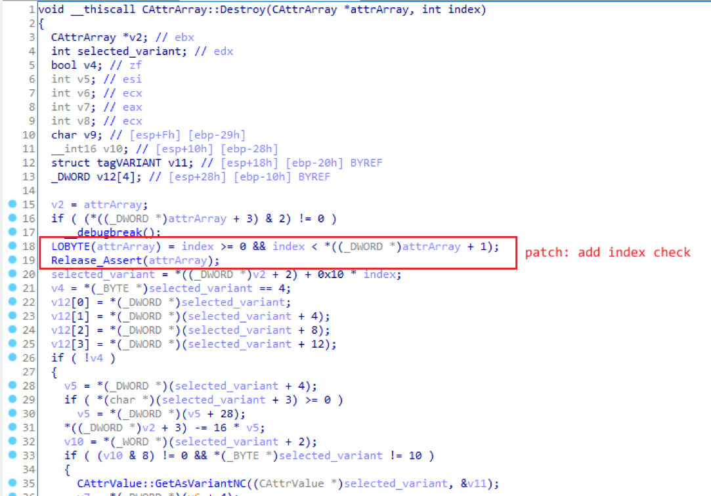
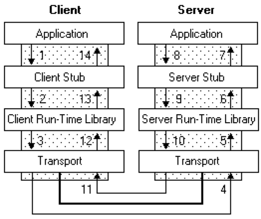
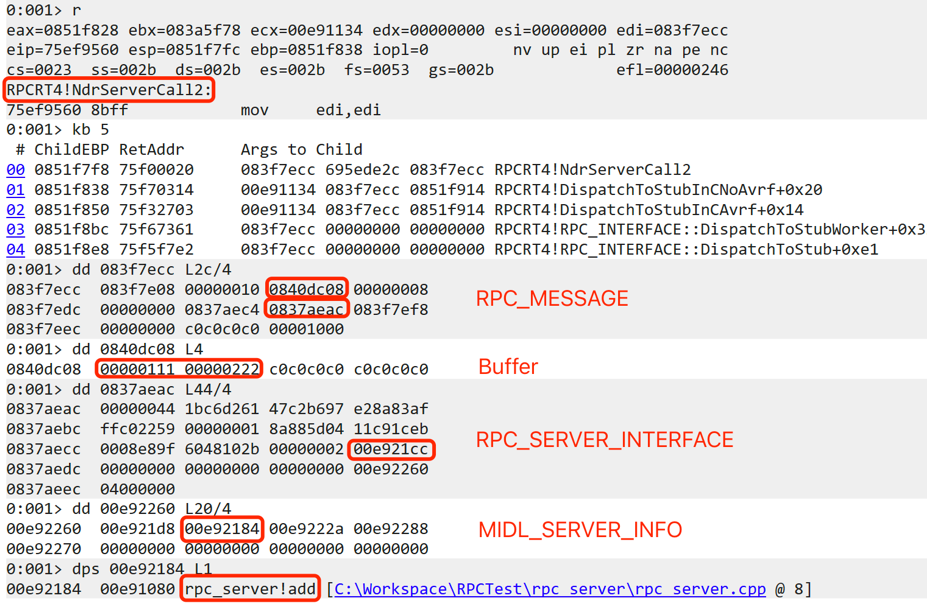
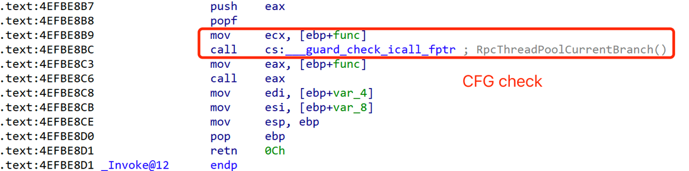
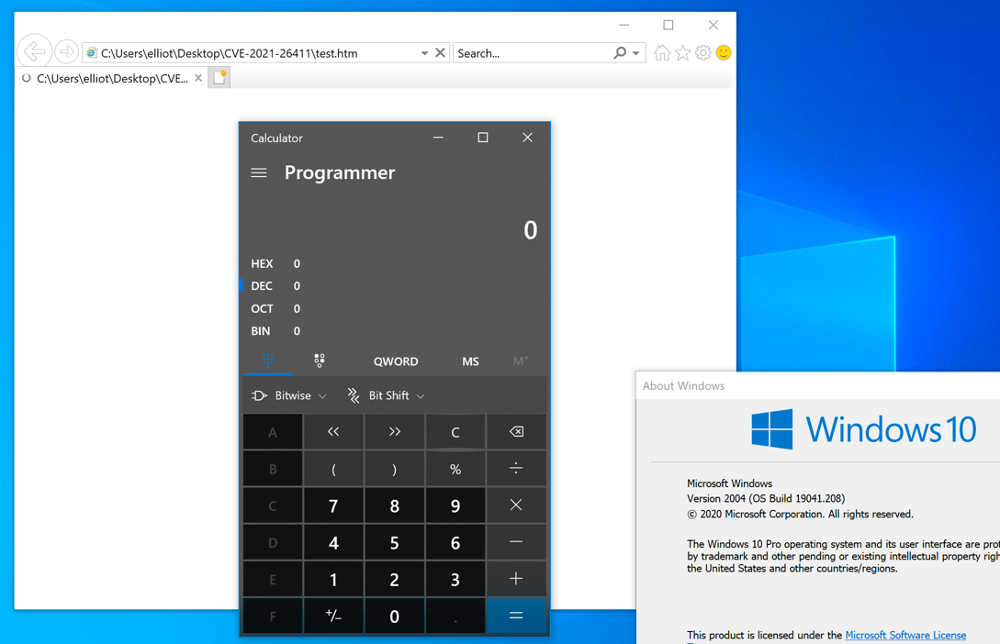

# 번역 추신

Hackyboiz 블로그 운영 초반에 CFG와 XFG에 대한 연구글을 작성하고 있었습니다. CFG Bitmap 생성 부분을 공부하다가 머리가 뻐근해서 잠시 멈춘다는 게 아예 무산되버렸네요. 연구팀 형님 한분께서 해당 글을 작성하던 저를 보시곤 "메모리 커럽션은 이제 어떻게 하냐 ㅋㅋㅋ?" 이런 말씀을 하셨죠. 그래서 CFG bypass라는 제목의 글을 그냥 지나칠 수가 없더군요. 이런 이유로 이번에 읽은 글 하나 번역해서 올립니다.

[원문: Exploiting Windows RPC to bypass CFG mitigation](https://iamelli0t.github.io/2021/04/10/RPC-Bypass-CFG.html)


# 머릿말

브라우저 렌더 프로세스 익스플로잇의 보편적인 방법은 다음과 같습니다. 취약점을 공격하여 메모리에 대한 임의의 유저 모드 읽기/쓰기 권한을 가져온 후 execution flow를 탈취하기 위해 DOM/js 객체의 vtable을 변조합니다. 그다음 ROP chain에 의해 호출된 VirtualProtect가 쉘 코드 메모리를 PAGE_EXECUTE_READWITE로 수정하고 execution flow가 최종적으로 쉘 코드로 이동합니다. Windows 8.1 이후로 Microsoft는 CFG(Control Flow Guard) 보호 기법을 도입하여 indirect function call(vtable을 참조하는 함수 호출 방식)을 활용한 vtable overwrite 공격을 감지 및 방지하고 있습니다.


하지만, 여기서 끝나면 섭섭하죠. CFG 보호 기법을 우회하는 새로운 방법이 등장했습니다. 예를 들어 chackra/jscript9에서는 스택의 리턴 주소를 변조하여 code execution flow를 가로채고, v8의 경우에는 실행 가능한 메모리 속성이 있는 WebAssembly를 사용해 쉘 코드를 실행합니다. 2020년 12월, Microsoft는 Intel Tiger Lake CPU를 기반으로 한 CET(Control-flow Enforcement Technology) 보호 기법을 Windows1020H1에 도입했습니다. 따라서 CET 환경에서 CFG를 우회하는 방법은 취약점 익스플로잇의 새로운 문제가 됐습니다.


저희는 실제 공격에 사용된 [CVE-2021-26411](https://hackyboiz.github.io/2021/03/26/l0ch/2021-03-26/)의 샘플을 분석하던 중 Windows RPC(Remote Procdure Call)를 사용하여 CFG 보호 기법을 우회하는 새로운 방법을 발견했습니다. 이 방법은 ROP chain에 의존하지 않습니다. 가짜 RPC_MESSAGE를 구성하는 것으로 rpcrt4!NdrServerCall2를 수동으로 호출하여 임의 코드 실행(Arbitrary Code Execution)을 할 수 있습니다.


# CVE-2021-25411

저의 블로그 글 "[CVE-2021-26411: Internet Explorer mshtml use-after-free](https://iamelli0t.github.io/2021/03/12/CVE-2021-26411.html)"에서 root cause를 분석했습니다. removeAttributeNode()는 nodeValue의 valueOf 콜백을 트리거합니다. 콜백 중에 clearAttributes()가 수동으로 호출되어 nodeValue에 저장된 BSTR를 미리 해제합니다. 콜백 값이 반환된 후 nodeValue 객체가 있는 경우 UAF(Use-After-Free)가 발생합니다.


Windows 3월 패치에서 해당 취약점을 수정하기 위해 CAttrArray::Destroy함수에 객체를 삭제하기 전에 인덱스를 검사하는 코드를 추가했습니다.




메모리 크기를 제어할 수 있는 UAF 취약점의 경우, 서로 다른 type의 포인터(BSTR과 Dictionary.item)가 재사용 메모리를 가리키게 하여 type confusion에 의한 포인터 노출 및 포인터 참조 해제를 달성할 수 있습니다.


# Windows RPC introduction and exploitation

Windows RPC는 분산된 클라이언트/서버 function call 시나리오를 지원하는 데 사용됩니다. Windows RPC에 의해 클라이언트는 서버 함수를 로컬 함수 호출인 것처럼 사용할 수 있습니다. 다음 사진은 Windows RPC의 기본 아키텍처입니다.




클라이언트/서버 프로그램은 호출 매개 변수 혹은 리턴 값을 lower-level Stub 함수로 전달합니다. Stub 함수는 NDR(Network Data Representation) 포맷으로 데이터를 캡슐화하는 역할을 담당합니다. Runtime library를 통한 통신을 rpcrt4.dll에 의해 제공됩니다.


다음은 idl 예제입니다.

```c
[
	uuid("1BC6D261-B697-47C2-AF83-8AE25922C0FF"),
	version(1.0)
]

interface HelloRPC
{
	int add(int x, int y);
}
```


클라이언트가 add 함수를 호출할 때 서버는 rpcrt4.dll로부터 처리 요청을 수신하고 rpcrt4!NdrServerCall2를 호출합니다.


rpcrt4!NdrServerCall2에는 함수 인덱스 및 매개 변수와 같은 중요한 데이터를 포함한 PRPC_MESSAGE만을 매개변수로 받습니다. 서버 RPC_MESSAGE 구조체와 main sub data 구조체는 다음과 같습니다.


앞서 언급한 그림과 같이, RPC_MESSAGE 구조체에서 함수 호출에 중요한 두 가지 변수는 Buffer와 RpcInterfaceInformation입니다. Buffer는 함수의 매개 변수를 저장하고 RpcInterfaceInformation은 RPC_SERVER_INTERFACE 구조체를 가리키고 있습니다. RPC_SERVER_INTERFACE 구조체는 서버 프로그램 인터페이스 정보를 담고 있는데, 여기서 DispatchTable(+0x2c)은 runtime library와 stub 함수의 인터페이스 함수 포인터를 저장하고, InterpreterInfo(+0x3c)는 MIDL_SERVER_INFO를 가리킵니다. MIDL_SERVER_INFO 구조체는 서버 IDL 인터페이스 정보를 저장하고, DispatchTable(+0x4)은 서버 루틴 함수의 포인터 배열을 담고 있습니다.


다음은 RPC_MESSAGE 구조체의 예제입니다.


위에서 제시한 idl에 따르면, 클라이언트가 add(0x111, 0x222)를 호출하면 서버 프로그램이 rpcrt4!NdrServerCall2에 break 합니다.



동적 디버깅을 통해 얻은 메모리 덤프를 보면 위에서 분석한 RPC_MESSAGE 구조체와 일치하며 add 함수는 MIDL_SERVER_INFO.DispatchTable에 저장되어 있음을 알 수 있습니다.


이제, rpcrt4!NdrServerCall2가 어떻게 RPC_MESSAGE를 참조해서 add 함수를 호출하는지 분석해봅시다.


rpcrt4!NdrServerCall2는 rpcrt4!NdrStubCall2를 호출합니다. rpcrt4!NdrStubCall2는 MIDL_SERVER_INFO.DispatchTable과 RPC_MESSAGE.ProcNum을 참조해 함수 포인터 주소를 계산합니다. 그리고 함수 포인터와 함수의 매개 변수, 매개 변수의 길이를 rpcrt4!Invoke로 전달합니다.


드디어 rpcrt4!Invoke가 서버로부터 받은 함수를 호출합니다.


위의 분석을 기반으로 임의의 메모리에 대한 읽기/쓰기 권한을 얻은 후 가짜 RPC_MESSAGE를 생성, 원하는 함수와 그 매개 변수를 설정, rpcrt4!NdrServerCall2 호출을 통해 원하는 어떤 함수던 구현할 수 있게 됩니다.


다음으로 해결해야 할 문제는 두 가지가 있습니다.

1. 어떻게 하면 javascript를 통해 rpcrt4!NdrServerCall2를 호출할 수 있는가?
2. rpc4!Invoke에서 서버 루틴 함수를 호출할 때 체크하는 CFG는 어떻게 해결할 것인가?




위 사진을 통해 서버 루틴 함수 호출은 indirect function call이고, CFG 검사가 있다는 것을 알 수 있습니다.


먼저 첫 번째 문제(어떻게 하면 javascript를 통해 rpcrt4!NdrServerCall2를 호출할 수 있는가?)를 해결하겠습니다. DOM 객체 vtable의 함수 포인터를 rpcrt4!NdrServerCall2로 바꿀 수 있습니다. 왜냐하면 rpcrt4!NdrServerCall2는 CFGBitmap에 기록된(화이트리스팅된) 함수이며 CFG 검사가 비정상 동작으로 판단하지 않기 때문입니다. 실제 공격에 사용된 샘플은 MSHTML!CAttribut::normalize를 rpcrt4!NdrServerCall2로 바꿔 칩니다. 그다음 javascript에서 "xyz.normalize()"를 호출해 결과적으론 rpcrt4!NdrServerCall2를 호출합니다.


두 번째 문제(rpc4!Invoke에서 서버 루틴 함수를 호출할 때 체크하는 CFG는 어떻게 해결할 것인가?)는 다음과 같은 방법으로 해결합니다.

1. 가짜 RPC_MESSAGE와 rpcrt4!NdrServerCall2를 사용해 VirtualProtect를 호출, RPCRT4!__guard_check_ical_fptr의 메모리 권한을 PAGE_EXECUTE_READWITE로 수정
2. rpcrt4!__guard_check_icall_fptr에 저장된 포인터 ntdll!LdrpValidateUserCallTarget를 ntdll!KiFastSystemCallRet으로 수정해 rpcrt4.dll에 대한 CFG 검사를 비활성화
3. RPC4!__guard_check_icall_fptr의 메모리를 복구

```c
function killCfg(addr) {
  var cfgobj = new CFGObject(addr)
  if (!cfgobj.getCFGValue()) 
    return
  var guard_check_icall_fptr_address = cfgobj.getCFGAddress()
  var KiFastSystemCallRet = getProcAddr(ntdll, 'KiFastSystemCallRet')
  var tmpBuffer = createArrayBuffer(4)
  call2(VirtualProtect, [guard_check_icall_fptr_address, 0x1000, 0x40, tmpBuffer])
  write(guard_check_icall_fptr_address, KiFastSystemCallRet, 32)
  call2(VirtualProtect, [guard_check_icall_fptr_address, 0x1000, read(tmpBuffer, 32), tmpBuffer])
  map.delete(tmpBuffer)
}
```


두 가지 문제를 해결한 후, rpcrt4.dll에 대한 CFG가 꺼져있으므로 가짜 RPC_MESSAGE를 사용해 원하는 함수(버퍼에 쉘 코드를 담고 있는 함수) 포인터를 호출할 수 있습니다. 샘플은 mis.dll+0x5000에 쉘 코드를 덮어쓰고 rpcrt4!NdrServerCall2를 통해 쉘 코드를 실행합니다.

```c
var shellcode = new Uint8Array([0xcc])
var msi = call2(LoadLibraryExA, [newStr('msi.dll'), 0, 1]) + 0x5000
var tmpBuffer = createArrayBuffer(4)
call2(VirtualProtect, [msi, shellcode.length, 0x4, tmpBuffer])
writeData(msi, shellcode)
call2(VirtualProtect, [msi, shellcode.length, read(tmpBuffer, 32), tmpBuffer])
call2(msi, [])
```


다음은 익스플로잇에 성공한 스크린샷입니다.




# Some thoughts

실제 공격에 사용된 CVE-2021-26411 샘플은 CFG 보호 기법을 익스플로잇 하는 새로운 기술을 담고 있습니다. 해당 익스플로잇 기법은 ROP에 의존하지 않아도 되며 RPC_MESSAGE를 통해 임의 코드 실행(Arbitrary Code Execution)을 달성할 수 있습니다. 또한 간결하고 신뢰도(성공률)가 높습니다. 앞으로 CFG 보호 기법을 효과적으로 우회하기 위한 방법으로 통용될 것이라 생각합니다.


# Reference

[1] https://docs.microsoft.com/en-us/windows/win32/secbp/control-flow-guard

[2] https://windows-internals.com/cet-on-windows/

[3] https://docs.microsoft.com/en-us/windows/win32/rpc/rpc-start-page