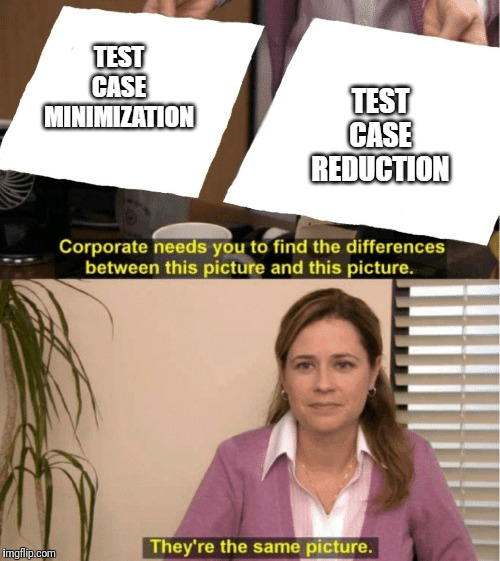
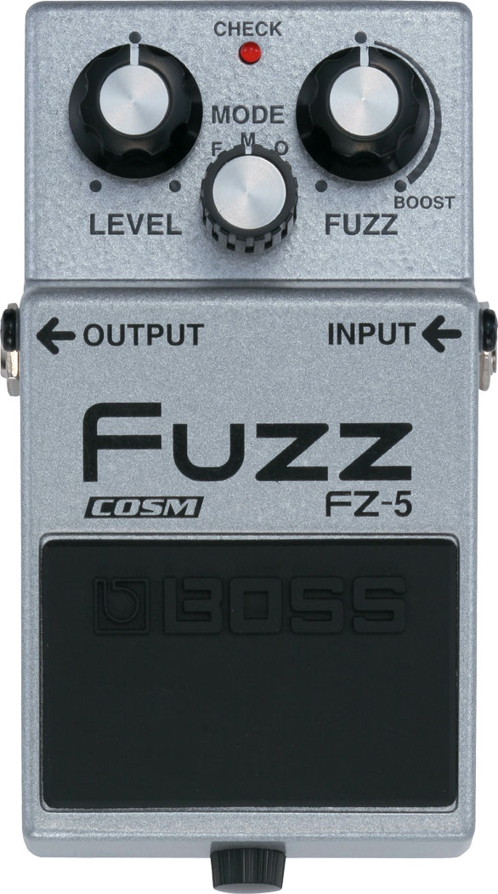
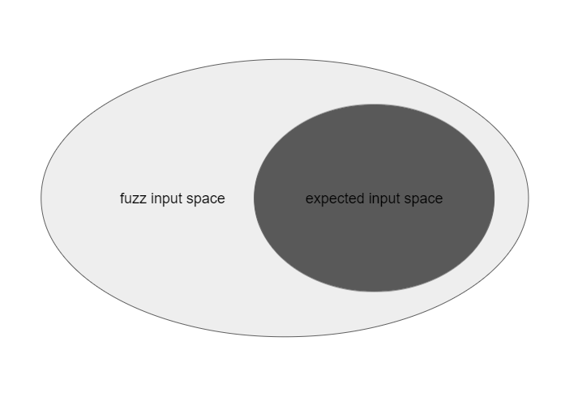
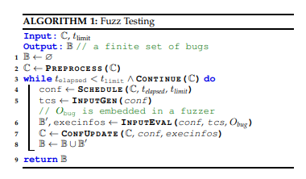
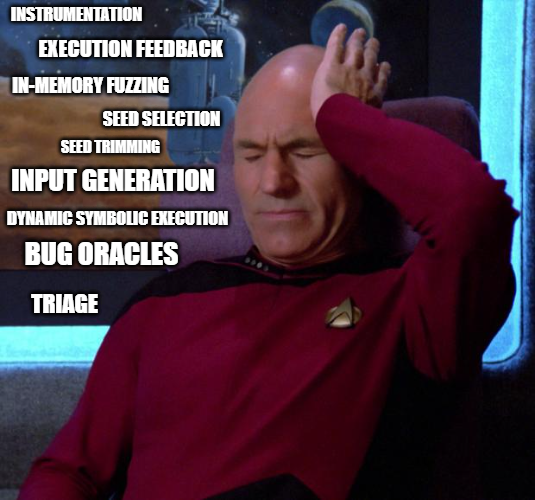

# 머릿말

안녕하세요 Fabu1ous입니다.

제가 최근에 올린 연구글이 모두 퍼저에 대한 글이었죠? 퍼징의 개념은 매우 단순해서 취약점 탐색 기술 중 높은 인기를 유지 중이며 꾸준히 연구되는 분야입니다. 물론 개념만 단순할 뿐 퍼징의 효율 향상을 위한 연구들을 하나하나 살펴본다면 대단히 방대하고 어렵습니다. 이러한 퍼징 분야의 공부를 시작하기 위해 딱 알맞은 논문이 있어 공부하고 정리해봤습니다. 이번 파트에선 퍼징의 기본 개념과 용어, 그리고 퍼저의 분류에 대해 정리했습니다.

https://arxiv.org/pdf/1812.00140.pdf

# 1. Introduction

1990년대 fuzzing이라는 용어가 처음 사용된 이후, 퍼징은 exploit generation과 penetration testing 등 다양한 취약점 탐색법에 적용되었습니다. 단순히 Attacker의 입장에서만이 아니라 Defender의 입장에서 개발 단계부터 퍼징을 사용하기도 합니다. 현재 퍼징 커뮤니티는 정말 방대한데, 깃헙에만 퍼징에 대한 퍼블릭 레포가 천 개 이상 존재합니다.

이렇게 방대한 분야를 하나하나 따라가기 쉽지 않을뿐더러 각 퍼저에서 새로 추가되거나 향상된 기능 등을 뜻하는 용어들이 하나로 확립되어 있지 않습니다.

예를 들면 AFL의 "test case minimization"과 funfuzz의 "test case reduction"의 경우 같은 동작을 서로 다르게 부르고 있죠. 또한 BFF의 "crash minimization"과 같이 이름은 비슷하지만 동작이 전혀 다른 경우도 있습니다.

장기적으로 볼 때 이런 현상은 퍼징 연구의 장애물이 될 것이라 생각해, 본 논문을 통해 퍼징을 분류하고 통일된 모델을 제시합니다.

# 2. Systemization, Taxonomy, Test Programs

> generates a stream of random characters to be consumed by a target program
>
> -Miller-

"fuzz"라는 단어는 1990년 처음 위와 같은 의미로 사용됩니다. 그 후로 fuzz와 fuzzing의 개념 및 동작이 서로 다른 이름으로 파생되어 혼용되고 있습니다. <s>일렉기타 이펙터 페달중에 fuzz라는 놈도 있습니다.</s>

- dynamic symbolic execution

- grammarbased test case generation

- permission testing

- behavioral testing

- complexity testing

- kernel testing

- representation dependence testing

- function detection

- robustness evaluation

- exploit development

- GUI testing

- signature generation

- penetration testing

  

## 2.1 fuzzing & fuzz testing

따라서 좀 더 체계적으로 정리하기 위해 용어를 먼저 정의합시다.

퍼징 동작이란 "fuzz input"을 사용해 PUT(Program Under Test)를 실행하는 것이고, "fuzz input"이란 PUT가 예상하지 못할 input을 뜻합니다. PUT이 잘못 처리하는 input 혹은 개발 의도와는 다른 행동을 보이는 input을 넣어 PUT을 실행하는 것이라고 해석할 수 있습니다. 이를 통해 fuzzing을 다음과 같이 정의할 수 있습니다.

> Definition 1 (Fuzzing) Fuzzing is the execution of the PUT using input(s) sampled from an input space (the “fuzz input space”) that protrudes the expected input space of the PUT.
> fuzzing이란 PUT의 예상 가능 입력 공간을 초과한 입력 공간(fuzz 입력 공간) 중에서 선별된 입력을 PUT에 넣어 실행하는 것

1. fuzz input space가 expected input space를 포함 가능
2. 반복 실행은 fuzzing의 필수조건과 같으니 굳이 정의할 필요는 없다.(= 반복 실행이 아니어도 퍼징이라 부를 수 있다)
3. sampling 작업은 꼭 랜덤 하지 않다. (= 꼭 랜덤 인풋을 넣는 것은 아니다)

Fuzz testing을 fuzzing 기술을 사용한 소프트웨어 검사 기술이라고 정의할 수 없습니다. 소프트웨어 검사 기술과 fuzzing의 가장 큰 차별점은 바로 목적성입니다. fuzzing의 주요 목적은 crash와 같은 보안 관련 버그 탐색이므로 비슷한 동작을 하지만 목적이 다른 기술들과 구분하고 강조하기 위해 fuzz testing, fuzzer, fuzz campaign이라는 용어를 다음과 같이 정의합니다.

> Definition 2 (Fuzz Testing) Fuzz testing is the use of fuzzing to test if a PUT violates a security policy. 
> fuzz testing이란 fuzzing 기술을 사용해 PUT가 보안 정책에 어긋나는지 검사하는 것

> Definition 3 (Fuzzer) A fuzzer is a program that performs fuzz testing on a PUT. fuzzer란 PUT에 fuzz testing을 수행하는 프로그램

> Definition 4 (Fuzz Campaign) A fuzz campaign is a specific execution of a fuzzer on a PUT with a specific security policy.
> fuzz campaign이란 특정 보안 정책을 갖는 PUT에 대한 fuzzer의 특정 실행

초창기 퍼저들은 test case가 PUT의 crash를 발생시키는지만을 검사했습니다. 하지만 fuzz testing은 실행되는 동안 관측할 수 있는 모든 보안 정책을 검사할 수 있고 특정 실행이 보안정책에 어긋나는지 확인하는 메커니즘을 Bug Oracle이라 부릅니다.

> Definition 5 (Bug Oracle) A bug oracle is a program, perhaps as part of a fuzzer, that determines whether a given execution of the PUT violates a specific security policy.
> Bug Oracle이란 제공된 PUT의 실행이 특정 보안 정책에 어긋나는지 구분하는 프로그램

fuzz algorithm은 fuzzer에 구현된 알고리즘으로 PUT의 몇 가지 parameter들에 의존하며 그 parameter들에 대한 설정을 fuzz configuration이라 부릅니다.

> Definition 6 (Fuzz Configuration) A fuzz configuration of a fuzz algorithm comprises the parameter value(s) that control(s) the fuzz algorithm.
> Fuzz algorithm의 Fuzz configuration은 fuzz algorithm을 제어하는 parameter값들로 이루어져 있다.

즉, fuzz configuration은 fuzz algorithm 종류에 따라 달라집니다. fuzz configuration을 fuzzing이 진행됨에 따라 발전시키는 fuzzer가 있는 반면, fuzz configuration을 처음부터 끝까지 동일한 내용으로 유지하는 fuzzer도 있습니다.

seed란 test case를 만들기 위해 사용되는 PUT의 input입니다. fuzzer들은 대개 여러 seed(seed pool)를 갖고 있고 fuzz campaign이 진행되는 동안 변화를 주는 알고리즘을 사용하기도 합니다.

또한 coverage-guided fuzzer들은 coverage라고 하는 실행 정보를 저장해 각 configuration의 발전을 기록합니다.

## 2.3 Fuzz testing algorithm

위 사진은 fuzz testing의 보편적인 알고리즘을 의사 코드로 작성한 것입니다. Black-box, Grey-box, White-box의 기초가 되는 코드이며 두개의 구성으로 나눌 수 있습니다.

1. Preprocess는 fuzz campaign의 시작으로 "전처리" 단계라 부릅니다.
2. 5개의 함수를 루프로 실행합니다.
   - Schedule, InputGen, InputEval, ConfUpdate, Continue
   - 한 번의 루프 실행을 fuzz iteration이라 부름
   - InputEval 단계에서 실제로 PUT이 실행되는 것을 fuzz run이라 부름

위에서 언급한 대로 ConfUpdate 작업을 수행하지 않는 fuzzer가 존재하듯 해당 5단계 중 일부를 사용하지 않는 fuzzer도 있습니다.

- Preprocess(C) → C

  Preprocess 단계는 fuzz configuration을 input으로 받아 수정하고 반환합니다. fuzz algorithm마다 다른 동작을 하며 PUT에 Instrumentaion code를 삽입하거나 seed file의 실행 속도를 측정하는 등의 작업을 합니다.

- Schedule(C, t_elapsed, t_limit) → conf

  현재 set of fuzz configuration(C), current time(t_elapesed), timeout(t_limit)을 인풋으로 받아 현재 iteration에 적용시킬 configuration(conf)을 선택합니다.

- InputGen(conf) → tcs

  fuzz configuration(conf)을 input으로 받아 teset cases(tcs)를 생성합니다. InputGen은 conf의 특정한 parameter를 사용하며 conf속 seed를 사용해 input을 생성하거나 model 혹은 문법을 parameter로 사용합니다.

- InputEval(conf, tsc, Obug) → B', execinfo

  fuzz configuration(conf)과 teset cases(tcs), bug oracle(Obug)을 input으로 받아 tcs가 PUT의 보안 정책에 어긋나는 행동을 유발하는지 검사합니다. set of bug(B')와 각 fuzz run에 대한 정보(execinfo)를 반환하며 execinfo는 fuzz configuration update에 사용됩니다.

- ConfUpdate(C, conf, execinfo) → C

  set of fuzz configuration(C), current configuration(conf), info of fuzz run(execinfo)를 인풋으로 받음 set of fuzz configuration(C)을 수정합니다. 많은 gray-box fuzzer들은 execinfo를 통해 set of fuzz configuration(C)의 개수를 줄이는 작업을 합니다.

- Continue(C) → {True, False}

  set of fuzz configuration(C) C를 받아 다음 iteration의 실행 여부를 결정합니다. white-box fuzzer에선 더 이상 발견할 path가 없으면 종료하는 등의 작업을 합니다.

  

## 2.4 Texonomy of fuzzer

fuzzer 마다 각 fuzz run에서 수집하는 data의 종류가 다르며 이를 통해 fuzzer를 3가지로 구분할 수 있습니다.

### 2.4.1 Black-box fuzzer

PUT의 내부에 대한 정보 없이 행해지는 software-testing과 fuzzing을 black-box라 부릅니다. PUT의 input/output 동작만을 관측하고 사용하므로 software-testing에선 IO-driven 혹은 data-driven testing이라고도 부릅니다. 고전적인 fuzzer들은 대부분 black-box fuzzer에 속합니다.

### 2.4.2 White-box fuzzer

PUT의 internals를 분석한 정보와 PUT을 실행해 수집한 정보를 통해 test case를 생성하는 fuzzer입니다. White-box fuzzing은 2007년 Godefroid에 의해 소개되었고 DSE(Dynamic Symbolic execution)의 dynamic instrumentaion과 SMT solving을 사용하기 때문에 overhead가 black-box보다 높은 게 일반적입니다.

### 2.4.3 Grey-box fuzzer

black-box와 white-box의 중단 단계를 택한 fuzzer입니다. 간단한 정적 분석과 실행에 대한 동적 정보를 사용하는 등 PUT의 internals와 실행에 대한 일부 정보를 수집하며 white-box와 달리 PUT에 대한 완벽한 분석 정보가 필요 없습니다. grey-box의 가장 흔한 예로 code coverage 기반 속도 개선이 있습니다.

black-box, grey-box, white-box fuzzer에 대한 이런 구분은 명확하지 않습니다. PUT에 대한 정보수집을 하는 black-box도 존재하며 근사값을 사용하는 white-box 또한 존재하기 때문에 여전히 그 경계가 모호합니다.

# 다음 파트 예고

이번 파트는 초반부라 쉬운 편에 속합니다. 다음 파트부터는 intsrumentaion, bug oracle, seed selection 등 이름만 들어도 머리가 아파오는, 각각 연구글 하나는 충분히 쓰고도 남을 주제들을 다룰 예정입니다. 이번 글은 단순히 정리하면 끝이었지만 다음 글부턴 추가로 공부해야 할게 산더미라... 퍼저101 시리즈는 정말 오래오래 틈틈이 작성할 거 같군요.