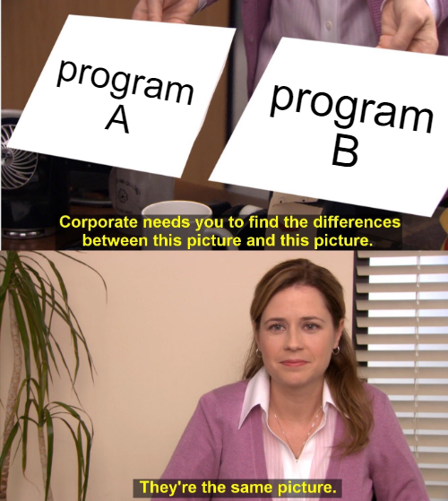

# 6. Input Evaluation

PUT을 반복 실행한다는 이론적 간단함이 퍼징이 매력적인 이유 중 하나지만 퍼저의 효율과 퍼포먼스에 큰 영향을 미치는 최적화와 디자인 결정 방법이 많이 있습니다. input을 생성한 뒤 퍼저는 그 인풋으로 PUT을 실행하고, 실행 결과를 두고 어떤 행동을 할지 결정하는 과정을 InputEval이라 합니다.

## 6.1 Bug Oracles

퍼징에 사용되는 canonical security policy는 fatal siganl(예를 들면 segmentation fault)가 발생하는 모든 프로그램 실행을 violation으로 정의합니다. 메모리로 인해 프로그램의 실행 흐름이 바뀔 수 있기 때문에 이런 policy는 많은 메모리 취약점을 발견할 수 있습니다. 최근엔 gcc와 clang 컴파일러는 CFI violation을 방지하는데 집중합니다.

### 6.1.2 Undifined Behaviors

C언어 경우 많은 행동들이 정의되지 않은체로 남아있고 컴파일러는 이를 다양한 방식으로 처리할 수 있습니다. 즉 개발자의 코드가 특정 컴파일러에서만 의도한 대로 해석되고 동작할 가능성이 존재한다는 것입니다. 이런 상황이 크게 위협적으로 느껴지지 않을 수도 있지만 최적화 세팅, 아키텍쳐, 컴파일러, 컴파일러 버전등 다양한 요인이 undifined behavior 해석에 영향을 미칠 수 있습니다. Undifined behavior에 대한 프로그래머의 예상과 컴파일러의 구현 정도가 상이할 때 취약점과 버그가 발생합니다.

Memory Sanitizer(MSan)는 컴파일 과정에서 instrumentation을 수행하고 초기화 되지 않은 메모리로 인해 발생하는 C나 C++의 undefined behavior를 탐지합니다. ASan와 유사하게, MSan은 shadow memory를 사용해 각 주소의 메모리가 초기화 되었는지 표현하는데 약 150%의 오버헤드가 있습니다.

Undefined Behavior Sanitizer(UBSan)은 undefined Behavior를 탐지하기 위해 compile-time에 프로그램을 수정합니다. 특정 버그만을 탐지하는 다른 Sanitizer들과 다르게 UBSan은 다양한 종류의 버그를 탐지 할 수 있습니다.

Thread Sanitizer(TSan)은 compile-time에 프로그램을 수정해 precision과 performance 사이의 trade-off에서 발생하는 data race를 탐색합니다. data race는 두 thread에서 동시에 공유 메모리에 접근하고, 그중 하나는 write일 때 발생하는데, 이런 버그들은 메모리 오염을 발생시키며 비결정적이기 때문에 버그 재현이 매우 힘듭니다.

### 6.1.3 Input Validation

웹 브라우저와 DB 엔진에 사용되는 복잡한 파서의 정확한 동작을 이해해야 하기 때문에 XSS나 SQL injection과 같은 input validation 취약점을 testing하는 것은 매우 힘든 일입니다.

KameleonFuzz는 실제 웹 브라우저를 사용해 test case를 파싱하는 것으로 XSS 공격을 성공적으로 탐지합니다.

µ4SQLi는 이와 비슷한 방법을 통해 SQL injection을 탐지합니다. 웹 애플리케이션 리스폰스로 sql injection을 탐지하기 힘들기 때문인데, database proxy를 통해 웹 애플리케이션과 데이터베이스 사이의 통신을 가로체 input이 악성행위를 이르키는지 검사합니다.

### 6.1.4 Semantic Difference

시멘틱 버그는 비슷하지만 동일하진 않은 프로그램들을 비교하는 differential testing 기술을 통해 자주 발견됩니다. 다양한 퍼저에서 비슷한 프로그램 사이의 차이점을 확인하는 방식으로 버그를 찾습니다.

black-box differential fuzz testing은 PUT의 input과 output의 mutation을 map을 만들고 information leak을 탐지합니다.

## 6.2 Execution Optimizations

해당 논문에서 제시한 기초 모델은 각 fuzz iteration이 순차적으로 실행됩니다. 그만은 즉 fuzz iteration 마다 PUT을 새로운 프로세스로 load한다는 뜻입니다. 최신 퍼저들은 반복 loading을 줄일 수 있는 기능들을 제공합니다. 예를 들면 AFL은 iteration 마다 이미 초기화된 프로세스를 fork하는 fork-server를 제공합니다. 3.1.2에서 언급한 것 처럼 in-memory fuzzing 또한 비슷한 방식으로 실행 속도를 최적화합니다. 이러한 메커니즘은 아무리 오버해드가 커도 여러번의 iteration동안 상각됩니다.

## 6.3 Triage

Triage란 정책 위반을 발생시키는 test case를 분석하고 보고하는 과정입니다. Triage는 deduplication, prioritization, test case minimization이라는 3단계로 이루어져있습니다.

### 6.3.1 Deduplication

Deduplication(중복제거)은 같은 버그를 발생시키는 test case와 output 집합을 없에 정리하는 과정입니다. 각각 고유한 버그를 트리거하는 일련의 test case를 반환하는 것이 이상적입니다.

몇가지 이유에서 Deduplication은 퍼저의 중요한 요소입니다. 우선 중복된 테스트 결과를 저장해 디스크 공간을 낭비하는 것을 방지합니다. 또한 현재 서로다른 버그가 몇개 존재하는지 직관적으로 확인할 수 있게 도와줍니다.

현재 Deduplication 방식은 3가지 존재합니다.

- 6.3.1.1 stack backtrace hashing

  stack backtrace hashing은 crash를 deduplication하는 가장 오래됬고 가장 흔한 방법입니다. crash가 발생하면 stack backtrace를 자동으로 기록하고 bachtrace의 내용에 따라 달라지는 stack hash를 생성합니다. stack hash는 다양한 방식으로 구현되어 있는데 stack frame의 갯수, stack frame에 저장된 정보, 함수이름, 주소, 오프셋등을 사용해 hash를 생성합니다.

  수집한 정보를 사용해 두개의 hash(major, minor)를 생성하는 방식도 있는데, major hash는 함수 이름을 hash해 유사하지 않은 crash들을 그룹화합니다. 그리고 minor hash는 line number와 여러개의 stack frame을 hash해 좀 더 세분화된 구분을 합니다.

  stack backtrace는 흔히 사용되지만 단점이 없는 것은 아닙니다. 몇몇 crash는 root cause 근처에서 발생하지 않을 때도 있기 때문에 stack backtrace의 진실성을 의심해볼 수 있습니다. 예를 들면  heap 오염에 의한 취약점들은 실제로 오염을 발생시키는 코드와 무관한 다른 코드가 오염된 메모리에 접근을 시도 할 때 crash가 발생합니다.

- 6.3.1.2 coverage-based deduplication

  AFL은 PUT의 각 실행 coverage를 기록하기 위한 효율적인 코드를 사용하는 grey-box 퍼저입니다. 또한 각 edge의 도달 횟수를 기록합니다. AFL은 이 coverage 정보를 사용해 새로운 seed file을 선택하는데 좋은 deduplication 역할을 해줍니다. AFL의 공식 문서에 따르면 crash가 이전엔 발견되지 않은 edge에 도달하거나 이전에 발견되었던 edge에 도달하지 못했을때 unique하다고 판단합니다.

- 6.3.1.3 semantic-aware deduplication

  RETracer는 각 crash를 reverse data-flow 분석해 얻은 semantic으로 crash triage를 수행합니다. RETracer는 crash dump(coredump)를 회귀적으로 분석해 정확히 어느 instruction에서 crash가 발생했는지 확인합니다. Frame level이 최대인 함수를 blame(비난)하는데 blame 함수는 crash를 군집화할 수 있습니다. RETracer는 해당 기술을 통해 수백개의 Internet Explorer 버그를 하나의 버그로 중복제거하는데 성공했습니다.

### 6.3.2 Prioritization and Exploitablity

Prioritization 혹은 fuzzer taming이라 불리는 문제는 버그를 발생시키는 test case의 고유성 정도에 따라 순위 매기거나 그룹화하는 프로세스입니다. 전통적으로 퍼징은 메모리 취약점을 발견하는데 사용되었기 때문에 prioritization은 crash의 exploit 가능성을 검증하는데 사용되었습니다. Exploit이 가능한 버그는 Defender와 Attacker 모두에게 우선순위가 높습니다. Defender는 exploit 가능한 버그를 다른 버그들 보다 먼저 수정하며 Attacker 또한 exploit이 가능한 버그를 우선적으로 악용합니다.

Microsoft WinDbg의 명령어 !exploitable은 최초의 Exploit ranking 시스템 중 하나입니다. 각 crash를 EXPLOITABLE > PROBABLY_EXPLOITABLE > UNKNOWN > NOT_LIKELY_EXPLOITABLE 순서로 순위를 매깁니다. 실제로 각 단계에 정의가 있기 보단 각 단계가 exploit 가능성이 다른 단계보다 높다는 것을 의미합니다. 한 예로 attacker가 control flow를 조작할 수 있을 땐 EXPLOITABLE 단계를 매기고 devision by zero는 NOT_LIKELY_EXPLOITABLE로 구분됩니다.

!exploitable이 나온 후 GDB exploitable 플러그인과 Apple의 CrashWrangler 등 비슷한 휴리스틱 시스템이 만들어졌습니다. 하지만 그들의 정확성은 아직 평가되지 않았습니다.

### 6.3.3 Test case minimization

Triage의 또다른 중요한 부분 중 하나는 test case minimization입니다. Test case minimization이란 testcase에서 crash를 야기하는 부분만을 찾아 좀 더 크기가 작고 간결한 test case를 만드는 과정입니다. Input의 크기를 줄인다는 점에서 seed trimming과 이론상 유사하지만 test case minimization은 bug oracle을 사용한다는 큰 차이점이 있습니다.