# Introduction

Microsoft Windows Graphics Device Interface+, 줄여서 GDI+는 다양한 응용 프로그램이 프린터나 비디오 디스플래이 서로 다른 그래픽 기능을 사용할 수 있도록 합니다. Windows 응용 프로그램은 장치 드라이버와 같은 그래픽 하드웨어에 직접 액세스하지 않지만 GDI와 상호 작용하여 장치 드라이버와 상호작용합니다. 이러한 방식으로 Windows 응용프로그램에 대한 추상화 계층과 모든 사용자가 사용할 수 있는 공통 API 집합이 있습니다.

GDI+는 복잡하기 때문에 다양한 취약점이 발견된 역사가 있습니다. McAfee는 Windows GDI+를 포함한 다양한 오픈 소스 및 클로즈드 소스 소프트웨어를 지속적으로 퍼징합니다. 지난 몇년 동안 GDI+를 포함한 다양한 Windows 구성요소에서 Microsoft에 다양한 문제를 보고하고 이를 위한 CVE를 제공 받았습니다.

이 게시물에서는 WinAFL을 사용하여 발견된 취약점 중 하나인 CVE-2021-1665: GDI+ 원격 코드 실행 취약점에 대한 root cause 분석에 대해 자세히 설명합니다. 해당 취약점은 2021년 1월에 Microsoft 패치로 해결되었습니다.

# What is WinAFL?

WinAFL은 널리 사용되는 Linux AFL 퍼저의 Windows 포드 버전이며 Google Project Zero의 Ivan Fratric에 의해 유지 관리됩니다. WinAFL은 DynamoRIO를 통한 바이너리 Instrumentation을 사용하며 Harness라 불리는 프로그램을 요구합니다. Harness는 우리가 퍼징하고자 하는 API를 호출하는 단순한 프로그램에 불과합니다.

저희가 사용할 Harness는 WinAFL과 함께 제공됩니다. 코드에서 주석 처리된 "Image→GetThumbnailImage" 코드를 활성화합니다. 다음은 GDI+ 이미지를 퍼징하는 harness 코드와 GetThumbnailImage API입니다.


보시다시피 이 작은 코드는 제공된 입력 파일에서 새 이미지 객체를 만든 다음 또 다른 기능을 호출하여 축소된 이미지를 생성합니다. 다양한 Windows 응용프로그램에서 썸네일 이미지를 사용하기 때문에 이는 아주 훌융한 공격 백터입니다. 또한 사용자 상호 작용이 거의 필요하지 않으므로 GDI+를 사용하고 GetThumbnailImage API를 호출하는 소프트웨어는 취약합니다.

# Collecting Corpus:

좋은 corpus는 퍼징을 위한 탄탄한 기반을 제공합니다. Google또는 Github을 사용해 수집할 수 있으며, 다른 취약점에 대해 릴리스 된 다양한 공용 EMP 파일에서 사용할 수 있는 추가 테스트 corpus를 얻을 수 있습니다. Microsoft 사이트에서 제공된 샘플 코드를 변경하여 몇 개의 테스트 파일을 생성했습니다. 다음 코드는 EMFPlusDrawString 및 기타 레코드로 EMF 파일을 생성한 것 입니다.

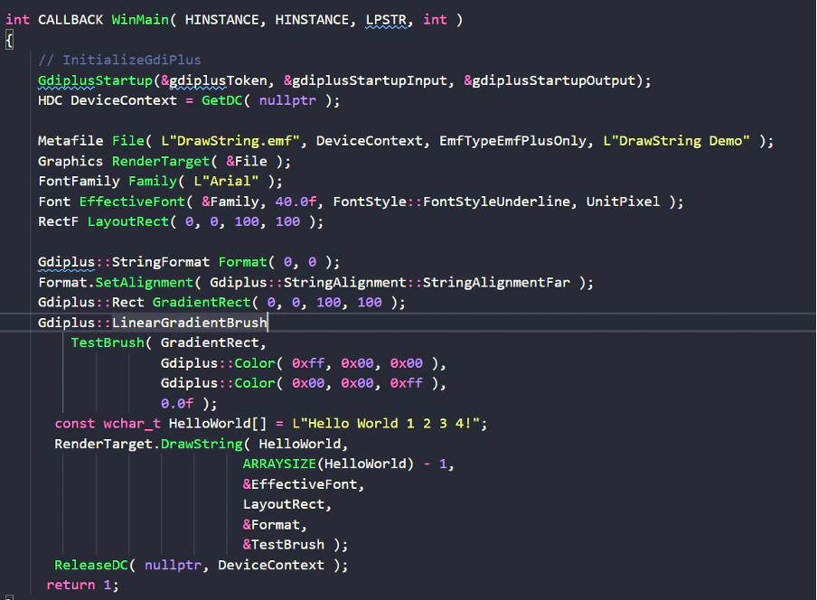

Ref: https://docs.microsoft.com/en-us/openspecs/windows_protocols/ms-emfplus/07bda2af-7a5d-4c0b-b996-30326a41fa57

# Minimizing Corpus:

초기 corpus 파일을 수집한 후에는 최소화해야 합니다. 이를 위해 winafl-cmin.py라는 유틸리티를 다음과 같이 사용할 수 있습니다.

```bash
winafl-cmin.py -D D:\\\\work\\\\winafl\\\\DynamoRIO\\\\bin32 -t 10000 -i inCorpus -o minCorpus -covtype edge -coverage_module gdiplus.dll -target_module gdiplus_hardik.exe -target_method fuzzMe -nargs 2 — gdiplus_hardik.exe @@
```

# How does WinAFL work?

WinAFL은 in-memory 퍼징이라는 개념을 사용합니다. 우리는 WinAFL에 함수명을 제공해야합니다. WinAFL은 프로그램 상태를 저장하고 corpus에서 하나의 입력 파일을 가져와 변형(mutate)시키고 함수에 공급합니다.

그리고 새 코드 경로(path)에 도달하거나 crash가 발생하는지 모니터링합니다. 새로운 path를 찾으면 새 파일을 흥미로운 테스트 사례로 간주하고 추가 mutate 부호로 대기열에 쌓습니다. crash를 발견하면 crashes 폴더에 crash를 발생시키는 파일을 저장합니다.

다음 그림은 퍼징 프름을 보여줍니다.

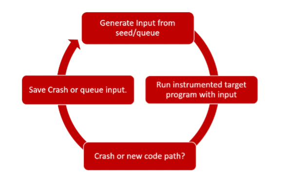

# Fuzzing with WinAFL:

Harness 프로그램을 컴파일하고, corpus를 수집하고, 최소화한 후에는 아래 명령어를 실행하여 WinAFL로 프로그램을 퍼징 할 수 있습니다.

```bash
afl-fuzz.exe -i minCorpus -o out -D D:\\work\\winafl\\DynamoRIO\\bin32 -t 20000 —coverage_module gdiplus.dll -fuzz_iterations 5000 -target_module gdiplus_hardik.exe -target_offset 0x16e0 -nargs 2 — gdiplus_hardik.exe @@
```

# Results:

몇 번의 충돌과 독특한 충돌 테스트를 거친 후 "gdiplus!BuiltLine::GetBaselineOffset"에서 carsh를 발견했습니다. callstack은 다음과 같습니다.


위의 이미지에서 볼 수 있듯이 edx+8로 가리킨 메모리 주소의 데이터를 읽으려 할 때 프로그램이 중단되고 있습니다. ebx, ecx 및 edx에 c0c0c0c0이 포함되어 있는 것을 볼 수 있습니다. 즉, 페이지 힙이 바이너리에서 사용되도록 설정되어 있습니다. 또한 c0c0c0c0이 "gdiplus!FullTextImager::RenderLine" 함수에 매개 변수로 전달되고 있음을 확인할 수 있습니다.

# Patch Diffing to See If We Can Find the Root Cause

Root cause를 파악하기 위해 IDA BinDiff 플러그인을 사용하여 패치 파일의 변경 사항을 식별할 수 있습니다. 운이 좋다면 변경된 코드만 봐도 원인을 쉽게 찾을 수 있습니다. 따라서 gdiplus.dll 패치된 버전과 패치되지 않은 버전의 IDB 파일을 생성한 다음 IDA BinDiff 플러그인을 실행하여 변경 내용을 확인할 수 있습니다.

패치가 적용된 파일에 새로운 기능이 하나 추가되었으며 이는 BuildLine Object의 소멸자로 보입니다.


몇몇 함수들의 유사성 점수가 < 1 인것을 알 수 있고 그중하나가 바로 FullTextImager::BuildAllLines 입니다.


이제 이 함수가 패치된 함수인지 확인하기 위해 windbg에서 테스트 프로그램과 POC를 실행하고 이 함수에 대한 break point를 설정할 수 있습니다. break point에 도달하면 프로그램에서 더이상 crash가 발생하지 않음을 알 수 있습니다.

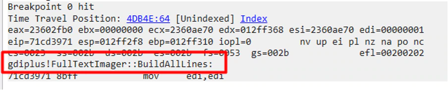

다음으로 이 취약점을 보완하기 위해 변경된 함수의 내용을 확인해야 합니다. 우리는 함수의 흐름 그래프를 확인해 다음과 같은 것을 볼 수 있습니다. 안타깝게도 변경 사항이 너무 많아 차이점만 보고 취약점을 식별할 수 없습니다.

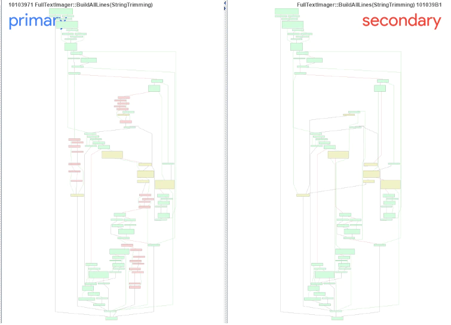

왼쪽은 패치되지 않은 버전, 오른쪽은 패치된 버전의 dll입니다.

- 녹색은 패치된 블록과 패치되지 않은 블록이 동일함을 뜻합니다.
- 노란색 블록은 두 버전 사이에 사소한 변경점이 있을을 뜻합니다.
- 빨간 블록은 dll 간에 차이점을 뜻합니다.

노란색 블록을 좀더 자세히 들여다 보면 다음과 같은 것을 볼 수 있습니다.

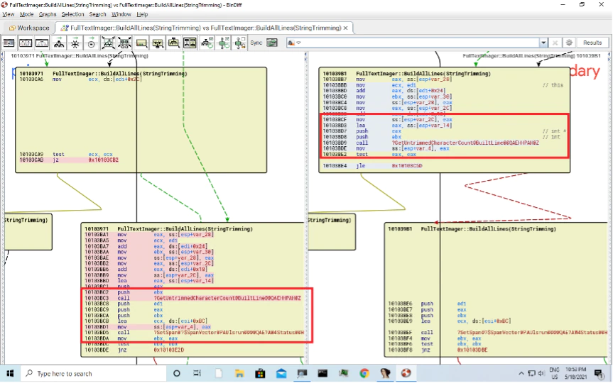

몇 가지 변경 사항을 확인할 수 있습니다. 패치된 DLL에서 일부 블록이 제거 되었으므로 patch diffing만으로는 해당 취약점의 root cause를 식별하기에 충분하지 않습니다. 그러나 windbg와 같은 다른 디버깅 방법을 사용할 때 어디에서 무엇을 찾아야 하는지에 대한 귀중한 힌트를 제공합니다. 위의 BinDiff 출력에서 몇 가지 관찰 결과를 확인할 수 있습니다.

- 패치되지 않은 DLL에서 주의 깊게 확인하면 "GetuntrimmedCharacterCount" 함수에 대한 호출이 있고 나중에 "SetSpan::SpanVector"함수를 호출합니다.
- 패치된 DLL에서 EAX 레지스터 내에 저장된 반환 값을 보면 "GetuntrimmedCharacterCount" 호출이 있음을 확인할 수 있습니다. 0이면 컨트롤이 다른 위치(BuiltLine Object의 소멸자)로 점프합니다. 이코드는 패치된 DLL에 새로 추가되었습니다.


따라서 여기서 취약점이 해결되었다고 가정할 수 있습니다. 이제 다음 사항들을 파악해야 합니다.

1. 제공된 POC 파일과 함께 우리 프로그램이 중단되는 이유는 뭔가?
2. 파일의 어떤 필드에 의해 crash가 발생하는가?
3. 필드의 값이 뭔가?
4. 이 crash를 일으키는 프로그램 조건은 무엇인가?
5. 어떻게 취약점이 보완되었나?

# EMF File Format:

EMF는 그래픽 이미지 장치를 독립적으로 저장하는 데 사용되는 향상된 메타 파일 형식이라고도 합니다. EMF 파일은 가변 길이의 다양한 레코드로 구성됩니다. 여기에는 다양한 그래픽 객체의 정의, 도면 명령 및 기타 그래칙 특성이 포함도리 수 있습니다.


일반적으로 EMF 파일은 다음과 같은 레코드로 구성됩니다.

1. EMF 헤더 - EMF 구조에 대한 정보가 포함되어 있습니다.
2. EMF 레코드 - 그래픽 특정, 도면 순서 등에 대한 정보를 포함하는 다양한 가변 길이 레코드일 수 있습니다.
3. EMFEOF 레코드 - EMF 파일의 마지막 레코드입니다.
4. EMF 파일 형식의 자세한 사양은 Microsoft 사이트에서 다음 URL을 통해 확인할 수 있습니다.

https://docs.microsoft.com/en-us/openspecs/windows_protocols/ms-emf/91c257d7-c39d-4a36-9b1f-63e3f73d30ca

# Locating the Vulnerable Record in the EMF File:

일반적으로 EMF의 대부분의 문제는 잘못된 형식의 레코드나 손상된 레코드 때문입니다. 어떤 레코드 타입이 이 crash를 일으켰는지 알아내야 합니다. 이를 위해 Call stack을 살펴보면 다음을 확인할 수 있습니다.


"gdiplus!GdiPlayMetafileRecordCallback"에 대한 호출을 확인 할 수 있습니다.


해당 함수에 break point를 걸고 매개 변수를 보면 다음과 같은 사실을 알 수 있습니다.

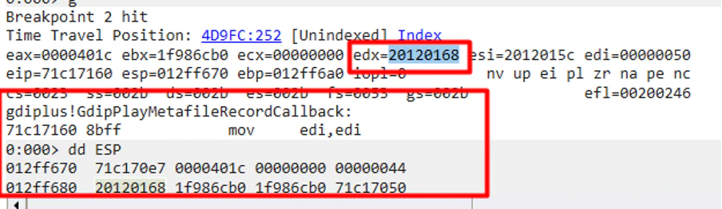

EDX에 일부 메모리 주소가 포함되어 있으며, 이 기능에 지정된 매개 변수는 00x00401c,0x00000000, 0x00000044 입니다.

또한 EDX가 가리키는 위치를 확인해보면 다음과 같은 것을 알 수 있습니다.

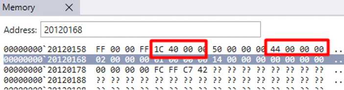

POC EMF 파일을 확인하면 이 데이터가 파일의 오프셋 0x15c에 속함을 알 수 있습니다.


EMF 규격을 검토하고 레코드를 수동으로 분석하면 이 레코드가 "EmfPlusDrawString" 레코드임을 쉽게 알 수 있습니다. 이 레코드의 형식은 다믕과 같습니다.


우리의 경우에는 다음과 같습니다.

레코드 유형 = 0xeccEmfPlusDrawString 레코드

flag = 0x0000

Size = 0x50

Data size = 0x44

Brushid = 0x02

Format id = 0x01

Length = 0x14

Layoutrect = 00 00 00 00 00 00 00 00 FC FF C7 42 00 00 80 FF

String data =


이제 crash를 발생시키는 레코드를 찾았으니, 다음 문제는 왜 우리 프로그램이 crash나는지 알아내는 것입니다. 코드를 디버그 하고 학인하면 컨트롤이 "gdiplus!FullTextImager::BuildAlllines"이 도달하는 것을 알 수 있습니다.

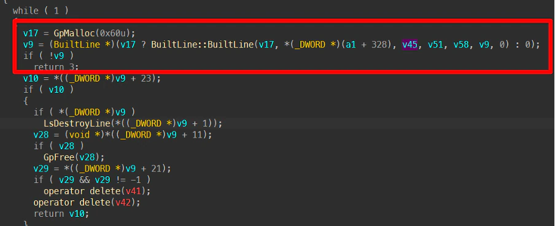

다음 다이어그램은 함수 호출의 hierarchy를 나타냅니다.


# The execution flow in summary:

1. "Builtline::BuildAllLines" 함수 내부에 0x60 바이트의 메모리를 할당하는 루프가 있습니다. 그 다음 "Buildline::BuildLine"를 호출합니다.
2. "Buildline::Buildline"은 새로 할당된 메모리에 데이터를 옮기고 "BuiltLine::GetUntrimmedCharacterCount"를 호출합니다.
3. "BuiltLine::GetUntrimmedCharacterCount"의 리턴 값은 루프 카운트로 ECX에 해당합니다. 해당 루프는 돌며 ECX가 string length(EAX) == 0x14가 될 때까지 반복합니다.
4. 루프 카운트가 0일 때 시작해 0x13일 때 종료됩니다. 즉, "GetUntrimmedCharacterCount"가 0일 때 종료됩니다.
5. DLL의 취약점은 해당 루프가 정상적으로 종료되지 않아 발생합니다. “BuiltLine::GetUntrimmedCharacterCount”가 0을 반환하고 루프카운터(ECX)에 더해지는데, 이는 ECX의 값을 증가시키지 않습니다. 0x60 바이트의 메모리를 할당하고 데이터를 오염시켜 나중에 crash를 발생시킵니다. 20번 돌아야할 루프가 총 21번 돌게 됩니다.

# In detail:

1. "Builtline::BuildAllLines" 내부에서 0x60(90) 바이트의 메모리를 할당합니다.


1. 그런 다음 “BuiltLine::BuiltLine”를 호출해 새로 할당된 메모리에 데이터를 옮깁니다.


1. 이는 while 루프 안에 “BuiltLine::GetUntrimmedCharacterCount”에서 발생합니다.
2. “BuiltLine::GetUntrimmedCharacterCount”의 반환값은 0x12ff2ec에 저장됩니다. 아래 사진에서 볼 수 있드시 해당 값은 1이 됩니다.

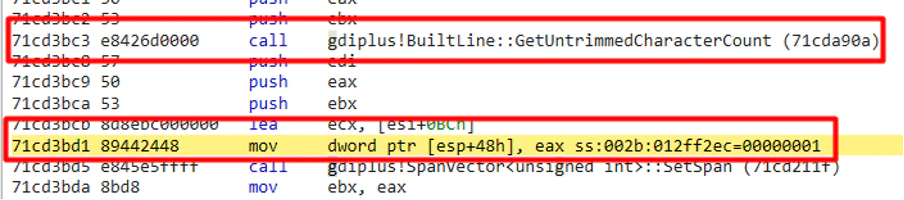

1. 해당 값은 ECX에 더해집니다.

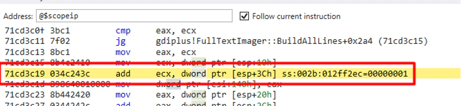

1. ecx가 eax보다 작은지에 대한 검사가 이루어집니다. 만약 참이라면 루프를 반복하고, 거짓이라면 다른 지점으로 점프합니다.

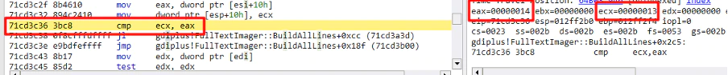

1. 취약점 버전에서는 “BuiltLine::GetUntrimmedCharacterCount”의 반환값이 0일 때 루프가 존재하지 않습니다. 이는 ECX에 0이 추가되고 ECX값이 증가하지 않음을 의미합니다. 따라서 20번 돌아야 할 루프가 총 21번 실행되고 이것이 root cause입니다.

또한 약간의 디버깅을 하면 해당 값은 POC 파일의 0x174로 부터 읽어드림을 알 수 있습니다.

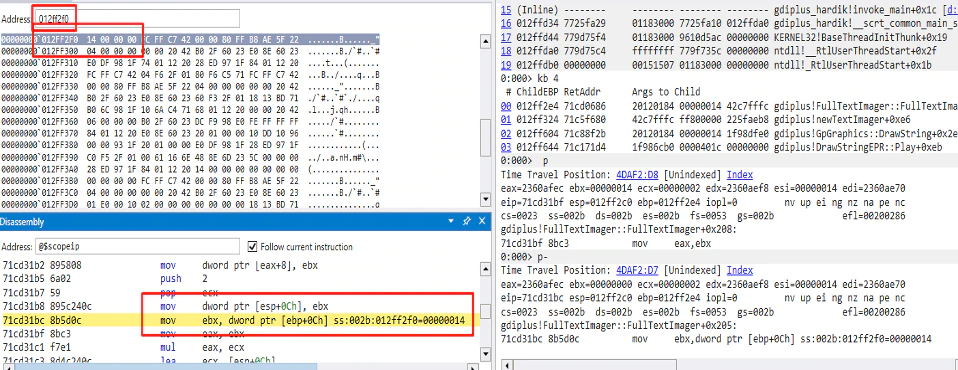****

전에도 확인했드시 해당 오프셋은 EmfPlusDrawString 레코드이고 0x14는 압에서 언급한 길이입니다.

나중에 프로그램이 "FullTextImager::Render"함수에 도달하면 사용하지 않는 메모리로 부터 값을 읽어들여 EAX 값을 손상시킵니다.


이는 "FullTextImager::RenderLine"함수로 전달되고

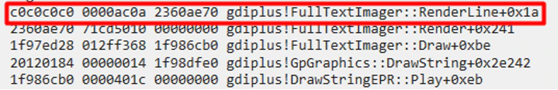

나중에 프로그램이 해당 주소를 접근하려 할 때 crash가 발생합니다.


EMF file속 EmfPlusDrawString 레코드를 처리할때 잘못된 메모리 주소에 접근을 시도하면서 프로그램의 crash가 발생합니다. 결론은 프로그램이 "gdiplus!BuiltLine::GetUntrimmedCharacterCount"함수의 반환값을 검사하지 않아 레지스터 값이 오염되고 잘못된 path로 실행 흐름이 도달하게 되어 crash가 발생합니다.

# How this issue was fixed?

위의 패치 diff를 보고 파악한 바와 같이, "gdiplus!BuiltLine::GetUntrimmedCharacterCount" 함수의 반환값을 결정하는 루틴이 추가되었습니다.


만약 그 값이 0이라면 EBX와 xor연산을 하여 Built object의 destructor 주소로 점프합니다.


아래는 destructor입니다.


# Conclusion:

GDI+는 매우 일반적으로 사용되는 Windows 구성 요소이며, 이와 같은 취약점은 전 세계 수십억 개의 시스템에 영향을 미칭 수 있습니다. 사용자에게 적절한 업데이트를 적용하고 Windows 배포를 최신 상태로 유지하는 것이 좋습니다.

McAfee는 다양한 오픈 소스 및 클로즈드 소스 라이브러리 지속적으로 퍼징하고 있으며, 공급업체와 협력하여 이러한 문제를 책임감 있게 공개함으로써 문제를 해결하고 필요에 따라 업데이트를 릴리스할 수 있는 적절한 시간을 제공합니다.

이 문제를 해결하고 업데이트를 릴리스해주신 Microsoft에 갑사합니다.