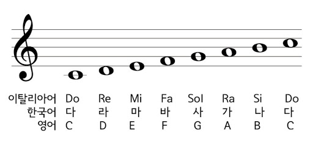

---

title: "[Write-Up] Christmas CTF 2020 - No g"
author: Fabu1ous
tags: [Fabu1ous, misc, scale, hex]
categories: [Write-Up]
date: 2020-12-29 21:00:00
cc: true
index_img: /2020/12/29/fabu1ous/no-g/1.png
---


# 문제 개요


음계(Scale)를 알파벳으로 나타내곤 합니다. 음이름이라고 하죠.

라(A), 시(B), 도(C), 레(D), 미(E) , 파(F), 솔(G)

16진수(HEX) 또한 알파벳을 사용해 수를 표현합니다.

10(A), 11(B), 12(C), 13(D), 14(E), 15(F)




악보에 그려진 음표를 알파벳으로, 그 알파벳을 hex값으로 치환하고 연결된 음표들끼리 hex값을 더해 ASCII로 변환하면 하나의 문자가 됩니다.

예 ) 라라라 → chr(0xa+0xa+0xa) → '\x1e'

hex에는 G가 없기 때문에 악보의 제목이 'No G'입니다. 


제가 의도한 풀이 접근 방식은 이렇습니다.

1. 제목에서 힌트를 얻어 음이름을 찾아본다.
2. 첫 여섯 음의 hex값을 더해봤더니 'X'가 나온다.
3. flag 형식이 'XMAS{}'이므로 2번 과정을 몇 번 더 반복해 본다.


# Solution

```python
note = ['fa', 'mi', 'fa', 'mi', 'fa', 'fa'
, 're', 'do', 'mi', 'ti', 'fa', 'do'
, 'fa', 'do', 're', 'mi', 'ti'
, 'mi', 'fa', 're', 'mi', 're', 'mi'
, 're', 'mi', 'fa', 're', 're', 'mi', 're', 're', 'fa'
, 'mi', 're', 'fa', 're'
, 'fa', 'ti', 'mi', 'mi', 'ti', 'ti', 'fa', 're'
, 'fa', 'fa', 're', 'fa', 'fa', 're', 'fa'
, 're', 'fa', 'mi', 'fa', 'do', 'fa', 'fa', 'fa'
, 'la', 'ti', 'la', 'la', 'la'
, 'ti', 'la', 'la', 'la', 'ti', 'la', 'ti', 'la', 'do'
, 're', 'do', 'la', 'ti', 'ti', 're', 'ti', 'do', 'do'
, 'la', 'ti', 'ti', 'la', 'ti'
, 'ti', 'ti', 'la', 'ti', 'ti', 'la', 'la', 'la', 'ti'
, 'do', 'do', 'ti', 'mi', 'do', 'mi', 're', 'ti', 'ti'
, 'do', 'do', 're', 'fa', 'do', 'do', 'la', 'mi', 'ti'
, 'la', 're', 're', 'do', 'ti', 'mi', 'ti', 'ti'
, 'la', 'ti', 'mi', 'ti', 'do', 're'
, 'do', 're', 'la', 'do', 'la', 're', 'mi', 'ti'
, 'ti', 'mi', 'ti', 'fa', 're', 'fa', 're', 're'
, 'ti', 'fa', 'fa', 'do', 'do', 'fa', 'fa', 'fa'
, 'mi', 'ti', 'la', 'ti', 'mi', 'ti', 'do', 'do'
, 'la', 'la', 'ti', 'la', 'ti', 'la', 'la'
, 'fa', 'ti', 're', 'do'
, 'do', 'ti', 'la', 'ti', 'ti', 'la', 'do', 'ti'
, 'do', 're', 'fa', 'mi', 're', 'fa', 'mi', 'fa', 'mi']

idx = [6, 6, 5, 6, 9
, 4, 8, 7, 8, 5
, 9, 9, 5, 9
, 9, 9, 8, 6
, 8, 8, 8, 8
, 7, 4, 8, 9]

flag = []

pre_chk = 0

while(len(flag) < len(idx)):
	cur_chk = idx[len(flag)]
	buf = note[pre_chk:pre_chk+cur_chk]
	result = 0
	
	for i in range(len(buf)):
		 if(buf[i] == 'la'):
		 	result += 0xa
		 elif(buf[i] == 'ti'):
		 	result += 0xb
		 elif(buf[i] == 'do'):
		 	result += 0xc
		 elif(buf[i] == 're'):
		 	result += 0xd
		 elif(buf[i] == 'mi'):
		 	result += 0xe
		 elif(buf[i] == 'fa'):
		 	result += 0xf
			
	flag.append(chr(result))
	print(''.join(flag))
	pre_chk += cur_chk
```

```plain
X
XM
XMA
XMAS
XMAS{
XMAS{7
XMAS{7h
XMAS{7he
XMAS{7her
XMAS{7her3
XMAS{7her3_
XMAS{7her3_i
XMAS{7her3_i5
XMAS{7her3_i5_
XMAS{7her3_i5_n
XMAS{7her3_i5_no
XMAS{7her3_i5_no_
XMAS{7her3_i5_no_G
XMAS{7her3_i5_no_G_
XMAS{7her3_i5_no_G_i
XMAS{7her3_i5_no_G_in
XMAS{7her3_i5_no_G_in_
XMAS{7her3_i5_no_G_in_H
XMAS{7her3_i5_no_G_in_H3
XMAS{7her3_i5_no_G_in_H3X
XMAS{7her3_i5_no_G_in_H3X}
```